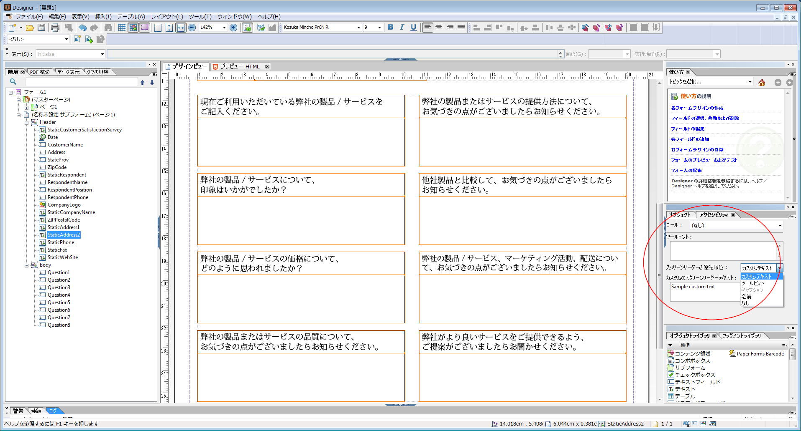

# アクセス可能な HTML5 フォームの設計 {#designing-accessible-html-forms}

HTML5 フォームは、ARIAHTML5 アクセシビリティ標準を使用して、アクセシブルなHTMLフォームを生成します。 これらのフォームは、タブナビゲーション（Mozilla FireFox を除く）をサポートし、一般的なスクリーンリーダーとの互換性が認定されています。 優れたアクセシビリティの機能を備えた HTML5 フォームを生成するには、何らかの基本的なデザインガイドラインに基づいて XFA フォームをデザインします。デザインガイドラインには正しいタブ順序の設定、および各フォームコントロールのために読み上げテキストコンテンツの提供などが含まれます。AEM Forms Designer ではこれらのフォームコントロール属性を設定し、アクセシビリティを備えた PDF フォームおよび HTML5 フォームを生成できます。

*注意：タブナビゲーションは、値の合計を表示する計算フィールドなど、保護されたフィールドをカバーしません。 スクリーンリーダーが保護されたフィールドの値を読み取るには、保護されたフィールドの上または横に空の読み取り専用フィールドを配置します。 保護されたフィールドの値を新しい読み取り専用フィールドに割り当てます。 スクリーンリーダーまたはタブナビゲーションは、この読み取り専用フィールドを選択し、保護フィールドの値として読み上げることができます。*

AEM Forms Designer には、スクリーンリーダーに渡すことができる複数の「スピーチテキスト」オプションが含まれています。 フォーム内の各オブジェクトに対して、ユーザーはスクリーンリーダーテキストに対して、次のいずれかの設定を指定できます。

* カスタムのスクリーンリーダーテキスト。アクセシビリティパレットを使用して設定できます。 作成者は、ボタンやフィールドの名前、およびその目的に注釈を付けることができます。
* ツールチップ（アクセシビリティパレットで設定可能）
* フォーム上のフィールドのキャプション。
* 「連結」タブの「名前」オプションで指定された、オブジェクトの名前。

フォームコントロールで、ツールチップ、画面Readerテキスト、キャプションなど複数のオプションを使用できる場合、画面Readerではこれらのプロパティの 1 つのみが使用されます。 デフォルトの順序は、カスタムスクリーンReaderテキスト、ツールヒント、キャプション、名前です。 デフォルト順序はアクセシビリティパレットにある「**スクリーンリーダーの優先順位**」オプションを使用してオーバーライドできます。
