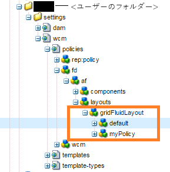
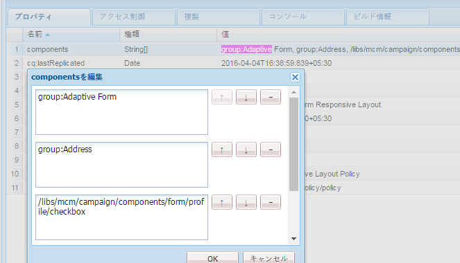
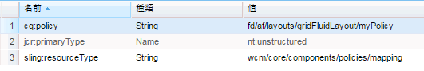

# 使用するテンプレートに基づいたコンポーネントの表示{#displaying-components-based-on-the-template-used}

フォーム作成者は、[テンプレート](../../forms/using/template-editor.md)を使用してアダプティブフォームを作成する際、テンプレートポリシーに基づいて、特定のコンポーネントを表示して使用できます。テンプレートコンテンツポリシーを指定することにより、フォームの作成中にフォーム作成者に表示されるコンポーネントのグループを選択できます。

## テンプレートのコンテンツポリシーの変更  {#changing-the-content-policy-of-a-template}

テンプレートを作成すると、コンテンツリポジトリの`/conf`の下に作成されます。 `/conf`ディレクトリに作成したフォルダーに基づき、テンプレートのパスは次のとおりです。`/conf/<your-folder>/settings/wcm/templates/<your-template>`.

次の手順を実行して、テンプレートのコンテンツポリシーに基づいてサイドバーにコンポーネントを表示します。

1. CRXDE Lite を開きます。\
   URL: `https://<server>:<port>/crx/de/index.jsp`
1. CRXDE で、テンプレートを作成したフォルダーに移動します。

   例：`/conf/<your-folder>/`

1. CRXDEで、次の場所に移動します。`/conf/<your-folder>/settings/wcm/policies/fd/af/layouts/gridFluidLayout/`

   コンポーネントのグループを選択するためには、新しいコンテンツポリシーが必要です。新しいポリシーを作成するには、デフォルトのポリシーをコピーして貼り付け、名前を変更します。

   デフォルトコンテンツポリシーのパス：`/conf/<your-folder>/settings/wcm/policies/fd/af/layouts/gridFluidLayout/default`

   `gridFluidLayout` フォルダーで、デフォルトのポリシーをコピーして貼り付け、名前を変更します。例： `myPolicy`

   

1. 作成する新しいポリシーを選択し、右側のパネルでタイプ`string[]`の&#x200B;**components**&#x200B;プロパティを選択します。

   components プロパティを選択して開くと、components を編集ダイアログが表示されます。components を編集ダイアログでは、「**+**」および「**-**」ボタンを使用して、コンポーネントグループを追加または削除できます。作成者が使用するコンポーネントを含むコンポーネントグループを追加できます。

   

   コンポーネントグループを追加した後、「**OK**」をクリックしてリストを更新し、CRXDEアドレスバーの上にある「**すべて保存**」をクリックして更新します。

1. テンプレートで、コンテンツポリシーをデフォルトから、作成した新しいポリシーに変更します。（この例では`myPolicy`）

   ポリシーを変更するには、CRXDEで`/conf/<your-folder>/settings/wcm/templates/<your-template>/policies/jcr:content/guideContainer/rootPanel/items`に移動します。

   `cq:policy`プロパティで、`default`を新しいポリシー名(`myPolicy`)に変更します。

   

   テンプレートを使用して作成したフォームを使用すると、追加したコンポーネントがサイドバーに表示されます。

