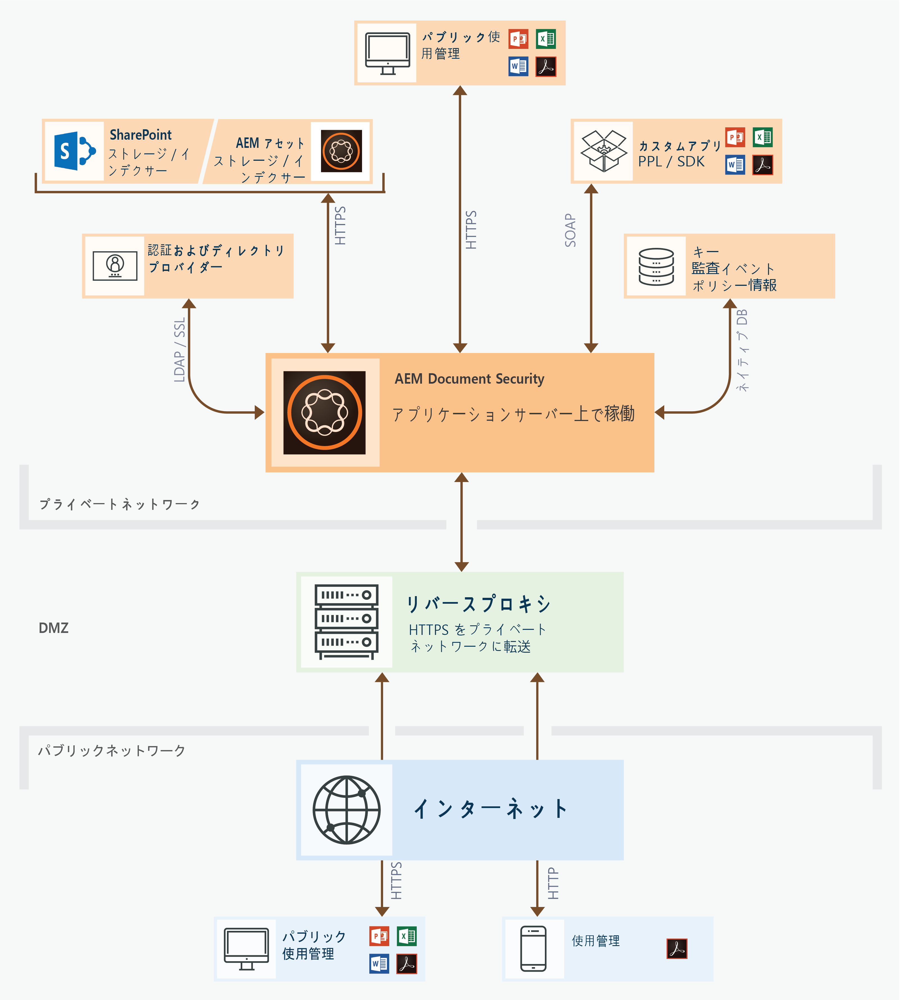

# Document Security の機能{#document-security-offerings}

Adobe Experience Manager Forms の Document Security を使用して、許可されたユーザーだけがドキュメントを使用するように指定できます。Document Security を使用すると、サポートされる形式で保存した情報を安全に配布できます。Adobe Portable Document Format （PDF）、Microsoft Word、Excel および PowerPoint を含むファイル形式に対応しています。

ドキュメントを保護するには、ポリシーを使用します。ポリシーに指定する機密設定によって、ポリシーを適用したドキュメントを受信者が使用できる方法が決まります。例えば、テキストの印刷やコピー、テキストの編集、または保護されたドキュメントへの署名や注釈の追加を実行できるかどうかを指定することができます。

ポリシーは Document Security に保存されます。クライアントアプリケーションを使用してそのポリシーをドキュメントに適用します。ドキュメントにポリシーを適用すると、ドキュメントに含まれる情報は、ポリシーで指定されている機密設定で保護されます。ポリシーで保護されたドキュメントを、ポリシーで許可された受信者に配布できます。

次の図は、AEM Forms Document Security の一般的なアーキテクチャを示しています。

## Document Security クライアント {#document-security-clients}

Document Security では、ドキュメントの保護や、保護されたドキュメントを表示および編集するための、さまざまなクライアントが提供されています。また、保護されたドキュメント上での全文検索を有効にするためのインデクサーも提供されています。ニーズに合ったクライアント、およびそのクライアントの機能を選ぶことができます。

Document Security サーバーは、ユーザー認証、ポリシーのリアルタイム管理、機密性の適用などのトランザクションをサーバーから実行する、中心となるコンポーネントです。サーバーは、ポリシー、監査レコードおよび他の関連情報の中央リポジトリとしての役割も果たします。

Document Security サーバーでは、ポリシーの作成、ポリシーで保護されたドキュメントの管理およびポリシーで保護されたドキュメントに関連するイベントの監視を行うための、Web ベースのインターフェイス（Web ページ）が提供されています。管理者は、ユーザー認証、監査、招待ユーザーへの通知などのグローバルオプションを設定したり、招待ユーザーのアカウントを管理することができます。

このサーバーには、AEM Forms Document Security アドオンの機能が含まれています。Document Security アドオンのご購入については、AEM Forms の[セールスチーム](https://www.adobe.com/products/request-consultation/marketing-cloud.html?s_osc=70114000002JNwKAAW&s_iid=70114000002JHs3AAG)にお問い合わせください。

### ドキュメントの保護 {#protect-documents}

AEM Forms Document Security には、セキュリティポリシーに適用できるさまざまなツールが用意されています。ニーズや仕様に応じて、ツールを選ぶことができます。

Document Security SDK、Adobe Acrobat、Document Security Extension for Microsoft Office、またはポータブル保護ライブラリを使用して、セキュリティポリシーを適用、トラッキングすることができます。

* **Document Security SDK：**&#x200B;この SDK は、豊富な機能を持つクライアントです。ドキュメントセキュリティ SDK を使用して Document Server の機能にアクセスしたり、ポリシーで保護されたドキュメントを開いたり、カスタム拡張機能やプラグイン、またはアプリケーションを開発したりすることができます。例えば、カスタムファイル形式を保護する拡張機能を開発したり、SDK とデータ損失防止（DLP）ソリューションを統合することができます。Document Security SDK を使用して開発された拡張機能、アプリケーション、およびプラグインは、指定された AEM Forms サーバーにドキュメントを送信し、ポリシーはサーバー上で適用されます。AEM Forms Document Security クライアント SDK（CSDK）で、ポータブル保護ライブラリ（PPL）を使用して保護されているドキュメントの保護を解除することはできません（その逆の動作もできません）。

   Document Security SDK は Java と C++ の両方で利用することができます。Java SDK は、AEM Forms Document Security に付属しています。JEE 上に AEM Forms をデプロイする際に、Java SDK がインストールされます。C++ SDK を入手する場合は、[AEM サポートチーム](https://helpx.adobe.com/marketing-cloud/contact-support.html)にお問い合わせください。C++ SDKは、Microsoft Visual Studio 2013でコンパイルできます。 SDK の機能とその使用方法については、[Document Security API のドキュメント](https://help.adobe.com/en_US/livecycle/11.0/Services/WS92d06802c76abadb76c48dfe12dbeb3e281-7ff0.2.html)のサイトを参照してください。 

* **Adobe Acrobat：** Adobe Acrobat を使用して、Microsoft Office、ウェブブラウザー、またはその他の PDF 形式の印刷に対応しているアプリケーションなど、一般的なデスクトップアプリケーションで作成された PDF ドキュメントにセキュリティポリシーを適用することができます。

   Adobe Acrobat は、[アドビ システムズ社の Web サイト](https://acrobat.adobe.com/us/en/free-trial-download.html)で購入、ダウンロードできます。Adobe Acrobat の記事「[PDF のセキュリティポリシーの設定](https://helpx.adobe.com/acrobat/using/setting-security-policies-pdfs.html)」には、Adobe Acrobat を使用したポリシーの作成や適用についての詳細が掲載されています。 

* **Document Security Extension for Microsoft Office**：Document Security Extension for Microsoft Office を使用して、Microsoft Office プログラム内から、事前に定義されたポリシーを Microsoft Office ファイルに適用できます。この拡張機能を使用することで、許可されたユーザーだけがポリシーで保護された Microsoft Word、Excel および PowerPoint ファイルを使用できるようになります。このプラグインをインストールした、権限を持つユーザーのみがポリシーで保護されたファイルを使用することができます。

   この Document Security の拡張機能は Microsoft Office プラグインととして使用できます。You can contact [AEM support team](https://helpx.adobe.com/ca/marketing-cloud/contact-support.html) to procure the extension. その後、[Document Security Extension for Microsoft Office](https://helpx.adobe.com/aem-forms/aem-document-security/download-installer.html)のヘルプを参照することで、インストール方法、設定方法、拡張機能の使用方法を確認できます。

* **ポータブル保護ライブラリ：**&#x200B;ポータブル保護ライブラリ（PLL）は、ドキュメントを AEM Forms サーバーに送ることなく、ローカルにドキュメントを保護します。ネットワークに送信されるのは、セキュリティの証明書とポリシーの詳細のみです。また、PPLでは、ポリシーの取得アクセスをログインしたユーザーのみに制限することもできます。 AEM にログインしているユーザーについて、ポリシーを取得することができます。

   上記に加え、ポータブル保護ライブラリには、ドキュメントセキュリティSDKのすべての機能があります。 ドキュメントセキュリティ SDK を使用して Document Server の機能にアクセスしたり、ポリシーで保護されたドキュメントを開いたり、カスタム拡張機能やプラグイン、またはアプリケーションを開発したりすることができます。ポータブル保護ライブラリ（PPL）で、AEM Forms Document Security クライアント SDK（CSDK）を使用して保護されているドキュメントの保護を解除することはできません（その逆の動作もできません）。

   ポータブル保護ライブラリは、32 ビットおよび 64 ビットバージョンの Java、または C++ 言語で使用できます。また、OSGi上のAEM Forms用のOSGiバンドルとしても使用できます。 C++ PPLは、Microsoft Visual Studio 2013でコンパイルできます。 AEM Forms Document Security アドオンのライセンスを持っている場合は、[AEM Forms Document Security](https://helpx.adobe.com/marketing-cloud/contact-support.html) サポートチームに問い合わせて、ポータブル保護ライブラリを入手することができます。後から、ポータブル保護ライブラリヘルプ（ライブラリに付属）を参照することで、ポータブル保護ライブラリのセットアップ方法および使用方法を確認することができます。

### 保護されたドキュメントの表示および編集 {#view-or-edit-protected-documents}

* **PDF ドキュメント**&#x200B;の場合、Adobe Acrobat DC、Acrobat Reader、およびモバイル版 Acrobat Reader を使用して保護された PDF ドキュメントを表示することができます。ほとんどのユーザーはすでにデバイスに Acrobat Reader がインストールされているため、保護されたドキュメントを表示するために追加のソフトウェアを入手もしくは使用方法を学習する必要はありません。Acrobat Reader は、[Acrobat Reader ダウンロード Web サイト](https://get.adobe.com/reader/)からダウンロードすることもできます。

* **Microsoft Office ドキュメント**&#x200B;の場合、Microsoft Office と AEM Forms Document Security extension for Microsoft Office が必要となります。この Document Security の拡張機能は Microsoft Office プラグインととして使用できます。この拡張機能は、アドビ システムズ社の Web サイトからダウンロードすることができます。

### 保護済みドキュメントのインデックス作成 {#index-protected-documents}

Microsoft Windows の全文検索エンジン（SharePoint インデックスサーバー）や Adobe Experience Manager（AEM）は、プレーンテキストファイル、Microsoft Office ドキュメント、PDF ドキュメントなど、広く使用されているさまざまなドキュメント形式において、全文検索を実行することができます。ドキュメントセキュリティインデクサーを使用して全文検索エンジンを有効にし、保護された PDF ドキュメントを検索することができます。

* **iFilter インデクサー：** iFilter インデクサーを使用することで、保護された PDF ドキュメントのインデックスを作成し、Microsoft Windows の全文検索エンジン（デスクトップインデックスサービスとSharePoint インデックスサーバー）を有効にします。これにより、保護された PDF ドキュメントを検索することができます。詳しくは、「[保護済みドキュメントに対する AEM SharePoint IFilter の使用](assets/sharepoint-ifilter-doc-security.pdf)」を参照してください。 

* **AEM Forms ドキュメントセキュリティインデクサー：** AEM Forms ドキュメントセキュリティインデクサーを使用することで、保護された PDF ドキュメントのインデックスを作成し、Adobe Experience Manager での保護された PDF ドキュメントの検索を有効にします。インデクサーは、AEM Formsのドキュメントセキュリティ機能の一部です。 これらは、JEE 上の AEM Forms インストーラーに含まれています。

