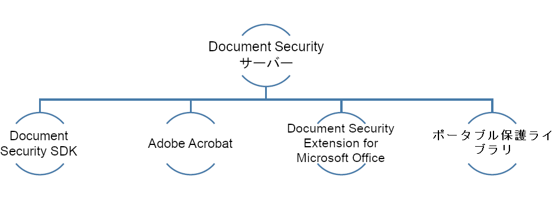

# Document Security の機能{#document-security-offerings}

Adobe Experience Manager Forms Document Security を使用すると、許可されたユーザーのみがドキュメントを使用できるようになります。 Document Security を使用すると、サポートされている形式で保存した情報を安全に配布できます。サポートされるファイル形式には、Adobeポータブルドキュメント形式 (PDF) ファイル、Microsoft® Word、Excel、PowerPoint ファイルなどがあります。

ドキュメントを保護するには、ポリシーを使用します。ポリシーを適用したドキュメントを受信者がどのように使用できるかは、ポリシーで指定した機密性設定によって決まります。例えば、テキストの印刷やコピー、テキストの編集、保護されたドキュメントへの署名やコメントの追加を受信者が実行できるかどうかを指定できます。

ポリシーは Document Security サーバーに保存され、クライアントアプリケーションを使用してドキュメントにポリシーを適用します。 ドキュメントにポリシーを適用すると、ポリシーで指定された機密性設定によって、ドキュメントに含まれる情報が保護されます。ポリシーで保護されたドキュメントは、ポリシーで許可されている受信者に配布できます。

次の図は、AEM Forms Document Security の一般的なアーキテクチャを示しています。

## Document Security クライアント {#document-security-clients}

Document Security は、ドキュメントの保護、保護されたドキュメントの表示と編集、およびインデクサーを提供する様々なクライアントを提供し、保護されたドキュメントに対する全文検索を有効にします。 要件とクライアントの機能に基づいてクライアントを選択できます。

Document Security Server は、Document Security がユーザー認証、ポリシーのリアルタイム管理、機密性の適用などのトランザクションを実行する中央コンポーネントです。 サーバーは、ポリシー、監査記録およびその他の関連情報の中央リポジトリとしての役割も果たします。

Document Security サーバーは、Web ベースのインターフェイス（Web ページ）を提供し、ポリシーの作成、ポリシーで保護されたドキュメントの管理、およびポリシーで保護されたドキュメントに関連するイベントの監視を行います。 管理者は、ユーザー認証、監査、招待ユーザーへのメッセージングなどのグローバルオプションを設定したり、招待ユーザーのアカウントを管理したりすることもできます。

サーバーは、AEM Forms Document Security アドオンの機能に含まれています。 AEM Formsに連絡できます [営業チーム](https://business.adobe.com/request-consultation/experience-cloud.html?s_osc=70114000002JNwKAAW&amp;s_iid=70114000002JHs3AAG) をクリックして、Document Security アドオンを購入します。

### Protectドキュメント {#protect-documents}

AEM Forms Document Security には、セキュリティポリシーを適用するための様々なツールが用意されています。 要件と仕様に応じて、ツールを選択できます。

Document Security SDK、Adobe Acrobat、Document Security Extension for Microsoft® Office、または Portable Protection Library を使用して、セキュリティポリシーを適用および追跡できます。

* **Document Security SDK:** SDK は、機能豊富なクライアントです。 Document Security SDK を使用して、Document Server 機能へのアクセス、ポリシーで保護されたドキュメントの開閉、カスタム拡張機能、プラグイン、またはアプリケーションの開発を行うことができます。 例えば、カスタムのファイル形式を保護する拡張機能を開発したり、SDK とデータ損失防止 (DLP) ソリューションを統合したりできます。 Document Security SDK を使用して開発された拡張機能、アプリケーション、プラグインで、指定されたAEM Forms Server にドキュメントを送信し、ポリシーをサーバーに適用します。 AEM Forms Document Security Client SDK(CSDK) は、Portable Protection Library(PPL) を使用して保護されたドキュメントの保護を解除することはできません。また、逆も同様です。

  Document Security SDK は、Java™と C++の両方で使用できます。 Java™ SDK は、AEM Forms Document Security の機能に含まれており、JEE 上のAEM forms のデプロイ時にインストールされます。 連絡先 [AEM Customer Support](https://experienceleague.adobe.com/?support-solution=General&amp;lang=ja&amp;support-tab=home#support) C++ SDK を入手する。 C++ SDK は、Microsoft® Visual Studio 2013 を使用してコンパイルできます。 次にアクセス： [Document Security API ドキュメント](https://help.adobe.com/ja_JP/livecycle/11.0/Services/WS92d06802c76abadb76c48dfe12dbeb3e281-7ff0.2.html) SDK の機能を学習および使用できるサイトです。

* **ADOBE ACROBAT:** Adobe Acrobatを使用すると、Microsoft® Office、Web ブラウザー、PDF形式での印刷をサポートする任意のアプリケーションなど、一般的なデスクトップアプリケーションを使用して作成したPDFドキュメントにセキュリティポリシーを適用できます。

  Adobe Acrobatは、 [AdobeWeb サイト](https://www.adobe.com/acrobat/free-trial-download.html). Adobe Acrobat の記事「[PDF のセキュリティポリシーの設定](https://helpx.adobe.com/acrobat/using/setting-security-policies-pdfs.html)」には、Adobe Acrobat を使用したポリシーの作成や適用についての詳細が掲載されています。 

* **Microsoft® Office の Document Security Extension**:Microsoft® Office の Document Security Extension を使用して、Microsoft® Office プログラム内から定義済みのポリシーをMicrosoft® Office ファイルに適用できます。 この拡張機能を使用すると、許可されたユーザーのみがポリシーで保護されたMicrosoft® Word、Excel、PowerPoint のファイルを使用できるようになります。 ポリシーで保護されたファイルを使用できるのは、このプラグインをインストールしている権限を持つユーザーだけです。

  Document Security 拡張機能は、Microsoft® Office プラグインとして使用できます。 連絡先 [AEM Customer Support](https://helpx.adobe.com/jp/marketing-cloud/contact-support.html) 拡張機能を入手するには、以下を実行します。 後から、 [Microsoft® Office の Document Security Extension](https://experienceleague.adobe.com/docs/experience-manager-document-security/using/download-installer.html?lang=ja) 拡張機能のインストール、設定、使用について説明します。

* **ポータブル保護ライブラリ：** PPL は、ドキュメントをAEM Forms Server に送信することなく、ドキュメントをローカルで保護します。 ネットワークを経由するのは、セキュリティ資格情報とポリシーの詳細のみです。 また、PPL では、ポリシー取得アクセスを、ログインしたユーザーに限定することもできます。 AEM にログインしているユーザーについて、ポリシーを取得することができます。

  上記と共に、PPL には Document Security SDK のすべての機能が含まれています。 Document Security SDK を使用して、Document Server 機能へのアクセス、ポリシーで保護されたドキュメントの開閉、カスタム拡張機能、プラグイン、またはアプリケーションの開発を行うことができます。 PPL は、AEM Forms Document Security Client SDK(CSDK) を使用して保護されたドキュメントの保護を解除することはできません。また、逆も同様です。

  PPL は、32 ビット版および 64 ビット版の Java™および C++言語で使用できます。 また、OSGi 上の AEM Forms に対する OSGi バンドルとして使用することもできます。C++ PPL は、Microsoft® Visual Studio 2013 を使用してコンパイルできます。 AEM Forms Document Security アドオンのライセンスをお持ちの場合は、 [AEM Forms Document Security](https://experienceleague.adobe.com/?support-solution=General&amp;lang=ja&amp;support-tab=home#support) PPL を調達するためのサポートチーム。 後から、PPL ヘルプ（ライブラリに付属）を使用して、PPL を設定して使用できます。

### 保護されたドキュメントの表示または編集 {#view-or-edit-protected-documents}

* の場合 **PDF文書**&#x200B;を使用すると、Adobe Acrobat DC、Acrobat ReaderおよびAcrobat Reader Mobile を使用して、保護されたPDFドキュメントを表示できます。 ほとんどのユーザーは既にAcrobat Readerをデバイスにインストールしているので、保護されたドキュメントを表示するために追加のソフトウェアを入手したり、学習したりする必要はありません。 また、Acrobat Readerは、 [Acrobat Readerダウンロード Web サイト](https://get.adobe.com/jp/reader/).

* の場合 **Microsoft® Office ドキュメント** Microsoft® Office およびAEM Forms Document Security extension for Microsoft® Office が必要です。 Document Security 拡張機能は、Microsoft® Office プラグインとして使用できます。 この拡張機能は、Adobeの Web サイトからダウンロードできます。

### 保護されたドキュメントのインデックス作成 {#index-protected-documents}

Microsoft® Windows の全文検索エンジン (SharePoint Index server) とAdobe Experience Manager(AEM) は、一般的に使用されるドキュメント形式 ( プレーンテキストファイル、Microsoft® Office ドキュメント、PDFドキュメントなど ) で全文検索を実行できます。 Document Security インデクサーを使用して、全文検索エンジンを有効にし、保護されたPDFドキュメントを検索できます。

* **iFilter インデクサー：** iFilter インデクサーを使用して保護されたPDFドキュメントのインデックスを作成し、Microsoft® Windows 全文検索エンジン (Desktop Indexing Service とSharePoint Index Server) で保護されたPDFドキュメントの検索を有効にすることができます。 詳しくは、 [AEM SharePoint Ifilter for Protected Documents](assets/sharepoint-ifilter-doc-security.pdf).

* **AEM Forms ドキュメントセキュリティインデクサー：** AEM Forms ドキュメントセキュリティインデクサーを使用することで、保護された PDF ドキュメントのインデックスを作成し、Adobe Experience Manager での保護された PDF ドキュメントの検索を有効にします。インデクサーは、AEM Forms Document Security の機能の一部です。 これらは、JEE 上の AEM Forms インストーラーに含まれています。
