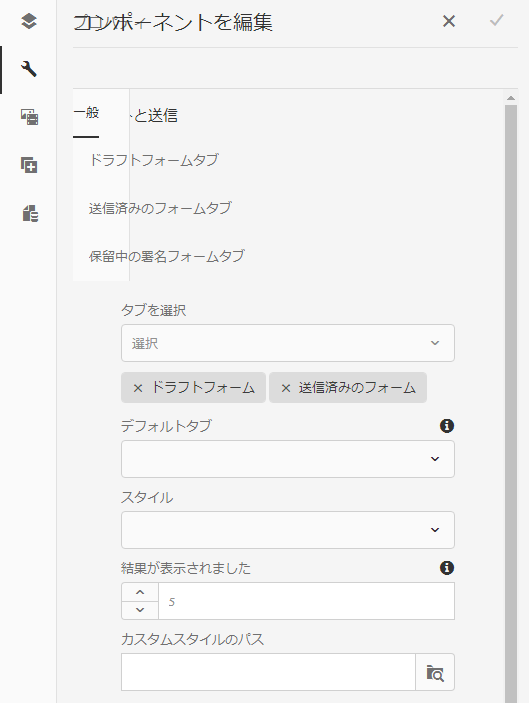

# ドラフトと送信コンポーネント{#drafts-and-submissions-component}

ドラフトと送信コンポーネントは、ドラフト状態のすべてのフォームと、既に送信済みのフォームを一覧表示します。 このコンポーネントには、ドラフトフォームと送信済みフォーム用に別々のセクション（タブ）があります。 ユーザーは自分の下書きと送信済みのフォームのみを表示できます。

## コンポーネントの設定 {#configuring-the-component}

ドラフトと送信コンポーネントには、「ドラフト」と「送信」の 2 つのタブがあります。

アダプティブフォームの送信を有効化して「送信」タブに表示するには、アダプティブフォームで「**送信アクション**」を「**[フォームポータル送信アクション](../../forms/using/configuring-submit-actions.md)」に設定します。または、** により「フォームポータル送信」オプションが有効になります。ユーザーがフォームを送信するたびに、フォームが「送信」タブに追加されます。

ドラフト機能は、初期状態で有効になっています。 ユーザーが **保存** アダプティブフォームでは、フォームが「ドラフト」タブに追加されます。

以下の手順を実行して、ドラフトと送信コンポーネントを追加して設定します。

1. 次をドラッグ&amp;ドロップ： **ドラフトと送信** コンポーネントブラウザーの「ドキュメントサービス」カテゴリの下のコンポーネントをページに移動します。
1. コンポーネントを選択し、「 」を選択します。  をクリックして、コンポーネントの編集ダイアログを開きます。

   

1. 編集ダイアログで、次の詳細を指定し、「 」を選択します。 **完了** をクリックして設定を保存します。

<table>
 <tbody>
  <tr>
   <th>タブ</th>
   <th>設定</th>
   <th>説明</th>
  </tr>
  <tr>
   <td>一般</td>
   <td>合計結果</td>
   <td>表示する結果の最大数を指定します。 結果の数が結果の合計数の制限を増やした場合、 <strong>その他 </strong>コンポーネントの下部にリンクが表示されます。 「<strong>詳細</strong>」をクリックするとすべてのフォームが表示されます。 </td>
  </tr>
  <tr>
   <td> </td>
   <td>スタイルタイプ</td>
   <td>コンポーネントのスタイルを指定します。 フォームのリスト表示には、<strong>書式なし</strong>、<strong>デフォルトスタイル</strong>、<strong>カスタムスタイル</strong>のいずれかを指定できます。「カスタムスタイル」オプションの場合、「<strong>カスタムスタイルパス</strong>」フィールドでカスタム CSS ファイルのパスを指定できます<strong>。</strong></td>
  </tr>
  <tr>
   <td> </td>
   <td>カスタムスタイルパス</td>
   <td>「<strong>スタイルタイプ</strong>」フィールドで「<strong>カスタムスタイル</strong>」オプションを選択する場合、「<strong>カスタムスタイルパス</strong>」フィールドを使用してカスタム CSS ファイルのパスを指定します。 </td>
  </tr>
  <tr>
   <td> </td>
   <td>表示オプション</td>
   <td>
表示するタブを指定します。 「ドラフトフォーム」、「送信済みのフォーム」または「両方」のうちどれを表示するかを選択できます。 
 
<strong>メモ</strong>：<em><strong>「表示」オプション</strong>で、「<strong>両方</strong>」以外のオプションを選択した場合、「<strong>デフォルトタブ</strong>」フィールドのオプションは使用されません。</em>
 </td>
  </tr>
  <tr>
   <td> </td>
   <td>デフォルトのタブ</td>
   <td>フォームポータルページの読み込み時に表示するタブを指定します。 次の中から選択できます。 <strong>ドラフトFormsタブ</strong> および <strong>送信済みのFormsタブ</strong>.</td>
  </tr>
  <tr>
   <td>ドラフトフォームタブの設定</td>
   <td>カスタムタイトル</td>
   <td>タイトルを指定します。 <strong>下書きForms</strong> タブをクリックします。 デフォルト値は <strong>下書きForms。</strong></td>
  </tr>
  <tr>
   <td> </td>
   <td>テンプレートのレイアウト</td>
   <td>ドラフトFormsリストに使用するレイアウトを指定します。</td>
  </tr>
  <tr>
   <td>送信済みのフォームタブの設定</td>
   <td>カスタムタイトル </td>
   <td>タイトルを指定します。 <strong>送信済みForms </strong>タブをクリックします。 デフォルト値は <strong>Formsを提出しました。</strong></td>
  </tr>
  <tr>
   <td> </td>
   <td>テンプレートのレイアウト</td>
   <td>送信済みフォーム<strong> </strong>のリストに使用するレイアウトを指定します。 </td>
  </tr>
 </tbody>
</table>

## ストレージのカスタマイズ {#customizing-the-storage}

「フォームポータル」送信アクションを使用したり、アダプティブフォームでフォームポータルにデータを保存するオプションを有効にしたりすると、フォームデータは AEM リポジトリーに保存されます。実稼働環境では、ドラフトまたは送信されたフォームデータを AEM リポジトリーに保存しないことをお勧めします。代わりに、ドラフトと送信コンポーネントをエンタープライズデータベースなどの安全なストレージと統合して、ドラフトと送信済みフォームデータを格納する必要があります。

Forms portal では、データをローカルのAEMリポジトリ、リモートのAEMリポジトリ、またはデータベースに保存できます。 AEM Formsでは、ドラフトと送信に関するユーザーデータの保存の実装をカスタマイズできます。 デフォルトの方法を上書きして、ドラフトデータや送信データを任意のストレージに保存する方法を指定できます。例えば、組織に現在実装されているデータストアにデータを保存することができます。

フォームポータルには、ローカルとリモートの AEM Forms パブリッシュインスタンスの crx-repository にデータを保存するための、標準のサービス（API）が用意されています。デフォルトの実装は置き換えることができます。その方法について詳しくは、[ドラフトデータと送信データ用のストレージサービスの設定](/help/forms/using/configuring-draft-submission-storage.md)の記事を参照してください。デフォルト機能を置き換えるカスタム実装についての説明もあります。安全な場所にコンテンツを保存するためのカスタム実装に必要な方法について詳しくは、[ドラフトおよび送信データサービスのカスタマイズ](/help/forms/using/custom-draft-submission-data-services.md)と[ドラフトと送信コンポーネントのカスタムストレージ](/help/forms/using/adding-custom-storage-provider-forms.md)を参照してください。

AEM Forms のドキュメントでは、[ドラフトと送信コンポーネントとデータベースの統合のサンプル](integrate-draft-submission-database.md)を示しています。サンプル実装を使用して、独自のカスタム実装を作成できます。

## 関連記事

* [フォームポータルコンポーネントの有効化](/help/forms/using/enabling-forms-portal-components.md)
* [フォームポータルページの作成 ](/help/forms/using/creating-form-portal-page.md)
* [API を使用した Web ページ上のフォームの一覧表示](/help/forms/using/listing-forms-webpage-using-apis.md)
* [ドラフトと送信コンポーネントの使用](/help/forms/using/draft-submission-component.md)
* [ドラフトと送信済みフォームのストレージのカスタマイズ](/help/forms/using/draft-submission-component.md)
* [ドラフトと送信コンポーネントとデータベースの統合のサンプル](/help/forms/using/integrate-draft-submission-database.md)
* [フォームポータルコンポーネントのテンプレートをカスタマイズする](/help/forms/using/customizing-templates-forms-portal-components.md)
* [ポータル上のフォーム公開の概要](/help/forms/using/introduction-publishing-forms.md)
