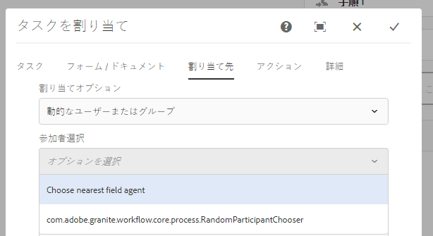

# AEM Forms 中心のワークフローステップ用にユーザーまたはグループを動的に選択する {#dynamically-select-a-user-or-group-for-aem-forms-centric-workflow-steps}

実行時に AEM Forms ワークフローのユーザーまたはグループを選択する方法について説明します。

大規模な組織では、プロセスのユーザーを動的に選択する必要があります。例えば、お客様に対応するフィールドエージェントを、お客様とエージェントの近さを基準として選択します。このようなシナリオで、エージェントは動的に選択されます。

Assign task and Adobe Sign steps of [Forms-centric workflows on OSGi](/help/forms/using/aem-forms-workflow.md) provide options to dynamically select a user. ECMAScriptまたはOSGiバンドルを使用して、タスクの割り当て手順の担当者を動的に選択したり、署名のドキュメント手順の署名者を選択したりできます。

## ECMAScript を使用して、ユーザーまたはグループを動的に選択 {#use-ecmascript-to-dynamically-select-a-user-or-group}

ECMAScript はスクリプト言語です。この言語は、クライアント側のスクリプト作成とサーバーアプリケーションに使用されます。ECMAScript を使用して、ユーザーまたはグループを動的に選択するには、以下の手順を実行します。

1. CRXDE Lite を開きます。URLは `https://'[server]:[port]'/crx/de/index.jsp`
1. 次のパスに、拡張子が .ecma のファイルを作成します。パス（ノード構造）が存在しない場合は作成します。

   * (Path for Assign Task step) `/apps/fd/dashboard/scripts/participantChooser`
   * （署名手順のパス） `/apps/fd/workflow/scripts/adobesign`

1. 動的にユーザーを選択するロジックを含む ECMAScript を .ecma ファイルに追加します。「**[!UICONTROL すべて保存]**」をクリックします。

   For sample scripts, see [Sample ECMAScripts for dynamically selecting a user or a group](/help/forms/using/dynamically-select-a-user-or-group-for-aem-workflow.md#sample-ecmascripts-to-dynamically-choose-a-user-or-a-group).

1. スクリプトの表示名を追加します。この名前は、ワークフローステップで表示されます。名前を指定するには：

   1. スクリプトノードを拡張します。**[!UICONTROL jcr:content]**&#x200B;ノードを右クリックしてから、「**[!UICONTROL Mixins]**」をクリックします。
   1. Mixin を編集ダイアログに `mix:title` プロパティを追加して、「**OK**」をクリックします。
   1. ス追加クリプトのjcr:contentノードに対する次のプロパティ。

      | 名前 | タイプ | 値 |
      |--- |--- |--- |
      | jcr:title | 文字列 | スクリプトの名前を指定します。例えば、最寄のフィールドエージェントを選択します。この名前は、タスクの割り当ておよびドキュメントに署名手順で表示されます。 |

   1. 「**すべて保存**」をクリックします。このスクリプトは、AEM ワークフローのコンポーネントで選択できるようになります。

      

### ユーザーまたはグループを動的に選択するためのサンプル ECMAScripts {#sample-ecmascripts-to-dynamically-choose-a-user-or-a-group}

次のサンプル ECMAScript では、タスクの割り当て手順に担当者を動的に選択します。このスクリプトでは、ユーザーはペイロードのパスに基づいて選択されます。このスクリプトを使用する前に、スクリプトに記述されているすべてのユーザーが AEM に存在することを確認してください。スクリプトに記述されているユーザーが AEM に存在しない場合、関連するプロセスが失敗する可能性があります。

```
function getParticipant() {

var workflowData = graniteWorkItem.getWorkflowData();

if (workflowData.getPayloadType() == "JCR_PATH") { 

var path = workflowData.getPayload().toString(); 
     if (path.indexOf("/content/geometrixx/en") == 0) {
    return "user1";
    } 
   else {
              return "user2";
            }
}
}
```

次のサンプル ECMAScript では、Adobe Sign 手順に担当者を動的に選択します。以下のスクリプトを使用する前に、スクリプトに記述されているユーザー情報（電子メールアドレスと電話番号）が正しいことを確認してください。スクリプトに記述されているユーザー情報が正しくない場合、関連するプロセスが失敗する可能性があります。

>[!NOTE]
>
>Adobe Sign で ECMAScript を使用する場合、スクリプトは /apps/fd/workflow/scripts/adobesign/ にある必要があります。また、ユーザーのリストを返す getAdobeSignRecipients という名前の関数が含まれている必要があります。

```
function getAdobeSignRecipients() {

    var recipientSetInfos = new Packages.java.util.ArrayList();

    var recipientInfoSet = new com.adobe.aem.adobesign.recipient.RecipientSetInfo();
    var recipientInfoList = new Packages.java.util.ArrayList();
    var recipientInfo = new com.adobe.aem.adobesign.recipient.RecipientInfo();

    var email;
    var recipientAuthenticationMethod = com.adobe.aem.adobesign.recipient.RecipientAuthenticationMethod.PHONE;  
    //var recipientAuthenticationMethod = com.adobe.aem.adobesign.recipient.RecipientAuthenticationMethod.NONE;
    var securityOptions = null;

    var phoneNumber = "123456789";
    var countryCode = "+1";
    var recipientPhoneInfo = new Array();
    recipientPhoneInfo.push(new com.adobe.aem.adobesign.recipient.RecipientPhoneInfo(phoneNumber, countryCode));

     securityOptions = new com.adobe.aem.adobesign.recipient.RecipientSecurityOption(recipientAuthenticationMethod, recipientPhoneInfo , null);
    
    email = "example@example.com";
    
    recipientInfo.setEmail(email);
    recipientInfo.setSecurityOptions(securityOptions);
    
    recipientInfoList.add(recipientInfo);
    recipientInfoSet.setMemberInfos(recipientInfoList);
    recipientSetInfos.add(recipientInfoSet);

    return recipientSetInfos;

}
```

## ユーザーまたはグループを動的に選択するための Java インターフェースの使用 {#use-java-interface-to-dynamically-choose-a-user-or-group}

[RecipientInfoSpecifier](https://helpx.adobe.com/experience-manager/6-3/forms/javadocs/com/adobe/fd/workflow/adobesign/api/RecipientInfoSpecifier.html) Java インターフェースを使用して、Adobe Sign やタスクの割り当て手順にユーザーまたはグループを動的に選択することができます。[RecipientInfoSpecifier](https://helpx.adobe.com/experience-manager/6-3/forms/javadocs/com/adobe/fd/workflow/adobesign/api/RecipientInfoSpecifier.html) Java インターフェースを使用する OSGi バンドルを作成して、AEM Forms サーバーにデプロイすることができます。これにより、AEM ワークフローのタスクの割り当ておよび Adobe Sign コンポーネントで、オプションを選択できるようになります。

次のコードサンプルをコンパイルするには、[AEM Forms Client SDK](https://helpx.adobe.com/aem-forms/kb/aem-forms-releases.html) jar および [granite jar](https://repo.adobe.com/nexus/content/groups/public/com/adobe/granite/com.adobe.granite.workflow.api/1.0.2/) ファイルが必要です。これらの jar ファイルを、外部依存として OSGi バンドルプロジェクトに追加します。OSGi バンドルの作成には、任意の Java IDE を使用できます。以下の手順では、Eclipse を使用して OSGi バンドルを作成します。

1. Eclipse IDE を開きます。**[!UICONTROL ファイル]**／**[!UICONTROL 新規プロジェクト]**&#x200B;に移動します。
1. ウィザードを選択画面で、**[!UICONTROL Maven プロジェクト]**&#x200B;を選択し、「**[!UICONTROL 次へ]**」をクリックします。
1. 新しい Maven プロジェクトではデフォルトを保持し、「**[!UICONTROL 次へ]**」をクリックします。archetype を選択して「**[!UICONTROL 次へ]**」をクリックします。例えば、maven-archetype-quickstart などです。プロジェクトに&#x200B;**[!UICONTROL グループ ID]**、**[!UICONTROL アーティファクト ID]**、**[!UICONTROL バージョン]**、**[!UICONTROL パッケージ]**&#x200B;を指定して、「**[!UICONTROL 完了]**」をクリックします。プロジェクトが作成されます。
1. 編集のために pom.xml ファイルを開き、ファイルのすべての中身を次で置き換えます。

   ```xml
   <project xmlns="https://maven.apache.org/POM/4.0.0" xmlns:xsi="https://www.w3.org/2001/XMLSchema-instance"
       xsi:schemaLocation="https://maven.apache.org/POM/4.0.0 https://maven.apache.org/xsd/maven-4.0.0.xsd">
       <modelVersion>4.0.0</modelVersion>
   
       <groupId>getAgent</groupId>
       <artifactId>assignToAgent</artifactId>
       <version>1.0</version>
       <packaging>bundle</packaging><!-- packaging type bundle is must -->
   
       <name>assignToAgent</name>
       <url>https://maven.apache.org</url>
       <repositories>
           <repository>
               <id>adobe</id>
               <name>Adobe Public Repository</name>
               <url>https://repo.adobe.com/nexus/content/groups/public/</url>
               <layout>default</layout>
           </repository>
       </repositories>
       <pluginRepositories>
           <pluginRepository>
               <id>adobe</id>
               <name>Adobe Public Repository</name>
               <url>https://repo.adobe.com/nexus/content/groups/public/</url>
               <layout>default</layout>
           </pluginRepository>
       </pluginRepositories>
   
       <dependencies>
           <dependency>
               <groupId>com.adobe.aemfd</groupId>
               <artifactId>aemfd-client-sdk</artifactId>
               <version>6.0.138</version>
           </dependency>
           <dependency>
               <groupId>com.adobe.granite</groupId>
               <artifactId>com.adobe.granite.workflow.api</artifactId>
               <version>1.0.0</version>
           </dependency>
   
           <dependency>
               <groupId>org.osgi</groupId>
               <artifactId>org.osgi.core</artifactId>
               <version>4.2.0</version>
               <scope>provided</scope>
           </dependency>
   
           <dependency>
               <groupId>org.apache.felix</groupId>
               <artifactId>org.apache.felix.scr.annotations</artifactId>
               <version>1.7.0</version>
   
           </dependency>
   
           <dependency>
               <groupId>org.apache.sling</groupId>
               <artifactId>org.apache.sling.api</artifactId>
               <version>2.2.0</version>
   
           </dependency>
   
       </dependencies>
   
       <!-- ====================================================================== -->
       <!-- B U I L D D E F I N I T I O N -->
       <!-- ====================================================================== -->
       <build>
           <plugins>
   
               <plugin>
                   <groupId>org.apache.felix</groupId>
                   <artifactId>maven-bundle-plugin</artifactId>
                   <extensions>true</extensions>
                   <configuration>
                       <instructions>
                           <Bundle-SymbolicName>com.aem.assigntoAgent-bundle</Bundle-SymbolicName>
                       </instructions>
                   </configuration>
               </plugin>
   
               <plugin>
                   <groupId>org.apache.felix</groupId>
                   <artifactId>maven-scr-plugin</artifactId>
                   <version>1.9.0</version>
                   <executions>
                       <execution>
                           <id>generate-scr-descriptor</id>
                           <goals>
                               <goal>scr</goal>
                           </goals>
                       </execution>
                   </executions>
               </plugin>
           </plugins>
       </build>
   
   </project>
   ```

1. [RecipientInfoSpecifier](https://helpx.adobe.com/experience-manager/6-3/forms/javadocs/com/adobe/fd/workflow/adobesign/api/RecipientInfoSpecifier.html) Java インターフェースを使用するソースコードを追加して、タスクの割り当て手順にユーザーまたはグループを動的に選択することができます。サンプルコードについて詳しくは、「[Java インターフェイスを使用してユーザーまたはグループを動的に選択するためのサンプル](#-sample-scripts-for)」を参照してください。
1. コマンドプロンプトを開き、OSGi バンドルプロジェクトを含むディレクトリに移動します。次のコマンドを使用して OSGi バンドルを作成します。

   `mvn clean install`

1. バンドルを AEM Forms サーバーにアップロードします。AEM Package Manager を使用して、バンドルを AEM Forms サーバーに読み込むことができます。

バンドルを読み込むと、Adobe Sign やタスクの割り当て手順で、ユーザーまたはグループを動的に選択する Java オプションを使用できるようになります。

### ユーザーまたはグループを動的に選択するためのサンプル Java コード {#sample-java-code-to-dynamically-choose-a-user-or-a-group}

次のサンプル Java コードでは、Adobe Sign 手順に担当者を動的に選択します。OSGi バンドルのコードを使用します。以下のコードを使用する前に、コードに記述されているユーザー情報（電子メールアドレスと電話番号）が正しいことを確認してください。コードに記述されているユーザー情報が正しくない場合、関連するプロセスが失敗する可能性があります。

```java
/*************************************************************************

 *
 * ADOBE CONFIDENTIAL
 * __________________
 *
 * Copyright 2016 Adobe Systems Incorporated
 * All Rights Reserved.
 *
 * NOTICE:  All information contained herein is, and remains
 * the property of Adobe Systems Incorporated and its suppliers,
 * if any.  The intellectual and technical concepts contained
 * herein are proprietary to Adobe Systems Incorporated and its
 * suppliers and are protected by trade secret or copyright law.
 * Dissemination of this information or reproduction of this material
 * is strictly forbidden unless prior written permission is obtained
 * from Adobe Systems Incorporated.
 **************************************************************************/
 
package com.aem.impl;

import java.util.ArrayList;
import java.util.List;

import com.adobe.aem.adobesign.recipient.RecipientAuthenticationMethod;
import com.adobe.aem.adobesign.recipient.RecipientInfo;
import com.adobe.aem.adobesign.recipient.RecipientPhoneInfo;
import com.adobe.aem.adobesign.recipient.RecipientSecurityOption;
import com.adobe.aem.adobesign.recipient.RecipientSetInfo;
import com.adobe.fd.workflow.adobesign.api.RecipientInfoSpecifier;
import com.adobe.granite.workflow.WorkflowException;
import com.adobe.granite.workflow.WorkflowSession;
import com.adobe.granite.workflow.exec.WorkItem;
import com.adobe.granite.workflow.metadata.MetaDataMap;
import org.apache.felix.scr.annotations.Component;
import org.apache.felix.scr.annotations.Service;

/**
 * <code>DummyRecipientInfoSpecifier implementation. A sample code to write implementation of RecipientInfoSpecifier to choose recipients/code>...
 */
@Service

@Component(metatype = false)
public class DummyRecipientChoser implements RecipientInfoSpecifier {
    public List<RecipientSetInfo> getAdobeSignRecipients(WorkItem workItem, WorkflowSession workflowSession, MetaDataMap args) throws WorkflowException {

        List<RecipientSetInfo> recipientSetInfos = new ArrayList<RecipientSetInfo>();

                //First Recipient

                RecipientSetInfo recipientInfoSet1 = new RecipientSetInfo();
                List<RecipientInfo> recipientInfoList = new ArrayList<RecipientInfo>();
                RecipientInfo recipientInfo1 = new RecipientInfo();//Member to first recipient

                String email;

                RecipientAuthenticationMethod recipientAuthenticationMethod = RecipientAuthenticationMethod.WEB_IDENTITY;
                RecipientSecurityOption securityOptions = null;

                String phoneNumber = "123456789";
                String countryCode = "+1";
                RecipientPhoneInfo[] recipientPhoneInfo = new RecipientPhoneInfo[1];  //if multiple phone numbers, size>1
                recipientPhoneInfo[0] = new RecipientPhoneInfo(phoneNumber, countryCode);
                securityOptions = new RecipientSecurityOption(recipientAuthenticationMethod, recipientPhoneInfo , null);
                 
                email = "example@example.com";

                recipientInfo1.setEmail(email);
                recipientInfo1.setSecurityOptions(securityOptions);

                recipientInfoList.add(recipientInfo1);  //Add member

                recipientInfoSet1.setMemberInfos(recipientInfoList);

                //Second Recipient

                RecipientSetInfo recipientInfoSet2 = new RecipientSetInfo();
                List<RecipientInfo> recipientInfoList2 = new ArrayList<RecipientInfo>();

                recipientAuthenticationMethod = RecipientAuthenticationMethod.PHONE;
                securityOptions = null;
                 
                phoneNumber = "987654321";//"0123456789";

                countryCode = "+1";
                RecipientPhoneInfo[] recipientPhoneInfo_1 = new RecipientPhoneInfo[1];
                recipientPhoneInfo_1[0] = new RecipientPhoneInfo(phoneNumber, countryCode);
                securityOptions = new RecipientSecurityOption(recipientAuthenticationMethod, recipientPhoneInfo_1 , null);
                 
                email = "example2@example.com";//"dummymail2@domain.com";

                RecipientInfo recipientInfo2  = new RecipientInfo();
                recipientInfo2.setEmail(email);
                recipientInfo2.setSecurityOptions(securityOptions);

                recipientInfoList2.add(recipientInfo2);  //Add member

                recipientInfoSet2.setMemberInfos(recipientInfoList2);

                //*********************************

                recipientSetInfos.add(recipientInfoSet1); 
                recipientSetInfos.add(recipientInfoSet2);

        return recipientSetInfos;

    }

}
```

