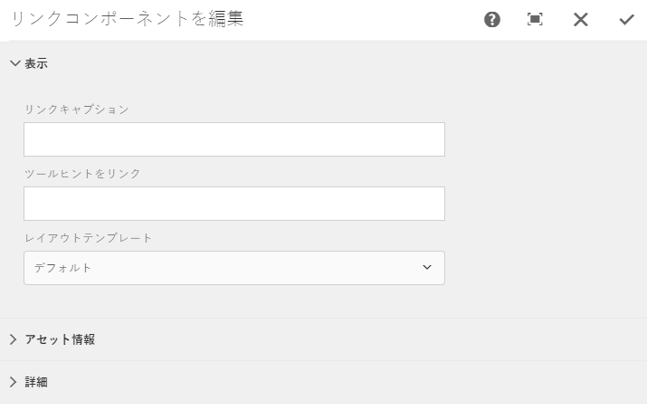

# ページでのリンクコンポーネントの埋め込み{#embedding-link-component-in-a-page}

## 前提条件 {#prerequisites}

リンクコンポーネントは、Document Services カテゴリのメンバーです。Document Services カテゴリが AEM コンポーネントブラウザーに表示されていることを確認してください。カテゴリがリスト表示されていない場合は、[フォームポータルコンポーネントの有効化](/help/forms/using/enabling-forms-portal-components.md)にリストされている手順に従ってください。

## リンクコンポーネント  {#link-component}

フォームポータルの作成者は、リンクコンポーネントを使用してページの任意の場所からアダプティブフォームへのリンクを作成できます。リンクコンポーネントは、コンポーネントブラウザーの Document Services セクションで利用できます。

次の手順を実行して、ページにリンクコンポーネントを追加します。

1. **リンク**&#x200B;コンポーネントをページにドラッグします。コンポーネントを選択し、をタップします。 リンクコンポーネントを編集ダイアログが開きます。

   

1. 「**表示**」タブで次の情報を指定します。

   * **リンクのキャプション**：リンクテキストまたはリンクのキャプション。
   * **リンクツールチップ**：リンクのツールヒント
   * **レイアウトテンプレート**：リンクコンポーネントのレイアウト用テンプレート

1. 「**アセット情報**」タブを開き、アセットのタイプを指定します。アセットは&#x200B;**フォーム**&#x200B;にすることができます。 選択するアセットのタイプによって、次のオプションが表示されます。

   * **アセットパス**：アセットが保存されるリポジトリパス。

   * **レンダリングタイプ**：レンダリング形式--PDF、HTML または自動。自動レンダリングタイプでは、ユーザーの環境が検出され、それに応じて HTML 形式または PDF 形式でフォームがレンダリングされます。例えば、フォームがモバイルデバイスからアクセスされる場合、自動レンダリングタイプでは HTML 形式でフォームがレンダリングされます。
   * **URLの送信：**  URLを、フォームデータが送信されるサーブレットに送信します。
   * **HTML プロファイル：** HTML 形式でのフォームのレンダリングのためのプロファイル。
   * **PDF プロファイル**：PDF 文書形式でのフォームのレンダリングのためのプロファイル。

1. 「**詳細**」タブを開きます。その他のパラメーターは、キーと値のペアの形式で指定できます。リンクをクリックすると、これらのその他のパラメーターはフォームと共に渡されます。

   「**完了**」をタップして設定を保存します。

## リンクコンポーネントを使用するためのベストプラクティス {#best-practices-for-using-link-component-br}

* フォームパスに指定したパスが、レンダリング形式として許可された PDF を含む文書を指す場合は、レンダリングタイプとして PDF を選択したことを確認してください。
* フォームの送信 URL は複数の場所で指定でき、その優先順位は以下の通りです。

   1. 優先順位が最も高いのは、フォーム（送信ボタン）に埋め込まれている送信 URL です。
   1. 優先順位が中程度なのは、Forms Manager で説明している送信 URL です。
   1. 一番優先順位が引くのが、フォームポータルで説明している送信URLです。
