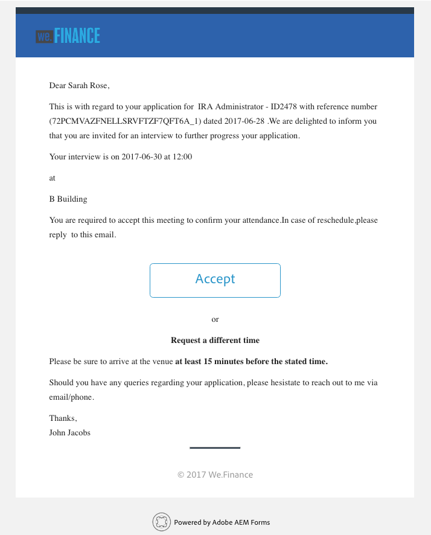

# 従業員採用リファレンスサイトのチュートリアル {#employee-recruitment-reference-site-walkthrough}

## 概要 {#overview}

We.Finance 社のリファレンスサイトポータルでは、求人の募集に申し込むことができます。この組織では、ポータルを面接スケジュール、最終候補者名簿、社内コミュニケーションの管理にも使用しています。このサイトでは以下を管理します。

* 求人の検索と申し込みの管理
* 候補者の審査と最終候補者名簿
* 面接プロセス
* 候補者の詳細情報の収集
* 候補者の経歴の確認
* 選考した候補者へのオファーの展開

>[!NOTE]
>
>従業員採用のユースケースは、We.Finance と We.Gov のどちらのリファレンスサイトでもご覧いただけます。チュートリアルで使用する例、画像、説明は、We.Finance のリファレンスサイトを使用しています。ただし、これらのユースケースおよびレビューアーティファクトは We.Gov を使用しても実行できます。これを行うには、記述されている URL で **we-finance** を **we-gov** に置き換えます。

### 含まれているワークフローモデル {#workflow-models-involved}

従業員採用のユースケースには、2 つのワークフローが含まれています。

* 面接前 - We Finance 従業員採用ワークフロー
* 面接後 - We Finance 従業員採用面接後ワークフロー

これらのワークフローは、AEM で作成され、次の場所で見つかります。

`https://[authorHost]:[authorPort]/libs/cq/workflow/admin/console/content/models.html/etc/workflow/models/`

#### We Finance 従業員採用ワークフロー {#we-finance-employee-recruiting-workflow}

このドキュメントで後述されている We Finance 従業員採用ワークフローのモデルを以下に示します。

#### We Finance 従業員採用面接後ワークフロー {#we-finance-employee-recruiting-post-interview-workflow}

このドキュメントで後述されている We Finance 従業員採用面接後ワークフローのモデルを以下に示します。

### 登場人物 {#personas}

このシナリオでは、次の人物が登場します。

* Sarah Rose（組織の求人に応募する候補者）
* John Jacobs（人材採用担当者）
* Gloria Rios（採用担当マネージャー）
* John Doe（HR 担当者）

## Sarah が求人に応募 {#sarah-applies-for-a-job}

Sarah Rose は、組織の求人を検索しています。Web ポータルにアクセスして、採用ページの求人リストを検索します。リストから適合する求人を見つけ、それに応募します。

We.Finance ホームページ

We.Finance 採用ページ

Sarah は、掲載されている求人の「Apply」（申し込む）をクリックします。求人申込フォームが開きます。応募の詳細をすべて記入して送信します。

### 仕組み {#how-it-works}

We.Finance ホームページと採用ページは、AEM Sites のページです。採用ページにはアダプティブフォームが埋め込まれており、繰り返し可能なパネルを使用して、サービスを利用している求人を取得し、ページ上に一覧表示します。アダプティブフォームは `https://[authorHost]:[authorPort]/editor.html/content/forms/af/we-finance/employee/recruitment/jobs.html` で確認できます。

### 実際の動作確認 {#see-it-yourself}

`https://[publishHost]:[publishPort]/content/we-finance/global/en.html` に移動して、「**[!UICONTROL キャリア]**」をクリックします。「**[!UICONTROL Search]**」（検索）をクリックして求人のリストを表示し、特定の仕事を見つけて「**[!UICONTROL Apply]**」（申し込む）をクリックします。フォームの詳細を記入し、申込書を送信します。

申込書で有効なメール ID を指定していることを確認します。このチュートリアルで行われるすべての通信は、指定したメール ID を使用して行われます。

## John Jacobs が Sarah Rose のプロファイルを採用担当マネージャーの最終候補者名簿に記載 {#john-jacobs-shortlists-sarah-rose-s-profile-for-the-hiring-manager-s-screening}

Sarah が送信した求人の申込書を組織が受信します。John Jacobs（採用担当者）は Sarah のプロファイルのレビューを割り当てられます。John は AEM インボックスでプロファイルをレビューし、プロファイルが求人要件を満たしていることを確認して、「Shortlist」（最終候補者名簿）をクリックします。Sarah のプロファイルは採用マネージャーである Gloria Rios に転送され、承認を受けます。

John の AEM インボックス

John Jacobs が Sarah Rose のプロファイルを採用担当マネージャーの最終候補者名簿に記載

**仕組み**

求人申込フォームの送信アクションは、John Jacob のインボックスに申込書の審査タスクを作成するワークフローをトリガーします。John がレビューして申込書を最終候補者名簿に追加すると、ワークフローによって採用担当マネージャーである Gloria のインボックスにタスクが作成されます。

### 実際の動作確認 {#see-it-yourself-1}

`https://[publishHost]:[publishPort]/content/we-finance/global/en/login.html?resource=/aem/inbox.html` に移動し、John Jacobs のユーザー名とパスワード（jjacobs／password）を使用してログインします。候補者のプロファイルをレビューするタスクと最終候補者名簿を開きます。

## Gloria が申込書をレビューし、申込者の面接を承認 {#gloria-reviews-the-application-and-approves-the-applicant-for-an-interview}

採用担当マネージャーである Gloria は、最終候補者名簿のプロファイルをタスクとして AEM インボックスに受信します。Gloria はレビューを行い、候補者である Sarah Rose の面接を承認します。

Gloria の AEM インボックス

Gloria が Sarah Rose の面接を承認

**仕組み**

Gloria が候補者の面接を承認すると、ワークフローは We.Finance の採用担当者である John Doe の AEM インボックスにタスクを作成します。

### 実際の動作確認 {#see-it-yourself-2}

`https://[publishHost]:[publishPort]/content/we-finance/global/en/login.html?resource=/aem/inbox.html` に移動し、John Jacobs のユーザー名とパスワード（jjacobs／password）を使用してログインします。候補者のプロファイルをレビューするタスクと最終候補者名簿を開きます。

`https://[publishHost]:[publishPort]/content/we-finance/global/en/login.html?resource=/aem/inbox.html` に移動し、Gloria Rios のユーザー名とパスワード（grios／password）を使用してログインします。候補者のプロファイルをレビューするタスクを開き、「Schedule Interview」（面接のスケジュール）をクリックします。

## John Doe が面接をスケジュール {#john-doe-schedules-an-interview}

John Doe は、インボックスに面接のスケジュールのタスクを受信します。John Doe はそのタスクを選択して開き、面接日時と場所を指定し、面接担当の HR を John Jacob に指定します。John Doe は「Send Invitation Email」（招待メールの送信）をクリックします。メールが Sarah に送信され、Sarah の面接タスクが採用担当マネージャーである Gloria に割り当てられます。

John Doe の AEM インボックス

John Doe が面接をスケジュールし詳細を Sarah Rose に送信

## Sarah Rose が面接スケジュールのメールを受信 {#sarah-rose-receives-the-email-with-interview-schedule}

Sarah Rose は、面接スケジュール、場所、およびその他の詳細が記載されたメールを受信します。「Accept」（承諾）をクリックし、面接のスケジュールと場所について承諾します。詳細情報に従い、Sarah は面接に対応します。

Sarah Rose が面接スケジュールを受信

## 面接後、採用担当マネージャーが Sarah Rose を最終候補者名簿に記載 {#after-the-interviews-the-hiring-manager-shortlists-sarah-rose}

Sarah Rose が面接を受けて合格すると、採用担当マネージャーである Gloria Rios は自分のインボックスから候補者選択タスクを開いて「選択」をクリックします。Gloria Rios の判断は HR 担当者である John Doe に伝達され、さらに処理が進められます。

Gloria の AEM インボックス

面接後、Gloria Rios は Sarah Rose を選択

## John Doe が詳細情報をリクエスト {#john-doe-requests-more-information}

候補者に組織への参加を依頼する前に、Sarah の経歴を確認する必要があります。John Doe は選択された応募者の詳細情報を開いて確認し、学歴と職歴の一部がまだ入力されていないことに気づきます。John Doe は「詳細情報が必要」をクリックします。

 

John Doe は、Sarah Rose に学歴と職歴について詳細情報をリクエスト

## Sarah Rose は詳細情報を求めるメールを受信 {#sarah-rose-receives-an-email-requesting-further-information}

Sarah Rose は、採用手続きを進めるには、詳細情報が必要であることを通知するメールを受信します。メールには、必要な情報を入力するためのリンクが含まれています。

Sarah Rose は、採用手続きを進めるには詳細情報が必要であることを通知するメールを受信

Sarah は、メールの「詳細を入力」リンクをクリックします。フォームが表示されます。Sarah は、John Doe がリクエストしている学歴と職歴の詳細を入力し、「送信」をクリックします。

Sarah がメール内のリンクをクリックし、追加情報フォームを開く

Sarah は John Doe のリクエストに従って追加情報を入力し、「送信」をクリック

## John Doe が、選択した候補者プロファイルの追加情報を確認 {#john-doe-reviews-the-selected-candidate-profile-for-the-additional-information-provided}

John Doe は、候補者審査要求を選択して開きます。John Doe は、Sarah がすべての必要な情報を入力したことを確認します。申請書をレビューした後、John Doe は「承認」をクリックします。John Doe の承認を受けて、Sarah Rose の経歴チェックのリクエストが John Jacobs に転送されます。

John Doe の AEM インボックス

John Doe が、Sarah により入力された追加情報を確認して承認

## John Jacobs が、経歴チェックリクエストを受信 {#john-jacobs-receives-a-background-check-request}

John Jacobs は、自分のインボックスにある経歴チェックリクエストを確認します。John Jacobs は、タスクを開いて Sarah Rose の入力した情報を確認します。John Jacobs は、経歴をチェック後「続行」をクリックして、経歴チェックが完了したことを通知します。

John Jacobs の AEM インボックス

John Jacobs は、経歴をチェック後「続行」をクリック

## John Doe は、採用通知を Sarah Rose に送信 {#john-doe-sends-out-the-joining-letter-to-sarah-rose}

John Doe は、AEM インボックスに採用通知の送信要求を受信します。John はそのリクエストを開いて詳細を確認します。John Doe は、採用通知の PDF を添付して「採用通知の添付と送信」をクリックします。

John Doe の AEM インボックス

John Doe は署名を求める採用通知を送信

## Sarah Rose が受信して採用通知に署名 {#sarah-rose-receives-and-signs-the-joining-letter}

Sarah Rose が署名を求める採用通知を受信します。Sarah が「Click Here To Review And Sign Joining Letter」（採用通知を確認して署名）をクリックします。署名するフィールドのある採用通知の PDF が開きます。

Sarah Rose が署名を求める採用通知を受信

Sarah は、手入力、描画による手書き、署名画像の挿入、またはモバイル機器のタッチスクリーンでの描画のいずれかによって署名できます。Sarah は名前を入力して「クリックして署名」をクリックし、採用通知の署名済みコピーをダウンロードします。

Sarah は自分の名前を入力し、採用通知に署名します。

Sarah は「Click To Sign」（クリックして署名）をクリックし、採用通知への署名を完了します。
