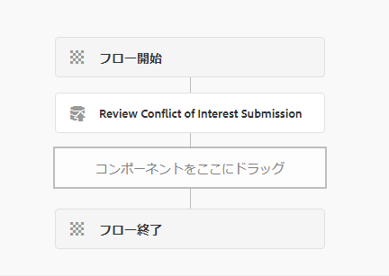
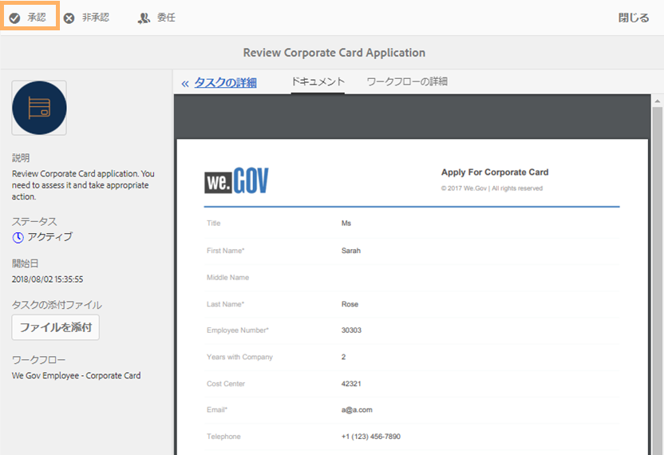
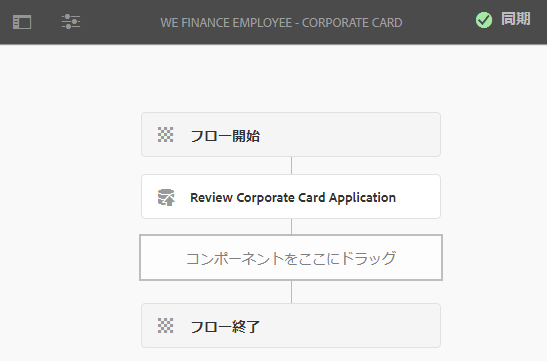
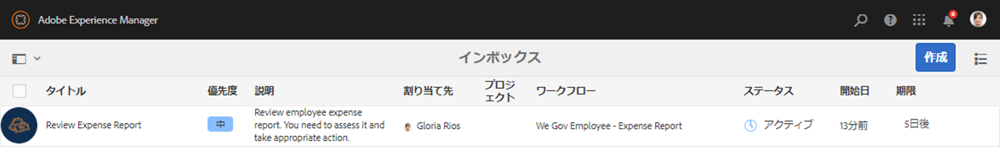
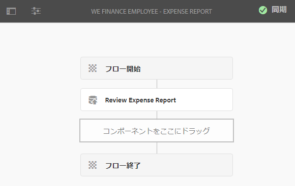
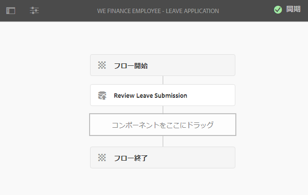

# 従業員セルフサービス reference site walkthrough{#employee-self-service-reference-site-walkthrough}

## 前提条件 {#prerequisite}

「[AEM Forms リファレンスサイトのセットアップおよび設定](../../forms/using/setup-reference-sites.md)」を参照してリファレンスサイトをセットアップします。

## 概要 {#overview}

通常、従業員セルフサービスシステムは企業のイントラネットでホストされ、従業員が自分の席からさまざまな情報やサービスにアクセスして利用できるようになっています。これにより、雇用内容詳細へのアクセス、休暇の申請、経費報告書の提出などを操作する権限が従業員に与えられ、自身でコントロールできるようになります。一方、組織は従業員に情報を提供しながらプロセス効率を高め、費用を削減することができます。

従業員セルフサービスのリファレンスサイトでは、どのように AEM Forms を活用して従業員セルフサービスのシステムを組織に実装するのかを紹介しています。

>[!NOTE]
>
>従業員セルフサービスのチュートリアルで使用する例、画像、説明には、We.Financeリファレンスサイトを使用します。

## 利益相反アンケートのチュートリアル {#conflict-of-interest-questionnaire-walkthrough}

組織は、時折、従業員に対して、組織と競合する可能性のある社外活動または従業員の個人的な関係を特定する、利益相反アンケートの提出を求めます。

Sarahの組織のコンプライアンス部門は、従業員に対して、利益相反アンケートの提出を求めています。

### Sarah はこの利益相反アンケートを送信 {#sarah-submits-the-conflict-of-interest-questionnaire}

Sarah は組織のポータルサイトにアクセスしてログインし、「Employee」をクリックして従業員のダッシュボードにアクセスします。従業員のダッシュボードで利益相反アンケートを見つけ、「**[!UICONTROL Apply]**」をクリックします。

組織のポータルサイト

従業員のダッシュボード

Sarah は「Next」ボタンを使用してフォームを移動し、「Introduction」セクションと「Definition」のセクションをすべて読みます。「Questions」セクションにあるアンケートに回答します。最後に、アンケートに署名をして送信します。

組織のポータルサイトとアンケートはレスポンシブで、モバイルデバイスでも使いやすくなっています。次のワークフローは、Sarah がモバイルデバイスでアンケートに移動してアンケートを送信するまでの方法を示しています。

**仕組み**

組織のポータルサイトと従業員のダッシュボードは AEM サイトページです。このダッシュボードには、利益相反のアンケートなど複数のセルフサービスオプションが一覧表示されています。「Apply」ボタンはアダプティブフォームにリンクされています。

このアダプティブフォームでは、「Questions」タブで入力された回答に基づいて情報を表示または非表示にするためのルールが使用されています。また、「Declaration」タブへの署名に対する「手書き」コンポーネントも使用されています。でアダプティブフォームを確認しま `https://[authorHost]:[authorPort]/editor.html/content/forms/af/we-finance/employee/self-service/conflict-of-interest.html`す。

**実際の動作確認**

Go to `https://[publishHost]:[publishPort]/content/we-finance/global/en/self-service-forms.html` and log in using `srose/srose` as username/password for Sarah. 「**[!UICONTROL Employee]**」をクリックしてダッシュボードにアクセスし、利益相反アンケートで「**[!UICONTROL Apply]**」をクリックします。アンケートを確認して送信します。

#### Gloria は利益相反アンケートの送信を確認して、承認します。 {#gloria-reviews-and-approves-the-conflict-of-interest-questionnaire-submission}

Sarah により送信された利益相反アンケートは、確認用に Gloria Rios に割り当てられます。Gloria はこの組織でコンプライアンス担当の役員として働いています。Gloria は AEM インボックスにログインし、自分に割り当てられたタスクを確認します。Sarah により送信されたアンケートを承認し、タスクを終了します。

Gloria のインボックス

タスクを開く

**仕組み**

利益相反アンケートの送信アクションにより、Gloria のインボックスに承認のタスクを作成するワークフローがトリガーされます。フォームワークフローの確認( `https://[authorHost]:[authorPort]/editor.html/conf/global/settings/workflow/models/we-finance/employee/self-service/we-finance-employee-conflict-of-interest.html`

**実際の動作確認**

Go to `https://[publishHost]:[publishPort]/content/we-finance/global/en/login.html?resource=/aem/inbox.html` and log in using `grios/password` as username/password for Gloria Rios. 利益相反アンケート用に作成されたタスクを開き、これを承認します。

## 法人カードの申し込みのチュートリアル {#corporate-card-application-walkthrough}

Sarah は出張が多いため、移動にかかる費用の支払いに法人カードを必要としています。彼女は組織の従業員用ポータルサイトで法人カードを申し込みます。

### Sarah は法人カードの申込フォームを送信 {#sarah-submits-the-corporate-card-application}

Sarah は組織のポータルサイトにアクセスしてログインし、「**[!UICONTROL Employee]**」をクリックして従業員のダッシュボードにアクセスします。従業員のダッシュボードで法人カードの申込フォームを見つけ、「**[!UICONTROL Apply]**」をクリックします。

組織のポータルサイト

従業員のダッシュボード

法人カードの申込フォームで「**[!UICONTROL Apply]**」をクリックします。単一ページの申込フォームが開きます。すべての項目に詳細を入力して「**[!UICONTROL Apply]**」をクリックし、申込書を送信します。

**仕組み**

組織のポータルサイトと従業員のダッシュボードは AEM サイトページです。このダッシュボードには、法人カードの申し込みなど複数のセルフサービスオプションが一覧表示されています。申込フォームの「Apply」ボタンはアダプティブフォームにリンクされています。

法人カード申し込みのアダプティブフォームは、単一ページに表示される簡素化されたレスポンシブフォームです。これは、テキスト、電話、数値ボックス、数値ステッパーなど、基本的なアダプティブフォームコンポーネントを使用しています。次の場所でアダプティブフォームを確認します。\
`https://[authorHost]:[authorPort]/editor.html/content/forms/af/we-finance/employee/self-service/corporate-card.html` です。

**実際の動作確認**

Go to `https://[publishHost]:[publishPort]/content/we-finance/global/en/self-service-forms.html` and log in using `srose/srose` as username/password for Sarah. 「**[!UICONTROL Employee]**」をクリックしてダッシュボードにアクセスし、法人カードの申込フォームで「**[!UICONTROL Apply]**」をクリックします。各項目に詳細を入力し、申込書を送信します。

### Gloria は法人カードの申込書を確認して承認 {#gloria-reviews-and-approves-the-corporate-card-application}

Sarah により送信された法人カードの申込書は、確認用に Gloria Rios に割り当てられます。Gloria は AEM インボックスにログインし、自分に割り当てられたタスクを確認します。Sarah により送信された申込書を承認し、タスクを終了します。

Gloria のインボックス

タスクを開く

**仕組み**

法人カード申し込みの送信ワークフローにより、Gloria のインボックスに承認のタスクを作成する Forms ワークフローがトリガーされます。フォームワークフローの確認( `https://[authorHost]:[authorPort]/editor.html/conf/global/settings/workflow/models/we-finance/employee/self-service/we-finance-employee-corporate-card.html`

**実際の動作確認**

Go to `https://[publishHost]:[publishPort]/content/we-finance/global/en/login.html?resource=/aem/inbox.html` and log in using `grios/password` as username/password for Gloria Rios. 法人カードの申し込み用に作成されたタスクを開き、これを承認します。

## 経費報告書送信のチュートリアル {#expense-report-submission-walkthrough}

Sarah は出張中に出費があったため、承認を得るために経費報告書を提出する必要があります。組織のセルフサービスオプションを使用すれば、経費報告書をオンラインで送信できます。

### Sarah は経費報告書の申請を送信 {#sarah-submits-the-expense-report-application}

Sarah は組織のポータルサイトにアクセスしてログインし、「**[!UICONTROL Employee]**」をクリックして従業員のダッシュボードにアクセスします。She finds Expense Report application on the employee dashboard and clicks **[!UICONTROL Apply]**.

組織のポータルサイト

従業員のダッシュボード

経費報告書の申請フォームで「**[!UICONTROL Apply]**」をクリックします。申請フォームが開きます。ここには、「レポート名」と「レポートの詳細」の 2 つのタブが表示されます。「レポートの詳細」タブの「**+**」アイコンをクリックすると、1 つの報告書に複数の支出項目を追加できます。

組織のポータルサイトと申請フォームはレスポンシブで、モバイルデバイスでも使いやすくなっています。次のワークフローは、Sarah がモバイルデバイスで経費報告書に移動して送信するまでの流れを示しています。

**仕組み**

組織のポータルサイトと従業員のダッシュボードは AEM サイトページです。このダッシュボードには、経費報告書の申請など複数のセルフサービスオプションが一覧表示されています。「Apply」ボタンはアダプティブフォームにリンクされています。

アダプティブフォームの「Report Name」タブと「Report Details」タブはパネルコンポーネントです。「Report Details」パネルには「Expense」パネルが含まれています。これは繰り返し使用可能なパネルで、レポートに複数の支出項目を追加できます。アダプティブフォームとその設定を、で確認しま `https://[authorHost]:[authorPort]/editor.html/content/forms/af/we-finance/employee/expense-report.html`す。

**実際の動作確認**

Go to `https://[publishHost]:[publishPort]/content/we-finance/global/en/self-service-forms.html` and log in using `srose/srose` as username/password for Sarah. 「**[!UICONTROL Employee]**」をクリックしてダッシュボードにアクセスし、経費報告の申請フォームで「**[!UICONTROL Apply]**」をクリックします。各項目に詳細を入力し、申込書を送信します。

### Gloria は経費報告書を確認して承認 {#gloria-reviews-and-approves-the-expense-report}

Sarah により送信された経費報告書は、確認用に Gloria Rios に割り当てられます。Gloria は AEM インボックスにログインし、自分に割り当てられたタスクを確認します。Sarah により送信された申込書を承認し、タスクを終了します。

Gloria のインボックス

タスクを開く

**仕組み**

経費報告の申請書の送信ワークフローにより、Gloria のインボックスに承認のタスクを作成する Forms ワークフローがトリガーされます。フォームワークフローの確認( `https://[authorHost]:[authorPort]/editor.html/conf/global/settings/workflow/models/we-finance/employee/self-service/we-finance-employee-expense-report-workflow.html`

**実際の動作確認**

Go to `https://[publishHost]:[publishPort]/content/we-finance/global/en/login.html?resource=/aem/inbox.html` and log in using `grios/password` as username/password for Gloria Rios. 経費報告の申請用に作成されたタスクを開き、これを承認します。

## 休暇申請のチュートリアル {#leave-application-walkthrough}

Sarah は来月家族旅行を計画しているため、1 週間の休暇を申請しようとしています。

### Sarah は休暇の申請書を送信 {#sarah-submits-the-leave-application}

Sarah は組織のポータルサイトにアクセスしてログインし、「**[!UICONTROL Employee]**」をクリックして従業員のダッシュボードにアクセスします。従業員のダッシュボードで休暇の申請フォームを見つけ、「**[!UICONTROL Apply]**」をクリックします。

組織のポータルサイト

従業員のダッシュボード

休暇の申請フォームは、Sarah の名前と従業員 ID が入力された状態で開きます。ここには、彼女の有効な休暇日数と履歴も表示されます。各項目に詳細を入力し、承認用に申請フォームを送信します。

組織のポータルサイトと申請フォームはレスポンシブで、モバイルデバイスでも使いやすくなっています。次のワークフローは、Sarah がモバイルデバイスで申請フォームに移動して送信するまでの方法を示しています。

**仕組み**

組織のポータルサイトと従業員のダッシュボードは AEM サイトページです。このダッシュボードには、休暇の申請など複数のセルフサービスオプションが一覧表示されています。「Apply」ボタンはアダプティブフォームにリンクされています。

休暇申請のアダプティブフォームは、従業員の休暇フォームデータモデルに基づいています。`getLeavesOf` フォームデータモデルサービスを使用して、「Leave Balance」セクションに有効な休暇日数を示す表が表示されます。「Start Date」および「End Date」フィールドは、ルールを使用して日付の値が現在の日付以降になっているかどうかが検証されます。休暇期間は、`calcBusinessDays` 関数を使用して計算されます。

次の場所で、アダプティブフォームおよびフォームデータモデルを確認できます。

`https://[authorHost]:[authorPort]/editor.html/content/forms/af/we-finance/employee/self-service/leave-application.html`

`https://[authorHost]:[authorPort]/aem/fdm/editor.html/content/dam/formsanddocuments-fdm/db`

**実際の動作確認**

Go to `https://[publishHost]:[publishPort]/content/we-finance/global/en/self-service-forms.html` and log in using `srose/srose` as username/password for Sarah. 「**[!UICONTROL Employee]**」をクリックしてダッシュボードにアクセスし、休暇の申請フォームで「**[!UICONTROL Apply]**」をクリックします。各項目に詳細を入力し、申込書を送信します。

#### Gloria は休暇申請書を確認して承認 {#gloria-reviews-and-approves-the-leave-application}

Sarah により送信された休暇申請書は、確認用に Gloria Rios に割り当てられます。Gloria は AEM インボックスにログインし、自分に割り当てられたタスクを確認します。Sarah により送信された申込書を承認し、タスクを終了します。

Gloria のインボックス

タスクを開く

**仕組み**

休暇申請の送信ワークフローにより、Gloria のインボックスに承認のタスクを作成する Forms ワークフローがトリガーされます。フォームワークフローの確認( `https://[authorHost]:[authorPort]/editor.html/conf/global/settings/workflow/models/we-finance/employee/self-service/we-finance-employee-leave-application.html`

**実際の動作確認**

Go to `https://[publishHost]:[publishPort]/content/we-finance/global/en/login.html?resource=/aem/inbox.html` and log in using `grios/password` as username/password for Gloria Rios. 休暇の申請用に作成されたタスクを開き、これを承認します。
