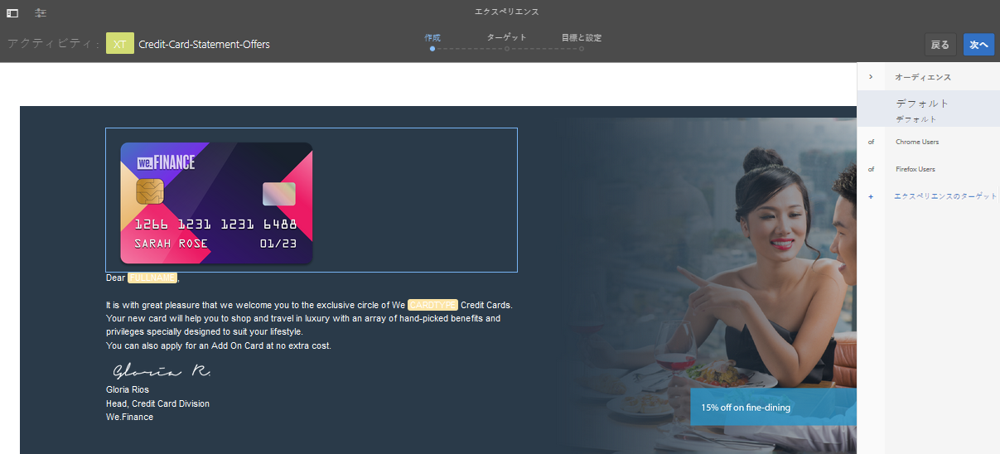

# AEM Forms でターゲット設定されたエクスペリエンスを作成する {#create-targeted-experiences-in-aem-forms}

## Adobe TargetをAEM Formsと統合{#integrate-adobe-target-with-aem-forms}

Adobe Target は AEM と統合されて、対象オーディエンスに向けてカスタマイズされたエクスペリエンスを作成することが可能になりました。Adobe Target では、対象ユーザーに向けて A/B テストを作成し、ユーザーの反応を評価し、カスタマイズされた Web コンテンツを生成します。Adobe TargetとAEM Formsを、アダプティブフォームのターゲット画像コンポーネントやインタラクティブコミュニケーションに統合できます。

AEMでAdobe Targetを設定し、アダプティブフォームとインタラクティブな通信で使用します。「[AEM](/help/sites-administering/target.md)でのターゲット設定の作成」と「[追加a Framework](/help/sites-administering/target.md)」を参照してください。

>[!NOTE]
>
>ターゲット設定は、アダプティブフォームまたはインタラクティブな通信がホスト名またはIPアドレスを使用してレンダリングされる場合に機能します。 アダプティブフォームまたはインタラクティブな通信がローカルホストを使用してレンダリングされると、失敗します。

## Target アクティビティを作成する {#creating-a-target-activity}

1. **Adobe Experience Manager/パーソナライゼーション/アクティビティ**&#x200B;をタップします。

   `https://<hostname>:<port>/libs/cq/personalization/touch-ui/content/v2/activities.html`

1. アクティビティページで、**作成/ブランドを作成**&#x200B;をタップします。
1. テンプレートを選択し、プロパティを入力します。

   テンプレートを選択し、「**次へ」をタップします。** 「プロパティ」セクションにブランドのタイトルを入力し、「 **作成」をタップします。**
ブランドがアクティビティページに表示されます。

1. アクティビティページのブランドをタップします。
1. ブランドのマスター領域で、**作成**/**アクティビティを作成**&#x200B;をタップします。

   アクティビティを作成したら、その詳細、対象、および設定を指定します。

   詳細セクションには、名前、対象のエンジン、および目的が含まれます。対象のエンジンとして Adobe Target を選択した場合、Target のクラウド設定オプションが有効になります。ターゲットクラウドの設定を選択し、アクティビティの種類を選択してアクティビティの目的を指定し、「**次へ**」をタップします。 Interactive Communicationは、エクスペリエンスのターゲット設定のアクティビティタイプのみをサポートします。

   Target セクションでは、オーディエンスのエクスペリエンスを追加し、名前を付けることができます。「**エクスペリエンス追加**」をクリックして、「**オーディエンス**&#x200B;を選択」および「**エクスペリエンスに名前を付ける**」オプションを有効にします。 「**オーディエンス**&#x200B;を選択」をタップして、オーディエンスとそのソースのリストを表示します。 オーディエンス名のリストからオーディエンスを選択します。「**エクスペリエンス追加**」をタップしてエクスペリエンスの名前を指定し、「**次へ**」をタップします。

   「目標と設定」セクションでは、アクティビティのスケジュールと優先度の設定ができます。開始日、終了日、アクティビティ、目標指標、追加指標の優先度を設定し、**保存**&#x200B;をタップします。

   アクティビティが、ブランドページのリストに表示されました。

   >[!NOTE]
   >
   >「アクティビティは保存されましたが、ターゲットに同期されていません。 理由：「次のエクスペリエンスにはオファーがありません」というエラーが発生した場合は、アクティビティを保存する際にエラーが発生します。

1. ターゲットを有効にするには、.jspファイルを編集し、アダプティブフォームテンプレートで使用するクライアントライブラリを含めます。

   例えば、そのまま使用できる実装では、**ツール**/**CRXDE Lite**&#x200B;をクリックします。

   CRXDE Liteのアドレスバーに/libs/fd/af/components/page/base/head.jspと入力し、head.jspファイルを編集します。

   この実装では、simpleEnrollmentテンプレートを使用します。 この実装では、head.jspファイルを変更して次のクライアントライブラリを含めます。

   `<cq:include script="/libs/cq/cloudserviceconfigs/components/servicelibs/servicelibs.jsp"/>`

   `<cq:include path="clientcontext_optimized" resourceType="/libs/cq/personalization/components/clientcontext_optimized"/>`

   `<cq:include path="config" resourceType="cq/personalization/components/clientcontext_optimized/config"/>`

1. アダプティブフォームのターゲットフレームワークを有効にするには、フォームまたはインタラクティブな通信に移動し、編集モードで開きます。

   フォームまたはインタラクティブな通信を編集モードで開くには、**「**&#x200B;を選択」をタップし、**「**&#x200B;を開く」をタップします。

   または、フォームまたはインタラクティブなコミュニケーションアイコンを選択せずにポインターをフォーム上に移動すると、4つのボタンが表示されます。 表示される「**編集**」ボタンをタップすると、フォームが編集モードで開きます。

1. ページツールバーで、**ページ情報**  > **プロパティを開く**&#x200B;をタップします。
1. 「一般」タブで、**Adobe Target**&#x200B;フィールドの設定を選択します。 「**保存して閉じる**」をタップします。

## 作成したアクティビティをアダプティブフォームの画像またはインタラクティブな通信画像に適用する{#applying-created-activity-to-an-adaptive-form-image-or-an-interactive-communication-image}

1. アダプティブフォームとインタラクティブな通信を開いて編集します。 対話型の通信を開く場合は、Webチャネルを開きます。

1. インタラクティブな通信またはアダプティブフォームのオーサリングモードで、ターゲットにする画像を追加します。

   >[!NOTE]
   >
   >AEM Formsは、画像コンポーネントのターゲット設定のみをサポートしています。 画像コンポーネントをホストするパネルに他のコンポーネントが含まれていないこと、およびパネルの列数が1に設定されていることを確認します。

1. **編集**&#x200B;から&#x200B;**ターゲット**&#x200B;モードに切り替えます。 モードを切り替えるオプションは、右上隅付近にあります。
1. **BRAND**&#x200B;を選択し、**アクティビティ**&#x200B;を選択して、**開始のターゲット設定**&#x200B;をタップします。 エディターの右側に&#x200B;**オーディエンス**&#x200B;メニューが表示されます。

   

1. **オーディエンス**&#x200B;メニューからオーディエンスを選択し、ターゲットする画像をタップします。 メニューが表示されます。 メニューで、**ターゲット**&#x200B;をタップします。 画像をタップし、**設定**&#x200B;をタップします。 プロパティウィンドウで、選択したオーディエンスに対して表示する画像を選択します。 すべてのオーディエンスに対して手順を繰り返します。 エクスペリエンスのターゲット設定は、インタラクティブな通信またはアダプティブフォームの画像に対して有効になります。

## 作成したアクティビティと Target サーバーとの同期を確認する {#check-if-the-created-activity-syncs-with-the-target-server}

ターゲット設定に使用したアクティビティは、Target サーバーと同期します。アクティビティが Target サーバーと同期しているか確認するには、ブランドページでアクティビティのステータスを確認します。

アクティビティのステータスが同期していることを確認してください。

## Target の動作を検証する {#validate-target-behavior}

Target の動作は次のように検証します。

* 作成者モードで`wcmmode preview`でターゲティングを使用
* 公開モードで`wcmmode preview`と`wcmmode disabled`でターゲット設定を使用

## 画像コンポーネントのターゲット設定を監視する {#monitor-targeting-for-the-image-component}

フォームの画像コンポーネントのターゲット設定を監視するには、画像、アクティビティ、アダプティブフォームを発行します。

## 未解決の問題 {#open-issues}

表示式のフォーカスの設定は、アダプティブフォームでターゲット設定された画像では機能しません。
