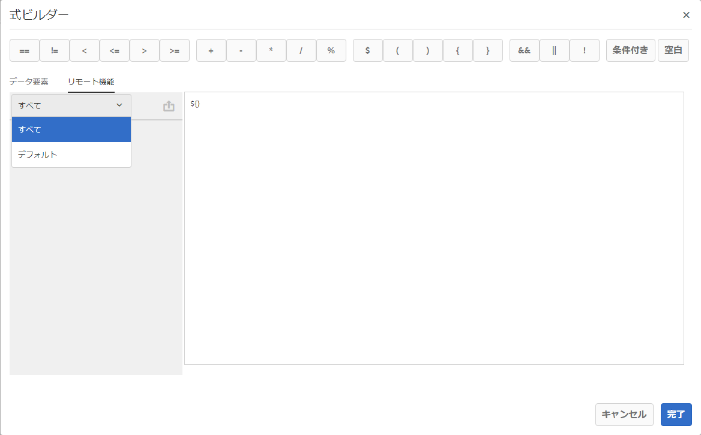

# 式ビルダーのリモート関数{#remote-functions-in-expression-builder}

式ビルダーを使用して、データ辞書またはエンドユーザーによって提供されたデータ値に対して計算を実行する式または条件を作成できます。Correspondence Management は式の評価の結果を使用して、アセット（テキスト、画像、リスト、条件など）を選択し、それらを必要に応じて通信に挿入することができます。

## 式ビルダーによる式およびリモート関数の作成 {#creating-expressions-and-remote-functions-with-expression-builder}

式ビルダーは内部的には JSP EL ライブラリを使用しているため、式は JSPEL 構文に従います。詳しくは、「[サンプル式](#exampleexpressions)」を参照してください。


### 演算子 {#operators}

式で使用できる演算子は、式ビルダーの上部バーにあります。

### サンプル式 {#exampleexpressions}

通信管理ソリューションで使用できる、一般的な JSP EL の例は以下のとおりです。

* 2 つの数値の追加： ${number1 + number2}
* 2 つの文字列の連結： ${str1} ${str2}
* 2 つの数値の比較： ${age &lt; 18}

詳細な情報は、「[JSP EL 仕様](https://download.oracle.com/otn-pub/jcp/jsp-2.1-fr-spec-oth-JSpec/jsp-2_1-fr-spec-el.pdf)」で確認できます。クライアント側の Expression Manager は、JSP EL 仕様の特定の変数や関数をサポートしていません。以下に例を示します。

* コレクションのインデックスとマップのキー（[] 表記を使用）は、クライアント側で評価される式の変数名には対応していません。
* 式に使用する関数のパラメーターの型や戻り値の型を以下に示しています。

   * java.lang.String
   * java.lang.Character
   * Char
   * java.lang.Boolean
   * ブール値
   * java.lang.Integer
   * Int
   * java.util.list
   * java.lang.Short
   * Short
   * java.lang.Byte
   * byte
   * java.lang.Double
   * 倍精度浮動小数点
   * java.lang.Long
   * Long
   * java.lang.Float
   * 浮動小数点数
   * java.util.Calendar
   * java.util.Date
   * java.util.List

### リモート関数 {#remote-function}

リモート関数を使用すると、式内でカスタムロジックを使用できます。Java のメソッドとして式内で使用するためのカスタムロジックを作成でき、その関数は式内で使用できます。使用可能なリモート関数の一覧は、式ビルダーの左側の「リモート関数」タブにあります。



#### カスタムリモート関数の追加 {#adding-custom-remote-functions}

式の中で使用する独自のリモート関数は、カスタムバンドルを作成してエクスポートすることができます。独自のリモート関数をエクスポートするカスタムバンドルを作成するには、次のタスクを実行します。このデモでは、入力文字列を大文字に変換するカスタム関数を作成する例を示します。

1. Expression Manager 用にエクスポートするメソッドを含んだ OSGi サービスのインターフェイスを定義します。
1. インターフェイス A のメソッドを宣言し、@ServiceMethod 注釈を設定します（com.adobe.exm.expeval.ServiceMethod）。Expression Manager では、注釈が付いていないメソッドはすべて無視されます。ServiceMethod 注釈には次のオプション属性があり、必要に応じて指定することができます。

   1. **Enabled**： このメソッドを有効化するかどうかを決定します。Expression Manager では、無効なメソッドは無視されます。
   1. **familyId**：メソッドのファミリー（グループ）を指定します。空の場合、Expression Manager では、メソッドがデフォルトのファミリーに属するものと見なします。関数が選択されたファミリーのレジストリはありません（デフォルトのファミリーを除く）。Expression Manager では、様々なバンドルによって書き出されたすべての関数で指定されているすべてのファミリー ID を取得することで、レジストリが動的に作成されます。ここで指定された ID は式オーサリングユーザーインターフェイスにも表示されるので、適切に判読できることを確認します。
   1. **displayName**：人が判読できる関数の名前です。この名前は、オーサリングユーザーインターフェイスに表示されます。空の場合、Expression Manager では、関数のプレフィックスとローカル名を使用してデフォルトの名前が作成されます。
   1. **Description**: 関数の詳細な説明。この説明は、オーサリングユーザーインターフェイスに表示されます。空の場合は、関数のプレフィックスとローカル名に基づくデフォルトの説明が Expression Manager によって構築されます。

   ```java
   package mergeandfuse.com;
   import com.adobe.exm.expeval.ServiceMethod;
   
   public interface RemoteFunction {
    @ServiceMethod(enabled=true,displayName="Returns_all_caps",description="Function to convert to all CAPS", familyId="remote")
    public String toAllCaps(String name);
   
   }
   ```

   メソッドのパラメーターには、必要に応じて @ServiceMethodParameter 注釈（com.adobe.exm.expeval.ServiceMethodParameter）を使用し、注釈を設定することもできます。この注釈は、オーサリングユーザーインターフェイスに表示されるメソッドパラメーターの名前と説明を人間が判読できる形で指定する目的でのみ使用されます。インターフェイスメソッドのパラメーターおよび戻り値が、次の型のいずれかに属していることを確認してください。

   * java.lang.String
   * java.lang.Character
   * Char
   * java.lang.Boolean
   * ブール値
   * java.lang.Integer
   * 整数
   * java.lang.Short
   * Short
   * java.lang.Byte
   * バイト
   * java.lang.Double
   * 倍精度浮動小数点
   * java.lang.Long
   * Long
   * java.lang.Float
   * 浮動小数点数
   * java.util.Calendar
   * java.util.Date
   * java.util.List


1. インターフェイスの実装を定義し、それを OSGi サービスとして設定して、次のサービスプロパティを定義します。

```jsp
@org.apache.felix.scr.annotations.Properties({
  @org.apache.felix.scr.annotations.Property(name = "connectors.jsoninvoker", boolValue = true),
  @org.apache.felix.scr.annotations.Property(name = "connectors.jsoninvoker.alias", value = "<service_id>"),
  @org.apache.felix.scr.annotations.Property(name = "exm.service", boolValue = true)})
```

exm.service=true エントリは、式マネージャーに対して、式での使用に適したリモート関数をサービスに含めるように指示します。&lt;service_id> 値は、有効な Java 識別子である必要があります（英数字、$、_ のみ。他の特殊文字は使用できません）。この値の先頭に REMOTE_ というキーワードを付けると、式の中で使用されるプレフィックスとなります。例えば、サービスプロパティ内の注釈付きメソッド bar() およびサービス ID foo とのインターフェイスは、REMOTE_foo:bar() を使用して式内で参照できます。

```java
package mergeandfuse.com;

import org.apache.felix.scr.annotations.Component;
import org.apache.felix.scr.annotations.Service;

@Component(metatype = true, immediate = true, label = "RemoteFunctionImpl")
@Service(value = RemoteFunction.class)
@org.apache.felix.scr.annotations.Properties({
  @org.apache.felix.scr.annotations.Property(name = "connectors.jsoninvoker", boolValue = true),
  @org.apache.felix.scr.annotations.Property(name = "connectors.jsoninvoker.alias", value = "test1"),
  @org.apache.felix.scr.annotations.Property(name = "exm.service", boolValue = true)})
public class RemoteFuntionImpl implements RemoteFunction {

 @Override
 public String toAllCaps(String name) {
  System.out.println("######Got######"+name);
  
  return name.toUpperCase();
 }
 
}
```

使用するサンプルアーカイブを以下に示します。

* **GoodFunctions.jar.zip** はサンプルのリモート関数の定義を含むバンドルを持っている jar ファイルです。GoodFunctions.jar.zip ファイルをダウンロードし、それを展開して jar ファイルを取得します。
* **GoodFunctions.zip **&#x200B;は、カスタムのリモート関数を定義しそれに対するバンドルを作成するためのソースコードのパッケージです。

GoodFunctions.jar.zip

[ファイルを入手](assets/goodfunctions.jar.zip)

GoodFunctions.zip

[ファイルを入手](assets/goodfunctions.zip)
