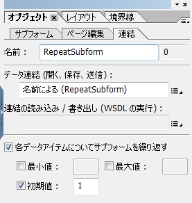

# HTML5 フォームに関するよくある質問（FAQ）{#frequently-asked-questions-faq-for-html-forms}

レイアウト、スクリプティングサポート、および HTML5 フォームのスコープについて、いくつかのよくある質問（FAQ）があります。

## レイアウト {#layout}

1. バーコードフィールドと署名フィールドがフォームに表示されないのはなぜですか？

   回答：バーコードフィールドと署名フィールドは HTML やモバイルのシナリオに関係していません。これらのフィールドは、インタラクティブではない領域として表示されます。ただし、AEM Forms Designer では、署名フィールドの代わりに使用できる新しい署名手書きフィールドを提供します。また、バーコードの[カスタムウィジェット](../../forms/using/custom-widgets.md)を追加し、それを統合することもできます。

1. XFA テキストフィールドではリッチテキストのサポートはありますか？

   回答：AEM Forms Designer でリッチコンテンツの使用を可能にする XFA フィールドはサポートされていないため、リッチテキストは標準テキストとして表示されます。ユーザーインターフェイスでテキストのスタイル設定はサポートされていません。また、comb の桁の値によって許可される文字数の制限はまだありますが、comb プロパティのある XFA フィールドも標準フィールドとして表示されます。

1. 繰り返し可能なサブフォームの使用に関して制限はありますか？

   回答：繰り返し可能なサブフォームには、初期カウントとして「1」以上の値を設定する必要があります。繰り返し可能なサブフォームの初期カウントとして「0」を設定することはできません。繰り返し可能なサブフォームを使用する場合、フォームのロード時に繰り返し可能なサブフォームを非表示にすることもできます。その場合は、以下の手順を実行します。

   1. 繰り返し可能な Subform の初期カウントとして「1」を設定します。

      

   1. フォームの初期化イベントを使用して、サブフォームのプライマリインスタンスを非表示にします。例えば、フォームを初期化する際にサブフォームのプライマリインスタンスを非表示にするには、以下のようなコードを記述します。また、アプリの種類を確認して、スクリプトがクライアントサイドでのみ実行されるようにします。

      ```javascript
      if ((xfa.host.appType == "HTML 5" || xfa.host.appType == "Exchange-Pro" || xfa.host.appType == "Reader")&&(_RepeatSubform.count == 1)&&(form1.Page1.Subform1.RepeatSubform.Key.rawValue == null)) {
      RepeatSubform.presence = "hidden";
      }
      ```

   1. サブフォームのインスタンスを追加するためのスクリプトを編集用に開き、インスタンスをサブフォームスクリプトに追加するための、以下のようなコードを記述します。

      このコードにより、サブフォームの非表示インスタンスが存在するかどうかが確認されます。サブフォームの非表示インスタンスが検出された場合は、そのインスタンスが削除され、サブフォームの新しいインスタンスが挿入されます。サブフォームの非表示インスタンスが検出されなかった場合は、単純にサブフォームの新しいインスタンスが挿入されます。

      ```javascript
      if (RepeatSubform.presence == "hidden")
      {
      RepeatSubform.instanceManager.insertInstance(0);
      RepeatSubform.instanceManager.removeInstance(1);
      }
      else
      {
      RepeatSubform.instanceManager.addInstance(1);
      }
      ```

   1. 編集用 Subform のインスタンスを削除するためのスクリプトを開きます。Subform スクリプトのインスタンスを削除するには、以下のようなコードを追加します。

      このコードにより、サブフォームのカウントが確認されます。サブフォームのカウントが「1」になると、サブフォームが非表示になります。その際、サブフォームが削除されることはありません。

      ```javascript
      if (RepeatSubform.instanceManager.count == 1) {
      RepeatSubform.presence = "hidden";
      } else {
      RepeatSubform.instanceManager.removeInstance(RepeatSubform.instanceManager.count - 1);
      }
      ```

   1. フォームの presubmit イベントを編集用に開きます。このイベントに、編集前にスクリプトの非表示インスタンスを削除するための以下のスクリプトを追加します。これにより、非表示サブフォームの送信時に、そのサブフォームのデータが送信されなくなります。

      ```javascript
      if(RepeatSubform.instanceManager.count == 1 && RepeatSubform.presence == "hidden") {
      RepeatSubform.instanceManager.removeInstance(0);
      }
      ```

1. 非表示の Subform の使用に関して制限事項はありますか？

   回答：複数のページにまたがる複雑な階層の非表示 Subform は、レイアウトに問題を引き起こします。この問題を回避するには、最初はサブフォームを表示するようにマークを付けておき、後で特定のロジックまたはデータに基づいた初期設定スクリプトで非表示にします。

1. HTML5 で一部のテキストが切り捨てられたり、正しく表示されないのはなぜですか？

   回答：コンテンツを表示するためのスペースが Draw または Caption のテキスト要素に十分に与えられていないとき、モバイルフォームのレンダリングでテキストが切り捨てられて表示されます。この切り捨ては AEM Forms Designer のデザインビューでも見られます。この切り捨ては PDF では対処できますが、HTML5 フォームでは対処できません。この問題を回避するには、AEM Forms Designer のデザインモードで切り捨てが発生しないよう、Draw または Caption のテキスト用に十分なスペースを用意します。

1. 不足しているコンテンツまたは重なり合っているコンテンツに関連するレイアウト問題が見られます。理由は？

   回答：Draw Text 要素や Draw Image 要素と同じ位置に重なり合う他の要素（Rectangle など）がある場合、Draw Text のコンテンツが（AEM Forms Designer 階層ビューで）ドキュメント順序の後の方にあると、Draw Text のコンテンツが表示されません。PDF は透明レイヤーをサポートしていますが、HTML／ブラウザーは透明レイヤーをサポートしていません。

1. HTML フォームで表示されるフォントの一部がフォームをデザインする間に使用されるものと違う理由は？

   回答：HTML5 フォームは、フォーム内にフォントが埋め込まれる PDF フォームと違い、フォントを埋め込みません。HTML バージョンのフォームが期待どおりに表示されるようにするには、XDP で指定したフォントがサーバー上およびクライアントのマシンで使用できることを確認してください。目的のフォントがサーバー上で使用できない場合、代替フォントが使用されます。さらに、クライアントデバイスで使用できない、Form Template のフォントを使用すると、テキストの表示にはブラウザーのデフォルトのフォントが使用されます。

1. vAlign と hAlign の属性は HTML フォームでサポートされていますか？

   はい、vAlign 属性と hAlign 属性はサポートされています。vAlign 属性は、Internet Explorer の場合とマルチラインフィールドの場合はサポートされていません。

1. HTML5 フォームはヘブライ語の文字をサポートしていますか？

   HTML5 フォームは、Microsoft Internet Explorer 以外のすべてのブラウザーでヘブライ語の文字をサポートしています。

1. HTML5 フォームは数値フィールドに対して何らかの制限がありますか？

   回答：はい、HTML5 フォームにはいくつか制限があります。桁数が、picture 句で指定されたカウントよりも多い場合は、数字はローカライズされずに英語ロケールで表示されます。

1. HTML フォームのサイズが PDF フォームのサイズより大きいのはなぜですか？

   XDP を HTML フォームにレンダリングするには、多くの中間データ構造とフォーム DOM、データ DOM、レイアウト DOM などのオブジェクトが必要になります。

   PDF フォームの場合、Adobe Acrobat には中間データ構造およびオブジェクトを作成するための組み込み XTG エンジンがあります。Acrobat はレイアウトおよびスクリプトも管理します。

   HTML5 フォームの場合、ブラウザーには未加工の XDP バイトで中間データ構造およびオブジェクトを作成するための組み込み XTG エンジンはありません。このため、HTML5 フォームの場合、中間構造はサーバーで生成され、クライアントに送信されます。クライアントでは、JavaScript ベースのスクリプトおよびレイアウトエンジンがこれらの中間構造を使用します。

   中間構造のサイズは、元の XDP のサイズと XDP にマージされたデータによって異なります。

1. xdp でのテーブルの使用に関して制限事項はありますか？

   回答：複雑なテーブルはレンダリングで問題を引き起こします。

   * テーブル内のセクション (SubformSet) はサポートされていません。
   * 一部のテーブルのヘッダーやフッター列は繰り返しのためにマークされています。そのようなテーブルを複数ページにわたって分割すると、いくつかの問題が発生する可能性があります。

1. アクセス可能なテーブルには制限事項がありますか？

   回答：はい。アクセス可能なテーブルには次の制限事項があります。

   * 階層化テーブルとテーブル内のサブフォームはサポートされません。
   * ヘッダーがサポートされているのは、テーブルの一番上の行または左の列に対してのみです。ヘッダーは中間テーブル要素に対してサポートされていません。複数行にヘッダーを適用することができます。そのような行および列がすべてテーブルの一番上の行または一番左の列に連動している場合、列ヘッダーがサポートされます。
   * テーブル内のランダムな場所の `Rowspan` および `colspan` はサポートされません。

   * 1 より大きい rowspan 値を持つ要素を含む行のインスタンスは、動的に追加または削除することはできません。

1. スクリーンリーダーのツールヒントとキャプションの読み取り順序はどうなっていますか？

   * キャプションとツールヒントがどちらもある場合は、キャプションのみが読み取られます。キャプションがない場合は、ツールヒントが読み取られます。また、Form Designer を使用した XDP での読み取りに対して優先順位を指定することができます。
   * 要素にマウスオーバーすると、ツールヒントが表示されます。ツールヒントがない場合は、音声テキストが表示されます。音声テキストがない場合は、フィールド名が表示されます。

1. フィールドにマウスオーバーすると、ツールヒントが表示されます。どうすれば無効にできますか？

   マウスオーバーしたときにツールヒントが表示されないようにするには、Designer のアクセシビリティパネルで何も選択しないでください。

1. Designer では、ラジオボタンとチェックボックスのカスタムの Appearance プロパティを構成できます。フォームのレンダリング中、HTML5 フォームはこれらのカスタム Appearanceプロパティを考慮しますか？

   回答：HTML5 フォームは、ラジオボタンとチェックボックスのカスタムの Appearance プロパティを無視します。ラジオボタンとチェックボックスは基になるブラウザーの仕様にしたがって表示されます。

1. サポート対象のブラウザーで HTML5 フォームを開くと、隣接して配置されたフィールドの境界線が正しく配列されないか、またはサブフォームが重なって表示されます。同じ HTML5 フォームを Forms Designer でプレビューすると、フィールドとレイアウトは正しく配列されており、サブフォームも適切な位置に表示されます。どのようにして修正できますか？

   サブフォームがコンテンツをフローするように設定されており、そのサブフォームに非表示の境界線要素が含まれている場合、隣接して配置されたフィールドの境界線が正しく配置されないか、サブフォームが重なって表示されます。この問題を解決するには、対応する XDP から非表示の &lt;border> 要素を削除するか、コメントを指定します。例えば、次の &lt;border> 要素はコメントとしてマークされます。

   ```xml
               <!--<border>
                  <edge presence="hidden"/>
                  <corner thickness="0.175mm" presence="hidden"/>
               </border> -->
   ```

1. スクリーンリーダーが日付／時間フィールドオブジェクトで正しく機能しないのはなぜですか？

   スクリーンリーダーは日付／時間フィールドをサポートしていません。ただし、フィールドに手動で日時を入力して、スクリーンリーダーに読み上げさせることはできます。ツールチップまたはスクリーンリーダーテキストを使用して、フィールドの日時を手動で選択するようにユーザーに指示します。

1. HTML5 フォームはフローティングフィールドの表示パターンをサポートしていますか？

   回答：HTML5 のフォームは、フローティングフィールドの表示パターンをサポートしていません。

### スクリプティング {#scripting}

1. HTML フォームの JavaScript 実装に関して制限事項はありますか？

   回答：

   * xfa.connectionSet スクリプトではサポートが制限されています。connectionSet の場合、web サービスの server-side 起動のみがサポートされています。詳しくは、[スクリプティングのサポート](/help/forms/using/scripting-support.md)を参照してください。
   * クライアント側スクリプトでは $record および $data のサポートはありません。ただし、スクリプトが formReady、layoutReady ブロックで記述されている場合は、これらのイベントはサーバー側で発生するため、スクリプトは機能します。
   * Draw Text（またはフィールドでは Caption テキスト）の変更などの Xfa Draw 要素固有のスクリプトはサポートされていません。

1. formCalc の使用に関して制限事項はありますか？

   回答：formCalc スクリプトのサブセットのみが現在実装されています。詳しくは、[スクリプティングのサポート](/help/forms/using/scripting-support.md)を参照してください。

1. 推奨される命名規則はありますか？また、避けるべき予約済みのキーワードはありますか？

   * AEM Forms Designer では、オブジェクト（サブフォーム、テキストフィールドなど）の名前を、アンダースコア（_）で始めないようにすることをお勧めします。名前の最初にアンダースコアを使用するには、アンダースコアの後に接頭辞を追加します。例えば、_&lt;prefix>&lt;objectname>のようにします。
   * すべての HTML5 Forms API は予約済みのキーワードです。カスタムの APIや機能については、[HTML5 Forms API](/help/forms/using/scripting-support.md) と異なる名前を使用します。

1. HTML5 フォームはフローティングフィールドをサポートしていますか？

   はい、HTML5 フォームはフローティングフィールドをサポートしています。フローティングフィールドを有効にするには、次のプロパティをレンダリングプロファイルに追加します。

   >[!NOTE]
   >
   >デフォルトでは、フィールドのフローティングは有効になっていません。Forms Designer を使用して、フィールドのフローティングプロパティを設定できます。

   1. CRXde lite を開き、`/content/xfaforms/profiles/default` ノードに移動します。
   1. 文字列タイプの `mfDataDependentFloatingField` プロパティを追加し、プロパティの値を `true` に設定します。
   1. 「**すべて保存**」をクリックします。更新されたレンダリングプロファイルを使用して、HTML フォームでフローティングフィールドが有効になりました。

      >[!NOTE]
      >
      >レンダリングプロファイルを更新することなく、特定のフォームでフローティングフィールドを有効にするには、mfDataDependentFloatingField=true プロパティを URL パラメーターとして渡します。

1. HTML5 フォームでは初期化スクリプトと form ready イベントが複数回実行されますか？

   はい、初期化スクリプトと form ready イベントは複数回（少なくともサーバー側で 1 回、クライアント側で 1 回）実行されます。initialize イベントや form:ready イベントなどのスクリプトを何らかのビジネスロジック（フォームデータ、フィールドデータなど）に基づいて作成し、データの状態やべき等（データが同じ場合）に基づいてアクションが実行されるようにすることをお勧めします。

### XDP のデザイン {#designing-xdp}

1. HTML5 フォームには予約済みのキーワードがありますか？

   回答：すべての HTML5 フォーム API は予約済みのキーワードです。カスタムの APIや機能については、[HTML5 Forms API](/help/forms/using/scripting-support.md) と異なる名前を使用します。予約済みのキーワード以外で、アンダースコア（_）で始まるオブジェクト名を使用する場合、アンダースコアの後に一意の接頭辞を追加することをお勧めします。接頭辞を追加することで、HTML5 フォームの内部 API との競合を回避しやすくなります。例：`_fpField1`
