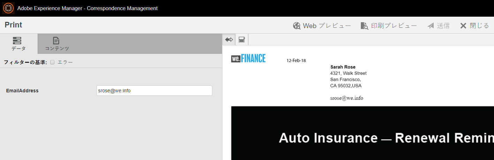

# We.Finance 自動保険更新リファレンスサイトのチュートリアル{#we-finance-auto-insurance-renewal-reference-site-walkthrough}

## We.Finance リファレンスサイトのシナリオ  {#we-finance-reference-site-scenario}

We.Financeサイトは、AEM Formsの対話型通信機能を学ぶのに役立つ金融サービスサイトです。

AEMフォームとMicrosoft Dynamicsとの統合が、金融サービス会社での顧客体験をパーソナライズする方法を示すWe.Finance Auto Insuranceの使用例の詳細なチュートリアルをご覧ください。 インタラクティブウォークスルーは、複雑なデジタルトランザクションの実装と、金融会社での顧客とのやり取りを容易にするように設計されています。

**まず、ユースケースをご覧ください。**

Sarah Rose は We.Finance 社の既存の顧客で、自動保険契約を購入しています。今が保険を更新する時だ We.Finance 社の保険営業担当である Gloria Rios は、Sarah に契約の更新について通知します。Sarah は電子メールに記載されている手順に従い、プロセスを正常に完了します。

## 自動保険申し込みのチュートリアル {#auto-insurance-application-walkthrough}

We.Finance自動保険申込シナリオは、ユーザーに対する視覚的なナレーションで、次の2人の人物に基づいています。

* Sarah Rose（We.Finance 社の顧客）
* Gloria Rios（We.Finance 社の保険営業担当）

### Gloria が We.Finance 社から保険契約の更新通知を送信する {#gloria-sends-an-insurance-policy-renewal-communication-from-we-finance}

Gloria logs into AEM instance, clicks **Auto Insurance Renewal,** and then clicks **Open Agent UI.**&#x200B;クリックすると、保険ドキュメントにSarah Roseのポリシーの詳細が事前入力されます。 Gloria clicks **Submit** and a message is displayed on the screen “Submission Initiated” and then in few seconds “Submitted Successfully”.

Sarahが「Your Auto Insurance Renewal」という件名の電子メールを受信します。

#### 実際の動作確認 {#see-it-yourself}

**Adobe Experience Manager** / **Forms** / **Forms&amp;ドキュメント/** We Finance ******** nethred/Auto Insurance nothidに移動します。 Select the Auto Insurance Renewal **interactive communication** and click **Open Agent UI**. エージェント UI でインタラクティブ通信が開きます。ポリシードキュメントが添付された電子メールを受信する有効な電子メールアドレスを入力し、「送信」をクリックします。

You can access and review the Auto Insurance Renewal interactive communication directly from `https://[authorHost]: authorPort]/aem/formdetails.html/content/dam/formsanddocuments/we-finance/autoinsurance/auto-insurance-renewal.`

### Sarah は We.Finance 社から保険契約の更新通知を受信し、更新を決める {#sarah-receives-an-insurance-policy-renewal-communication-from-we-finance-and-decides-to-renew}

Sarahは、We.Financeから添付ファイルが添付された電子メールを受信します。この電子メールにより、自動保険のポリシーがまもなく期限切れになることを通知します。 添付ファイルは、彼女の自動保険レターの印刷版です。

Sarah clicks **Renew Now** and is directed to the web version of her Auto Insurance letter. このレターの上に、Sarahはポリシーの有効期限が切れるまでの日数を見つけます。 このページでは、Sarahは保険契約の詳細(ポリシー番号、支払期限額、割引オファー、ロイヤルティ報酬など)の基本的な概要を確認できます。 Sarah again clicks **Renew Now** at the bottom of the policy.

#### 仕組み {#how-it-works}

自動保険レターのWebおよび印刷出力は、Interactive Communicationsのマルチチャネル機能を使用して作成されます。

電子メールに含まれている「今すぐ更新する」ボタンは、自動保管更新の申し込みにリンクされます。これはパブリッシュインスタンス上のインタラクティブ通信です。

#### 実際の動作確認 {#see-it-yourself-1}

PDF が添付された電子メールを受信します。このPDFは、自動保険レターの印刷版です。 Click **Renew Now** to reach to the web version of the policy. Check your personal information and policy details and click **Renew Now** which takes you to another Interactive Communication.

The **Renew Now** button in the email directs Sarah to the web version of the policy. 次の URL にアクセスできます。

`https://[authorServer]:[authorPort]/content/document.html?schema=fdm&documentId=/content/forms/af/we-finance/autoinsurance/auto-insurance-renewal/channels/web.html&customerId=1`

You can check the detailed summary of your Auto Insurance Renewal and click **Renew Now** at the bottom of the page.

### 支払いページの表示 {#sarah-reaches-the-payment-page}

We.Finance 社の支払いページが表示されます。Sarahは、自分のレコードと共にPolicy Number and Date of Expirationを再確認します。 ページの右側で、Sarahは更新の支払要約を合計金額の10%プレミアム割引で確認します。

#### 仕組み {#how-it-works-1}

「今すぐ更新」ボタンをクリックすると、支払いページに移動します。 支払いページはアダプティブフォームです。

#### 実際の動作確認 {#see-it-yourself-2}

「**今すぐ更新する**」をクリックして支払いページにアクセスします。Fill in your Credit Card information, and click **Make Payment**.

オーサリングインスタンスで、支払いページには、

`https://[authorServer]:[authorPort]/content/document.html?documentId=/content/forms/af/we-finance/credit-card/ccbillpayment.html&schema=fdm&customerId=1`

### Sarah は支払いを行ってプロセスを完了する {#sarah-makes-the-payment-and-completes-the-process}

Sarah fills her Credit Card details and clicks **Make Payment**.

#### 仕組み {#how-it-works-2}

Sarah がクレジットカードの詳細を入力して「送信」をクリックすると、クレジットカードによる支払い処理が行われ、アダプティブォームで設定された「ありがとうございます」メッセージが画面に表示されます。

#### 実際の動作確認 {#see-it-yourself-3}

確認メッセージは、「支払いを行う」をクリックした後、

`https://[authorServer]:[authorPort]/content/forms/af/we-finance/credit-card/ccbillpayment/jcr:content/guideContainer.guideThankYouPage.html?owner=admin&status=Submitted`
