# We.Finance リファレンスサイトのチュートリアル{#we-finance-reference-site-walkthrough}

## 前提条件 {#pre-requisites}

「[AEM Forms リファレンスサイトのセットアップおよび設定](../../forms/using/setup-reference-sites.md)」を参照してリファレンスサイトをセットアップします。

## We.Finance リファレンスサイトのシナリオ {#we-finance-reference-site-scenarios}

金融業界をリードする We.Finance 社は、幅広い顧客プロフィール要件に合わせてパーソナライズされた包括的な金融ソリューションを提供しています。クレジットカード、住宅ローンおよび住宅保険のサービスを提供しています。

同社の目標は、希望するデバイス上で既存および見込み客に働きかけ、自社のサービスの利点を説明し、自社のサービスへの登録を支援することです。 さらに同社は、アドオンのカードなど、顧客が興味を抱きそうな金融商品を宣伝していきたいと考えています。

We.Finance 社のユースケースの詳細なチュートリアルをお読みいただき、金融機関が目標を達成するのに AEM Forms がどのように貢献しているかご確認ください。次のチュートリアルが説明されています。

* [クレジットカードの申し込みのチュートリアル](#credit-card-application-walkthrough)
* [住宅ローン申し込みのチュートリアル](#home-mortgage-application-walkthrough)
* [Microsoft Dynamics を使用した住宅ローンの申し込みのチュートリアル](#home-mortgage-application-walkthrough-with-microsoft-dynamics)
* [住宅保険申し込みのチュートリアル](#home-insurance-application-walkthrough)
* [資産管理のチュートリアル](#wealthmanagementwalkthrough)
* [自動保険申し込みのチュートリアル](#autoinsuranceapplicationwalkthrough)

## クレジットカードの申し込みのチュートリアル {#credit-card-application-walkthrough}

We.Finance 社のクレジットカード申し込みのシナリオでは、以下の人物が登場します。

* Sarah Rose（We.Finance 社の顧客）
* Gloria Rios（We.Finance 社のクレジットカードおよび住宅ローンの責任者）

以下の解説図は、クレジットカードの申し込みのワークフローを図式化したものです。

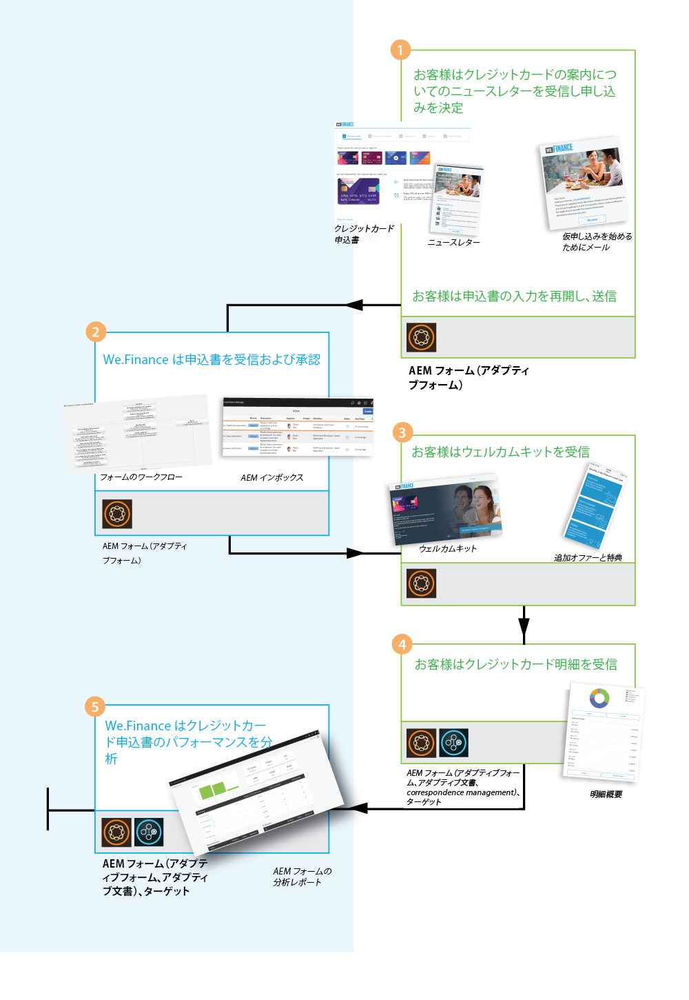

リファレンスサイトの詳細なシナリオをお読みいただき、We.Finance 社が目標を達成するのに AEM Forms がどのように貢献しているかご確認ください。

### Sarah は We.Finance 社からニュースレターを受信し、クレジットカードを申し込む {#sarah-receives-a-newsletter-from-we-finance-and-applies-for-a-credit-card}

Sarah Rose は We.Finance 社の既存の顧客です。Sarah は We.Finance 社から新しいクレジットカードのキャンペーンについてのニュースレターを受信します。Sarah はそのキャンペーンに興味を持ち、クレジットカードを申し込むことに決めます。Sarah はニュースレターに表示されている「Apply Now」ボタンをクリックします。これにより、We.Finance 社のポータルサイトにあるクレジットカード申込フォームが表示されます。

#### 仕組み {#how-it-works}

Sarah に送信されたニュースレターは、特定の電子メール ID への電子メールをトリガーするカスタム実装です。電子メールに記載された「今すぐ申し込む」ボタンはクレジットカードの申込フォームにリンクされます。これはパブリッシュインスタンス上のアダプティブフォームです。

#### 実際の動作確認 {#see-it-yourself}

発行インスタンスで次のURLを開いて、ニュースレター電子メールをトリガーします。 Ensure that you replace `[emailID]` with a valid email account to receive the newsletter. ニュースレターを開き、「**[!UICONTROL Apply Now]**」をクリックして、クレジットカードの申込フォームに移動します。

`https://[publishServer]:[publsihPort]/content/campaigns/we-finance/start.html?app=cc&email=[emailID]&givenName=Sarah&familyName=Rose`

### Sarah がキャンペーンに関心を抱き、申込みを決意 {#sarah-finds-the-offer-interesting-and-chooses-to-apply}

Sarah decides to apply for the credit card and taps **Apply Now** button on the email. We.Finance 社のポータルサイトにあるクレジットカードの申込フォームが表示されます。申込フォームはカードレイアウトを使用してセクションごとに構成されています。

Sarah は利用可能なオプションからクレジットカードを選択して、「**[!UICONTROL Continue]**」をクリックします。

個人情報のページで社会保険番号を入力すると、使用している資格情報でログインするようにプロンプトが表示されます。

Sarah は We.Finance 社の既存の顧客です。Sarah が We.Finance 社のアカウントの資格情報でログインすると、個人情報の詳細がフォームに自動で入力されます。引き続き申込フォームに入力します。これは、Sarahが出席する必要のある会議に関するリマインダーをポップアップしたときです。 She clicks **[!UICONTROL Save my progress]** on the application form. このボタンをクリックすると、その時点までに入力されたすべての情報が保存されます。さらに、ダイアログポップアップが表示され、途中まで入力していたドラフトの内容を後で完成するために申込フォームへのリンクを電子メールで受け取ることを希望するかどうか尋ねられます。

Sarah は「**[!UICONTROL Send mail]**」をクリックします。彼女はクレジットカードの申込フォームを再開するためのリンクが表示された電子メールを受け取ります。

**Sarahがモバイルデバイスからクレジットカード申込書にアクセス**

Sarah がモバイルデバイスからクレジットカードの申込フォームにアクセスした場合、申込フォームはモバイルデバイス用に最適化されて表示されます。このビューでは、申込フォームは一度に 1 つずつのセクションでレンダリングされます。そのため、Sarah は申込フォームを移動するたびに、順を追って情報の表示および入力を行うことができます。

**仕組み**

「**Apply Now**」ボタンから、Sarah は直接クレジットカードの申込フォームにアクセスできます。The application is an adaptive form, which you can review in the authoring instances at `https://[host]:'port'/editor.html/content/forms/af/we-finance/cc-app.html`.

アダプティブフォームで確認できるいくつかの主な機能は、次のとおりです。

* XSD スキーマに基づいている。
* スタイル設定は We Finance Theme A を使用し、レイアウトは We.Finance テンプレートを使用して構築されている。また、フォームのヘッダー部分にはモバイルナビゲーション用のパネルタイトルが表示されないレイアウトが採用されています。モバイルデバイスから開くと、プログレッシブモバイルレイアウトが表示されます。 テンプレートはで確認でき、テーマ `https://[host]:'port'/libs/wcm/core/content/sites/templates.html/conf/we-finance` はで確認でき `https://[host]:'port'/editor.html/content/dam/formsanddocuments-themes/we-finance/we-finance-theme-a/jcr:content`ます。
* フォームデータモデルサービスを呼び出すためのアダプティブフォームルールが含まれ、ログインしたユーザーのユーザー詳細を事前入力する。また、サービスを呼び出す際は、フォームに入力した社会保険番号や電子メールアドレスにより、情報が事前入力されます。You can review the Form Data Models and their services at `https://[host]:'port'/aem/forms.html/content/dam/formsanddocuments-fdm`.
* さまざまなアダプティブフォームコンポーネントを使用して入力内容を取得し、ユーザーレスポンスに適合する。HTML5 入力タイプをサポートする電子メールなどのコンポーネントも使用します。
* 署名ステップコンポーネントを使用して、入力が完了したフォームを表示し、フォーム上で電子署名を行うことができる。
* 「Save my progress」ボタンをクリックすると、ユーザーに対して一意の ID が生成され、AEM リポジトリのノード内に一部入力済みの申込フォームが下書きとして保存される。また、同じアクションによって、申込フォームの下書きを含むノードへのリンクを電子メールで送信する許可を求めるダイアログが表示されます。確認ダイアログの「Send mail」ボタンをクリックすると、下書きを含むノードへのリンクを持つ電子メールが自動送信されます。
* AEM ワークフローを起動する送信アクションを使用して、クレジットカードの承認ワークフローをトリガーする。You can review the workflow used in this form at `https://[host]:'port'/editor.html/conf/global/settings/workflow/models/we-finance-credit-card-workflow.html`

フォームを確認して、フォームの作成に使用したスキーマ、コンポーネント、ルール、フォームデータモデル、Forms ワークフロー、送信アクションを理解することをお勧めします。

また、クレジットカード申し込みのアダプティブフォームで使用した機能の詳細については、次のドキュメントを参照してください。

* [アダプティブフォームのオーサリングの概要](../../forms/using/introduction-forms-authoring.md)
* [XML スキーマを使ったアダプティブフォームの作成](../../forms/using/adaptive-form-xml-schema-form-model.md)
* [ルールエディター](../../forms/using/rule-editor.md)
* [テーマ](../../forms/using/themes.md)
* [データ統合](../../forms/using/data-integration.md)
* [アダプティブフォームで Adobe Sign を使用する](../../forms/using/working-with-adobe-sign.md)
* [OSGi 上の Forms 中心のワークフロー](../../forms/using/aem-forms-workflow.md)

**実際の動作確認**

Sarah Rose でログインし、クレジットカードの申込フォームで「**Apply now**」ボタンをクリックします。詳細を一部入力し、様々なアダプティブフォームコンポーネントを確認して「**Save my progress**」をクリックすると、途中まで入力した下書きの申込フォームにリンクする「**Resume**」ボタンが表示された電子メールを受信します。申込フォームで電子メール ID を指定し、電子メールを受け取ることを確認します。

We.Finance のテーマは、次の場所で確認できます。

`https://<host>:<AuthorPort>/editor.html/content/dam/formsanddocuments-themes/we-Finance/we-Finance-Theme-A/jcr:content`

We.Finance のテンプレートは、次の場所で確認できます。

`https://<host>:<AuthorPort>/editor.html/conf/we-finance/settings/wcm/templates/we-finance-template/structure.html`

### Sarah が申込書の入力を再開し、送信 {#sarah-resumes-and-submits-the-application}

Sarah は会議から戻り、We.Finance 社からの電子メールを見つけます。電子メールに表示された「**Resume**」ボタンをクリックすると、入力が途中のクレジットカードの申込フォームにアクセスできます。先ほど記入した情報はすでに入力された状態で表示されます。Sarah は申込フォームの残りの項目に記入し、申し込みに署名して送信します。

この方法以外にも、We.Finance 社のホームページにある「**My Forms**」から、下書きした申込フォームにアクセスできます。

#### 仕組み {#how-it-works-1}

電子メールの「Resume」ボタンは、申込書の下書きを含むノードへリダイレクトします。

#### 実際の動作確認 {#see-it-yourself-1}

申込フォームの入力時に指定した電子メール ID で、申込フォームの下書きへのリンクが表示された電子メールを受信します。先へ進み、申込フォームの中の残りのセクションに必要な情報を入力し、送信します。

### We.Finance 社が申込書を受信および承認 {#approving-the-application}

Sarah によって送信されたクレジットカード申込書を、We.Finance 社が受信します。タスクは Gloria Rios に割り当てられます。Gloria は AEM インボックスでタスクを確認し、これを承認します。

#### 仕組み {#how-it-works-2}

Sarah がクレジットカードの申込フォームにすべて記入して送信すると、Forms ワークフローがトリガーされ、Gloria の AEM インボックスにタスクが作成されます。

OSGi 上の AEM Forms によって Forms 中心のワークフローが提供され、アダプティブフォームに基づいたワークフローを構築できます。これらのワークフローをレビューや承認、ビジネスプロセスフローに使用して、ドキュメントサービスを開始したり、Adobe Sign 署名ワークフローと統合したりすることができます。For more information, see [Forms-centric workflow on OSGi](../../forms/using/aem-forms-workflow.md).

次の画像では、クレジットカード申込書を処理してその PDF 出力を生成する AEM ワークフローを図式化して説明しています。

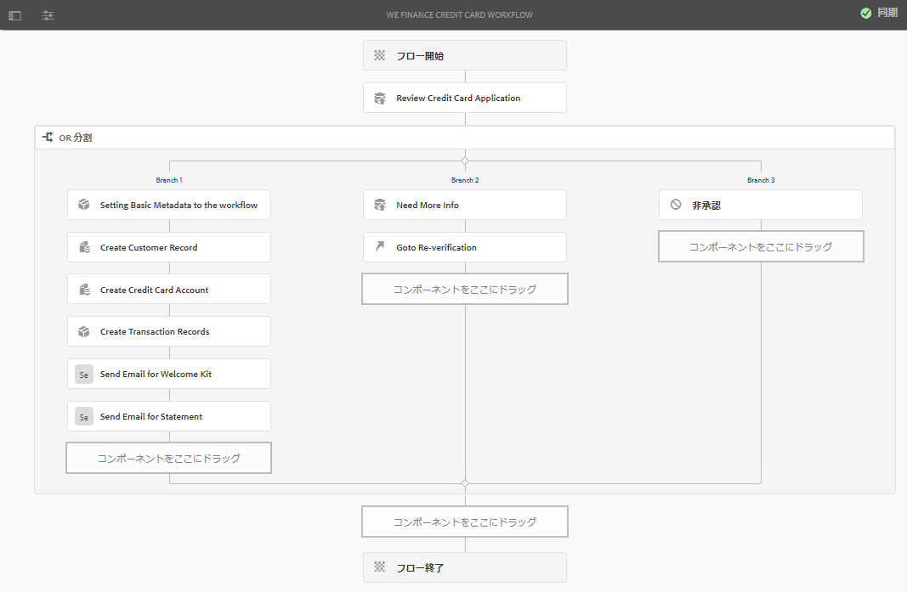

#### 実際の動作確認 {#see-it-yourself-2}

we.financeサイトのAEMインボックスにアクセスするには、https://&lt;*hostname*>:&lt;*PublishPort*>/content/we-finance/global/en.htmlを参照してください。 ページで「 **サインイン**」をタップし、「代表者として **ログイン**`grios/password` 」チェックボックスを選択して、Gloria Riosのユーザー名/パスワードを使用してAEMインボックスにログインし、クレジットカード申込書を承認します。 For information about using AEM Inbox for forms-centric workflow tasks, see [Manage Forms applications and tasks in AEM Inbox](../../forms/using/manage-applications-inbox.md).

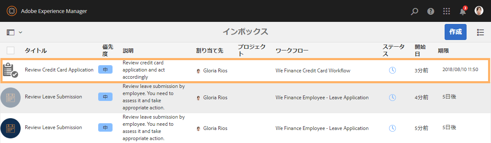

申し込みを承認すると、Sarah は電子メールでウェルカムキットを受け取ります。

### Sarah がウェルカムキットを受信し、アドオンカードに適用 {#sarah-receives-the-welcome-kit-and-applies-for-an-add-on-card}

Sarah のクレジットカード申込が承認されると、彼女はウェルカムキットへのリンクを含む電子メールを受信します。ウェルカムキットには彼女のクレジットカードアカウントの詳細情報が記載されています。ウェルカムキットには、Sarah向けにパーソナライズされたプロモーションオファーも表示されます。 スクロールダウンすると、埋め込みフォームからアドオンカードへの申し込みができるようになっています。Sarahはウェルカムキットの中から必要事項を素早く入力し、アドオンカードの申込を行います。 アドオンカード申込の確認ダイアログが表示されます。

ウェルカムキットは Sarah に合わせてパーソナライズされており、彼女に関わる情報を表示します。ウェルカムキットの PDF バージョンをダウンロードするオプションを彼女に提供します。

ウェルカムキットにはもうひとつの申込フォームが含まれています。Sarah がこれに入力して送信すると、We.Finance 社のポータルサイトを訪れることなく、ウェルカムキットの中からアドオンカードの申し込みを行うことができます。

#### 仕組み {#how-it-works-3}

The welcome kit is an interactive communication included in the `cq-we-finance-content-pkg.zip` package. デスクトップバージョンのウェルカムキットの中でクレジットカードのメリットを表示するインタラクティブカードは、ドキュメントフラグメントのデフォルトカードレイアウトを使用して作成されたカスタムレイアウトです。

アドオンカード申込フォームは、ウェルカムキットのインタラクティブ通信に埋め込まれたアダプティブフォームです。

#### 実際の動作確認 {#see-it-yourself-3}

前の手順で受け取った電子メールの中の「Resume」ボタンをクリックします。 申込書の下書きが開きます。各項目に詳細を入力し、申込書を送信します。するとウェルカムキットを受信するので、その内容を確認します。

次の URL でもウェルカムキットが表示されます。

https://&lt;*host*> : &lt;*port*>/content/aemforms-refsite/doclink.html?ドキュメント=/content/forms/af/we-finance/credit-card/creditcardwelcomekit&amp;customerId=197&amp;チャネル=web

作成者インスタンスと発行インスタンスでアクセスできます。

### Sarah がクレジットカード明細を受信 {#sarah-receives-a-credit-card-statement}

Sarah は、クレジットカードの使用開始後に、自らのクレジットカード明細を含む別の電子メールを We.Finance 社から受信します。以下の画像では、クレジットカード明細へのリンクを含む電子メールのモバイルバージョンを紹介しています。

Sarah は「View Statement」（明細を表示）ボタンをクリックし、クレジットカード明細を確認します。この文は対話的な通信です。 Web版と印刷版(PDF)版があります。 この文は、Forms・データ・モデルと統合され、顧客に固有のデータをデータベースから取得します。 この明細はインタラクティブステートメントであり、様々な要素から構成されています。

* 明細概要
* 支払細目レポート
* 支払分析のグラフィック表示
* 明細の中から支払合計額の支払方法を選択するオプション
* 支払受領書のダウンロード

Sarahは、オフラインアーカイブ用のクレジットカード明細のPDF版に関する電子メールや検索をポータルに行う必要はありません。 「Download Statement」をクリックするだけで、PDF版のステートメントをダウンロードできます。

詳細なステートメントはレスポンシブテーブル内にレイアウトされます。 明細書には、明細の中から一部または全額を支払うオプションも用意されています。

Sarahは明細の中から支払いを予定します。 また、Sarahは「Flexi Pay」オプションを使用して、支払を均等な部分に分割することもできます。

#### 仕組み {#how-it-works-4}

クレジットカード明細は対話型の通信です。 明細中の支払細目一覧はレスポンシブテーブルです。経費分析のグラフィックはグラフコンポーネントで、経費表を読み取り、円グラフを生成します。

#### 実際の動作確認 {#see-it-yourself-4}

インタラクティブなクレジットカード明細を確認するには、次の URL を参照します。

https://&lt;*hostname*>:&lt;*port*>/content/aemforms-refsite/doclink.html?ドキュメント=/content/forms/af/we-finance/credit-card/credit-card-statement&amp;customerId=197&amp;チャネル=web

作成者インスタンスと発行インスタンスでアクセスできます。

クレジットカード明細には、明細の終わりに近い販促オファーが表示されます。 Adobe TargetをAEM Forms・インタラクティブ・コミュニケーションと統合して、特定の顧客セグメントに基づくプロモーションのターゲットオファーを提供できます。 カスタマイズおよびターゲット設定されたオファーに対してAdobe Targetを使用するようにインタラクティブコミュニケーションを設定するには、「ターゲットを設定したエクスペリエンスの [作成](/help/forms/using/experience-targeting-forms.md)」を参照してください。

### We.Finance 社がクレジットカード申込フォームのパフォーマンスを分析 {#we-finance-analyzes-the-performance-of-the-credit-card-application}

We.Finance 社は、時折、自社のクレジットカード申し込みを見直して、顧客が直面しうる問題についてチェックします。同社はこの分析を使用して、クレジットカード申込フォームの中で必要な変更について、情報に基づいた判断を行います。その目的は、ユーザーエクスペリエンスを強化し、申込希望者がフォームを途中で破棄する割合を低減し、カードの乗り換えをしやすくすることにあります。同社は、分析のために AEM Forms を Adobe Analytics と統合しています。以下の画像では、同社の Analytics ダッシュボードを紹介しています。

Analytics ダッシュボードの見方について詳しくは、「[AEM Forms の分析レポートの確認方法と詳細](../../forms/using/view-understand-aem-forms-analytics-reports.md)」を参照してください。

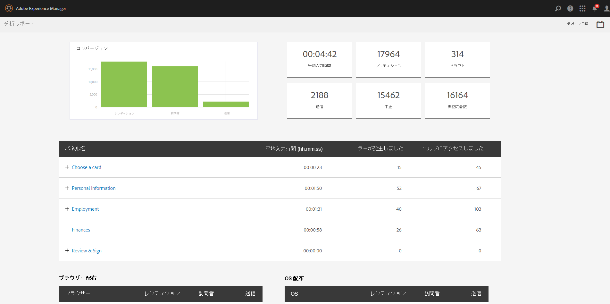

#### 仕組み {#how-it-works-5}

クレジットカード申込フォームのパフォーマンス指標は、Adobe Analytics を使用して追跡されます。Adobe Analytics の設定とレポートの表示について詳しくは、「[フォームおよびドキュメント用の Analytics の設定](../../forms/using/configure-analytics-forms-documents.md)」を参照してください。

#### 実際の動作確認 {#see-it-yourself-br}

Analytics レポートを閲覧および検討したい方のために、リファレンスサイトでクレジットカード申込フォームのシードデータが提供されています。シードデータを使用する前に、「[Analytics の設定](../../forms/using/setup-reference-sites.md#configureanalytics)」を参照してください。シードデータを使用したレポートを閲覧するには、作成者インスタンスで以下の手順を実行します。

1. Go to **Forms &amp; Documents** UI at https://&lt;*hostname*>:&lt;*AuthorPort*>/aem/forms.html/content/dam/formsanddocuments.

1. **We.Finance** フォルダーをクリックし、開きます。
1. 「 **Application for Credit Card** 」アダプティブフォームを選択し、ツールバーで「Analyticsを **[!UICONTROL 有効にする]**」をクリックします。

1. アダプティブフォームを再度選択し、ツールバーの「 **[!UICONTROL Analyticsレポート]** 」をクリックして、レポートを生成します。 最初は、空白のレポートが表示されます。

シードデータを使用してAnalyticsレポートを生成するには：

1. In the address browser of CRXDE lite, type: `/apps/we-finance/demo-artifacts/analyticsTestData/Credit card Analytics Test Data`
1. 左側のディレクトリ構造でテストデータが選択されます。
1. 選択されたファイルをダブルクリックして、右側のパネルにファイルのコンテンツを開きます。
1. シードデータファイル内のすべてのコンテンツをコピーします。
1. In CRXDE, navigate to: `/content/dam/formsanddocuments/we-finance/cc-app/jcr:content/analyticsdatanode/lastsevendays`
1. In the **[!UICONTROL analyticsdata]** field under **[!UICONTROL Properties]**, paste the copied content of the seed data file.

1. 「 **Application for Credit Card** 」アダプティブフォームを選択し、ツールバーの **[!UICONTROL Analyticsレポート]** （シードデータを使用したレポートを生成）をクリックします。

**クレジットカード申込書の A/B テスト**

クレジットカード申込フォームのパフォーマンスを分析し継続的にその改善を図ることに加えて、We.Finance 社は、AEM Forms と Adobe Target を統合し、A/B テストを作成します。このテストにより、クレジットカード申込フォームの異なるエクスペリエンスを提供し、フォームの完成および送信という見地から乗り換えの促進につながるエクスペリエンスを突き止めることができます。

To configure Target in AEM Forms server, see [Set up and integrate Target in AEM Forms](../../forms/using/ab-testing-adaptive-forms.md#set%20up%20and%20integrate%20target%20in%20aem%20forms).

以下の手順を実行し、We.Finance 社クレジットカード申込フォームのための A/B テストを試作しましょう。

1. **Formsとドキュメント** (https://&lt;*ホスト名*>:&lt;*作成者ポート*>/aem/forms.html/content/dam/formsanddocuments)に移動します。

1. **We.Finance** フォルダーをクリックし、開きます。
1. 「**Application for Credit Card**」アダプティブフォームを選択します。
1. ツールバーの「**その他**」をクリックし、「**A/B テストを設定**」を選択します。「A/B テストを設定」ページが開きます。

1. 「**アクティビティ名**」を指定します。
1. オーディエンスドロップダウンリストから、そのフォームの異なるエクスペリエンスの提供対象オーディエンスを選択します。例えば、**Chrome を使用している訪問者**&#x200B;を選択します。
1. エクスペリエンス A および B に対する&#x200B;**エクスペリエンス配布**&#x200B;フィールドで、パーセンテージの見地から配信内容を指定し、全オーディエンス間のエクスペリエンスの配信を決定します。例えば、エクスペリエンス A および B に対してそれぞれ 40、60 を指定すると、エクスペリエンス A はオーディエンスの 40 % に配布され、残りの 60 % にはエクスペリエンス B が表示されます。
1. 「**設定**」をクリックします。A/B テストの作成を確認するダイアログが表示されます。
1. 「**完了**」をクリックします。
1. Select the **Application for Credit Card** form and click **Edit**. その後表示されるオプションにより、エクスペリエンスの一方を開くことができます。「**エクスペリエンス B**」をクリックします。フォームが編集モードで開きます。

1. 必要に応じてフォームを修正し、デフォルトのエクスペリエンス A とは異なるエクスペリエンスを作成します。
1. 「フォームとドキュメント」UI へ進み、フォームを選択し、「**その他**」をクリックし、「**A/B テストを開始**」をクリックします。
1. 次のURLを使用して、Chromeブラウザーで数回フォームを開きます。

   `https://[hostname]:[port]/content/dam/formsanddocuments/we-finance/cc-app/jcr:content?wcmmode=disabled`

   >[!NOTE]
   > 
   >次回以降、フォームを開く前に **mbox** という名前を持つ Cookie を、ブラウザーの Cookie パーシステンスから削除してください。そうすると、フォームのエクスペリエンス A および B をランダムに確認することになります。

1. フォームを選択し、「**その他**」をクリックし、「**A/B テストを開始**」をクリックします。テスト開始直後には、レポートに多くのデータが表示されることはありません。シードデータを使用して、A/B テストレポートがどのように表示されるか確認しましょう。
1. CRXDE Lite を開き、次のファイルのバックアップを作成します。 /libs/fd/fmaddon/gui/components/admin/targetreport/clientlibs/targetreport/js/targetreport.js
1. 上記のファイル `onReportLoadSuccess` 内の関数の定義を、次のファイル内の関数の定義に置き換えます。 /apps/we-finance/demo-artifacts/targetreport.js

   >[!NOTE]
   >
   >これらの変更はデモのためだけに行われます。この手順を完了した後、必ずファイルの中身を元に戻してください。

1. 生成したレポートを更新すると、以下のような画面が表示されます。レポートダッシュボードを確認します。

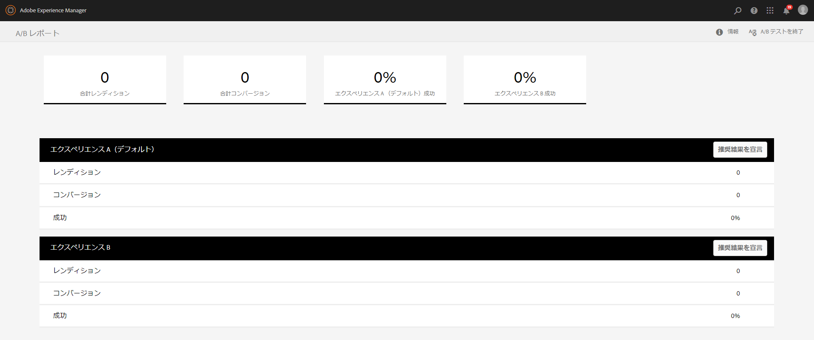

A/B テストを終了するには、レポートダッシュボードの「**A/B テストを終了**」ボタンをクリックします。ここで、一方のエクスペリエンスを公表するように求めるダイアログが表示されます。推奨結果を選択し、A/B テストの終了を確認します。

エクスペリエンス A を優れていると判断した場合は、A/B テストの終了後は、エクスペリエンス A のみが Chrome ユーザーを含むすべてのオーディエンスに配信されます。

## 住宅ローン申し込みのチュートリアル {#home-mortgage-application-walkthrough}

We.Finance 社の住宅ローンのシナリオでは、以下の人物が登場します。

* Sarah Rose（We.Finance 社の顧客）
* Gloria Rios（We.Finance 社のクレジットカードおよび住宅ローンの責任者）
* John Doe（We.Finance 社の顧客担当代表）

以下の解説図は、住宅ローン申し込みのワークフローを図式化したものです。

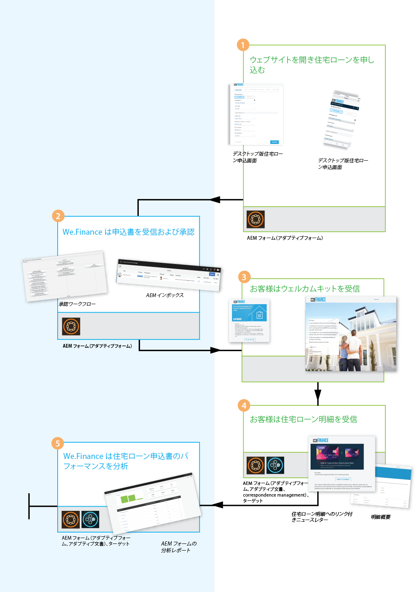

リファレンスサイトのシナリオを順に詳しく見ていきながら、AEM Forms が We.Finance 社の目標達成にどのように貢献しているか確認しましょう。

### Sarah は We.Finance 社の Web サイトにアクセスして住宅ローンを申し込む {#sarah-visits-we-finance-website-and-applies-for-home-mortgage}

Sarah Rose は家を購入する計画を立て、住宅ローンのプランを探しています。Sarah は We.Finance 社の顧客なので、We.Finance 社のポータルサイトにアクセスして住宅ローンのプランを探しています。住宅ローンのセクションに移動すると、ポータルサイトでローンの計算ができることが分かりました。Sarah が詳細を入力して「Calculate my mortgage」をクリックすると、住宅ローンのプランが表示されます。

 

住宅ローン計算機

住宅ローン計算機の結果

#### 仕組み {#how-it-works-6}

ローンページにある住宅ローン計算機は、AEM サイトページのアダプティブフォームに埋め込まれています。You can review the Loans page in edit mode at `https://[authorHost]:[authorPort]/editor.html/content/we-finance/global/en/loan-landing-page.html`.

埋め込まれた住宅ローン計算機はアダプティブフォームです。これは、計算機フィールドに入力されたローンの詳細に基づいて、ルールを使用して EMI 総額を算出します。アダプティブフォームは、で確認でき `https://[authorHost]:[authorPort]/editor.html/content/forms/af/we-finance/hm-calc.html`ます。

#### 実際の動作確認 {#see-it-yourself-5}

Go to We.Finance portal at `https://<publishHost>:<publishPort>/content/we-finance/global/en.html` and click **[!UICONTROL Loans]**. 住宅ローン計算機に詳細を入力すると、その結果が表示されます。

### Sarah がキャンペーンに関心を抱き、申し込みを決意 {#sarah-finds-the-offer-interesting-and-chooses-to-apply-1}

Sarah chooses to apply for home mortgage and clicks **[!UICONTROL Apply Now]** on home mortgage calculator results. 住宅ローンの申込フォームが開きます。

Sarah がモバイルデバイスから住宅ローンの申込フォームにアクセスした場合は、申込フォームはモバイルデバイスの表示用に最適化されたビューで開かれます。この表示では、アプリケーションフォームは1つのセクションを一度にレンダリングします。 そのため、Sarah は申込フォームを移動するたびに、順を追って情報の表示および入力を行うことができます。

以下の画像では、Sarah が住宅ローンの申し込み時にモバイルデバイス上で閲覧したワークフローを紹介します。

Sarah がデスクトップから「**Apply now**」をクリックすると、以下のように住宅ローン申込フォームが表示されます。Sarah が住宅ローン計算機に入力した情報は、申込フォームに事前入力されます。Sarah は残りの情報を入力し、「**Continue**」をクリックします。

Sarah が住宅ローン計算機に入力した情報に基づいて、いくつかの住宅ローンプランが提示されます。その中から自分の要件に適したプランを選択し、申込フォームへの入力を続けます。最後に署名を行い、申込書を送信します。

送信された申込書は、承認用に We.Finance 社に送られます。

#### 仕組み {#how-it-works-7}

「**Apply Now**」ボタンから、Sarah は直接住宅ローンの申込フォームにアクセスできます。The application is an adaptive form, which you can review in the authoring instances at `https://[host]:'port'/editor.html/content/forms/af/we-finance/hm-app.html`.

アダプティブフォームで確認できるいくつかの主な機能は、次のとおりです。

* XSD スキーマ、`homeMortgageApplication.xsd` に基づいている。
* スタイル設定は We Finance Theme B を使用し、レイアウトは We.Finance テンプレートを使用して構築されている。また、フォームのヘッダー部分にはモバイルナビゲーション用のパネルタイトルが表示されないレイアウトが採用されています。モバイルデバイスから開くと、プログレッシブモバイルレイアウトが表示されます。 アダプティブフォームで使用されるテンプレートおよびテーマは、AEM オーサーインスタンスの次の場所で確認できます。

   * `https://[host]:'port'/libs/wcm/core/content/sites/templates.html/conf/we-finance`
   * `https://[host]:'port'/editor.html/content/dam/formsanddocuments-themes/we-finance/we-finance-theme-b/jcr:content`

* 申込フォームにある最初のタブの「Getting Started」は、動的な住宅ローン計算機で、ユーザーの選択内容に基づいてオプションを表示する。例えば、購入のオプションと借り換えのオプションではフィールドおよび値が異なります。この機能は、表示または非表示のルールを使用して実行されます。さらに、「Continue」をクリックして「Plans」タブを初期化すると、フォームデータモデルで設定された Web サービスが呼び出され、住宅ローンプランが取得されて表示されます。You can review the Form Data Models and configured services at `https://[host]:'port'/aem/forms.html/content/dam/formsanddocuments-fdm`.
* さまざまなアダプティブフォームコンポーネントを使用して入力内容を取得し、ユーザーレスポンスに適合する。HTML5 入力タイプをサポートする電子メールなどのコンポーネントも使用します。
* 署名ステップコンポーネントを使用して、入力が完了したフォームを表示し、フォーム上で電子署名を行うことができる。
* AEM ワークフローを起動する送信アクションを使用して、We Finance 住宅ローン AEM ワークフローをトリガーする。You can review the workflow used in this form at `https://[host]:'port'/editor.html/conf/global/settings/workflow/models/we-finance-home-mortgage-workflow.html`

フォームを確認して、フォームの作成に使用したスキーマ、コンポーネント、ルール、フォームデータモデル、Forms ワークフロー、送信アクションを理解することをお勧めします。

また、住宅ローン申し込みのアダプティブフォームで使用した機能の詳細については、次のドキュメントを参照してください。

* [アダプティブフォームのオーサリングの概要](../../forms/using/introduction-forms-authoring.md)
* [XML スキーマを使ったアダプティブフォームの作成](../../forms/using/adaptive-form-xml-schema-form-model.md)
* [ルールエディター](../../forms/using/rule-editor.md)
* [テーマ](../../forms/using/themes.md)
* [データ統合](../../forms/using/data-integration.md)
* [アダプティブフォームで Adobe Sign を使用する](../../forms/using/working-with-adobe-sign.md)
* [OSGi 上の Forms 中心のワークフロー](../../forms/using/aem-forms-workflow.md)

#### 実際の動作確認 {#see-it-yourself-6}

Go to `https://'[server]:[port]'/content/we-finance/global/en/all-forms.html` and click the **Apply now** button on Home Mortgage Application. 「Getting Started」タブに詳細を入力し、さまざまなオプションを試して、申込書を送信します。

申込フォームで有効な電子メール ID を指定し、インボックスで確認のメールを受信します。

### We.Finance 社が申し込みを受信 {#approving_the_application-1}

Sarah によって送信された住宅ローン申込書を、We.Finance 社が受信します。申し込みの承認または拒否のタスクが Gloria Rios に割り当てられます。彼女は申し込みを確認し、行政 ID が入力されていないことに気付きます。

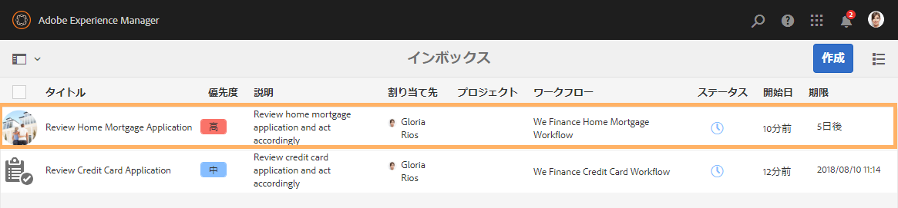

Gloria はタスクを開き、「Need More Info」をクリックして、行政 ID が入力されていないというコメントを入力します。

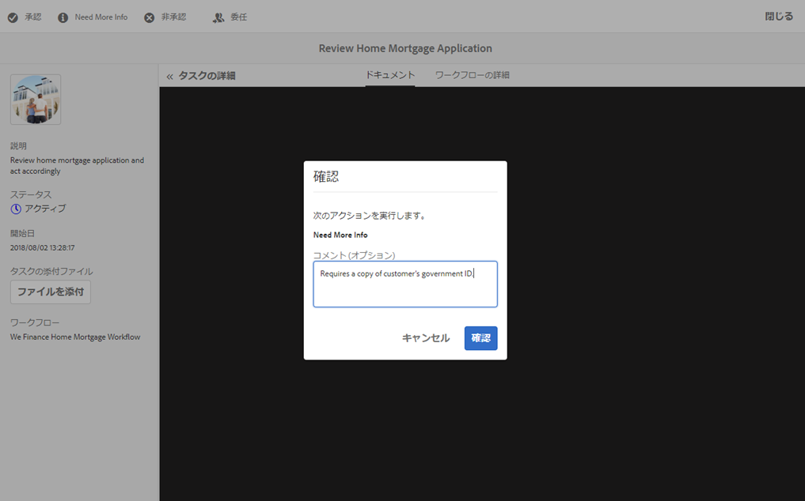

これにより、タスクは We.Finance 社の顧客担当代表の John Doe に割り当てられます。John はタスクを開き、Gloria のコメントを確認します。John は Sarah に連絡を取り、ID のコピーを送信してくれるように伝えます。Sarah の ID のコピーを受け取ったら、タスクに添付して再評価するために申込書を送信します。

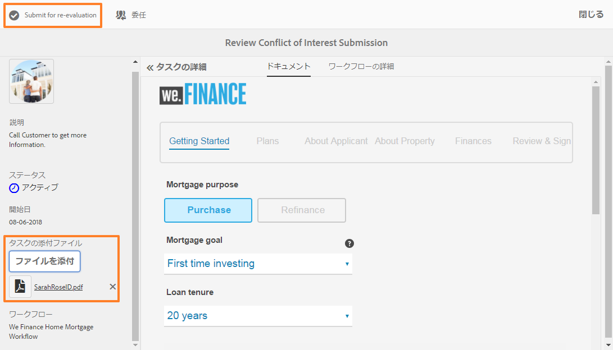

タスクは Gloria に再度割り当てられます。添付された ID を確認し、申し込みを承認します。

#### 仕組み {#how-it-works-8}

Sarah が住宅ローンの申込フォームにすべて記入して送信すると、Forms ワークフローがトリガーされ、Gloria の AEM インボックスにタスクが作成されます。Gloria が申込書を確認して追加の情報をリクエストしたため、タスクは John Doe に割り当てられます。John Doe が ID を添付して申込書を再度送信すると、申込書は Gloria に割り当てられます。これは、住宅ローンの申し込みに関連する AEM ワークフローで定義されています。

OSGi 上の AEM Forms によって Forms 中心のワークフローが提供され、アダプティブフォームに基づいたワークフローを構築できます。これらのワークフローをレビューや承認、ビジネスプロセスフローに使用して、ドキュメントサービスを開始したり、Adobe Sign 署名ワークフローと統合したりすることができます。For more information, see [Forms-centric workflow on OSGi](../../forms/using/aem-forms-workflow.md).

以下の図は、住宅ローンの申し込みに関連する AEM ワークフローを図式化したものです。

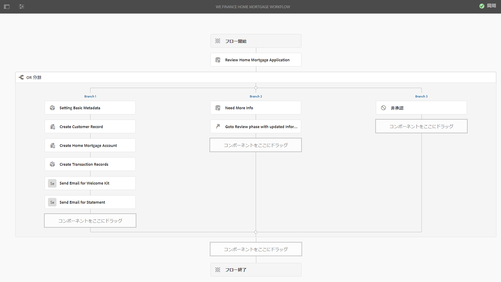

#### 実際の動作確認 {#see-it-yourself-7}

You can access the AEM inbox at `https://<hostname>:<AuthorPort>/content/we-finance/global/en/login.html?resource=/aem/inbox.html`. Gloria Rios のユーザー名とパスワード（`grios/password`）と、John Doe のユーザー名とパスワード（`jdoe/jdoe`）をそれぞれ使用して AEM インボックスにログインし、住宅ローンの申し込みワークフローを参照します。

For information about using AEM Inbox for forms-centric workflow tasks, see [Manage Forms applications and tasks in AEM Inbox](../../forms/using/manage-applications-inbox.md).

### Sarah がウェルカムキットを受信 {#sarah-receives-the-welcome-kit}

Sarah の住宅ローン申込が承認されると、彼女はウェルカムキットへのリンクを含む電子メールを受信します。Sarah はウェルカムキットを開き、これにはカルーセルスライド式のディスプレイが含まれており、そこに Sarah 向けにカスタマイズされたプロモーションキャンペーン情報が表示されます。

ウェルカムキットは Sarah に合わせてパーソナライズされており、彼女に関わる情報を表示します。ウェルカムキットの PDF バージョンをダウンロードするオプションを彼女に提供します。画面下の矢印ボタンにより、Sarah は画面をスクロールダウンし、ウェルカムキットの他のセクションを次々に閲覧できます。

#### 仕組み {#how-it-works-9}

The welcome kit is an interactive communication included in the `cq-we-finance-content-pkg.zip` package. ウェルカムキットの中のプロモーションキャンペーン情報は、Adobe Target サーバーから配信されます。キャンペーン情報は個別の顧客セグメントを対象としてカスタマイズされます。ウェルカムキットは、前もって設定された Adobe Target サーバーから、女性利用客の閲覧者セグメントのためのキャンペーン情報を取得します。

デスクトップバージョンのウェルカムキットにあるインタラクティブカードは、ドキュメントフラグメントのデフォルトのカードのレイアウトを使用して作成されたカスタムレイアウトを使用します。

#### 実際の動作確認 {#see-it-yourself-8}

住宅ローンの申込フォームの入力時に電子メール ID を入力した場合、ウェルカムキットへのリンク先が表示された電子メールを受信します。インボックスをチェックしてウェルカムキットを確認します。

これは次の URL にある AEM パブリッシュインスタンスに表示されます。

`https://[host]:'port'/content/forms/af/we-finance/mortgage-loan-welcome-kit.html`

### Sarah が取引明細書を受信 {#sarah-receives-an-account-statement}

Sarah が住宅ローンの利用を開始し、賦払金の返済を開始すると、自らの毎月の取引明細を含む別の電子メールを We.Finance 社から受信します。

Sarah は「View Statement」（明細を表示）ボタンをクリックし、住宅ローン明細を確認します。この明細はインタラクティブステートメントであり、様々な要素から構成されています。

* 明細概要
* 明細詳細

以下の画像では、デスクトップバージョンの取引明細の別の部分を紹介しています。

細目が記載された明細はレスポンシブテーブルとしてレイアウトされており、明細の中で一部または全額を支払う選択を行うことができるようになっています。

#### 仕組み {#how-it-works-10}

住宅ローン明細は対話型のコミュニケーションです。 これは JSON バッチプロセスを使用して生成されます。明細中の支払細目一覧はレスポンシブテーブルです。

#### 実際の動作確認 {#see-it-yourself-9}

インタラクティブな住宅ローン明細を確認するには、次の URL を参照します。

https://&lt;*hostname*>:&lt;*port*>/content/forms/af/we-finance/mortgage-account-statement.html?wcmmode=disabled

作成者インスタンスと発行インスタンスでアクセスできます。

### We.Finance 社が住宅ローン申込フォームのパフォーマンスを分析 {#we-finance-analyzes-the-performance-of-the-mortgage-application}

We.Finance 社は、時折、自社の住宅ローン申し込みを見直して、顧客が直面しうる問題についてチェックします。同社はこの分析を使用して、住宅ローン申込フォームの中で必要な変更について、情報に基づいた判断を行います。その目的は、ユーザーエクスペリエンスを強化し、申込希望者がフォームを途中で破棄する割合を低減し、カードの乗り換えをしやすくすることにあります。同社は、分析のために AEM Forms を Adobe Analytics と統合しています。以下の画像では、同社の Analytics ダッシュボードを紹介しています。

Analytics ダッシュボードの見方について詳しくは、「[AEM Forms の分析レポートの確認方法と詳細](../../forms/using/view-understand-aem-forms-analytics-reports.md)」を参照してください。

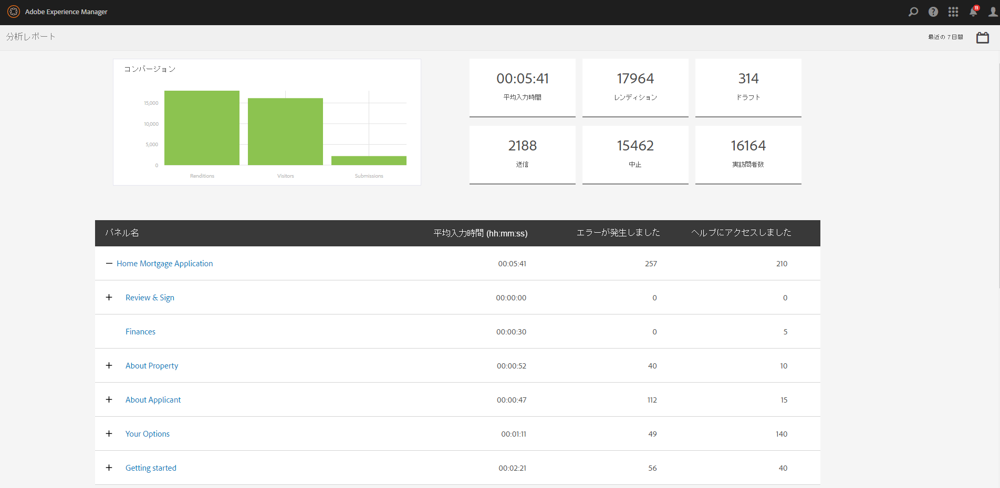

#### 仕組み {#how-it-works-11}

住宅ローン申込フォームのパフォーマンス指標は、Adobe Analytics を使用して追跡されます。Adobe Analytics の設定とレポートの表示について詳しくは、「[フォームおよびドキュメント用の Analytics の設定](../../forms/using/configure-analytics-forms-documents.md)」を参照してください。

#### 実際の動作確認 {#see-it-yourself-br-1}

Analytics レポートを閲覧および検討したい方のために、リファレンスサイトで住宅ローン申込フォームのシードデータが提供されています。シードデータを使用する前に、「[Analytics の設定](../../forms/using/setup-reference-sites.md#configureanalytics)」を参照してください。シードデータを使用したレポートを閲覧するには、作成者インスタンスで以下の手順を実行します。

1. Go to **Forms &amp; Documents** UI at https://&lt;*hostname*>:&lt;*AuthorPort*>/aem/forms.html/content/dam/formsanddocuments.

1. **we-finance** フォルダーをクリックし、開きます。
1. 「 **[!UICONTROL Application for Home Mortgage]** 」アダプティブフォームを選択し、ツールバーで「 **[!UICONTROL Analyticsを]**&#x200B;有効にする」をクリックします。

1. フォームを再度選択し、ツールバーの **[!UICONTROL Analyticsレポート]** をクリックして、レポートを生成します。 最初は、空白のレポートが表示されます。

シードデータを使用してAnalyticsレポートを生成するには：

1. In the address browser of CRXDE lite, type the following: `/apps/we-finance/demo-artifacts/analyticsTestData/HomeMortgageAnalyticsTestData`
1. 左側のディレクトリ構造でテストデータが選択されます。
1. 選択されたファイルをダブルクリックして、右側のパネルでファイルのコンテンツを開きます。
1. シードデータファイル内のすべてのコンテンツをコピーします。
1. In CRXDE, navigate to: `/content/dam/formsanddocuments/we-finance/hm-app/jcr:content/analyticsdatanode/lastsevendays`
1. Analyticsデータフィールドの「プロパティ」の下で、シードデータファイルのコピーした内容を貼り付けます。
1. 住宅ローン申し込みフォームの分析レポートを再生成します。 シードデータを含むレポートが表示されます。

**住宅ローン申込書の A/B テスト**

住宅ローン申込フォームのパフォーマンスを分析し継続的にその改善を図ることに加えて、We.Finance 社は、AEM Forms と Adobe Target を統合し、A/B テストを作成します。このテストにより、申込フォームの異なるエクスペリエンスを提供し、フォームの完成および送信という見地から乗り換えの促進につながるエクスペリエンスを突き止めることができます。

To configure Target in AEM Forms server, see [Set up and integrate Target in AEM Forms](../../forms/using/ab-testing-adaptive-forms.md#set%20up%20and%20integrate%20target%20in%20aem%20forms).

作成者インスタンスで以下の手順を実行して、We.Finance 社の住宅ローン申込フォームのための A/B テストを試作しましょう。

1. **Formsとドキュメント** (https://&lt;*ホスト名*>:&lt;*作成者ポート*>/aem/forms.html/content/dam/formsanddocuments)に移動します。

1. **We.Finance** フォルダーをクリックし、開きます。
1. 「 **Application for Home Mortgage** 」アダプティブフォームを選択します。
1. ツールバーの「**その他**」をクリックし、「**A/B テストを設定**」を選択します。「A/B テストを設定」ページが開きます。

1. 「**アクティビティ名**」を指定します。
1. オーディエンスドロップダウンリストから、そのフォームの異なるエクスペリエンスの提供対象オーディエンスを選択します。例えば、**Chrome を使用している訪問者**&#x200B;を選択します。
1. エクスペリエンス A および B に対する&#x200B;**エクスペリエンス配布**&#x200B;フィールドで、パーセンテージの見地から配信内容を指定し、全オーディエンス間のエクスペリエンスの配信を決定します。例えば、エクスペリエンス A および B に対してそれぞれ 40、60 を指定すると、エクスペリエンス A はオーディエンスの 40 % に配布され、残りの 60 % にはエクスペリエンス B が表示されます。
1. 「**設定**」をクリックします。A/B テストの作成を確認するダイアログが表示されます。
1. 「**完了**」をクリックします。
1. 「 **Application for Home Mortgage** 」アダプティブフォームを選択し、「 **編集**」をクリックします。 その後表示されるオプションにより、エクスペリエンスの一方を開くことができます。「**エクスペリエンス B**」をクリックします。フォームが編集モードで開きます。
1. 必要に応じてフォームを修正し、デフォルトのエクスペリエンス A とは異なるエクスペリエンスを作成します。
1. 「フォームとドキュメント」UI へ進み、フォームを選択し、「**その他**」をクリックし、「**A/B テストを開始**」をクリックします。
1. 次のURLを使用して、Chromeブラウザーで数回フォームを開きます。
   `https://[hostname]:[port]/content/dam/formsanddocuments/we-finance/hm-app/jcr:content?wcmmode=disabled`

   >[!NOTE]
   > 次回以降、フォームを開く前に **mbox** という名前を持つ Cookie を、ブラウザーの Cookie パーシステンスから削除してください。そうすると、フォームのエクスペリエンス A および B をランダムに確認することになります。

1. フォームを選択し、「**その他**」をクリックし、「**A/B テストを開始**」をクリックします。テスト開始直後には、レポートに多くのデータが表示されることはありません。シードデータを使用して、A/B テストレポートがどのように表示されるか確認しましょう。
1. CRXDE Lite を開き、次のファイルのバックアップを作成します。 /libs/fd/fmaddon/gui/components/admin/targetreport/clientlibs/targetreport/js/targetreport.js
1. 上記のファイル内の `onReportLoadSuccess` 関数の定義を、次のファイル内の関数定義に置き換えます。 /apps/we-finance/demo-artifacts/targetreport.js

   >[!NOTE]
   >
   >これらの変更はデモのためだけに行われます。この手順を完了した後、必ずファイルの中身を元に戻してください。

1. 生成したレポートを更新すると、以下のような画面が表示されます。レポートダッシュボードを確認します。

A/B テストを終了するには、レポートダッシュボードの「**A/B テストを終了**」ボタンをクリックします。ここで、一方のエクスペリエンスを公表するように求めるダイアログが表示されます。推奨結果を選択し、A/B テストの終了を確認します。

エクスペリエンス A を優れていると判断した場合は、A/B テストの終了後は、エクスペリエンス A のみが Chrome ユーザーを含むすべてのオーディエンスに配信されます。

## Microsoft Dynamics を使用した住宅ローンの申し込みのチュートリアル {#home-mortgage-application-walkthrough-with-microsoft-dynamics}

Microsoft Dynamics を使用した We.Finance 社の住宅ローンのシナリオでは、以下の人物が登場します。

* Sarah Rose（We.Finance 社の顧客）
* We.Finance Microsoft Dynamics インスタンスの管理者

Microsoft Dynamicsを使用したホーム住宅ローン申し込みのチュートリアルでは、リファレンスサイトでMicrosoft Dynamics for Data Integrationを使用する場合に、Web.Financeのお客様がサイトを使用して住宅ローンの申し込み方法を示します。 このチュートリアルは、Microsoft Dynamics で受信されたユーザーがデータ入力を完了するところで終わります。Before you proceed with this scenario, you need to complete the [Microsoft Dynamics 365 configuration for the home mortgage workflow of the We.Finance reference site](/help/forms/using/ms-dynamics-configuration-home-mortgage.md).

### Sarah は We.Finance 社の Web サイトにアクセスして住宅ローンを申し込む {#sarah-visits-we-finance-website-and-applies-for-home-mortgage-1}

Sarah Rose は家を購入する計画を立て、住宅ローンのプランを探しています。Sarah は We.Finance 社の顧客なので、We.Finance 社のポータルサイトにアクセスして住宅ローンのプランを探しています。住宅ローンのセクションに移動すると、ポータルサイトでローンの計算ができることが分かりました。Sarah が詳細を入力して「Calculate my mortgage」をクリックすると、住宅ローンのプランが表示されます。

 

住宅ローン計算機

住宅ローン計算機の結果

#### 仕組み {#how-it-works-12}

ローンページにある住宅ローン計算機は、AEM サイトページのアダプティブフォームに埋め込まれています。You can review the Loans page in edit mode at `https://[authorHost]:[authorPort]/editor.html/content/we-finance/global/en/loan-landing-page.html`.

埋め込まれた住宅ローン計算機はアダプティブフォームです。これは、計算機フィールドに入力されたローンの詳細に基づいて、ルールを使用して EMI 総額を算出します。アダプティブフォームは、で確認でき `https://[authorHost]:[authorPort]/editor.html/content/forms/af/we-finance/ms-dynamics/home-mortgage-calculator.html`ます。

#### 実際の動作確認 {#see-it-yourself-10}

Go to We.Finance portal at `https://<publishHost>:<publishPort>/content/we-finance/global/en.html` and click **[!UICONTROL Loans]**. 住宅ローン計算機に詳細を入力すると、その結果が表示されます。

### Sarah がキャンペーンに関心を抱き、申し込みを決意 {#sarah-finds-the-offer-interesting-and-chooses-to-apply-2}

Sarah chooses to apply for home mortgage and clicks **[!UICONTROL Apply Now]** on home mortgage calculator results. 住宅ローンの申込フォームが開きます。

Sarah がモバイルデバイスから住宅ローンの申込フォームにアクセスした場合は、申込フォームはモバイルデバイスの表示用に最適化されたビューで開かれます。この表示では、アプリケーションフォームは1つのセクションを一度にレンダリングします。 そのため、Sarah は申込フォームを移動するたびに、順を追って情報の表示および入力を行うことができます。

以下の画像では、Sarah が住宅ローンの申し込み時にモバイルデバイス上で閲覧したワークフローを紹介します。

Sarah がデスクトップから「**Apply now**」をクリックすると、以下のように住宅ローン申込フォームが表示されます。Sarah が住宅ローン計算機に入力した情報は、申込フォームに事前入力されます。Sarah は残りの情報を入力し、「**Continue**」をクリックします。

Sarah が住宅ローン計算機に入力した情報に基づいて、いくつかの住宅ローンプランが提示されます。その中から自分の要件に適したプランを選択し、申込フォームへの入力を続けます。最後に署名を行い、申込書を送信します。

送信された申込書は、承認用に We.Finance 社に送られます。

#### 仕組み {#how-it-works-13}

「**Apply Now**」ボタンから、Sarah は直接住宅ローンの申込フォームにアクセスできます。The application is an adaptive form, which you can review in the authoring instances at `https://[host]:'port'/editor.html/content/forms/af/we-finance/ms-dynamics/application-for-home-mortgage.html`.

アダプティブフォームで確認できるいくつかの主な機能は、次のとおりです。

* XSD スキーマ、`homeMortgageApplication.xsd` に基づいている。
* スタイル設定は We Finance Theme B を使用し、レイアウトは We.Finance テンプレートを使用して構築されている。また、フォームのヘッダー部分にはモバイルナビゲーション用のパネルタイトルが表示されないレイアウトが採用されています。モバイルデバイスから開くと、プログレッシブモバイルレイアウトが表示されます。 アダプティブフォームで使用されるテンプレートおよびテーマは、AEM オーサーインスタンスの次の場所で確認できます。

   * `https://[host]:'port'/libs/wcm/core/content/sites/templates.html/conf/we-finance`
   * `https://[host]:'port'/editor.html/content/dam/formsanddocuments-themes/we-finance/we-finance-theme-b/jcr:content`

* 申込フォームにある最初のタブの「Getting Started」は、動的な住宅ローン計算機で、ユーザーの選択内容に基づいてオプションを表示する。例えば、購入のオプションと借り換えのオプションではフィールドおよび値が異なります。この機能は、表示または非表示のルールを使用して実行されます。さらに、「Continue」をクリックして「Plans」タブを初期化すると、フォームデータモデルで設定された Web サービスが呼び出され、住宅ローンプランが取得されて表示されます。You can review the Form Data Models and configured services at `https://[host]:'port'/aem/forms.html/content/dam/formsanddocuments-fdm`.
* さまざまなアダプティブフォームコンポーネントを使用して入力内容を取得し、ユーザーレスポンスに適合する。HTML5 入力タイプをサポートする電子メールなどのコンポーネントも使用します。
* 署名ステップコンポーネントを使用して、入力が完了したフォームを表示し、フォーム上で電子署名を行うことができる。

フォームを確認して、フォームの作成に使用したスキーマ、コンポーネント、ルール、フォームデータモデル、Forms ワークフロー、送信アクションを理解することをお勧めします。

### 管理者は送信されたデータを Microsoft Dynamics インスタンスで表示する {#the-administrator-views-the-submitted-data-in-the-microsoft-dynamics-instance}

Microsoft Dynamics インスタンスで Sarah によって送信された住宅ローン申込書を、We.Finance 社が受信します。管理者は、潜在顧客の列のエントリをタップし、Sarah Rose 用に作成された潜在顧客のレコードに移動します。

## 住宅保険申し込みのチュートリアル {#home-insurance-application-walkthrough}

We.Finance 社の住宅保険のシナリオでは、以下の人物が登場します。

* Sarah Rose（We.Finance 社の顧客）
* Gloria Rios（We.Finance 社のクレジットカードおよび住宅ローンの責任者）
* Frank De Costa（We.Finance 社の保険代理店）

以下の解説図は、住宅保険の申し込みシナリオのワークフローを図式化したものです。

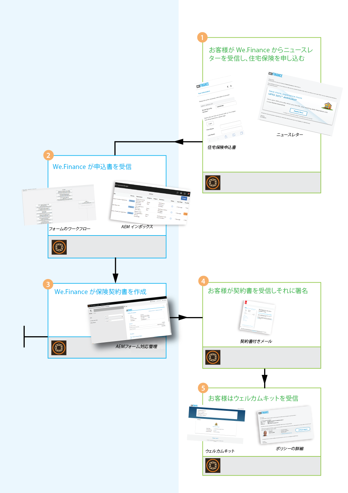

リファレンスサイトのシナリオを順に詳しく見ていきながら、AEM Forms が We.Finance 社の目標達成にどのように貢献しているか確認しましょう。

### Sarah は We.Finance 社からニュースレターを受信し、住宅保険を申し込む {#sarah-receives-a-newsletter-from-we-finance-and-applies-for-home-insurance}

Sarah Rose は We.Finance 社の住宅ローンの顧客で、住宅保険をいろいろと探しています。Sarah は We.Finance 社のポータルサイトにアクセスし、住宅保険のプランを探します。We.Finance 社は彼女が既存の顧客であることを特定し、対象となる内容のニュースレターを電子メールで送信します。このニュースレターには、お勧めの住宅保険のプランが含まれています。

#### 仕組み {#how-it-works-14}

Sarah に送信されたニュースレターは、特定の電子メール ID への電子メールをトリガーするカスタム実装です。ニュースレターに表示された「Apply Now」ボタンは住宅保険の申込フォームにリンクされます。これはパブリッシュインスタンス上のアダプティブフォームです。

#### 実際の動作確認 {#see-it-yourself-11}

次の URL を開くと、ニュースレターの電子メールがトリガーされます。Ensure that you replace `[emailID]` with a valid email account to receive the newsletter. Open the newsletter and click **[!UICONTROL Apply Now]** to go to the home insurance application.

`https://[authorServer]:[authorPort]/content/campaigns/we-finance/start.html?app=ins&email=[emailID]&givenName=Sarah&familyName=Rose`

### Sarah がお勧めの住宅保険に関心を抱き、申し込みを決意 {#sarah-finds-the-home-insurance-offer-interesting-and-chooses-to-apply}

Sarah はニュースレターに載っていた住宅保険プランが気に入り、この保険を申し込むことに決めました。Sarah がニュースレターの「Apply Now」ボタンをクリックすると、We.Finance 社のポータルサイトの住宅保険の申込フォームが開きます。申込フォームはカードレイアウトを使用してセクションごとに構成されています。

個人情報のページで社会保険番号を入力すると、使用している資格情報でログインするようにプロンプトが表示されます。

Sarah は We.Finance 社の既存の顧客です。Sarah が We.Finance 社のアカウントの資格情報でログインすると、個人情報の詳細がフォームに自動で入力されます。彼女は引き続き申込書に記入して送信します。

Sarah がモバイルデバイスから申込書を送信した場合は、次の画面で順に進んで行きます。

#### 仕組み {#how-it-works-15}

ニュースレターの「**Apply Now**」をクリックすると、We.Finance 社のポータルサイトの住宅保険の申込フォームに移動します。The application is an adaptive form, which you can review in the authoring instance at `https://[host]:'port'/editor.html/content/forms/af/we-finance/insurance/application-for-insurance.html`.

アダプティブフォームで確認できるいくつかの主な機能は、次のとおりです。

* XSD スキーマ、`insurance.xsd` に基づいている。
* スタイルに保険テーマを使用して構築されており、フォームのヘッダー部分にはモバイルナビゲーション用のパネルタイトルが表示されないレイアウトが採用されている。モバイルデバイスから開くと、プログレッシブモバイルレイアウトが表示されます。 テンプレートはで確認でき、テーマ `https://[host]:'port'/libs/wcm/core/content/sites/templates.html/conf/we-finance` はで確認でき `https://[host]:'port'/editor.html/content/dam/formsanddocuments-themes/we-finance/insurance/jcr:content`ます。

* フォームデータモデルサービスを呼び出すためのアダプティブフォームルールが含まれ、ログインしたユーザーのユーザー詳細を事前入力する。また、サービスを呼び出す際は、フォームに入力した社会保険番号や電子メールアドレスにより、情報が事前入力されます。You can review the Form Data Models and their services at `https://[host]:'port'/aem/forms.html/content/dam/formsanddocuments-fdm`.
* さまざまなアダプティブフォームコンポーネントを使用して入力内容を取得し、ユーザーレスポンスに適合する。HTML5 入力タイプをサポートする電子メールなどのコンポーネントも使用します。
* 「Save my progress」ボタンをクリックすると、ユーザーに対して一意の ID が生成され、AEM リポジトリのノード内に一部入力済みの申込フォームが下書きとして保存される。また、同じアクションによって、申込フォームの下書きを含むノードへのリンクを電子メールで送信する許可を求めるダイアログが表示されます。確認ダイアログの「Send mail」ボタンをクリックすると、下書きを含むノードへのリンクを持つ電子メールが自動送信されます。
* AEM ワークフローを起動する送信アクションを使用して、住宅保険の承認ワークフローをトリガーする。You can review the workflow used in this form at `https://[host]:'port'/editor.html/conf/global/settings/workflow/models/we-finance-insurance-workflow.html`

フォームを確認して、フォームの作成に使用したスキーマ、コンポーネント、ルール、フォームデータモデル、Forms ワークフロー、送信アクションを理解することをお勧めします。

また、住宅保険申し込みのアダプティブフォームで使用した機能の詳細については、次のドキュメントを参照してください。

* [アダプティブフォームのオーサリングの概要](../../forms/using/introduction-forms-authoring.md)
* [XML スキーマを使ったアダプティブフォームの作成](../../forms/using/adaptive-form-xml-schema-form-model.md)
* [ルールエディター](../../forms/using/rule-editor.md)
* [テーマ](../../forms/using/themes.md)
* [データ統合](../../forms/using/data-integration.md)
* [アダプティブフォームで Adobe Sign を使用する](../../forms/using/working-with-adobe-sign.md)
* [OSGi 上の Forms 中心のワークフロー](../../forms/using/aem-forms-workflow.md)

#### 実際の動作確認 {#see-it-yourself-12}

電子メールで受信したニュースレターの「**Apply now**」ボタンをクリックします。Alternatively, go to `https://[publishHost]:[publishPort]/content/we-finance/global/en/all-forms.html` and click **[!UICONTROL Apply]** on the insurance application. 「Social Security Number」フィールドで `123456789` を指定します。プロンプトが表示されたら、ユーザー名とパスワードに `srose/srose` と入力してログインします。

詳細を入力し、さまざまなアダプティブフォームコンポーネントを調査して、申込書を送信します。 アダプティブフォームは、で確認でき `https://[authorHost]:[authorPort]/editor.html/content/forms/af/we-finance/insurance/application-for-insurance.html`ます。

### We.Finance 社が申し込みを承認し、Sarah が契約書に署名 {#we-finance-approves-the-application-and-a-contract-is-signed}

Sarah によって送信された住宅保険申込書を、We.Finance 社が受信します。タスクは Gloria Rios に割り当てられます。Gloria は AEM インボックスで申込書を確認し、これを承認します。

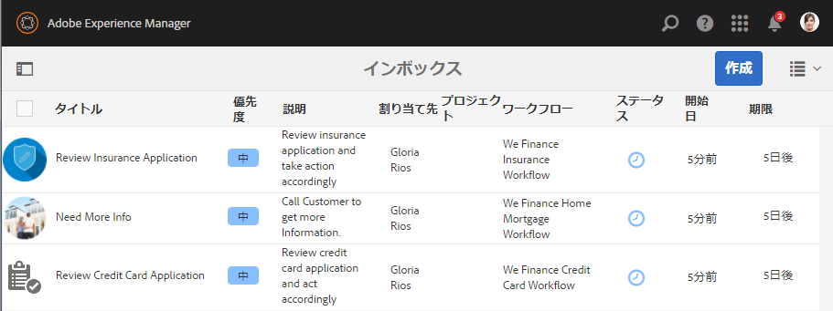

Gloria が Sarah の住宅保険の申し込みを承認すると、Frank De Costa の AEM インボックスにタスクが作成されます。Frankはそのタスクについて批評する。 Frank は Sarah 用に住宅保険の保険契約書を準備し、この契約書を Sarah の申込書に添付して彼女に送信して、契約書に署名をしてもらいます。エージェントUIに表示される契約は、インタラクティブ通信の印刷版です。

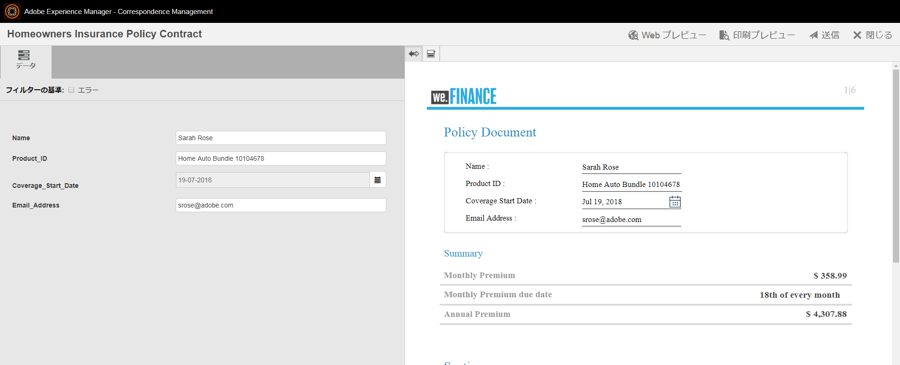

Sarah は、署名を行う住宅保険の保険契約書へのリンクを含む電子メールを受信します。Sarah は契約書を確認して、署名します。

#### 仕組み {#how-it-works-16}

Sarah が住宅保険の申込フォームを送信すると、Forms ワークフローがトリガーされ、Gloria の AEM インボックスにタスクが作成されます。Gloria が申込書を確認して承認したため、タスクは Frank De Costa に割り当てられます。ある人から別の人へのタスクの流れは、保険申込書に関連付けられたAEMワークフローで定義されます。 For more information about workflows, see [Forms-centric workflow on OSGi](../../forms/using/aem-forms-workflow.md).

以下の図は、保険の申し込みに関連する AEM ワークフローを図式化したものです。

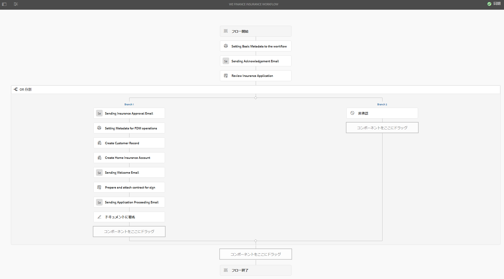

Frank は Correspondence Management を使用して、住宅保険の保険契約書を準備します。彼は契約書の PDF をダウンロードして Sarah の申込書に添付し、「Send Contract」をクリックします。このワークフローにより、署名を行う住宅保険の保険契約書を含む Sarah へのメールがトリガーされます。

#### 実際の動作確認 {#see-it-yourself-13}

以下の操作を実行してください。

1. Go to AEM Inbox, `https://[publishHost]:[publishPort]/content/we-finance/global/en/login.html?resource=/aem/inbox.html`, and log in with `grios/grios` as username password for Gloria&#39;s persona. Sarah の住宅保険の申し込みを承認します。

1. 次に、Frank のユーザー名とパスワード（`fdcosta/password`）を使用して AEM インボックスにログインします。タスクが表示されます。
1. 次に、HomeInsuranceWelcomeKitのレターテンプレートを開いてプレビュー `https://[authorHost]:[authorPort]/aem/forms.html/content/dam/formsanddocuments/we-finance/insurance` します。
1. 「Data」パネルで情報を指定します。「**[!UICONTROL Preview]**」をクリックして、PDF をローカルのファイルシステムにダウンロードします。この PDF ファイルは、contract.pdf filename という名前で保存するようにしてください。
1. Frank の AEM インボックスに移動してタスクを開き、ダウンロードした契約書の PDF を添付して「**[!UICONTROL Send Contract]**」をクリックします。
1. 契約書が含まれる電子メールを開き、ドキュメントに署名します。

### Sarah がウェルカムキットを受信 {#sarah-receives-a-welcome-kit}

Sarah が住宅保険の契約書に署名すると、保険契約の詳細が含まれる電子メールを受信します。

つまり、彼女は保険契約のウェルカムキットを使用して We.Finance 社から別の電子メールを受信します。ウェルカムキットから、Sarah は契約ドキュメントにアクセスしてステートメントを確認することができます。

#### 実際の動作確認 {#see-it-yourself-14}

申込フォームで電子メール ID を指定している場合は、ウェルカムキットへのリンクを含む電子メールを受信します。「**[!UICONTROL My Welcome Kit]**」をクリックしてウェルカムキットを開きます。

## 資産管理の目論見書のチュートリアル {#wealth-management-prospectus-walkthrough}

We.Finance Wealth Managementシナリオには、次の人物が含まれます。

* Sarah Rose（We.Finance 社の顧客）

ウェルス・マネジメントのチュートリアルでは、We.Financeのお客様が、このサイトをどのように利用して、投資信託であるブルー・チップ・グループ・ファンドについて学ぶかを示しています。 リファレンスサイトは、インタラクティブな通信を用いて、ファンドに関する情報を表示する。 この情報は、Web形式とPDF形式の両方で利用できます。 チュートリアルの最後に、顧客がPDF版の情報を弟に電子メールで送信します。

次の図は、資産管理のチュートリアルのワークフローを示しています。

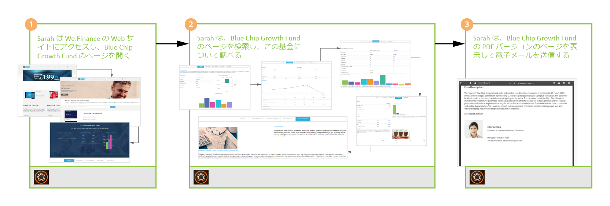

### SarahはWe.Finance社のウェブサイトに訪問し、Blue Chip Growth Fundの目論見書を開きます。 {#sarah-visits-we-finance-website-and-opens-the-blue-chip-growth-fund-prospectus}

サラ・ローズは、投資信託に投資する予定だ。 We.Financeの既存のお客様で、We.Financeポータルにアクセスして、利用可能なミューチュアルファンドをご利用いただけます。 彼女はウェルス・マネジメントのセクションに行きWe.Finance Blue Chip Growth Fundのページを開きます このページには、現在および過去の価格、月別業績、部門別多様化、費用、手数料、税金など、資金に関する詳細を含む目論見書へのリンクが含まれています。

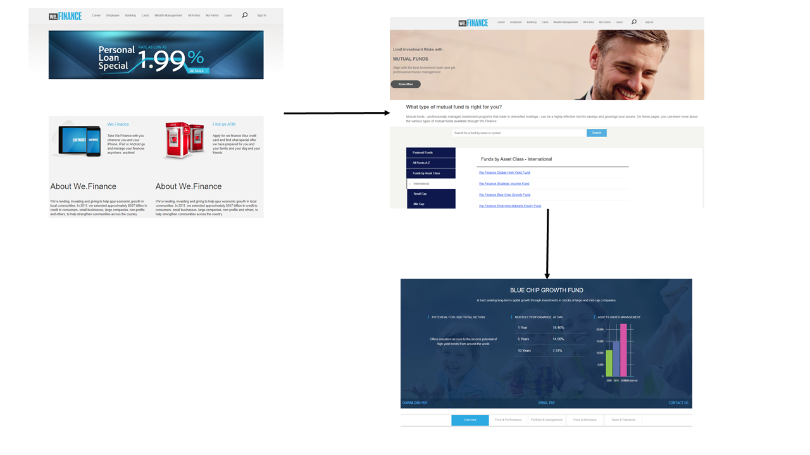

#### 仕組み {#how-it-works-17}

ブルーチップ・グループ・ファンドの目論見書は対話型のコミュニケーションです テキスト、画像、グラフ、表コンポーネント(ドキュメントフラグメント)を使用して、製品概要、株式スタイル、資金実績、資金詳細などの関連情報を表示します。 インタラクティブな通信は、次の場所で編集モードで確認できます。 `https://[authorHost]:[ authorPort]/editor.html/content/forms/af/we-finance/wealth-management/wealth-management/channels/web.html`

グラフや表は、フォームデータモデルからデータを取得します。 フォームデータモデルは、このチュートリアルのデータベースである設定済みのデータソースに接続し、基金に固有の情報を取得します。 フォームデータモデルは、 `https://[authorHost]:[authorPort]/aem/fdm/editor.html/content/dam/formsanddocuments-fdm/we-finance/wealth-management`

#### 実際の動作確認  {#see-it-yourself-15}

We.Financeポータル()に移動し、「資産管理」をタップし、「資産区分別資金」をタップし `https://[publishHost]:[publishPort]/wefinance`て、「We.Finance Blue Chip Growth Fund」をタップします。 We.Finance Blue Chip Growth Fundの目論見書が開館する。

### Sarahは、Blue Chip Growth Fundの目論見書を調査し、その基金について知る {#sarah-explores-the-blue-chip-growth-fund-prospectus-to-learn-about-the-fund}

Sarahは、目論見書の概要、価格とパフォーマンス、Portfolio管理、手数料と最小額、税金と支払いの各タブを調査し、現在と過去の価格、過去の成長、S&amp;P 500指数との比較、部門別多様化、資金管理者、資金に関連する費用を調べます。 関連情報は、異なるタブに分けられる。 目論見書は対話型のコミュニケーションです 対話型通信はレスポンシブデザインを持ちます。 どんな画面サイズのデバイスでも対話型のコミュニケーションを開くことができ、対話型のコミュニケーションは下のデバイスに合わせてデザインをリフローします。

#### 仕組み {#how-it-works-18}

Blue Chip Growth Fundの対話型コミュニケーションは、親パネルと子パネルを使って、関連情報を別々のセクションに分ける。 親パネルは、すべての子パネルをタブにまとめています。

親タブのレイアウトは「上部のタブ」に設定され、すべての子パネルがタブに変換されます。 インタラクティブ通信のパネルは、の編集モードで確認でき `https://[authorHost]:[ authorPort]/editor.html/content/forms/af/we-finance/wealth-management/wealth-management/channels/web.html`ます。

#### 実際の動作確認  {#see-it-yourself-16}

Blue Chip Growth Fundのインタラクティブ・コミュニケーション（英語）に進み `https://[publishHost]:[ publishPort]/content/forms/af/we-finance/wealth-management/wealth-management/channels/web.html?wcmmode=disabled`ます。 すべてのタブを調べます。

### Sarahの表示とBlue Chip Growth FundページのPDF版を電子メールで送信 {#sarah-views-and-emails-the-pdf-version-of-the-blue-chip-growth-fund-page}

Sarahは週末に田舎に旅行中です。 彼女は、ブルーチップス・グループ・ファンドについて兄と話し合う予定だ。 彼女の兄は銀行と仕事をし、金融に関する決断を助ける。 Sarahはオフラインで読むために、Blue Chip Growth FundページのPDF版を自分のノートパソコンにダウンロードします。 また、弟にPDF版のコピーをメールします。

#### 仕組み {#how-it-works-19}

ブルーチップ・グループ・ファンドの目論見書は対話型のコミュニケーションです WebおよびPDFのチャネルが含まれます。 インタラクティブな通信はAEMワークフローと統合され、PDFバージョンを電子メールで送信します。 ワークフローモデルは、で確認でき `https://[authorHost]:[ authorPort]/editor.html/conf/global/settings/workflow/models/wealthmanagement.html`ます。

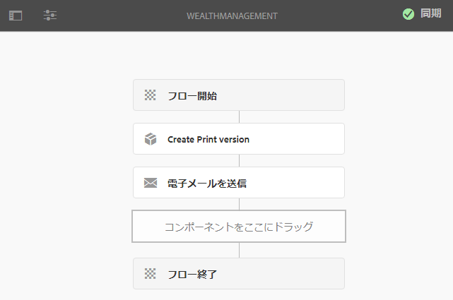

#### 実際の動作確認  {#see-it-yourself-17}

PDF版をダウンロードするには、Blue Chip Growth Fundのインタラクティブコミュニケーションに移動し、「PDFのダウンロード」をタップし `https://[publishHost]:[ publishPort]/content/forms/af/we-finance/wealth-management/wealth-management/channels/web.html`ます。

PDFを電子メールで送信するには、Blue Chip Growth Fundのインタラクティブコミュニケーションに移動し、「EMAIL PDF」をタップし `https://[publishHost]:[ publishPort]/content/forms/af/we-finance/wealth-management/wealth-management/channels/web.html`ます。 「 **フルネーム** 」と「 **電子メールアドレス**」を指定します。 「電子メール **の送信**」をクリックします。

## 自動保険申し込みのチュートリアル {#auto-insurance-application-walkthrough}

We.Finance自動保険申込シナリオでは、次の人物が含まれます。

* Sarah Rose（We.Finance 社の顧客）
* We.Finance社、保険代理店、Conrad Simms氏

Sarah Rose は We.Finance 社の既存の顧客で、自動保険契約を購入しています。今が保険を更新する時だ Conrad Simms（保険代理店）、We.Finance社は、Sarahにポリシーの更新に関するリマインダーを送信します。 リマインダーの電子メールには、ポリシー更新の詳細を含むPDFと、インタラクティブ通信のWebバージョンへのリンクが含まれています。 インタラクティブな通信は、モバイルに優しくレスポンシブなデザインを備えています。 Gloriaはどのデバイスでも対話型の通信を開くことができ、対話型の通信は基になるデバイスの画面サイズに合わせて折り返します。 PDF版のインタラクティブな通信は、電子メールに添付されており、オフラインでの読み取りに役立ちます。

Sarahは電子メールに記載されている指示に従い、プロセスを正常に更新します。 次の画像は、自動保険申込ウォークスルーのワークフローを示しています。  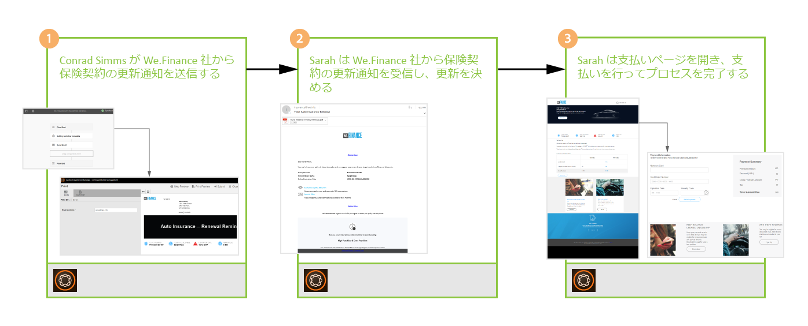

### Conrad sends an insurance policy renewal communication from We.Finance {#conrad-sends-an-insurance-policy-renewal-communication-from-we-finance}

ConradはAEMインスタンスにログインし、Auto InsuranceダッシュボードでSarahの **顧客IDを指定し、「** Renew Policy ****」をクリックします。 「 **エージェントUI** 」が開き、Sarah Roseのポリシーの詳細がすでに入力済みで表示されます。 Sarahの電子メールアドレスを指定し、「 **Submit**」をクリックします。 Sarah receives an email with the subject **Your Auto Insurance Renewal**.

#### 仕組み {#how-it-works-20}

保険証書更新通信は、対話型の通信です。 Conrad Simmsは、エージェントUIを使用して、保険契約の更新に関する連絡をSarahに送信します。 通信は、印刷(PDF)と、インタラクティブ通信のWfcチャネルへのリンクを含む。 対話型の通信は、AEMワークフローを使用して電子メールを送信します。 ワークフローは、 `https://[authorHost]:[ authorPort]/editor.html/conf/global/settings/workflow/models/we-finance-auto-insurance-renewal.html`

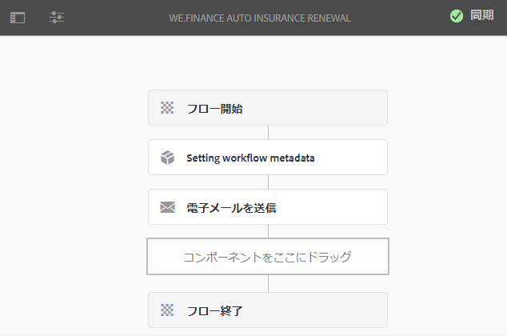

#### 実際の動作確認  {#see-it-yourself-18}

We.Finance Auto Insurance **ダッシュボードにConrad Simms** (csimms/password)としてログインします。 The URL is `https://[publishhost]:[publishport]/content/we-finance/global/en/login.html?resource=/content/we-finance/ccdashboard.html`. 「 **顧客ID**」を指定します。 Sarah Roseの顧客IDは900001です。 「 **ポリシーを更新**」をクリックします。 エージェント UI でインタラクティブ通信が開きます。エージェントUIで、有効な電子メールアドレスを入力し、ポリシードキュメントが添付された電子メールを送信し、 **「Submit**」をクリックします。 「送信開始」というメッセージが画面に表示され、数秒後に「送信に成功しました」というメッセージが表示されます。 「 **自動保険の更新** 」という件名の電子メールが、指定した電子メールアドレスに送信されます。 Sarah Roseに提供されるポリシーは、プレミアムポリシーです。

自動保険のチュートリアルには、別の顧客であるAlison Jonesも含まれています。 Alison Jonesの顧客IDは900002です。 対話型の通信をAlison Jonesに送信すると、標準ポリシーが送信されます。 標準ポリシーとプレミアムポリシーの違いは次のとおりです。

* プレミアムポリシーはバナー画像を持ち、標準ポリシーはアドレスブロックの下にテキストのみを持ちます。
* 標準ポリシーのコストは、プレミアムポリシーより低くなります。
* プレミアムポリシーは盗難防止の報酬を持ち、標準ポリシーはスマートな乗り物報酬を持つ

両方のポリシーが同じインタラクティブ通信を使用します。 ポリシー内のセクションは、ポリシータイプの条件に基づいて変更または非表示にされます。 You can access and review the auto insurance renewal interactive communication directly from `https://[authorHost]: authorPort]/aem/formdetails.html/content/dam/formsanddocuments/we-finance/autoinsurance/auto-insurance-renewal`

**Microsoft Dynamicsをデータソースとして使用する**

リファレンスサイトは、Microsoft Dynamicsをフォームデータモデルのデータソースとして使用するインタラクティブな通信も提供します。 次の手順を実行して、自動保険のウォークスルー用の対話型通信を設定します。

1. `https://[author]:'port'/crx/de as an administrator` にログインします。
1. Open the `/apps/we-finance/components/ccrui/ccrui.jsp`file.
1. の値を `FormFieldRequestParameter``/content/dam/formsanddocuments/we-finance/autoinsurance/auto-insurance-renewal-dynamics`
1. 「**すべて保存**」をタップします。リファレンスサイトは、MS Dynamicsをデータソースとして使用する対話型通信を使用するように構成されている。

次に、 **We.Finance Auto InsuranceダッシュボードにConrad Simms** (csimms/password)としてログインします。 The URL is `https://[publishhost]:[publishport]/content/we-finance/global/en/login.html?resource=/content/we-finance/ccdashboard.html`. 「 **顧客ID**」を指定します。 Sarah Roseの顧客IDは900001です。 「 **ポリシーを更新**」をクリックします。 エージェント UI でインタラクティブ通信が開きます。エージェントUIで、有効な電子メールアドレスを入力し、ポリシードキュメントが添付された電子メールを送信し、 **「Submit**」をクリックします。 「送信開始」というメッセージが画面に表示され、数秒後に「送信に成功しました」というメッセージが表示されます。 「 **自動保険の更新** 」という件名の電子メールが、指定した電子メールアドレスに送信されます。

>[!NOTE]
>
>Microsoft Dynamicsをデータソースとして使用する対話型の通信を使用する場合、Sarahに送信される電子メール内のリンクは、Microsoft Dynamicsを使用しない対話型の通信を指し示します。 この問題を修正するには、電子メールテンプレート内のリンクを手動で変更します。

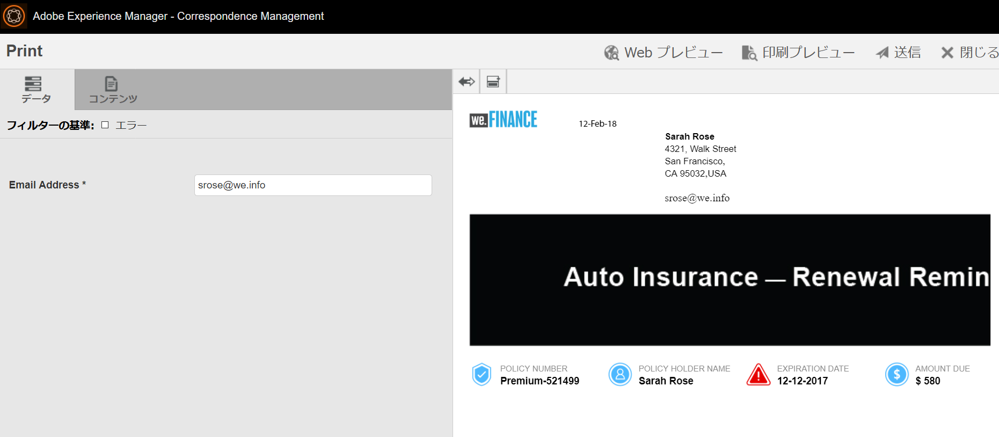

### Sarah は We.Finance 社から保険契約の更新通知を受信し、更新を決める {#sarah-receives-an-insurance-policy-renewal-communication-from-we-finance-and-decides-to-renew}

Sarahは、We.Financeから添付ファイルが添付された電子メールを受信します。この電子メールにより、自動保険ポリシーがまもなく期限切れになることを通知します。 添付ファイルは、自動保険契約の更新詳細の印刷版です。

Sarah clicks **Renew Now** and is directed to the web version of her auto insurance letter. このレターの上に、Sarahはポリシーの有効期限が切れるまでの日数が残っていることを見つけます。 このページでは、Sarahは保険ポリシーの詳細（Policy Number、Amount Dueなど）の概要と、割引オファー、ロイヤルティ報酬などの情報を提供します。 Sarah again clicks **Renew Now** at the bottom of the policy.

#### 仕組み  {#how-it-works-21}

自動保険レターのWeb出力と印刷出力は、Interactive Communicationsのマルチチャネル機能を使用して作成されます。 The **Renew Now** button in the email is linked to the auto insurance renew application, which is an interactive communication on a publish instance.

#### 実際の動作確認  {#see-it-yourself-19}

PDF が添付された電子メールを受信します。PDFは、自動保険レターの印刷版です。 Click **Renew Now** to reach to the web version of the policy. 個人情報とポリシーの詳細を確認し、「今すぐ **更新**」をクリックします。 支払いのためにアダプティブフォームに移動します。

The **Renew Now** button in the email directs Sarah to the web version of the policy. 次の URL にアクセスできます。

`https://[publishServer]:[publishPort]/content/document.html?schema=fdm&documentId=/content/forms/af/we-finance/autoinsurance/auto-insurance-renewal/channels/web.html&customerId=900001`

You can check the detailed summary of your auto insurance renewal and click **Renew Now** at the bottom of the page.

### Sarahが支払いページを開き、支払いを行い、処理を完了します {#sarah-opens-the-payment-page-and-makes-the-payment-and-completes-the-process}

SarahがWeb版のインタラクティブコミュニケーションの「 **今すぐ更新** 」をクリックすると、支払いページが開きます。 Sarahは、自分のレコードと共にPolicy Number and Date of Expirationを再確認します。 ページの右側で、Sarahは更新の支払要約を合計金額の10%プレミアム割引で確認します。 Sarah fills her Credit Card details and clicks **Make Payment**.

#### 仕組み  {#how-it-works-22}

「今すぐ更新」ボタンをクリックすると、支払いページに移動します。 支払いページはアダプティブフォームです。 Sarahはクレジットカードの詳細を入力し、「 **送信**」をクリックします。 クレジットカードの支払いが処理され、アダプティブフォームに設定された「ありがとうございます」メッセージが画面に表示されます。

#### 実際の動作確認  {#see-it-yourself-20}

「**今すぐ更新する**」をクリックして支払いページにアクセスします。Fill in your Credit Card information, and click **Make Payment**. オーサリングインスタンスの支払いページにアクセスするには、次の場所を参照してください。

`https://[authorServer]:[authorPort]/content/document.html?documentId=/content/forms/af/we-finance/credit-card/ccbillpayment.html&schema=fdm&customerId=900001`

「お支払い」ボタンをクリックすると、「ありがとうございます」というメッセージが表示されます。
