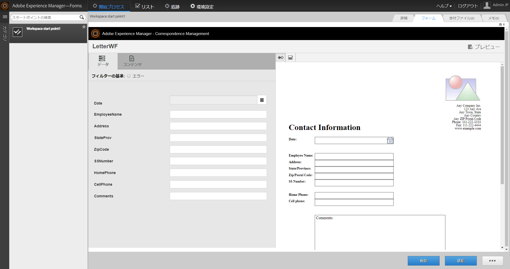

# AEM Forms Workspace のフォームセットの使用{#working-with-formsets-in-aem-forms-workspace}

フォームセットは HTML5 フォームの集まりであり、エンドユーザーには 1 つのフォームのセットとして提供されます。エンドユーザーがフォームセットへの入力を始めると、フォームセットはその内容を別のフォームにもシームレスに移行します。フォームセットは 1 回クリックすれば送信できます。フォームセットおよびその設定方法について詳しくは、[AEM Forms のフォームセット](../../forms/using/formset-in-aem-forms.md)を参照してください。

AEM Forms Workspace はフォームセットをサポートします。フォームセットでは、サービスやプロセスに関連する複数のフォームをグループ化し、ビジネス上のプロセスを自動化するとともにエンドユーザーに表示します。このようなシナリオでは、ユーザーはセット全体を 1 つとして記入し、個々のフォームやプロセスをファイル、送信、追跡する必要はありません。

## AEM Forms Workspace アプリケーションにおけるフォームセットのスタートポイントへの割り当て {#attaching-a-formset-to-startpoint-in-an-aem-forms-workspace-app-br}

1. Workbench でビジネスプロセスのワークフローを作成します。詳しくは、[Workbench ヘルプ](https://www.adobe.com/go/learn_aemforms_workbench_63_jp)を参照してください。
1. スタートポイントの「Process Properties」の「Presentation &amp; Data」で、「**CRX アセットを使用する**」を選択します。

   

1. CRX アセットパスの横にある「」（参照）をクリックします。フォームアセットを選択ダイアログが表示されます。

   

1. 「**フォームセット**」タブをクリックし、関連するフォームセットをリストから選択して、「**OK**」をクリックします。

1. 他の関連プロセスのプロパティを更新したら、アプリケーションをデプロイします。

## AEM Forms Workspace でのフォームセットの使用 {#using-formset-in-nbsp-aem-forms-workspace}

フォームセットをスタートポイントに割り当てると、このスタートポイントを、他のすべてのスタートポイントと同様に、AEM Forms Workspace から呼び出せるようになります。

AEM Forms Workspace を通じてフォームセットでサポートされる操作は次のとおりです。

* ドラフトとして保存
* ロック
* 中断
* 送信
* 添付ファイルを追加
* メモを追加
* 「戻る」または「次へ」ボタンを使用してフォームセット内のフォーム間を移動する

>[!NOTE]
>
>フォームセット内で前のフォームや次のフォームに移動する際のパフォーマンスを向上するため、Workspace のすべてのボタン（「戻る」、「次へ」、「保存」、「送信」など）は、関連フォームのレンダリングが終了するまで無効になります。
