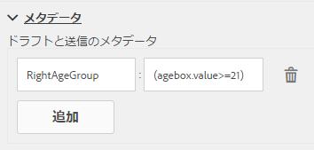
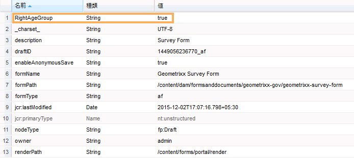
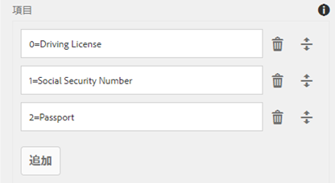

# ユーザーデータからフォーム送信メタデータへの情報の追加{#adding-information-from-user-data-to-form-submission-metadata}

フォームの要素に入力された値を使用して、ドラフトまたはフォーム送信のメタデータフィールドを計算できます。メタデータを使用すると、ユーザーデータに基づいてコンテンツをフィルターできます。例えば、ユーザーがフォームの名前フィールドに John Doe と入力するとします。この情報を使用してメタデータを計算することにより、この送信をイニシャル JD 下に分類できます。

ユーザーが入力した値を使用してメタデータフィールドを計算するには、フォームの要素をメタデータに追加します。ユーザーがその要素に値を入力すると、スクリプトはその値を使用して情報を計算します。 この情報はメタデータに追加されます。要素をメタデータフィールドとして追加する際は、メタデータフィールドのキーを指定します。キーはメタデータのフィールドとして追加され、計算された情報はこのフィールドに対して記録されます。

例えば、健康保険会社がフォームを発行するとします。このフォームのフィールドはエンドユーザーの年齢を取得します。顧客は、多数のユーザーからフォームが送信された後、特定の年齢範囲に当てはまる送信をすべて確認することを希望しています。しかしそのままでは相応の手間がかかります。なぜならフォームの数が増加するほどデータは複雑化するからです。メタデータを追加すると、顧客の手間を軽減することができます。フォーム作成者はエンドユーザーが入力したプロパティやデータのうちどれを最上位レベルに保存するかを設定できるため、検索が容易になります。追加のメタデータはユーザーによって入力される情報で、作成者の設定に基づいてメタデータノードの最上位レベルに保存されます。

電子メール ID と電話番号を取得するフォームの例を考えてみましょう。作成者は、ユーザーがフォームに匿名でアクセスしてからフォームを破棄した場合、電子メール ID と電話番号が自動保存されるようにフォームを設定できます。このフォームは自動保存され、電話番号と電子メール ID は、ドラフトのメタデータノードに保存されます。この設定のユースケースとしては、リード管理ダッシュボードが挙げられます。

## メタデータへのフォーム要素の追加  {#adding-form-elements-to-metadata}

次の手順を実行して、メタデータに要素を追加します。

1. アダプティブフォームを編集モードで開きます。\
   フォームを編集モードで開くには、フォームマネージャーでフォームを選択して、「**開く**」をタップします。
1. 編集モードで、コンポーネントを選択し、/**アダプティブフォームコンテナ**&#x200B;をタップし、をタップします。
1. サイドバーで、「**メタデータ**」をクリックします。
1. 「メタデータ」セクションで、「**追加**」をクリックします。
1. 「メタデータ」タブの「値」フィールドを使用して、スクリプトを追加します。追加したスクリプトは、フォームの要素からデータを収集し、メタデータに追加された値を計算します。

   例えば、入力された年齢が21才以上の場合は&#x200B;**true**&#x200B;はメタデータに記録され、21才未満の場合は&#x200B;**false**&#x200B;はログに記録されます。 「メタデータ」タブで次のスクリプトを入力します。

   `(agebox.value >= 21) ? true : false`

   

   「メタデータ」タブで入力されたスクリプト

1. 「**OK**」をクリックします。

メタデータフィールドとして選択された要素にユーザーがデータを入力した後、計算された情報はメタデータに記録されます。メタデータは、メタデータを保存するように設定したリポジトリで表示できます。

## 更新されたフォーム送信メタデータの表示：{#seeing-updated-form-nbsp-submission-metadata}

上記の例では、メタデータは CRX リポジトリに保存されます。メタデータは次のように表示されます。

メタデータにチェックボックス要素を追加すると、選択された値がコンマで区切られた文字列として保存されます。例えば、フォームにチェックボックスコンポーネントを追加し、その名前を `checkbox1` として指定します。チェックボックスコンポーネントのプロパティで、値 0、1 および 2 に対して、運転免許、社会保障番号、パスポートの各項目を追加します。

アダプティブフォームコンテナを選択し、フォームのプロパティで `cb1` を保存するメタデータキー `checkbox1.value` を追加して、フォームを発行します。顧客がフォームへの記入時に、チェックボックスフィールドで「パスポート」オプションと「社会保障番号」オプションを選択します。値 1 と 2 が送信メタデータの cb1 フィールドに 1, 2 として保存されます。

>[!NOTE]
>
>上記の例は学習目的のみで紹介しています。メタデータの検索は、AEM Forms 実装で設定した適切な場所で行ってください。

