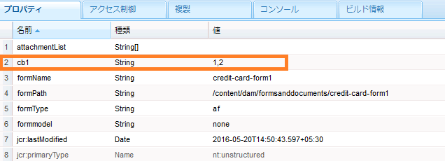

# ユーザーデータからフォーム送信メタデータへの情報の追加{#adding-information-from-user-data-to-form-submission-metadata}

[アダプティブフォームの新規作成](/help/forms/using/create-an-adaptive-form-core-components.md)または [AEM Sites ページへのアダプティブフォームの追加](/help/forms/using/create-or-add-an-adaptive-form-to-aem-sites-page.md)には、最新の拡張可能なデータキャプチャ[コアコンポーネント](https://experienceleague.adobe.com/docs/experience-manager-core-components/using/adaptive-forms/introduction.html?lang=ja)を使用することをお勧めします。これらのコンポーネントは、アダプティブフォームの作成における大幅な進歩を表し、ユーザーエクスペリエンスの向上を実現します。この記事では、基盤コンポーネントを使用してアダプティブフォームを作成する古い方法について説明します。

フォームの要素に入力された値を使用して、ドラフトまたはフォーム送信のメタデータフィールドを計算できます。メタデータを使用すると、ユーザーデータに基づいてコンテンツをフィルタリングできます。例えば、ユーザーがフォームの名前フィールドに John Doe と入力したとします。この情報を使用してメタデータを計算することにより、この送信をイニシャル JD の下に分類できます。

ユーザーが入力した値でメタデータフィールドを計算するには、メタデータにフォームの要素を追加します。この要素にユーザーが値を入力すると、スクリプトはその値を使用して情報を計算します。この情報はメタデータに追加されます。要素をメタデータフィールドとして追加する場合、そのキーを指定します。キーがメタデータのフィールドとして追加され、計算された情報がそのキーに対してログに記録されます。

例えば、健康保険会社がフォームを公開するとします。このフォームのフィールドで、エンドユーザーの年齢を取得します。多数のユーザーからフォームが送信された後、特定の年齢範囲に当てはまる送信をすべて確認したいと考えています。フォームの数が増加するとデータの確認に手間がかかりますが、メタデータを追加するとすべてのデータを確認する必要がなくなり、この手間を軽減することができます。フォーム作成者は、検索が最も簡単になるように、エンドユーザーが入力したプロパティやデータのうちどれを最上位レベルに保存するかを設定できます。追加のメタデータはユーザーによって入力される情報で、作成者の設定に基づいてメタデータノードの最上位レベルに保存されます。

メール ID と電話番号を取り込むフォームの別の例を考えます。ユーザーがフォームに匿名でアクセスしてからフォームを破棄した場合、メール ID と電話番号が自動保存されるようにフォームを設定できます。このフォームは自動保存され、電話番号およびメール ID はドラフトのメタデータノードに保存されます。この設定のユースケースとして、リード管理ダッシュボードが挙げられます。

## メタデータへのフォーム要素の追加 {#adding-form-elements-to-metadata}

フォーム要素をメタデータに追加するには、次の手順を実行します。

1. アダプティブフォームを編集モードで開きます。\
   フォームを編集モードで開くには、フォームマネージャーでフォームを選択して、「**開く**」を選択します。
1. 編集モードでコンポーネントを選択し、／**アダプティブフォームコンテナ**&#x200B;を選択してから、 を選択します。
1. サイドバーで、「**メタデータ**」をクリックします。
1. 「メタデータ」セクションで、「**追加**」をクリックします。
1. 「メタデータ」タブの「値」フィールドを使用して、スクリプトを追加します。追加したスクリプトは、フォーム上の要素からデータを収集し、メタデータに入力される値を計算します。

   例えば、入力された年齢が 21 才以上の場合はメタデータに **true** を記録し、21 才未満の場合は **false** を記録します。「メタデータ」タブで次のスクリプトを入力します。

   `(agebox.value >= 21) ? true : false`

   

   「メタデータ」タブで入力されたスクリプト

1. 「**OK**」をクリックします。

メタデータフィールドとして選択された要素にユーザーがデータを入力すると、計算された情報がメタデータに記録されます。メタデータは、メタデータを保存するように設定したリポジトリーで表示できます。

## フォーム送信メタデータの表示：  {#seeing-updated-form-nbsp-submission-metadata}

上記の例では、メタデータは CRX リポジトリーに保存されます。メタデータは次のようになります。

メタデータにチェックボックス要素を追加すると、選択された値がコンマで区切られた文字列として保存されます。例えば、フォームにチェックボックスコンポーネントを追加し、その名前を `checkbox1` として指定します。チェックボックスコンポーネントのプロパティで、値 0、1、および 2 に対して、運転免許、社会保障番号、パスポートの各項目を追加します。

アダプティブフォームコンテナを選択し、フォームのプロパティで `cb1` を保存するメタデータキー `checkbox1.value` を追加して、フォームを発行します。顧客はフォームへの記入時に、チェックボックスフィールドで「パスポート」オプションと「社会保障番号」オプションを選択します。値 1 と 2 が送信メタデータの cb1 フィールドに「1, 2」として保存されます。

>[!NOTE]
>
>上記の例は学習目的のみで紹介しています。メタデータの検索は、AEM Forms 実装で設定した適切な場所で行ってください。
