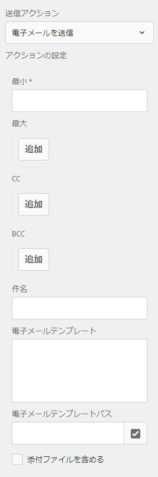

# 電子メールによるフォーム送信確認の送信 {#sending-a-form-submission-acknowledgement-via-email}

## アクティビティフォームデータ送信 {#adaptive-form-data-submission}

アクティビティフォームでは、あらかじめ用意されたいくつかの[送信アクション](../../forms/using/configuring-submit-actions.md)が使用でき、フォームデータを複数のエンドポイントに送信できます。

For example, the **[!UICONTROL Send email]** submit action sends an email on successful submission of an adaptive form. これは、フォームデータと PDF を電子メールで送信するように設定することもできます。

この記事では、アダプティブフォームで電子メールアクションを有効にする手順や、さまざまな設定について詳しく説明します。

>[!NOTE]
>
>You can also use the **[!UICONTROL Send PDF via email]** option to send the completed form by email as a PDF attachment. The configuration options available for this action are the same as the options available for the **[!UICONTROL Send email]** action. PDF のメール送信アクションは、XFA ベースのアダプティブフォームに対してのみ使用できます。

## 電子メール送信アクション {#email-action}

「電子メールの送信」アクションを使用すると、アダプティブフォームの送信が成功した場合に、作成者が1人または複数の受信者に自動的に電子メールを送信できます。

>[!NOTE]
>
>To use the Send email action, you need to configure the AEM mail service as described in [Configuring the mail service](/help/sites-administering/notification.md#configuring-the-mail-service).

### Enabling Send email action on an adaptive form {#enabling-email-action-on-an-adaptive-form}

1. Open an adaptive form in **[!UICONTROL edit]** mode.

1. 「コンテンツ **[!UICONTROL 」タブで、「フォーム]** コンテナ **[!UICONTROL 」をタップし、「設定]** 」をタップして、アダプティブフォームのプロパティを表示します。

1. In the **[!UICONTROL Submission]** section, select **[!UICONTROL Send email]** from the **[!UICONTROL Submit Action]** drop-down list.

   

1. Specify valid email IDs in the **[!UICONTROL To]**, **[!UICONTROL CC]**, and **[!UICONTROL BCC]** fields.

   Specify the subject and the body of the email in the **[!UICONTROL Subject]** and **[!UICONTROL Email Template]** fields, respectively.

   フィールドに変数プレースホルダーを指定することもできます。この場合、フィールドの値は、フォームがエンドユーザーによって正しく送信されたときに処理されます。詳細については、「[アダプティブフォームのフィールド名を使用した電子メールコンテンツの動的作成](../../forms/using/form-submission-receipt-via-email.md#p-using-adaptive-form-field-names-to-dynamically-create-email-content-p)」を参照してください。

   Select **[!UICONTROL Include attachments]** if the form includes file attachments and you want to attach these files in the email.

   >[!NOTE]
   >
   >If you choose the **[!UICONTROL Send PDF via Email]** option, you must select the Include attachments option.

1. Click  to save the changes.

### アダプティブフォームのフィールド名を使用した電子メールコンテンツの動的作成 {#using-adaptive-form-field-names-to-dynamically-create-email-content}

アダプティブフォームのフィールド名はプレースホルダーと呼ばれ、ユーザーがフォームを送信した後にそのフィールドの値によって置き換えられます。

In the **[!UICONTROL Send email]** action, you can use placeholders that are processed when the action is performed. It implies that the headers of the email (such as **[!UICONTROL To]**, **[!UICONTROL CC]**, **[!UICONTROL BCC]**, **[!UICONTROL Subject]**) are generated when the user submits the form.

プレースホルダーを定義するには、「電子メ `${<field name>}` ールを送信」を送信アクシ **[!UICONTROL ョンとして選択し]** 、フィールドに指定します。

For example, if the form contains the **[!UICONTROL Email address]** field, named `email_addr`, for capturing the email ID of a user, you can specify the following in the **[!UICONTROL To]**, **[!UICONTROL CC]**, or **[!UICONTROL BCC]** fields.

`${email_addr}`

ユーザーがフォームを送信すると、フォームの `email_addr` フィールドに入力された電子メール ID に電子メールが送信されます。

>[!NOTE]
>
>フィールドの&#x200B;**[!UICONTROL 編集]**&#x200B;ダイアログにフィールドの名前があります。

Variable placeholders can also be used in the **[!UICONTROL Subject]** and **[!UICONTROL Email Template]** fields.

次に例を示します。

`Hi ${first_name} ${last_name},`

`Your form has been received by our department. It usually takes ten business days to process the request.`

`Regards`

`Administrator`

>[!NOTE]
>
>繰り返し可能パネル内のフィールドは、変数プレースホルダーとして使用することはできません。

