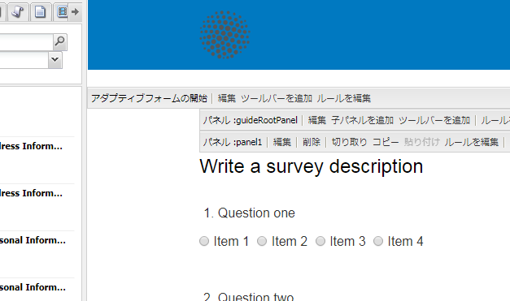
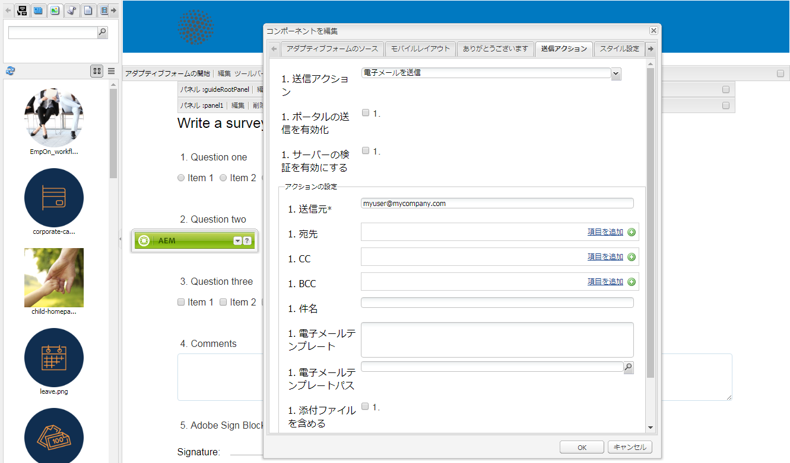

# 電子メールによるフォーム送信確認の送信{#sending-a-form-submission-acknowledgement-via-email}

## アクティビティフォームデータ送信 {#adaptive-form-data-submission}

アクティビティフォームでは、あらかじめ用意されたいくつかの[送信アクション](../../forms/using/configuring-submit-actions.md)が使用でき、フォームデータを複数のエンドポイントに送信できます。

For example, the **Email action** submit action sends an email on successful submission of an adaptive form. これは、フォームデータと PDF を電子メールで送信するように設定することもできます。

この記事では、アダプティブフォームで電子メールアクションを有効にする手順や、さまざまな設定について詳しく説明します。

>[!NOTE]
>
>You can also use the **Email PDF action** to send the completed form by email as a PDF attachment. このアクションで使用できる設定オプションは、電子メールアクションで使用できるオプションと同じです。PDF のメール送信アクションは、XFA ベースのアダプティブフォームに対してのみ使用できます。

## メール送信アクション {#email-action}

電子メールアクションを使用すると、アダプティブフォームの送信に成功したときに、1 人または複数の受信者に電子メールを自動的に送信できます。

>[!NOTE]
>
>電子メールアクションを使用するには、[電子メールサービスの設定](/help/sites-administering/notification.md#configuring-the-mail-service)で説明されているように AEM メールサービスを設定する必要があります。

### アダプティブフォームでの電子メールアクションの有効化 {#enabling-email-action-on-an-adaptive-form}

1. アダプティブフォームを編集モードで開きます。

1. **アダプティブフォームの開始**&#x200B;ツールバーの横にある&#x200B;**編集**&#x200B;をクリックします。

   コンポーネントを編集ダイアログが開きます。

   

1. Select the **Submit actions** tab and choose **Email action** from the Submit action drop-down list.

   このタブには、現在のフォームに対して電子メールアクションを設定するためのオプションが表示されます。

   

1. 宛先、CC、および BCC フィールドに有効な電子メール ID を指定します。

   件名および電子メールテンプレートフィールドに、それぞれ件名と電子メール本文を指定します。

   フィールドに変数プレースホルダーを指定することもできます。この場合、フィールドの値は、フォームがエンドユーザーによって正しく送信されたときに処理されます。詳細については、「[アダプティブフォームのフィールド名を使用した電子メールコンテンツの動的作成](../../forms/using/form-submission-receipt-via-email.md#p-using-adaptive-form-field-names-to-dynamically-create-email-content-p)」を参照してください。

   フォームに添付ファイルがありそれを電子メールに添付する場合は、添付ファイルを含めるを選択してください。

   >[!NOTE]
   >
   >**PDF のメール送信アクション**&#x200B;を選択した場合は、添付ファイルを含めるオプションを選択する必要があります。

1. 「**OK**」をクリックして、変更を保存します。

### アダプティブフォームのフィールド名を使用した電子メールコンテンツの動的作成 {#using-adaptive-form-field-names-to-dynamically-create-email-content}

アダプティブフォームのフィールド名はプレースホルダーと呼ばれ、ユーザーがフォームを送信した後にそのフィールドの値によって置き換えられます。

電子メールアクションタブでは、アクションが実行されたときに処理されるプレースホルダーを使用できます。すなわち、電子メールのヘッダー（例えば宛先、CC、BCC、件名）を、ユーザーがフォームを送信したときに生成するようにできることを意味します。

To define a placeholder, specify `${<field name>}` in a field in the Submit actions tab.

例えば、フォームが **** という`email_addr`電子メールアドレスフィールドを持っている場合、ユーザーの電子メール ID を取得するために、宛先、CC、または BCC フィールドに次のプレースホルダーを指定できます。

`${email_addr}`

ユーザーがフォームを送信すると、フォームの `email_addr` フィールドに入力された電子メール ID に電子メールが送信されます。

>[!NOTE]
>
>フィールドの&#x200B;**編集**&#x200B;ダイアログにフィールドの名前があります。

変数プレースホルダーは、**件名**&#x200B;や&#x200B;**電子メールテンプレート**&#x200B;フィールドにも使用できます。

次に例を示します。

`Hi ${first_name} ${last_name},`

`Your form has been received by our department. It usually takes ten business days to process the request.`

`Regards`

`Administrator`

>[!NOTE]
>
>繰り返し可能パネル内のフィールドは、変数プレースホルダーとして使用することはできません。

