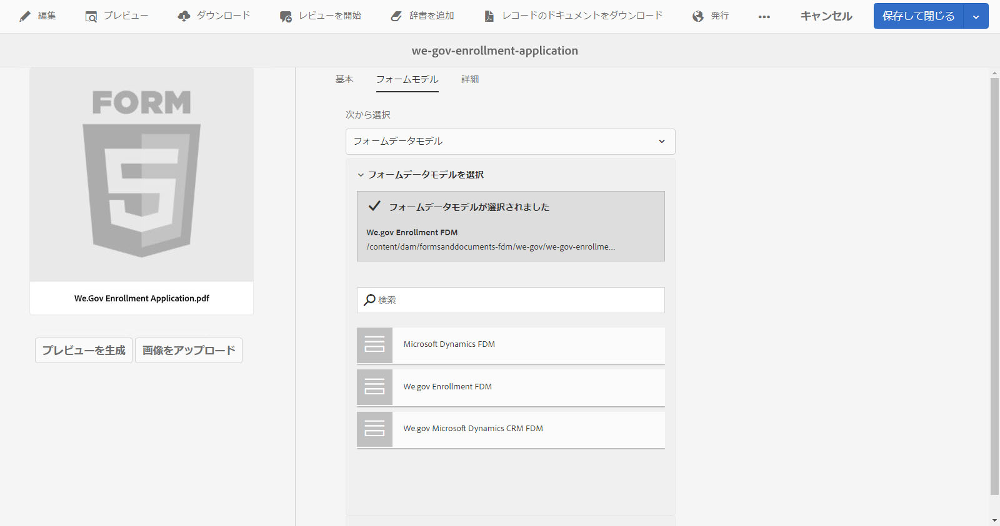

# We.GovとWe.Financeリファレンスサイトのチュートリアル {#we-gov-reference-site-walkthrough}

## 前提条件 {#pre-requisites}

We.GovおよびWe.Financeリファレンスサイトの [設定と設定の説明に従って、リファレンスサイトを設定します](../../forms/using/forms-install-configure-gov-reference-site.md)。

## ユーザーストーリー {#user-story}

* AEM Forms

   * 自動フォーム変換
   * オーサリング
   * フォームデータモデル/データソース

* AEM Forms

   * データの取得
   * （オプション）データ統合(MS Dynamics)
   * （任意）Adobe Sign

* ワークフロー
* 電子メール通知
* （オプション）顧客とのコミュニケーション

   * 印刷チャネル
   * Web チャネル

* Adobe Analytics
* データソースの統合

### Fictitious users and groups {#fictitious-users-and-groups}

We.Govデモパッケージには、次の組み込みの架空のユーザーが含まれています。

* **アヤタン**:官庁から送達を受ける資格を有する国民


* **ジョージ・ラング**:We.Govエージェンシー・ビジネス・アナリスト


* **カミラ・サントス**:We.Gov Agency CXリード


次のグループも含まれます。

* **We.GovFormsユーザー**

   * ジョージ・ラング（メンバー）
   * カミラ・サントス（メンバー）

* **We.Govユーザー**

   * ジョージ・ラング（メンバー）
   * カミラ・サントス（メンバー）
   * 綾丹（会員）

### デモ概要用語の凡例 {#demo-overview-terms-legend}

1. **偽装**:AEMデモでのユーザーとグループの定義。
1. **ボタン**:ナビゲーション用の色付きの長方形または丸型の矢印。
1. **クリック**:ユーザストーリー内のアクションを実行する。
1. **リンク**:Web.Govサイトのメインメニューの上部にあります。
1. **ユーザー手順**:ユーザーのストーリー内を移動する際に実行する一連の数値ステップ。
1. **Formsポータル**: *https://&lt;aemserver>:&lt;port>/content/we-gov/formsportal.html*
1. **モバイル表示**:Web.Govユーザー。モバイル表示を再サイズのブラウザーで複製します。
1. **デスクトップ表示**:We.govユーザーがノートパソコンまたはデスクトップで表示のデモを行います。
1. **事前スクリーンフォーム**:We.Govサイトのホームページ上のフォーム。
1. **アダプティブフォーム**:Web.govデモの登録申込フォーム。

   *https://&lt;aemserver>:&lt;port>/content/forms/af/adobe-gov-forms/enrollment-application-for-health-benefits.html*

1. **AdobeWeb.Govサイト**: *https://&lt;aemserver>:&lt;port>/content/we-gov/home.html*
1. **Adobe受信トレイ**:AEMバックエンドの上部メニューバー [のベルのアイコン](assets/bell.svg) 。

   *https://&lt;aemserver>:&lt;port>/aem/start.html*

1. **電子メールクライアント**:電子メールを表示する優先方法(Gmail、Outlook)
1. **CTA**:誘い文句（CTA：コールトゥアクション）
1. **ナビゲート**:ブラウザページで特定の基準点を指定する場合。
1. **AFC**:自動Formsコンバージョン

## 自動Formsコンバージョン（カミラ） {#automated-forms-conversion}

**この節**:CXリードは、紙ベースのプロセスの一部として使用された既存のPDFベースのフォームを持っています。 近代化の一環として、彼女はこのPDFフォームを使って新しいアダプティブFormsを自動的に作成したいと思っています。

### 自動Formsコンバージョン — We.Gov（カミラ） {#automated-forms-conversion-wegov}

1. https://&lt;aemserver>:&lt;port>/aem/start.htmlに移動し *ます。*

1. ログイン先：
   * **ユーザー**:camila.santos
   * **パスワード**：password
1. メインページから、Forms/Forms&amp;ドキュメント/AEM FormsWe.govForms/AFCを選択します。
1. カミラはPDFをAEM Formsにアップロードする。

   

1. 次に、PDFフォームを選択し、「 **開始自動変換** 」をクリックして、変換プロセスを開始します。 フォームを変換した場合は、 **「変換を** 上書き」をクリックする必要がある場合があります。

   >[!NOTE]
   >
   >AFCの設定はエンドユーザーに対して事前に設定されているので、変更しないでください。

   * **オプション**:アクセシブルなウルトラマリンテーマを使用する場合は、「アダプティブフォームテーマを指定」をクリックし、オプションのリストに表示されるAccessible-Ultramarineテーマを選択します。

   

   

   完了率のステータスは、コンバージョン中に表示されます。 ステータスに「 **変換済み**」と表示されたら、 **出力フォルダーをクリックし、アダプティブフォームを選択して「** 編集 **** 」をクリックし、変換済みのフォームを開きます。

1. 次に、Camillaはフォームをレビューし、すべてのフィールドが存在することを確認します

   

1. 次に、開始がフォームを編集します。 Selects Root Panel/Edit（レンチ）を選択し、「Panel Layout（パネルレイアウト）」ドロップダウンメニューから「Tabs on Top（上部のタブ）」を選択して、チェックボックスを選択します。

   

1. 次に、必要なCSSとフィールドの変更をすべて追加し、最終的な商品が生成されます。

   

### Form Data Model &amp; Data Sources(Camila) {#data-sources}

**この節**:ドキュメントが変換され、アダプティブフォームが生成されたら、Camilaはアダプティブフォームをデータソースに接続する必要があります。

1. Camilaは、 [自動Formsコンバージョン — We.Gov](#automated-forms-conversion-wegov).で変換されたフォームでプロパティを開きます。

1. 次に、「フォームモデル」>「選択元」ドロップダウンから「フォームデータモデルを選択」>「選択」のリストから「Web.gov登録FDMを選択」を選択します。

1. 「保存して閉じる」ボタンのクリック数。

   

1. Camilaは **出力** フォルダーをクリックし、アダプティブフォームを選択し、「 **編集** 」をクリックして、完成したWeb.Govフォームを開きます。
1. Camilaはアダプティブフォームフィールドを選択し、 。 「参照を **連結** 」フィールドを使用して、フォームデータモデルエンティティとの連結を作成します。 Gloriaは、アダプティブフォーム内のすべてのフィールドに対して、この手順を繰り返します。

### フォームのアクセシビリティのテスト(Camila) {#form-accessibility-testing}

また、作成したコンテンツが会社の基準に従って正しく完全にアクセス可能な状態で構築されているかを検証します。

1. Camilaは **output** フォルダーをクリックし、アダプティブフォームを選択し、 **** プレビューをクリックして、完成したWeb.Govフォームを開きます。

1. Chrome Developer Tool内の「監査」タブを開きます。

1. アダプティブフォームを検証するためにアクセシビリティチェックを実行します。

   

## アダプティブフォームモバイル表示デモ(Aya) {#mobile-view-demo}

**この節は、デモの前に実行する必要があります。**

**ユーザー手順：**

1. 移動先： *https://&lt;aemserver>:&lt;port>/content/we-gov/home.html*
1. ログイン先：

   1. **ユーザー**:aya.tan
   1. **パスワード**：password

1. ブラウザーウィンドウのサイズを変更するか、ブラウザーのエミュレーターを使用してモバイルデバイスのサイズを複製します。

### We.Gov Webサイト(Aya) {#aya-user-story-we-gov-website}


**この節**:亜矢は市民だ。 彼女は友人から、官庁から奉仕を受ける資格があるかもしれないと聞く。 Ayaは携帯電話からWe.Govのウェブサイトにアクセスし、自分が受ける資格のあるサービスの詳細を知る。

### We.Govプリスクリーン(Aya) {#aya-user-story-we-gov-pre-screener}

Ayaは、携帯電話で短いアダプティブフォームに入力し、適格性を確認するためのいくつかの質問に回答します。

**ユーザー手順：**

1. 各ドロップダウンフィールドを選択します。

   >[!NOTE]
   >
   >年間200,000ドルを超える金額を獲得したユーザーは、利用できません。

1. 「自分の資格があ&#x200B;**るか**” button.
1. 「**Apply Now**」ボタンをクリックして次に進みます。

   

### We.Govアダプティブフォーム(Aya) {#aya-user-story-we-gov-adaptive-form}

Ayaは資格があると知り、モバイルデバイスでサービスを要求する申込書の記入を開始します。

Ayaは、サービスリクエスト申込を完了する前に、自宅のドキュメントを確認する必要があります。 Savesはアプリを保存し、モバイルデバイスからアプリを終了します。

**ユーザー手順：**

1. 「基本情報」フィールドに入力します。次に、必須フィールドとドロップダウンを示します。

   1. 基本情報

      1. 名
      1. 姓
      1. DOB
      1. 電子メール

1. 次の **動的ロジックを使用して** 、「 **ファミリステータス** 」ドロップダウンを使用した動的機能を示します。

   1. **単一**:キンパネルの横に表示
   1. **既婚**:婚姻状況依存パネルを表示
   1. **離婚**:キンパネルの横に表示
   1. **妻**:キンパネルの横に表示
   1. **子供はいる？**:（はい/いいえ）子依存パネルを表示するラジオボタン。

      1. (追加/削除)ボタンをクリックして、複数の子依存パネルを追加/削除します。

1. グレーのメニューバーの右矢印をクリックします。
1. 下部にある「保存」ボタンをクリックします。

   

## デスクトップデモ {#desktop-demo}

**この節：** 自宅で必要な情報を見つけ、デスクトップから申し込みを再開しています。 Ayaはオンラインフォームポータルにアクセスし、申込を再開します。 簡単なカスタマイズでは、代理店は自動的にリンクを生成して電子メールで申込を再開することもできます。

### アダプティブフォームの継続(Aya) {#aya-user-story-continued-adaptive-form}

**ユーザー手順：**

1. https://&lt;aemserver>:&lt;port>/content/we-gov/home.htmlに移動し *ます。*
1. ナビゲーションバーで[**Online Services**]をクリックします。
1. 「ドラフト・Forms」パネルから、既存の「医療保険加入申込書」を選択します。

   

   外観と操作性は同じで、データを再入力する必要はありません。

   **ユーザー手順：**

1. 右の円CTAをクリックして、次のセクションに移動します。

   

   フォームは、Ayaの最後のエントリ時点まで入力されます。 Ayaは彼女の情報をすべて入力し、今すぐ送信する準備ができています。

   

   >[!NOTE]
   >
   >Ayaが電話番号フィールドに入力する際、ダッシュ、スペース、ハイフンを含まない11桁の連続した数字で入力する必要があります。

   Ayaの提出後、「ありがとうございます」ページが表示されます。 必要に応じて、Adobe Signと電子記録のドキュメントに署名するために開くメールも受け取ります。

### オプション：Adobe Sign（綾） {#adobe-sign}

**ユーザー手順：**

1. 電子メールクライアントに移動し、Adobe Signの電子メールを探します。
1. Adobe Signへのリンクをクリックします。

   

**ユーザー手順：**

1. 「**I agree**」ボックスを選択します。
1. 「**承認**」をクリックします。
1. レビュー済みドキュメントの一番下までスクロールします。
1. 強調表示された黄色のタブをクリックして、ドキュメントに署名します。

   

## 政府代理人（ジョージ） {#government-agent-george}


**この節：** ジョージ氏は、行政官庁Ayaのビジネス・アナリストで、サービスを要請している。 Georgeは1つのダッシュボードを持ち、レビュー用に割り当てられているすべてのサービスリクエストの申し込みを見ることができます。

### AEM受信トレイ(George) {#george-user-story-aem-inbox}

**ユーザー手順：**

1. https://&lt;aemserver>:&lt;port>/aem/start.htmlに移動し *ます。*
1. ユーザーアイコン（右上隅）をクリックし、「**サインアウト**」または管理ユーザーとしてログインしている場合は「**次のユーザーとして動作**」メニューオプションを使用します。

   1. ログイン先：

      1. **ユーザー：** george.lang
      1. **パスワード：** password
   1. または次のようになります。

      1. 「**次の形式で動作」フィールドに「** George **」と入力します**。

      1. 「OK」をクリックして偽装します。


1. 右上隅の通知（ベル）アイコンをクリックします。
1. 「**表示のすべて**」をクリックして、インボックスに移動します。
1. インボックスから、最新の「**Health Benefits Application Review**」タスクを開きます。

   

### オプション：AEM Inbox &amp; MS Dynamics (George) {#george-user-story-aem-inbox-and-ms-dynamics}

データの統合と自動ワークフローのおかげで、Ayaのアプリが、データの送信時に自動的に生成されたCRMレコードと共に表示されます。

**ユーザー手順：**

1. 読み取り専用のアダプティブフォームを開き、調査します。
1. [MS Dynamics **を開く**]ボタンをクリックして、MS Dynamicsレコードを新しいウィンドウで開きます。
1. CRMでは、すべての情報を更新できます

   1. 必要に応じて、Dynamicsに直接レビューノートを追加します。

1. AEM受信トレイを閉じてから戻ります。

   

### AEM受信トレイに戻る(George) {#george-user-story-back-to-aem-inbox}

GeorgeはAyaの申込を承認し、既存の自動ワークフローのおかげでAyaに確認の電子メールも送信されます。

**ユーザー手順：**

1. 左上隅に移動し、「**承認**」をクリックして申込を承認します。
1. モーダルでは、CXリードにメッセージを残すことができます。
1. 「完了」をクリックします。
1. （市民の役割） Eメールクライアントを開き、Ayaに送信するEメールを表示します。

   

## CXリード(Camila) {#cx-lead-camila}


**この節：** CXのリードは、Ayaとの歓迎電話を設定し、承認された政府サービスの利用方法を説明します。

### （オプション）AEMインボックスおよびMS Dynamics {#camila-user-story-aem-inbox-ms-dynamics}

**ユーザー手順：**

1. https://&lt;aemserver>:&lt;port>/aem/start.htmlに移動し *ます。*
1. ユーザーアイコン（右上隅）をクリックし、「**サインアウト**」または管理ユーザーとしてログインしている場合は「**次のユーザーとして動作**」メニューオプションを使用します。

   1. ログイン先：

      1. **ユーザー**:camila.santos
      1. **パスワード**：password
   1. または次のようになります。

      1. 「**次の形で動作」フィールドに「** Camila **」と入力し**&#x200B;ます。

      1. 「OK」をクリックして偽装します。


1. 右上隅の通知（ベル）アイコンをクリックします。
1. 「**表示のすべて**」をクリックして、インボックスに移動します。
1. インボックスから、最新の「**New Contact Approval**」タスクを開きます。


**（オプション）ユーザー手順：**

1. 読み取り専用のアダプティブフォームを開き、調査します。
1. [MS Dynamics **を開く**]ボタンをクリックして、MS Dynamicsレコードを新しいウィンドウで開きます。
1. CRMでは、すべての情報を更新できます

   1. 必要に応じて、Dynamicsに新しい呼び出しアクティビティを直接追加します。
   1. 「**アクティビティ**」セクションを開きます。
   1. 「**新しい電話**」オプションをクリックします。
   1. 電追加話の詳細。
   1. ウィンドウを保存して閉じます。

1. AEMに戻り、左上隅に移動し、「**送信**」をクリックして申込を送信します。
1. モーダルでは、メッセージを残すことができます。
1. 「完了」をクリックします。

   ![[アクティビティ]タブ](/help/forms/using/assets/activities_tab.png) [新しい連絡先の ![確認]](/help/forms/using/assets/confirm_new_contact.png)

## （オプション）ウェルカムキット市民(Aya) {#welcome-kit-citizen-aya}

**この節：** Ayaは、インタラクティブなコミュニケーションへのリンクを含む電子メールを受信します。このリンクは、Ayaの利点を要約し、入力するフォームフィールドも含みます。 PDFの特典明細を添付し、メール内のインタラクティブな通信レターにリンクします（インタラクティブ通信と同じテーマ/ブランドを使用）。

### 電子メールクライアント通知(Aya) {#aya-user-story-email-client}

**ユーザー手順：**

1. ウェルカムキットの電子メールを探して開きます。
1. ページ下部のPDF添付ファイルまでスクロールします。
1. PDF添付ファイルをクリックして開きます。
1. 電子メールクライアントを上にスクロールして、「**表示ウェルカムキットオンライン**」をクリックします。

   1. これにより、同じドキュメントのWebチャネルーのバージョンが開きます。

1. PDFを直接参照するには：

   *https://&lt;aemserver>:&lt;port>/aem/formdetails.html/content/dam/formsanddocuments/adobe-gov-forms/welcome-handbook/web-gov-welcome-handbook*

1. ICを直接参照するには：

   *https://&lt;aemserver>:&lt;port>/content/dam/formsanddocuments/adobe-gov-forms/welcome-handbook/web-gov-welcome-handbook/jcr:content?チャネル=web&amp;mode=プレビュー&amp;wcmmode=disabled*

   

## 更新リマインダー市民(Aya) {#renewal-reminder-citizen-aya}

**この節：** カミラはまた、1年後に通信リマインダーをスケジュールする。 （電子メールの自動化/実行を行うワークフローステップ）。

### 電子メールクライアント通知(Aya) {#aya-user-story-email-client-updated}

**ユーザー手順：**

1. 電子メールクライアントに移動します。
1. 更新リマインダの電子メールを探して開きます。
1. 「**Submit a new application**」ボタンをクリックして、アダプティブフォームを開きます。

   1. このセクションは、フェーズ2で事前入力されたデータをサポートするために、意図的に空のままにしておきます。

   

## （オプション）Form Data Model(Camila) {#form-data-model}

**この節**:Camilaは「AEM Formsデータ統合」に移動し、そこでクイックテストを実行して、フォームデータモデルの統合を介して外部データソースに送信された情報が実際に存在することを確認できます。

### Form Data Model(Camila) {#form-data-model-camila}

**この節**:Camilaはデータソースページに移動し、Derbyデータベース内でサーバーがレプリケートしたデータを検証します。

1. ユーザーエクスペリエンスが完了し、ユーザーの送信が完了すると、CamilaはAEM Forms内の「データソース」タブに移動します(**Forms** / **データ統合**)。

1. 次に、AEM Forms **We.gov FDM** を選択し、 **We.gov Enrollment FDMを編集します**。

1. 次に、 **Contact** / **Read Service** （連絡先）を選択し、テストを実行します。

   

1. 次に、Camilaは、テストサービスに連絡先IDを提供し、「Test」ボタンをクリックします。 例えば、フォームを送信した場合は1または2。 フォームを送信していない場合、データは返されません。

   

1. その後、データがデータソースに正常に挿入されたことを確認できます。

   * Derby DS内のデータは、次の形式に似ています。

   ```xml
      [
         {
         "ADDRESS_COUNTRY": "USA",
         "LAST_NAME": "Tan",
         "ADDRESS_CITY": "New York",
         "FIRST_NAME": "Aya",
         "ADDRESS_STATE": "AL",
         "ADDRESS_LINE1": "123 Street crescent",
         "GENDER_CODE": "2",
         "ADDRESS_LINE2": "123 Street crescent",
         "ADDRESS_POSTAL_CODE": "90210",
         "BIRTH_DATE": "1991-12-12",
         "CONTACT_ID": 1,
         "MIDDLE_NAME": "M",
         "HAS_CHILDREN_CODE": "0"
         }
   ]
   ```

## （オプション）Analytics(Camila) {#analytics-cx-lead-camila}

**この節：** Camilaは、エージェンシーKPIで確認できるダッシュボードに移動します。例えば、開始がサービスリクエストフォームに記入して放棄した人の割合、リクエスト提出から承認/拒否への対応までの平均時間、市民に送った福利厚生ハンドブックの関与統計などです。

### Adobe Analyticsサイトレポート（カミラ） {#camila-reviews-sites-reporting-we-gov-adobe-analytics}

1. https://&lt;aemserver>:&lt;port>/sites.html/ *contentに移動します。*
1. 「**AEM FormsWe.Govサイト**」を選択して、サイトページを表示します。
1. サイトページ（ホームなど）の1つを選択し、「**Analytics &amp;Recommendations**」を選択します。

   

1. このページには、AEM Sitesページに関連するAdobe Analyticsから取得した情報が表示されます(注：設計上、この情報はAdobe Analyticsから定期的に更新され、リアルタイムでは表示されません)。

   

1. ページ表示ページ（手順3.でアクセス）に戻ると、「**リスト表示**」の表示項目に表示設定を変更して、ページ表示情報を表示することもできます。
1. [**表示**]ドロップダウンメニューを見つけ、[**リスト表示**]を選択します。

   

1. 同じメニューで「**表示設定**」を選択し、「**Analytics**」セクションから表示する列を選択します。

   

1. 「**更新**」をクリックして、新しい列を利用可能にします。

   

### Adobe AnalyticsFormsレポート（カミラ） {#camila-reviews-forms-reporting-we-gov-adobe-analytics}

1.  に移動します。

   *https://&lt;aemserver>:&lt;port>/aem/forms.html/content/dam/formsanddocuments/adobe-gov-forms*

1. 「**Enrollment Application For Health Benefits**」アダプティブフォームを選択し、「**Analytics Report**」オプションを選択します。

   

1. ページが読み込まれるのを待ち、Analyticsレポートデータを表示します。

   

