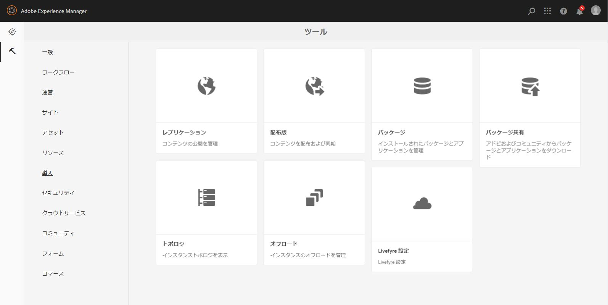

# We.Govリファレンスサイトの設定と設定{#set-up-and-configure-we-gov-reference-site}

## デモパッケージの詳細 {#demo-package-details}

### インストールの前提条件 {#installation-prerequisites}

このパッケージは **AEM Forms 6.4 OSGI Author向けに作成され、テスト済みで**、次のプラットフォームバージョンでサポートされています。

| AEMバージョン | AEM FORMSパッケージのバージョン | ステータス |
|---|---|---|
| 6.4 | 5.0.86 | **サポート対象** |
| 6.5 | 6.0.80 | **サポート対象** |

このパッケージには、次のプラットフォームバージョンをサポートするクラウド設定が含まれています。

| クラウドプロバイダー | サービスのバージョン | ステータス |
|---|---|---|
| Adobe Sign | v5 API | **サポート対象** |
| Microsoft Dynamics 365 | 1710 (9.1.0.3020) | **サポート対象** |

**パッケージのインストールに関する考慮事項：**

* パッケージは、他のデモパッケージや古いデモパッケージバージョンが含まれていない、クリーンなサーバーにインストールされる予定です
* パッケージは、作成者モードで実行されているOSGIサーバーにインストールされる必要があります

### このパッケージには何が含まれますか。 {#what-does-this-package-include}

AEM Forms We.Govデモパッケージ(**we-gov-forms.pkg.all-&lt;version>.zip**)は、他のサブパッケージやサービスを含むパッケージとして付属しています。 パッケージには、次のモジュールが含まれます。

* **we-gov-forms.pkg.all-&lt;version>.zip** — 完全なデ *モパッケージ*

   * **we-gov-forms.ui.apps-&lt;version>.zip** — すべてのコンポー *ネント、クライアントライブラリ、サンプルユーザー、ワークフローモデルなどが含まれます。*

      * **we-gov-forms.core-&lt;version>.jar** — すべてのOSGIサ *ービス、カスタムワークフロー手順の実装などを含みます。*

      * **core.wcm.components.all-2.0.4.zip** — サンプルWCMコン *ポーネントの収集*

      * **grid-aem.ui.apps-1.0-SNAPSHOT.zip** — サイトページ列制御用の *AEM Sites Gridレイアウトパッケージ*
   * **we-gov-forms.ui.content-&lt;version>.zip** — コンテ *ンツ、ページ、画像、フォーム、インタラクティブな通信アセットなどをすべて含みます。*

   * **we-gov-forms.config.public-&lt;version>.zip***— フォームデータモデルやサービスバインディングの問題を回避するために、プレースホルダクラウド設定を含むすべてのデフォルト設定ノードが含まれています。*

このパッケージに含まれるアセットは次のとおりです。

* 編集可能なテンプレートを含むAEMサイトページ
* AEM Formsアダプティブフォーム
* AEM Forms Interactive Communications(印刷およびWebチャネル)
* AEM Forms XDPレコードのドキュメント
* AEM Forms MS Dynamics Formsデータモデル
* Adobe Signの統合
* AEMワークフローモデル
* AEM Assetsサンプル画像

## 設定オプション {#configuration-options}

この節では、設定オプションの詳細について説明します。 現時点では、このセクションは意図的に空です。

## デモパッケージのインストール {#demo-package-installation}

この節では、デモパッケージのインストールについて説明します。

### From package share {#from-package-share}

1. https://&lt;aemserver>: *&lt;port>/crx/packageshare/に移動します。*

   または、AEMで「Deployment」をクリックし、「Package Share Icon」に移動します。

   

1. Adobe IDを使用してログインします。
1. we-gov-forms.pkg.all-&lt; **version>パッケージを検索して探します** 。
1. 「ダウンロード」オプションを選択し、利用条件に同意します。
1. ダウンロードが完了したら、「ダウンロード済み」オプションを選択して、パッケージマネージャーでパッケージを探します。
1. 「インストール」オプションを選択して、パッケージをインストールします。

   

1. インストールプロセスの完了を許可します。
1. https://&lt;aemserver>: *&lt;port>/content/we-gov/home.html?wcmmode=disabledに移動して、インストールが正常に完了したことを確認します* 。

### ローカルZIPファイルから {#from-a-local-zip-file}

1. we-gov-forms.pkg.all-&lt; **version>.zipファイルをダウンロードして探します** 。
1. https://&lt;aemserver>:&lt; *port>/crx/packmgr/index.jspに移動します*。
1. 「パッケージをアップロード」オプションを選択します。

   

1. ファイルブラウザーを使用して、ダウンロードしたZIPファイルに移動し、選択します。
1. 「開く」をクリックしてアップロードします。
1. アップロードが完了したら、「インストール」オプションを選択してパッケージをインストールします。

   

1. インストールプロセスの完了を許可します。
1. https://&lt;aemserver>: *&lt;port>/content/we-gov/home.html?wcmmode=disabledに移動して、インストールが正常に完了したことを確認します* 。

### 新しいパッケージバージョンのインストール {#installing-new-package-versions}

新しいパッケージバージョンをインストールするには、4.1および4.2で定義されている手順に従います。古いパッケージが既にインストールされている場合は、新しいパッケージバージョンをインストールすることもできますが、最初に古いパッケージバージョンをアンインストールすることをお勧めします。 これを行うには、次の手順に従います。

1. https://&lt;aemserver>:&lt; *port>/crx/packmgr/index.jspに移動します。*
1. 古い **we-gov-forms.pkg.all-&lt;version>.zipファイルを探します** 。
1. 「詳細」オプションを選択します。
1. ドロップダウンで[アンインストール]オプションを選択します。

   

1. 確認の上で、もう一度「アンインストール」を選択し、アンインストールプロセスの完了を許可します。

## デモパッケージの設定 {#demo-package-configuration}

この節では、プレゼンテーション前のデモパッケージのデプロイ後の設定の詳細と手順を説明します。

### 架空のユーザー設定 {#fictional-user-configuration}

1. https://&lt;aemserver>:&lt; *port>/libs/granite/security/content/groupadmin.htmlに移動します。*
1. 「**workflow**」を検索
1. 「**workflow-users**」グループを選択し、「Properties」をクリックします。
1. 「メンバー」タブに移動します。
1. 「Select User or Group **** 」フィールドにwegovと入力します。
1. 「**We.Gov Form Users**」ドロップダウンから選択します。

   

1. メニューバーの「保存して閉じる」をクリックします。
1. 手順2 ～ 7を繰り返し、「**Analytics**」を検索し、「**Analytics Administrators**」グループを選択し、「**We.Gov Form Users**」グループをメンバーとして追加します。
1. 手順2 ～ 7を繰り返し、「**forms** users **」を検索し、「** forms-power-users **」グループを選択し、「** We.Gov Form Users」グループをメンバーとして追加します。
1. 手順2 ～ 7を繰り返して、「**forms** users **」を検索し、「** forms-users **」グループを選択し、今回は「** We.Gov Users」グループをメンバーとして追加します。

### 電子メールサーバーの設定 {#email-server-configuration}

1. 設定ドキュメントの確認電子 [メール通知の設定](/help/sites-administering/notification.md)

1. Navigate to *https://&lt;aemserver>:&lt;port>/system/console/configMgr*
1. 設定する **Day CQ Mail Serviceサービスを探してクリックします** 。

   

1. 選択したSMTPサーバーに接続するサービスを設定します。

   1. **SMTP Server hostname**:例：(smtp.gmail.com)
   1. **Server Port**:例： (465) SSLを使用したgmail
   1. **SMTP User:** demo@ &lt;会社名> .com
   1. **「送信者」アドレス**:aemformsdemo@adobe.com
   

1. 「保存」をクリックして設定を保存します。

### AEM SSL設定 {#aemsslconfig}

この節では、Adobe Sign Cloudの設定を行うためのAEMインスタンスでのSSLの設定について詳しく説明します。

**参照:**

1. [デフォルトの SSL](/help/sites-administering/ssl-by-default.md)

**備考:**

1. https://&lt;aemserver>:&lt;port>/aem/inboxに移動し、上記のリファレンスドキュメントのリンクで説明されているプロセスを完了します。
1. we- **gov-forms.pkg.all-&lt;version>.zip** パッケージには、パッケージの一部である **** we-gov-forms.pkg.all-&lt;version>.zip/sslフォルダーを展開することでアクセスできるサンプルのSSLキーと証明書が含まれています。

1. SSL証明書とキーの詳細：

   1. 「CN=localhost」に発行
   1. 10年間の有効性
   1. パスワード「password」の値

### Adobe Sign cloud configuration {#adobe-sign-cloud-configuration}

この節では、Adobe Sign Cloudの設定に関する詳細と手順を説明します。

**参照:**

1. [Adobe Sign を AEM Forms に統合する](adobe-sign-integration-adaptive-forms.md)

#### Cloud configuration {#cloud-configuration}

1. **前提条件を確認します。 必要なSSL[設定については](../../forms/using/forms-install-configure-gov-reference-site.md#aemsslconfig)、「AEM SSL Configuration」を参照してください。**
1. 次の URL に移動します。

   *https://&lt;aemserver>:&lt;port>/libs/adobesign/cloudservices/adobesign.html/conf/we-gov*

   >[!NOTE]
   >
   >AEMサーバーへのアクセスに使用するURLは、設定の問題を回避するために、Adobe Sign OAuth Redirect URIで設定したURLと一致する必要があります( *https://&lt;aemserver>:&lt;port>/mnt/overlay/adobesign/cloudservices/adobesign/properties.html*)。

1. 「We.gov Adobe Sign」設定を選択します。
1. 「プロパティ」をクリックします。
1. 「設定」タブに移動します。
1. 認証URLを入力します。例：https://secure.na1.echosign.com/public/oauth 
1. 設定済みのAdobe Signインスタンスから、設定済みのクライアントIDとクライアントシークレットを指定します。
1. 「Adobe Signに接続」をクリックします。
1. 接続が完了したら、「保存して閉じる」をクリックして統合を完了します。

### MS Dynamicsクラウドの構成 {#ms-dynamics-cloud-configuration}

この節では、MS Dynamics Cloudの設定の詳細と手順を説明します。

**参照:**

1. [Microsoft Dynamics OData の設定](https://docs.adobe.com/content/help/en/experience-manager-64/forms/form-data-model/ms-dynamics-odata-configuration.html)
1. [AEM Forms用Microsoft Dynamicsの設定](https://helpx.adobe.com/experience-manager/kt/forms/using/config-dynamics-for-aem-forms.html)

#### MS Dynamics ODataクラウドサービス {#ms-dynamics-odata-cloud-service}

1. 次の URL に移動します。

   https://&lt;aemserver>:&lt;port>/libs/fd/fdm/gui/components/admin/fdmcloudservice/fdm.html/conf/we-gov

   1. MS Dynamicsアプリケーションの登録で設定されたのと同じリダイレクトURLを使用してサーバーにアクセスしていることを確認してください。

1. 「Microsoft Dynamics OData Cloud Service」設定を選択します。
1. 「プロパティ」をクリックします。

   

1. 「認証設定」タブに移動します。
1. 次の詳細を入力します。

   1. **サービスルート：** 例： https://msdynamicsserver.api.crm3.dynamics.com/api/data/v9.1/
   1. **認証の種類：** OAuth 2.0
   1. **認証設定** (この情報を収集するには  、MS Dynamicsクラウド設定を参照):

      1. クライアントID -アプリケーション ID
      1. クライアントの秘密鍵
      1. OAuth URL — 例： [https://login.windows.net/common/oauth2/authorize](https://login.windows.net/common/oauth2/authorize)
      1. トークンURLの更新 — 例： [https://login.windows.net/common/oauth2/token](https://login.windows.net/common/oauth2/token)
      1. アクセストークンURL — 例： [https://login.windows.net/common/oauth2/token](https://login.windows.net/common/oauth2/token)
      1. 認証スコープ — **openid**
      1. 認証ヘッダー — 認 **証ベアラ**
      1. リソース — 例： [https://msdynamicsserver.api.crm3.dynamics.com](https://msdynamicsserver.api.crm3.dynamics.com)
   1. 「OAuthに接続」をクリックします。

1. 認証が完了したら、「保存して閉じる」をクリックして統合を完了します。

#### MS Dynamicsクラウドの構成設定 {#dynamicsconfig}

この節で説明する手順は、MS Dynamics CloudインスタンスからクライアントID、クライアントシークレット、および詳細を見つけるのに役立ちます。

1. https://portal.azure.com/に移動し [てログイン](https://portal.azure.com/) します。
1. 左側のメニューから「All Services」を選択します。
1. 「アプリの登録」を検索または移動します。
1. 既存の申し込み登録を作成または選択します。
1. AEMクラウド設定 **で** 、OAuthクライアントIDとして使用する **アプリケーション ID** をコピーします。
1. 「設定」または「マニフェスト」をクリックして、返信URLを **設定します。**

   1. このURLは、ODataサービスを設定する際に、AEMサーバーへのアクセスに使用するURLと一致する必要があります。

1. 設定表示で、「キー」をクリックして表示で新しいキーを作成します（AEMのクライアントシークレットとして使用されます）。

   1. 後でAzureまたはAEMでキーを表示できないので、キーのコピーを保存してください。

1. リソースURL/サービスルートURLを見つけるには、MS Dynamicsインスタンスのダッシュボードに移動します。
1. 上部ナビゲーションバーで、「Sales」または独自のインスタンスタイプをクリックし、「設定を選択」をクリックします。
1. 右下の「Customizations」と「Developer Resources」をクリックします。
1. サービスルートURLは次のとおりです。例：

   *[https://msdynamicsserver.api.crm3.dynamics.com/api/data/v9.1/](https://msdynamicsserver.api.crm3.dynamics.com/api/data/v9.1/)*

1. 更新とアクセストークンURLの詳細は、次を参照してください。

   *[https://docs.microsoft.com/en-us/rest/api/datacatalog/authenticate-a-client-app](https://docs.microsoft.com/en-us/rest/api/datacatalog/authenticate-a-client-app)*

#### フォームデータモデルのテスト {#testing-the-form-data-model}

クラウドの設定が完了したら、フォームデータモデルをテストします。

1.  に移動します。

   *https://&lt;aemserver>:&lt;port>/aem/forms.html/content/dam/formsanddocuments-fdm/we-gov*

1. 「We.gov Microsoft Dynamics CRM FDM」を選択し、「プロパティ」を選択します。

   

1. 「ソースの更新」タブに移動します。
1. 「Context-Aware Configuration」が「/conf/we-gov」に設定され、設定済みのデータソースが「ms-dynamics-odata-cloud-service」であることを確認します。

   

1. フォームデータモデルを編集します。

   >[!NOTE]
   「保存して閉じる」ではな **く「キャンセル** 」をクリ **** ックし、再インストールが必要な問題を避けてください。

1. サービスをテストし、設定済みのデータソースに正しく接続できることを確認します。

   >[!NOTE]
   データソースがFDMに正常に連結されるために、AEMサーバーの再起動が必要であったと報告されています。

### Adobe Analytics 設定 {#adobe-analytics-configuration}

この節では、Adobe Analyticsクラウドの設定の詳細と手順について説明します。

**参照:**

* [Adobe Analytics との統合](../../sites-administering/adobeanalytics.md)

* [Adobe Analytics への接続とフレームワークの作成](../../sites-administering/adobeanalytics-connect.md)

* [ページ分析データの表示](../../sites-authoring/pa-using.md)

* [Analytics とレポートの設定](configure-analytics-forms-documents.md)

* [AEM Forms の分析レポートの確認方法と詳細](view-understand-aem-forms-analytics-reports.md)

### Adobe Analytics cloud service configuration {#adobe-analytics-cloud-service-configuration}

このパッケージは、Adobe Analyticsに接続するように事前に設定されています。 この設定を更新するために、次の手順が提供されます。

1. https://&lt;aemserver>:&lt; *port>/libs/cq/core/content/tools/cloudservices.htmlに移動します。*
1. 「Adobe Analytics」セクションを探し、「設定を表示」リンクを選択します。
1. 「We.Gov Adobe Analytics (Analytics Configuration)」設定を選択します。

   

1. 「編集」ボタンをクリックして、Adobe Analyticsの設定を更新します（Shared Secretを指定する必要があります）。 「Analyticsに接続」をクリックして接続し、「OK」をクリックして完了します。

   

1. フレームワーク設定を更新する場合は、同じページで「We.Gov Adobe Analytics Framework (Analytics Framework)」をクリックします(オーサリングを有効にする [AEMオーサリングの有効化](../../forms/using/forms-install-configure-gov-reference-site.md#enableauthoring) を参照)。

### Adobe Analyticsレポート {#adobe-analytics-reporting}

#### 表示のAdobe Analyticsサイトレポート {#view-adobe-analytics-sites-reporting}

1. https://&lt;aemserver>:&lt; *port>/sites.html/contentに移動します。*
1. 「AEM Forms Web.Govサイト」を選択して、サイトページを表示します。
1. サイトページ（例：ホーム）の1つを選択し、「Analytics &amp; Recommendations」を選択します。

   

1. このページには、AEMサイトページに関連してAdobe Analyticsから取得した情報が表示されます(注意：設計により、この情報は定期的にAdobe Analyticsから更新され、リアルタイムでは表示されません)。

   

1. ページ表示ページ（手順3.でアクセス）に戻ると、「リスト表示」の表示項目の表示設定を変更して、ページ表示情報を表示することもできます。
1. [表示]ドロップダウンメニューを見つけ、[リスト表示]を選択します。

   

1. 同じメニューから「表示設定」を選択し、「Analytics」セクションから表示する列を選択します。

   

1. 「更新」をクリックして、新しい列を利用可能にします。

   

#### 表示のAdobe Analyticsフォームレポート {#view-adobe-analytics-forms-reporting}

1.  に移動します。

   *https://&lt;aemserver>:&lt;port>/aem/forms.html/content/dam/formsanddocuments/adobe-gov-forms*

1. 「Enrollment Application For Health Benefits」アダプティブフォームを選択し、「Analytics Report」オプションを選択します。

   

1. ページが読み込まれるのを待ち、Analyticsレポートの表示を行います。

   

#### 表示Adobe Analyticsレポート {#view-adobe-analytics-reporting}

必要に応じて、Adobe Analyticsに直接移動して、解析データを表示できます。

1. https://my.omniture.com/login/に移動し [ます。](https://my.omniture.com/login/)
1. 資格情報を使用してログインします。

   1. **会社:** AEM Formsデモ
   1. **ユーザー：** &lt;ご要望に応じて利用可能>
   1. **パスワード：** &lt;ご要望に応じて利用可能>

1. レポートスイートから「We.Govリファレンスサイト」を選択します。

   

1. 使用可能なレポートの1つを選択して、そのレポートの分析データを表示します。

   

## デモパッケージのカスタマイズ {#demo-package-customizations}

この節では、デモのカスタマイズ手順を説明します。

### AEMオーサリングの有効化 {#enableauthoring}

このデモパッケージには、OSGIサービス設定ファイルが含まれています。このファイルは、ターゲット作成者サーバー上のWCM Filterサービスの動作を制御します。 この設定により、デモを許可するために、サーバーは無効な作成者モード（?wcmmode=disabledと同じ）で動作します。 この設定を更新し、オーサリングを有効にするには、次の手順を実行します。

1. Navigate to *https://&lt;aemserver>:&lt;port>/system/console/configMgr*
1. 設定する **Day CQ WCM Filter** Serviceを探してクリックします。

   

1. 「**WCM Mode**」の値を「**Edit**」に設定します。
1. Click “**Save**” to apply the configuration.

### テンプレートのカスタマイズ {#templates-customization}

編集可能なテンプレートは、次の場所にあります。

*https://&lt;aemserver>:&lt;port>/libs/wcm/core/content/sites/templates.html/conf/we-gov*

これらのテンプレートには、AEMサイト、アダプティブフォーム、およびインタラクティブコミュニケーションの各テンプレートが含まれ、以下のURLにあるコンポーネントを使用して作成およびアセンブリされます。

*https://&lt;aemserver>:&lt;port>/crx/de/index.jsp#/apps/we-gov/components*

#### Style system {#customizetemplates}

また、このサイトにはクライアントライブラリも含まれ、その1つがBootstrap 4 ( [https://getbootstrap.com/](https://getbootstrap.com/) )を読み込みます。 このクライアントライブラリは、

*https://&lt;aemserver>:&lt;port>/crx/de/index.jsp#/apps/we-gov/clientlibs/clientlib-base/css/bootstrap*

このパッケージに含まれる編集可能なテンプレートは、ページネーションやスタイル設定などにBootstrap 4 CSSクラスを使用するテンプレート/ページポリシーにあらかじめ設定されています。 テンプレートポリシーに追加されていないクラスもありますが、Bootstrap 4でサポートされているクラスはすべてポリシーに追加できます。 使用可能なクラスのリストについては、「はじめに」ページを参照してください。

[https://getbootstrap.com/docs/4.1/getting-started/introduction/](https://getbootstrap.com/docs/4.1/getting-started/introduction/)

このパッケージに含まれるテンプレートは、次のスタイルシステムもサポートします。

[スタイルシステム](../../sites-authoring/style-system.md)

#### テンプレートロゴ {#template-logos}

プロジェクトDAMアセットには、We.Govのロゴや画像も含まれます。 これらのアセットは、次の場所で使用できます。

*https://&lt;aemserver>:&lt;port>/assets.html/content/dam/we-gov*

ページおよびフォームテンプレートの編集時に、ナビゲーションとフッターのコンポーネントを編集してブランドロゴを更新することもできます。 次のコンポーネントオファーは、ロゴの更新に使用できる設定可能なブランドやロゴのダイアログです。

詳しくは、「ページコンテンツの編集」を参照してください。

[ページのコンテンツの編集](../../sites-authoring/editing-content.md)

### サイトページのカスタマイズ {#sites-pages-customization}

すべてのサイトページは次の場所から利用できます。 *https://&lt;aemserver>:&lt;port>/sites.html/content/we-gov*

これらのサイトページでは、AEM Gridパッケージを使用して、いくつかのコンポーネントのレイアウトを制御します。

#### Style system {#style-system}

このパッケージに含まれるページは、次のスタイルシステムもサポートします。

[スタイルシステム](../../sites-authoring/style-system.md)

また、サポートされているスタイルに関するドキ [ュメントについては](../../forms/using/forms-install-configure-gov-reference-site.md#customizetemplates) 、「テンプレートのカスタマイズスタイルシステム」を参照してください。

### アダプティブフォームのカスタマイズ {#adaptive-forms-customization}

すべてのアダプティブフォームは、次の場所から利用できます。

*https://&lt;aemserver>:&lt;port>/aem/forms.html/content/dam/formsanddocuments/adobe-gov-forms*

これらのフォームは、特定の使用例に合わせてカスタマイズできます。 フォームが引き続き正しく機能するように、特定のフィールドと送信ロジックを変更しないでください。 これには以下が含まれます。

**健康保険の加入申込：**

* contact_id — 送信時にMS Dynamicsの連絡先IDを受け取るために使用される非表示フィールド
* 送信 — コールバックをサポートするために、送信ボタンのロジックをカスタマイズする必要がありました。 カスタマイズはドキュメントに記載されていますが、フォームデータモデルを介してPOST操作とGET操作の両方をMS Dynamicsに対して実行する際に、フォームを送信するために大きなスクリプトが必要でした。
* ルートパネル — 初期化イベントは、AEM Inbox GraniteのすべてのUIコンポーネントを変更できないので、できるだけ簡単にAEM InboxにMS Dynamicsボタンを追加するために使用されます。

#### アダプティブフォームのスタイル設定 {#adaptive-form-styling}

アダプティブフォームは、スタイルエディターまたはテーマエディターを使用してスタイルを設定することもできます。

* [アダプティブフォームコンポーネントのインラインスタイリング](inline-style-adaptive-forms.md)
* [テーマを作成して使用する](themes.md)

### ワークフローのカスタマイズ {#workflow-customization}

登録アダプティブフォームは、処理のためにOSGIワークフローに送信されます。 このワークフローは、https://&lt;aemserver>:&lt; *port>/conf/we-gov/settings/models/we-gov-process.htmlにあります*。

特定の制限により、このワークフローにはいくつかのスクリプトとカスタムOSGIワークフロープロセスステップが含まれています。 これらのワークフロー手順は、一般的な手順として作成され、設定ダイアログでは作成されていません。 現時点では、ワークフロー手順の設定はプロセスの引数に依存します。

すべてのワークフロー手順のJavaコードは、 **we-gov-forms.core-&lt;version>.jarバンドルに含まれています** 。

## デモに関する考慮事項と既知の問題 {#demo-considerations-and-known-issues}

この節では、デモの機能と、デモの過程で特別な考慮が必要となる可能性のある設計上の意思決定に関する情報を説明します。

### デモに関する考慮事項 {#demo-considerations}

* AGRS-159の場合と同様に、登録アダプティブフォームで使用される連絡先の名前（最初、中間、最後）が一意であることを確認します。
* 登録アダプティブフォームは、フォームの電子メールフィールドで指定された電子メールにAdobe Sign電子メールを送信します。 その電子メールアドレスを、Adobe Signクラウド設定の設定に使用した電子メールと同じ電子メールアドレスにすることはできません。
* デフォルトでは、デモをホストするターゲットサーバーの全体的な動作を制御するOSGIサービス設定がデモパッケージに含まれています。 これらの設定には、WCM Filterサービスの設定が含まれます。この設定により、サーバーはデフォルトで無効な作成者 **モード** （?wcmmode=disabledと同じ）で動作します。 AEMオーサリング [を有効にして](../../forms/using/forms-install-configure-gov-reference-site.md#enableauthoring) 、ページオーサリングを許可するを参照してください。

### 既知の問題 {#known-issues}

* (AGRS-120)サイトナビゲーションコンポーネントは、現在、2レベルを超える深さの入れ子ページをサポートしていません。
* (AGRS-159)現在のMS Dynamics FDMは、最初に登録アダプティブフォームのデータをDynamicsにPOSTし、次に連絡先IDを取得するためにユーザーレコードを取得する2つの操作を実行する必要があります。 現在の状態では、同じ名前を持つ3人以上のユーザーがDynamicsに存在し、登録アダプティブフォームの送信が許可されない場合、連絡先IDの取得は失敗します。

## 次の手順 {#next-steps}

これで、We.Govリファレンスサイトを調査する準備が整いました。 We.Govリファレンスサイトのワークフローと手順について詳しくは、 [We.Govリファレンスサイトのチュートリアルを参照してください](../../forms/using/forms-gov-reference-site-user-demo.md)。
