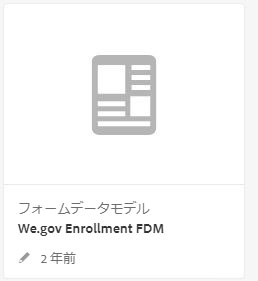
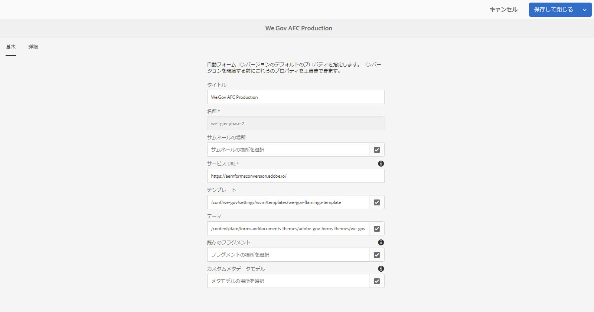

# Web.Govリファレンスサイトのセットアップと設定 {#set-up-and-configure-we-gov-reference-site}

## デモパッケージの詳細 {#demo-package-details}

### インストールの前提条件 {#installation-prerequisites}

このパッケージは **AEM Forms6.4 OSGI Author**&#x200B;向けに作成され、テスト済みであるため、次のプラットフォームバージョンでサポートされています。

| AEMバージョン | AEM FORMSパッケージ版 | ステータス |
|---|---|---|
| 6.4 | 5.0.86 | **サポート対象** |
| 6.5 | 6.0.80 | **サポート対象** |
| 6.5.3 | 6.0.122 | **サポート対象** |

このパッケージには、次のプラットフォームバージョンをサポートするクラウド設定が含まれています。

| クラウドプロバイダー | サービスのバージョン | ステータス |
|---|---|---|
| Adobe Sign | v5 API | **サポート対象** |
| Microsoft Dynamics 365 | 1710 (9.1.0.3020) | **サポート対象** |
| Adobe Analytics | v1.4 Rest API | **サポート対象** |
**パッケージのインストールに関する考慮事項：**

* パッケージは、クリーンサーバーにインストールされ、他のデモパッケージや古いデモパッケージバージョンが含まれていないことが想定されます。
* パッケージはOSGIサーバーにインストールされ、作成者モードで実行されている必要があります

### このパッケージに含まれる内容 {#what-does-this-package-include}

[AEM FormsWe.Govデモパッケージ](https://experience.adobe.com/#/downloads/content/software-distribution/en/aem.html?package=/content/software-distribution/en/details.html/content/dam/aem/public/adobe/packages/cq650/featurepack/we-gov-forms.pkg.all-2.0.2.zip) (**we-gov-forms.pkg.all-&lt;version>.zip**)は、他のサブパッケージやサービスを含むパッケージとして提供されます。 パッケージには次のモジュールが含まれています。

* **we-gov-forms.pkg.all-&lt;version>.zip** - *完全なデモパッケージ*

   * **we-gov-forms.ui.apps-&lt;version>.zip***— すべてのコンポーネント、クライアントライブラリ、サンプルユーザー、ワークフローモデルなどが含まれます。*

      * **we-gov-forms.core-&lt;version>.jar** — すべてのOSGIサービス、カスタムワークフロー手順の実装など *を含みます。*

      * **we-gov-forms.derby&lt;version>.jar** — すべてのOSGIサービス、データベーススキーマなどを *含みます。*

      * **core.wcm.components.all-2.0.4.zip** — サンプルWCMコンポーネントの *収集*

      * **grid-aem.ui.apps-1.0-SNAPSHOT.zip** — サイトページ列管理用 *AEM Sitesグリッドレイアウトパッケージ*
   * **we-gov-forms.ui.content-&lt;version>.zip** — コンテンツ、ページ、画像、フォーム、インタラクティブな通信アセットなどをすべて *含みます。*

   * **we-gov-forms.ui.analytics-&lt;version>.zip** — リポジトリ内に格納されるすべてのWeb.GovForms分析データを *含みます。*

   * **we-gov-forms.config.public-&lt;version>.zip** — フォームデータモデルやサービスバインディングの問題を回避するために、プレースホルダークラウドの設定を含むすべてのデフォルト設定ノードを *含みます。*

このパッケージに含まれるアセットは次のとおりです。

* 編集可能なテンプレートを含むAEMサイトページ
* AEM Forms適応Forms
* AEM Forms・インタラクティブ・コミュニケーション(印刷およびWebチャネル)
* AEM FormsXDPレコードドキュメント
* AEM FormsMSダイナミクスFormsデータモデル
* Adobe Sign統合
* AEMワークフローモデル
* AEM Assetsサンプル画像
* Apache Derbyデータベースのサンプル（メモリ内）
* Apache Derbyデータソース（フォームデータモデルで使用）

## デモパッケージのインストール {#demo-package-installation}

この節では、デモパッケージのインストールについて説明します。

### ソフトウェア配布から {#from-software-distribution}

1. Open [Software Distribution](https://experience.adobe.com/downloads). ソフトウェアディストリビューションにログインするには、Adobe ID が必要です。
1. Tap **[!UICONTROL Adobe Experience Manager]** available in the header menu.
1. 「**[!UICONTROL フィルター]**」セクションで、
   1. 「**[!UICONTROL ソリューション]**」ドロップダウンリストから「**[!UICONTROL Forms]**」を選択します。
   2. パッケージのバージョンとタイプを選択します。 You can also use the **[!UICONTROL Search Downloads]** option to filter the results.
1. パッケージ名 **we-gov-forms.pkg.all-&lt;version>.zipをタップし、「EULA条件に** 同意する **[!UICONTROL 」を選択して、「]**&#x200B;ダウンロード ****」をタップします。
1. Open [Package Manager](https://docs.adobe.com/content/help/ja-JP/experience-manager-65/administering/contentmanagement/package-manager.html)  and click **[!UICONTROL Upload Package]** to upload the package.
1. Select the package and click **[!UICONTROL Install]**.

   

1. インストールプロセスを完了できるようにします。
1. https://&lt;aemserver>:&lt;port>/content/we-gov/home.html ** ?wcmmode=disabledに移動して、インストールが正常に完了したことを確認します。

### ローカルZIPファイルから {#from-a-local-zip-file}

1. we-gov-forms.pkg. **all-&lt;version>.zip** ファイルをダウンロードして探します。
1. https://&lt;aemserver>:&lt;port>/crx/packmgr/index.jsp *に移動します*。
1. 「パッケージをアップロード」オプションを選択します。

   

1. ファイルブラウザーを使用して、ダウンロードしたZIPファイルに移動し、選択します。
1. 「開く」をクリックしてアップロードします。
1. アップロードが完了したら、「インストール」オプションを選択してパッケージをインストールします。

   

1. インストールプロセスを完了できるようにします。
1. https://&lt;aemserver>:&lt;port>/content/we-gov/home.html ** ?wcmmode=disabledに移動して、インストールが正常に完了したことを確認します。

### 新しいパッケージバージョンのインストール {#installing-new-package-versions}

新しいパッケージバージョンをインストールするには、4.1および4.2で定義されている手順に従います。新しいパッケージバージョンをインストールし、別の古いパッケージを既にインストールすることは可能ですが、最初に古いパッケージバージョンをアンインストールすることをお勧めします。 これを行うには、次の手順に従います。

1. https://&lt;aemserver>:&lt;port>/crx/packmgr/index.jspに移動し *ます。*
1. 古い **we-gov-forms.pkg.all-&lt;version>.zip** ファイルを探します。
1. 「詳細」オプションを選択します。
1. ドロップダウンで[アンインストール]オプションを選択します。

   

1. 確認の上で、もう一度「Uninstall」（アンインストール）を選択し、アンインストールプロセスを完了させます。

## デモパッケージの設定 {#demo-package-configuration}

この節では、プレゼンテーション前のデモパッケージのデプロイメント完了後の設定の詳細と手順について説明します。

### 架空のユーザー設定 {#fictional-user-configuration}

1. https://&lt;aemserver>:&lt;port>/libs/granite/security/content/groupadmin.htmlに移動し *ます。*
1. 以下のタスクを実行するには、管理者としてログインします。
1. ページの最後まで下にスクロールすると、すべてのユーザーグループが読み込まれます。
1. 「**workflow**」を検索します。
1. 「**workflow-users**」グループを選択し、「Properties」をクリックします。
1. 「メンバー」タブに移動します。
1. 「Select User or Group **」フィールドに** wegovと入力します。
1. [**We.GovFormsユーザ**]ドロップダウンから選択します。

   

1. メニューバーの「保存して閉じる」をクリックします。
1. 手順2 ～ 7を繰り返して、「**Analytics**」を検索し、「**Analytics Administrators**」グループを選択して、「**We.GovFormsユーザー**」グループをメンバーとして追加します。
1. 手順2 ～ 7を繰り返して、「**forms users**」を検索し、「**forms-power-users**」グループを選択し、「**We.GovFormsユーザー**」グループをメンバーとして追加します。
1. 手順2 ～ 7を繰り返して、「**forms-users**」を検索し、「**forms-users**」グループを選択して、次に「**We.Gov Users**」グループをメンバーとして追加します。

### 電子メールサーバーの設定 {#email-server-configuration}

1. 設定ドキュメントの確認電子メール通知 [の設定](/help/sites-administering/notification.md)
1. このタスクを実行するには、管理者としてログインします。
1. Navigate to *https://&lt;aemserver>:&lt;port>/system/console/configMgr*
1. 設定する **Day CQ Mail Service** サービスを探してクリックします。

   

1. 任意のSMTPサーバーに接続するようにサービスを設定します。

   1. **SMTP Server hostname**:例：(smtp.gmail.com)
   1. **サーバーポート**:例：SSLを使用したgmailの場合は(465)
   1. **SMTP User:** demo@ &lt;会社名> .com
   1. **&quot;送信者&quot;アドレス**:aemformsdemo@adobe.com

   

1. 「保存」をクリックして設定を保存します。

### （オプション）AEM SSL設定 {#aemsslconfig}

この節では、Adobe Signクラウドの設定を行うためのAEMインスタンスでのSSLの設定について詳しく説明します。

**参照:**

1. [デフォルトの SSL](/help/sites-administering/ssl-by-default.md)

**備考:**

1. https://&lt;aemserver>:&lt;port>/aem/inboxに移動します。ここで、前述の「ドキュメントの参照」リンクで説明されているプロセスを完了できます。
1. この `we-gov-forms.pkg.all-[version].zip` パッケージには、サンプルのSSLキーと証明書が含まれており、この証明書はパッケージの一部である `we-gov-forms.pkg.all-[version].zip/ssl` フォルダーを展開することでアクセスできます。

1. SSL証明書とキーの詳細：

   1. &quot;CN=localhost&quot;に発行される
   1. 10年間の有効性
   1. password「password」のパスワード値
1. 秘密鍵は *localhostprivate.derです*。
1. 証明書は *localhost.crt*。
1. 「次へ」をクリックします。
1. HTTPSホスト名は、 *localhostに設定する必要があります*。
1. ポートは、システムが公開したポートに設定する必要があります。

### (Optional) Adobe Sign cloud configuration {#adobe-sign-cloud-configuration}

この節では、Adobe Signクラウドの設定の詳細と手順について説明します。

**参照:**

1. [Adobe Sign を AEM Forms に統合する](adobe-sign-integration-adaptive-forms.md)

#### Cloud configuration {#cloud-configuration}

1. 前提条件を確認します。 必要なSSL設定については、 [AEM SSL Configuration](../../forms/using/forms-install-configure-gov-reference-site.md#aemsslconfig) （ SSL設定）を参照してください。
1. 次の URL に移動します。

   *https://&lt;aemserver>:&lt;port>/libs/adobesign/cloudservices/adobesign.html/conf/we-gov*

   >[!NOTE]
   >
   >AEMサーバーへのアクセスに使用するURLは、Adobe SignのOAuthリダイレクトURIに設定されたURLと一致し、設定上の問題を回避する必要があります(例： *https://&lt;aemserver>:&lt;port>/mnt/overlay/adobesign/cloudservices/adobesign/properties.html*)。

1. 「We.govAdobe Sign」設定を選択します。
1. 「プロパティ」をクリックします。
1. 「設定」タブに移動します。
1. 認証URLを入力します。例： [https://secure.na1.echosign.com/public/oauth](https://secure.na1.echosign.com/public/oauth)
1. 設定済みのAdobe Signインスタンスから、設定済みのクライアントIDとクライアントシークレットを指定します。
1. [Adobe Signに接続]をクリックします。
1. 接続が完了したら、「保存して閉じる」をクリックして統合を完了します。

### （オプション） MS Dynamicsクラウドの構成 {#ms-dynamics-cloud-configuration}

この節では、MS Dynamics Cloudの構成の詳細と手順を説明します。

**参照:**

1. [Microsoft Dynamics OData の設定](https://docs.adobe.com/content/help/en/experience-manager-64/forms/form-data-model/ms-dynamics-odata-configuration.html)
1. [Microsoft Dynamics forAEM Formsの構成](https://helpx.adobe.com/experience-manager/kt/forms/using/config-dynamics-for-aem-forms.html)

#### MS Dynamics ODataクラウドサービス {#ms-dynamics-odata-cloud-service}

1. 次の URL に移動します。

   https://&lt;aemserver>:&lt;port>/libs/fd/fdm/gui/components/admin/fdmcloudservice/fdm.html/conf/we-gov

   1. MS Dynamicsアプリケーション登録で構成されたのと同じリダイレクトURLを使用してサーバーにアクセスしていることを確認してください。

1. &quot;Microsoft Dynamics ODataCloud Service&quot;構成を選択します。
1. 「プロパティ」をクリックします。

   

1. 「認証の設定」タブに移動します。
1. 次の詳細を入力します。

   1. **サービスルート：** 例： https://msdynamicsserver.api.crm3.dynamics.com/api/data/v9.1/
   1. **認証の種類：** OAuth 2.0
   1. **認証設定** (この情報を収集するには、 [MS Dynamicsクラウドの構成設定](../../forms/using/forms-install-configure-gov-reference-site.md#dynamicsconfig) を参照してください):

      1. クライアントID -アプリケーション IDとも呼ばれる
      1. クライアントの秘密鍵
      1. OAuth URL — 例： [https://login.windows.net/common/oauth2/authorize](https://login.windows.net/common/oauth2/authorize)
      1. 更新トークンURL — 例： [https://login.windows.net/common/oauth2/token](https://login.windows.net/common/oauth2/token)
      1. アクセストークンURL — 例： [https://login.windows.net/common/oauth2/token](https://login.windows.net/common/oauth2/token)
      1. 承認スコープ — **openid**
      1. 認証ヘッダー — **承認ベアラー**
      1. リソース — 例： [https://msdynamicsserver.api.crm3.dynamics.com](https://msdynamicsserver.api.crm3.dynamics.com)
   1. 「OAuthに接続」をクリックします。

1. 認証が成功したら、「保存して閉じる」をクリックして統合を完了します。

#### MS Dynamicsクラウド構成設定 {#dynamicsconfig}

この節で説明する手順は、MS Dynamics CloudインスタンスからクライアントID、クライアントシークレット、および詳細を見つけるのに役立ちます。

1. https://portal.azure.com/に移動し [てログインします](https://portal.azure.com/) 。
1. 左側のメニューから「All Services」を選択します。
1. 「アプリの登録」を検索または移動します。
1. 既存の申込み登録を作成または選択します。
1. AEMクラウド設定でOAuth **Client Id** (OAuth **クライアントID** )として使用するアプリケーション IDをコピーします
1. 「設定」または「マニフェスト」をクリックして、 **返信URLを設定します。**

   1. このURLは、ODataサービスを設定する際に、AEMサーバーへのアクセスに使用されるURLと一致する必要があります。

1. 設定表示で、「キー」をクリックして表示が新しいキーを作成します(これはAEMのクライアントシークレットとして使用されます)。

   1. 後でAzureまたはAEMで表示できないので、キーのコピーを保存してください。

1. リソースURL/サービスルートURLを見つけるには、MS Dynamicsインスタンスダッシュボードに移動します。
1. 上部ナビゲーションバーで、「Sales」をクリックするか、独自のインスタンスタイプをクリックし、「Select Settings」をクリックします。
1. 右下の「カスタマイズ」と「開発者向けリソース」をクリックします。
1. サービスルートURLは次のとおりです。例：

   *[https://msdynamicsserver.api.crm3.dynamics.com/api/data/v9.1/](https://msdynamicsserver.api.crm3.dynamics.com/api/data/v9.1/)*

1. 更新とアクセストークンURLの詳細は、次を参照してください。

   *[https://docs.microsoft.com/en-us/rest/api/datacatalog/authenticate-a-client-app](https://docs.microsoft.com/en-us/rest/api/datacatalog/authenticate-a-client-app)*

#### Formsデータモデル(Dynamics)のテスト {#testing-the-form-data-model}

クラウドの設定が完了したら、フォームデータモデルをテストする必要があります。

1.  に移動します。

   *https://&lt;aemserver>:&lt;port>/aem/forms.html/content/dam/formsanddocuments-fdm/we-gov*

1. 「Web.gov Microsoft Dynamics CRM FDM」を選択し、「プロパティ」を選択します。

   

1. 「ソースを更新」タブに移動します。
1. 「Context-Aware Configuration」が「/conf/we-gov」に設定され、設定済みのデータソースが「ms-dynamics-odata-cloud-service」であることを確認します。

   

1. フォームデータモデルを編集します。

1. サービスをテストし、設定済みのデータソースに正常に接続できることを確認します。

   >[!NOTE]
   サービスをテストした後、「 **キャンセル** 」をクリックして、意図しない変更がフォームデータモデルに反映されないことを確認します。

   >[!NOTE]
   データ・ソースがFDMに正常にバインドするには、AEMサーバーの再起動が必要であったと報告されています。

#### Formsデータモデルのテスト(Derby) {#test-fdm-derby}

クラウドの設定が完了したら、formsデータモデルをテストすることができます。

1. https://&lt;aemserver>:&lt;port>/aem/forms.html/content/dam/formsanddocuments-fdm/we-govに移動します。 **

1. 「 **Web.gov Enrollment FDM** 」を選択し、「 **プロパティ**」を選択します。

   

1. 「ソースの **更新** 」タブに移動します。

1. 「 **Context-Aware Configuration** 」がに設定され `/conf/we-gov` ていて、設定済みのデータソースが **We.Gov Derby DS**」であることを確認します。

   

1. Click on **Save and Close**.

1. [サービスをテストし](work-with-form-data-model.md#test-data-model-objects-and-services) 、設定済みのデータソースに正常に接続できることを確認します

   * 接続をテストするには、 **HOMEMORTGAGEACCOUNTを選択し** 、getサービスを提供します。 サービスおよびシステム管理者は、取得中のデータを確認できます。

### Adobe Analytics設定（オプション） {#adobe-analytics-configuration}

この節では、Adobe Analytics Cloud設定の詳細と説明を説明します。

**参照:**

* [Adobe Analytics との統合](../../sites-administering/adobeanalytics.md)

* [Adobe Analytics への接続とフレームワークの作成](../../sites-administering/adobeanalytics-connect.md)

* [ページ分析データの表示](../../sites-authoring/pa-using.md)

* [Analytics とレポートの設定](configure-analytics-forms-documents.md)

* [AEM Forms の分析レポートの確認方法と詳細](view-understand-aem-forms-analytics-reports.md)

### Adobe Analytics cloud service configuration {#adobe-analytics-cloud-service-configuration}

このパッケージは、Adobe Analyticsに接続するように事前に設定されています。 この設定を更新するために、次の手順を実行します。

1. https://&lt;aemserver>:&lt;port>/libs/cq/core/content/tools/cloudservices.htmlに移動し *ます。*
1. 「Adobe Analytics」セクションを探し、「設定を表示」リンクを選択します。
1. 「We.GovAdobe Analytics（Analytics設定）」設定を選択します。

   

1. 「Edit」ボタンをクリックして、Adobe Analytics設定を更新します（Shared Secretを指定する必要があります）。 「Analyticsに接続」をクリックして接続し、「OK」をクリックして完了します。

   

1. フレームワーク設定を更新する場合は、同じページで「Web.GovAdobe Analyticsフレームワーク（Analyticsフレームワーク）」をクリックします(オーサリングを有効にするには、AEMオーサリングを [有効にする](../../forms/using/forms-install-configure-gov-reference-site.md#enableauthoring) を参照)。

#### Adobe Analyticsユーザ資格情報の検索 {#analytics-locating-user-credentials}

Adobe Analyticsアカウントのユーザー資格情報を見つけるには、アカウント管理者が次のタスクを実行する必要があります。

1. Adobe Experience Cloudポータルに移動します。
   * 管理者の資格情報を使用してログインします
1. メインダッシュボードでAdobe Analyticsアイコンを選択します。
   
1. 「管理者」タブに移動し、「ユーザー管理（レガシー）」項目を選択します
   
1. Select the **Users** tab.
   
1. ユーザーのリストから目的のユーザーを選択します。
1. ページの下部までスクロールすると、ユーザー認証情報がページの下部に表示されます。
   
1. ユーザー名と共有暗号鍵の情報は、権限ボックスの右側に表示されます。
1. ユーザ名には名前の中にコロンが含まれることに注意してください。コロンの左にある情報はすべてユーザ名で、コロンの右にある情報はすべて会社名です。
   * 次に例を示します。 *username :会社名*

#### Adobe Analyticsでのユーザー認証の設定 {#setup-user-authentication}

管理者は、次の操作を実行して、ユーザーにAEM Analyticsの権限を与えることができます。

1. Adobe Admin Consoleに移動します。

1. 管理コンソールに表示されるAnalyticsインスタンスをクリックします。

   * これは、管理ページのメインページにあります。

1. 「Analyticsフル管理者アクセス」を選択します。

1. プロファイル追加のユーザー。

   

1. ユーザーIDがプロファイルにマップされたら、「権限」タブをクリックします。

1. すべての権限がプロファイルにマップされていることを確認します。

   

1. ユーザーのログイン機能に対して権限がマッピングされると、数時間かかる場合があります。

### Adobe Analyticsレポート {#adobe-analytics-reporting}

#### 表示Adobe Analyticsサイトレポート {#view-adobe-analytics-sites-reporting}

>[!NOTE]
AEM Forms解析データは、オフライン時に使用できます。また、パッケージがインストールされている場合は、Adobe Analyticsクラウド設定なしで使用できますが、AEM Sitesデータにはアクティブなクラウド設定が必要です。 `we-gov-forms.ui.analytics-<version>.zip`

1. https://&lt;aemserver>:&lt;port>/sites.html/ *contentに移動します。*
1. 「AEM FormsWe.Govサイト」を選択して、サイトページを表示します。
1. サイトページ（ホームなど）の1つを選択し、「Analytics &amp;Recommendations」を選択します。

   

1. このページには、AEM Sites・ページに関連するAdobe Analyticsから取得した情報が表示されます(注意：設計上、この情報はAdobe Analyticsから定期的に更新され、リアルタイムでは表示されません)。

   

1. ページ表示ページ（手順3.でアクセス）に戻ると、「リスト表示」の表示項目の表示設定を変更して、ページ表示情報を表示することもできます。
1. [表示]ドロップダウンメニューを見つけ、[リスト表示]を選択します。

   

1. 同じメニューで「表示設定」を選択し、「Analytics」セクションから表示する列を選択します。

   

1. 「更新」をクリックして、新しい列を利用可能にします。

   

#### 表示Adobe Analyticsフォームズレポート {#view-adobe-analytics-forms-reporting}

>[!NOTE]
AEM Forms解析データは、オフライン時に使用できます。また、パッケージがインストールされている場合は、Adobe Analyticsクラウド設定なしで使用できますが、AEM Sitesデータにはアクティブなクラウド設定が必要です。 `we-gov-forms.ui.analytics-<version>.zip`

1.  に移動します。

   *https://&lt;aemserver>:&lt;port>/aem/forms.html/content/dam/formsanddocuments/adobe-gov-forms*

1. 「Enrollment Application For Health Benefits」アダプティブフォームを選択し、「Analytics Report」オプションを選択します。

   

1. ページが読み込まれるのを待ち、Analyticsレポートデータを表示します。

   

### Adobe自動Forms構成有効化 {#automated-forms-enablement}

AdobeFormsとの間でAEM Formsのインストールと設定を行うには、コンバージョンツールのユーザは次の作業を行う必要があります。

1. AdobeIOへのアクセス。

1. AdobeFormsコンバージョンサービスとの統合を作成する権限です。

1. AdobeAEM 6.5の最新のサービスパックは、作成者として実行されています。

詳細な手順を読む前に、次の点を確認してください。

* [自動フォーム変換サービスの設定](https://docs.adobe.com/content/help/en/aem-forms-automated-conversion-service/using/configure-service.html)

#### IMS設定の作成パート1 {#creating-ims-config}

フォーム変換ツールと正しく通信するようにサービスを設定するには、ユーザーがAdobeI/Oに登録できるように、Identity Managementシステム(IMS)サービスを設定する必要があります。

1. https://&lt;aemserver>:&lt;port>に移動し、左上の「AdobeExperienceManager」をクリックして、ツール/セキュリティ/AdobeIMS設定を選択します。

1. 「作成」をクリックします。

1. 下の画像のアクションを実行します。

   

1. 証明書は必ずダウンロードしてください。

1. 構成の残りの部分に進まないでください。「AdobeI/Oでの統合の [作成」の節を確認してください。](#create-integration-adobeio)

>[!NOTE]
このセクションで作成された証明書は、AdobeI/Oで統合サービスを作成する際に使用されます。統合サービスでユーザーが作成されたら、AdobeI/Oからの情報を使用して構成を完了できます。

#### AdobeI/Oでの統合の作成 {#create-integration-adobeio}

統合を作成するには、Adobe管理者に問い合わせない場合は、システムドメイン内で統合を作成できる権限があることを確認してください。

1. [ [AdobeI/Oコンソール](https://console.adobe.io/)]に移動します。

1. 「統合を作成」をクリックします。

1. 「APIへのアクセス」を選択します。

1. 正しいグループ(右上のドロップダウンリスト)に属していることを確認します。

1. 「Experience Cloud」セクションで、「Formsコンバージョンツール」を選択します。

1. 「続行」をクリックします。

1. 統合の名前と説明を入力します。

1. セクション2.1の公開鍵を使用すると、鍵の統合内に配置されます。

1. 自動フォーム変換のプロファイルを選択します。

   

#### IMS設定の作成パート2 {#create-ims-config-part-next}

これで、統合を作成したので、IMS設定のインストールを完了できます。

1. AdobeI/O内の統合をクリックして、接続の詳細を表示します。

1. AEM内でIMS設定に移動します（ツール/セキュリティ/IMS）。

1. IMS設定画面で「次へ」をクリックします。

1. 認証サーバー（スクリーンショットに表示されている値）を入力します。

1. APIキーを入力します。

1. クライアントシークレットを入力します(表示するには、AdobeI/Oの[Integration]上の[Expose]をクリックする必要があります)。

1. AdobeI/Oの「JWT」タブをクリックして、JWTペイロードを取得し、IMS設定のペイロードに貼り付けます。

   

1. 作成したIMS設定をクリックして「ヘルスチェック」を選択すると、次の結果が表示されます。

   

#### クラウドの設定（Web.Gov AFC実稼働環境） {#configure-cloud-configuration}

IMSの設定が完了したら、AEMでクラウドの設定を確認します。 設定が存在しない場合は、次の手順を実行してAEMでクラウド設定を作成します。

1. ブラウザーを開き、システムURL https://&lt;domain_name>:&lt;system_port>に移動します。

1. 画面の左上隅にあるAdobe Experience Manager/ツール/Cloud Services/Forms会話の自動設定をクリックします。

1. 設定を配置する設定フォルダを選択します。

1. 「作成」をクリックします。

1. 下のスクリーンショットに情報を入力してください。

   

1. 設定にタイトルと名前を指定します。

1. システムのサービスURLは、https://aemformsconversion.adobe.io/に設定されます。

1. テンプレートURL */conf/we-gov/settings/wcm/templates/we-gov-flamingo-template*.

1. テーマURL: */content/dam/formsanddocuments-themes/adobe-gov-forms-theme/we-gov-theme*

1. 「次へ」をクリックします。

1. この設定では、2つのチェックボックスの値を空のままにしました。

   * これらのオプションについて詳しくは、「クラウドサービスの [設定](https://docs.adobe.com/content/help/en/aem-forms-automated-conversion-service/using/configure-service.html#configure-the-cloud-service)」を参照してください。

#### クラウド設定の設定（Web.Finance AFC実稼働環境） {#configure-cloud-configuration-wefinance}

IMSの設定が完了したら、AEMでクラウド設定を作成できます。

1. ブラウザーを開き、システムURL https://&lt;domain_name>:&lt;system_port>に移動します。

1. 画面の左上隅にあるAdobe Experience Manager/ツール/Cloud Services/Forms会話の自動設定をクリックします。

1. 設定を配置する設定フォルダを選択します。

1. 「作成」をクリックします。

1. 下のスクリーンショットに情報を入力してください。

   

1. 設定にタイトルと名前を指定します。

1. システムのサービスURLはhttps://aemformsconversion.adobe.io/に設定されます。

1. テンプレートURL: */conf/we-finance/settings/wcm/templates/we-finance-adaptive-form*

1. テーマURL: */content/dam/formsanddocuments-theme/adobe-finance-forms-theme/we-finance-theme*

1. 「次へ」をクリックします。

1. この設定では、2つのチェックボックスの値を空のままにしました。

   * これらのオプションについて詳しくは、「クラウドサービスの [設定](https://docs.adobe.com/content/help/en/aem-forms-automated-conversion-service/using/configure-service.html#configure-the-cloud-service)」を参照してください。

#### フォーム変換のテスト（Web.Gov登録申込） {#test-forms-conversion}

設定が完了すると、ユーザーはPDFドキュメントをアップロードしてテストできます。

1. AEMシステムhttps://&lt;ドメイン名>:&lt;システムポート>に移動します。

1. Forms/Forms&amp;ドキュメント/AEM FormsWe.govForms/AFCをクリックします。

1. Web.Gov Enrollment Application PDFを選択します。

1. 右上隅の「 **開始自動コンバージョン** 」ボタンをクリックします。

1. 次に示すように、このオプションが表示されます。

   

1. ボタンを選択すると、次のオプションが表示されます

   * ユーザーが *We.Gov AFC Production* 設定を選択していることを確認します。

   

   

1. 使用するすべての開始を設定したら、「オプションの変換」を選択します。

1. 変換プロセスが始まると、次の画面が表示されます。

   

1. 変換が完了すると、次の画面が表示されます。

   

   Output **** フォルダーをクリックして、生成されたアダプティブフォームを表示します。

#### 既知の問題とメモ {#known-issues-notes}

自動Formsコンバージョンサービスには、特定の [ベストプラクティス、既知の複雑なパターン](https://docs.adobe.com/content/help/en/aem-forms-automated-conversion-service/using/styles-and-pattern-considerations-and-best-practices.html)、 [既知の問題が含まれています](https://docs.adobe.com/content/help/en/aem-forms-automated-conversion-service/using/known-issues.html)。 AEM Forms自動Formsコンバージョンサービスの使用を開始する前に、これらを確認してください。

1. 変換後にフォームをFDMに連結する場合は、データ連結を有効にせずにアダプティブフォームを生成します。

1. テンプレートフォルダーでjcr:read for everyone権限が有効になっていることを確認してください。有効になっていない場合、サービスユーザーはリポジトリからテンプレートを読み取れなくなり、変換は失敗します。

## デモパッケージのカスタマイズ {#demo-package-customizations}

この節では、デモのカスタマイズ手順について説明します。

### テンプレートのカスタマイズ {#templates-customization}

編集可能なテンプレートは次の場所にあります。

*https://&lt;aemserver>:&lt;port>/libs/wcm/core/content/sites/templates.html/conf/we-gov*

これらのテンプレートには、AEMサイト、アダプティブフォーム、およびインタラクティブコミュニケーションの各テンプレートが含まれ、以下の場所にあるコンポーネントを使用して作成およびアセンブルされます。

*https://&lt;aemserver>:&lt;port>/crx/de/index.jsp#/apps/we-gov/components*

#### Style system {#customizetemplates}

このサイトには、クライアントライブラリも含まれ、Bootstrap4 ( https://getbootstrap.com/  )がインポートされます。 このクライアントライブラリは、

*https://&lt;aemserver>:&lt;port>/crx/de/index.jsp#/apps/we-gov/clientlibs/clientlib-base/css/bootstrap*

このパッケージに含まれる編集可能なテンプレートには、Bootstrap4のCSSクラスを使用してページネーションやスタイルなどを設定するテンプレート/ページポリシーもあらかじめ設定されています。 テンプレートポリシーに追加されていないクラスもありますが、Bootstrap4でサポートされているクラスはすべてポリシーに追加できます。 使用可能なクラスのリストについては、「はじめに」ページを参照してください。

[https://getbootstrap.com/docs/4.1/getting-started/introduction/](https://getbootstrap.com/docs/4.1/getting-started/introduction/)

このパッケージに含まれるテンプレートは、次のスタイルシステムもサポートします。

[スタイルシステム](../../sites-authoring/style-system.md)

#### テンプレートロゴ {#template-logos}

プロジェクトDAMアセットにはWe.Govロゴや画像も含まれます。 これらのアセットは、次の場所で使用できます。

*https://&lt;aemserver>:&lt;port>/assets.html/content/dam/we-gov*

ページおよびフォームテンプレートを編集する場合、ナビゲーションとフッターのコンポーネントを編集してブランドロゴを更新することを選択できます。 次のコンポーネントは、ロゴの更新に使用できる設定可能なブランドとロゴのダイアログをオファーします。

詳しくは、「ページコンテンツの編集」を参照してください。

[ページのコンテンツの編集](../../sites-authoring/editing-content.md)

### サイトページのカスタマイズ {#sites-pages-customization}

すべてのサイトページは次の場所から利用できます。 *https://&lt;aemserver>:&lt;port>/sites.html/content/we-gov*

これらのサイトページでは、AEM Gridパッケージを使用して、いくつかのコンポーネントのレイアウトを制御します。

#### Style system {#style-system}

このパッケージに含まれるページは、次のスタイルシステムもサポートします。

[スタイルシステム](../../sites-authoring/style-system.md)

サポートされているスタイルのドキュメントについては、 [Templates customization style system](../../forms/using/forms-install-configure-gov-reference-site.md#customizetemplates) （テンプレートのカスタマイズスタイルシステム）も参照してください。

### アダプティブフォームのカスタマイズ {#adaptive-forms-customization}

すべてのアダプティブフォームは、次の場所から利用できます。

*https://&lt;aemserver>:&lt;port>/aem/forms.html/content/dam/formsanddocuments/adobe-gov-forms*

これらのフォームは、特定の用途に合わせてカスタマイズできます。 フォームが正しく機能し続けるように、特定のフィールドと送信ロジックを変更しないでください。 これには以下が含まれます。

**登録申請（健康保険給付）:**

* contact_id — 送信中にMS Dynamicsの連絡先IDを受け取るために使用される非表示フィールド
* 送信 — 送信ボタンのロジックに、コールバックをサポートするためのカスタマイズが必要。 カスタマイズはドキュメントに記載されていますが、Formsデータモデルを使用してMS Dynamicsに対してPOSTとGETの両方の操作を実行する際に、フォームを送信するために大きなスクリプトが必要でした。
* [ルートパネル — 初期化]イベントは、AEM Inbox Granite UIコンポーネントを変更できないため、できる限り押し付けがましい方法でAEM InboxにMS Dynamicsボタンを追加するために使用します。

#### アダプティブフォームのスタイル設定 {#adaptive-form-styling}

アダプティブフォームは、スタイルエディターまたはテーマエディターを使用してスタイルを設定することもできます。

* [アダプティブフォームコンポーネントのインラインスタイリング](inline-style-adaptive-forms.md)
* [テーマを作成して使用する](themes.md)

### ワークフローのカスタマイズ {#workflow-customization}

登録アダプティブフォームは、処理のためにOSGIワークフローに送信されます。 このワークフローは、https://&lt;aemserver>:&lt;port>/conf/we-gov/settings/models/we-gov-process.htmlにあり *ます*。

一部の制限により、このワークフローにはいくつかのスクリプトとカスタムOSGIワークフロープロセスステップが含まれています。 これらのワークフロー手順は一般的な手順として作成されたもので、設定ダイアログでは作成されていません。 現時点では、ワークフロー手順の設定はプロセスの引数に依存します。

すべてのワークフロー手順のJavaコードは、 **we-gov-forms.core-&lt;version>.jar** バンドルに含まれています。

## デモに関する考慮事項と既知の問題 {#demo-considerations-and-known-issues}

この節では、デモ機能と、デモプロセスの過程で特別な考慮が必要となる場合がある設計上の意思決定に関する情報を説明します。

### デモに関する考慮事項 {#demo-considerations}

* AGRS-159に従って、登録アダプティブフォームで使用される連絡先の名前（最初、中間、最後）が一意であることを確認します。
* 登録アダプティブフォームは、フォームの電子メールフィールドに指定された電子メールにAdobe Sign電子メールを送信します。 その電子メールアドレスは、Adobe Signクラウド設定の設定に使用した電子メールと同じ電子メールアドレスにすることはできません。

### 既知の問題 {#known-issues}

* (AGRS-120)サイトナビゲーションコンポーネントは、現在、2レベル以上の深さの入れ子ページをサポートしていません。
* (AGRS-159)現在のMS Dynamics FDMは、最初に2つの操作を実行し、登録アダプティブフォームデータをDynamicsにPOSTし、次に連絡先IDを取得するためにユーザーレコードを取得する必要があります。 現在の状態では、同じ名前を持つ2人以上のユーザーがDynamicsに存在し、登録アダプティブフォームでの送信が許可されない場合、連絡先IDの取得は失敗します。

## アクセシビリティテストの設定 {#configure-accessibility-testing}

### Chromeのアクセシビリティテストを有効にする {#enable-chrome-add-on}

最初にアクセシビリティテストを実行するには、Chromeプラグインをインストールする必要があります。このプラグインは [こちらから参照できます](https://chrome.google.com/webstore/detail/accessibility-developer-t/fpkknkljclfencbdbgkenhalefipecmb?hl=en)。

インストールが完了したら、テストするページをChromeブラウザーに読み込みます(注意：複数のタブを開くとスコアに影響する場合があるので、タブを1つだけ開くことをお勧めします)。 ページが読み込まれたら&#x200B;**、ページを右クリックし** 、「 **監査** 」タブを選択します。 開発者は、アクセシビリティプラグインによって実行される監査のタイプを選択できます。 必要なオプションをすべて選択すると、「レポートを生成」ボタンを選択できます。 これにより、全体的なアクセシビリティの評価と、全体的なアクセシビリティの評価を高めるために使用できる要素を示すPDFドキュメントが生成されます。

レポートの実行後は、次の項目が表示されます。

ユーザーの前に表示される数は、獲得したアクセシビリティの評価全体です。 スコアの後でこの値がどのように計算されたかについても説明します。

これを書き出す場合は、画面の右側の3つのボタンをクリックして、プラグインのオファーを追加するオプションを選択できます。

### Ultramarine Theme {#ultramarine-theme}

Adobeが管理する、公開されているUltramarineテーマは、インストール可能な`we-gov-forms.pkg.all-<version>.zip` ZIPファイルに組み込まれています。 CRXを使用してこのパッケージをインストールします。

Package Managerを使用すると、 **Forms** / **テーマ** / **参照テーマ/ウルトラマリンアクセス可能なテーマに移動して、AEM Formsのウルトラマリンにアクセスできます******。

## 設定オプション {#configuration-options}

ユーザーは、次のような様々なワークフローサービスオプションを設定できます。

1. Microsoft Dynamicsエントリ
1. Adobe Sign
1. AEMカスタムコミュニケーション管理
1. Adobe Analytics

ワークフローユーザーがワークフロー内で有効になるように設定するには、次のタスクを実行する必要があります。

1. https://&#39;[server]:[port]&#39;/system/console/configMgrに移動します。

1. WebGov *設定を見つけます*。

1. サービス定義を開き、選択したサービスをワークフロー内で呼び出せるようにします。

>[!NOTE]
ユーザーがConfiguration Managerページ内でサービスを有効にしたので、要求された外部サービスと通信するために、ユーザーは引き続きサービス設定を行う必要があります。

1. 設定を保存するには、「保存」ボタンをクリックします。

## 次の手順 {#next-steps}

これで、Web.Govリファレンスサイトを参照する設定が完了しました。 We.Govリファレンスサイトのワークフローと手順の詳細については、「 [We.Govリファレンスサイトのチュートリアル](../../forms/using/forms-gov-reference-site-user-demo.md)」を参照してください。
