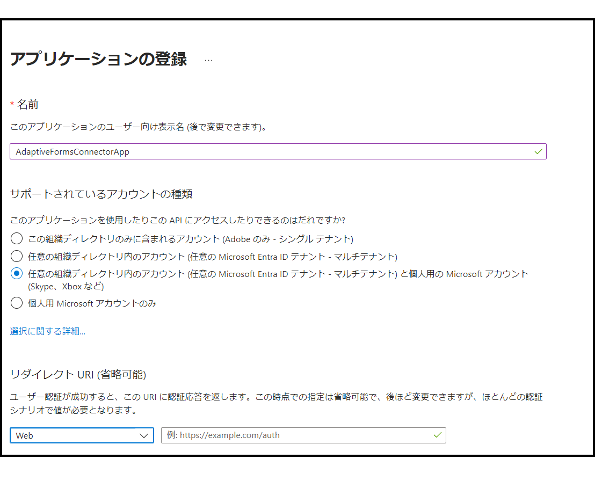
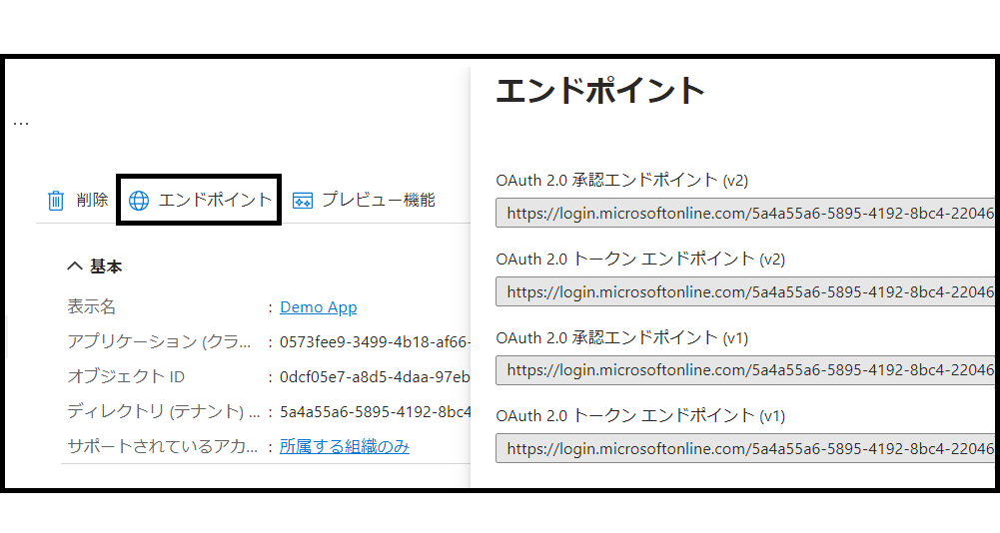
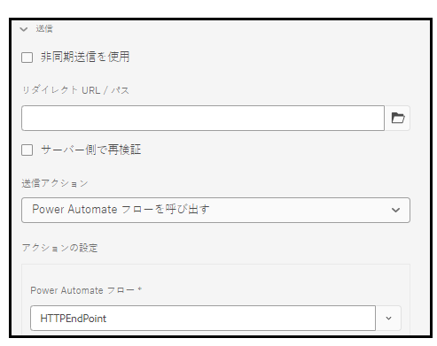

# アダプティブフォームのデータを Microsoft® Power Automate に接続して送信 {#connect-adaptive-form-with-power-automate}

送信時に Microsoft® Power Automate のクラウドフローを実行するように、アダプティブフォームを設定できます。設定済みのアダプティブフォームは、キャプチャされたデータ、添付ファイルおよびレコードのドキュメントを Power Automate クラウドフローに送信して処理します。 Microsoft® Power Automate の機能を活用して、キャプチャされたデータを中心にビジネスロジックを構築し、顧客のワークフローを自動化しながら、カスタムのデータキャプチャエクスペリエンスを構築するのに役立ちます。アダプティブフォームを Microsoft® Power Automated と統合した後に実行できる操作の例を以下に示します。

* Power Automate のビジネスプロセスでアダプティブフォームデータを使用する
* Power Automate を使用して、500 を超えるデータソースまたは一般公開されている API にキャプチャしたデータを送信する
* キャプチャしたデータに対する複雑な計算を実行する
* 事前に定義されたスケジュールでアダプティブフォームのデータをストレージシステムに保存する

アダプティブフォームエディターには「**Microsoft Power Automate フローの呼び出し**」送信アクションが用意されており、アダプティブフォームのデータ、添付ファイル、レコードのドキュメントを Power Automate クラウドフローに送信することができます。送信アクションを使用して、キャプチャしたデータを Microsoft® Power Automate に送信するには、[AEM Forms オーサーインスタンスを Microsoft® Power Automate に接続](#connect-your-aem-forms-instance-with-microsoft&reg;-power-automate)します

## 前提条件

アダプティブフォームを Microsoft® Power Automate に接続するには、以下が必要です。

* Microsoft® Power Automate Premium ライセンス
* アダプティブフォームの送信データを受け入れるための `When an HTTP request is received` トリガーを使用した Microsoft® [Power Automate フロー](https://docs.microsoft.com/ja-jp/power-automate/create-flow-solution)
* [Forms オーサー](/help/forms/using/forms-groups-privileges-tasks.md)および [Forms 管理者](/help/forms/using/forms-groups-privileges-tasks.md)権限を持つ Experience Manager ユーザー
* Microsoft® Power Automate への接続に使用されるアカウントが、アダプティブフォームからデータを受け取るように設定された Power Automate フローの所有者である


## AEM Forms インスタンスを Microsoft® Power Automate に接続 {#connect-forms-server-with-power-automate}

AEM Forms オーサーインスタンスを Microsoft® Power Automate に接続するには、次の操作を実行します。

1. [Microsoft を作成](#ms-power-automate-application)
1. [Microsoft を作成](#microsoft-power-automate-dataverse-cloud-configuration)
1. [Microsoft を作成](#create-microsoft-power-automate-flow-cloud-configuration)
1. [Microsoft を公開](#publish-microsoft-power-automate-dataverse-cloud-configuration)

### Microsoft® Azure Active Directory アプリケーションを作成します {#ms-power-automate-application}

1. [Azure Portal](https://portal.azure.com/) にログインします。 
1. 左側のナビゲーションから [!UICONTROL Azure Active Directory] を選択します。
1. デフォルトのディレクトリページで、左側のパネルから「[!UICONTROL アプリの登録]」を選択します。
1. アプリ登録ページで、「新規登録」をクリックします。
1. そのページで、名前、サポートされているアカウントタイプおよびリダイレクト URI を指定します。 リダイレクト URI で、次の情報を指定し、「保存」をクリックします。
   * `https://[AEM Forms Author instance]/libs/fd/powerautomate/content/dataverse/config.html`
   * `https://[AEM Forms Author instance]/libs/fd/powerautomate/content/flowservice/config.html`

   

   >[!NOTE]
   >必要に応じて、認証ページから追加のリダイレクト URI を指定することもできます。
   > サポートしているアカウントの種類に対して、使用事例に応じて、単一テナント、複数テナント、または個人の Microsoft® アカウントを選択します


1. 認証ページで、次のオプションを有効にし、「保存」をクリックします。


   * アクセストークン（暗黙的なフローに使用）
   * ID トークン（暗黙的なフローとハイブリッドフローに使用）

1. API 権限ページで、「権限を追加」をクリックします。
1. Microsoft® API で、「フローサービス」を選択し、次の権限を選択します。
   * Flows.Manage.All
   * Flows.Read.All

   「権限を追加」をクリックして、権限を保存します。
1. API 権限ページで、「権限を追加」をクリックします。 組織で使用している API を選択して `DataVerse` を検索します。
1. user_impersonation を有効にし、「権限を追加」をクリックします。
1. （オプション）証明書とシークレットページで、「新しいクライアントシークレット」をクリックします。 「クライアントシークレットの追加」画面で、説明とシークレットの有効期限を入力し、「追加」をクリックします。 シークレットの文字列が生成されます。
1. 組織固有の [Dynamics 環境 URL](https://docs.microsoft.com/ja-jp/power-automate/web-api#compose-http-requests) をメモしておいてください。

### Microsoft® Power Automate Dataverse クラウド設定の作成 {#microsoft-power-automate-dataverse-cloud-configuration}

1. AEM Forms のオーサーインスタンスで、**[!UICONTROL ツール]** ／**[!UICONTROL 一般]**／**[!UICONTROL 設定ブラウザー]**&#x200B;に移動します。
1. 次の日： **[!UICONTROL 設定ブラウザー]** ページ、選択 **[!UICONTROL 作成]**.
1. Adobe Analytics の **[!UICONTROL 設定を作成]** ダイアログ、指定する **[!UICONTROL タイトル]** 設定の場合は、を有効にします。 **[!UICONTROL クラウド設定]**&#x200B;をクリックし、次を選択します。 **[!UICONTROL 作成]**. これにより、Cloud Services 用の設定コンテナが作成されます。フォルダー名にスペースが含まれていないことを確認します。
1. **[!UICONTROL ツール]**／**[!UICONTROL クラウドサービス]**／**[!UICONTROL Microsoft® Power Automate Dataverse]** に移動し、前の手順で作成した設定コンテナを開きます。

   >[!NOTE]
   >
   アダプティブフォームを作成する際に、**[!UICONTROL 設定コンテナ]**&#x200B;フィールドにコンテナ名を指定します。

1. 設定ページで、「 」を選択します。 **[!UICONTROL 作成]** を作成します。 [!DNL Microsoft®® Power Automate Flow Service] AEM Formsでの設定
1. **[!UICONTROL Microsoft® Power Automate の Dataverse Service の設定]**&#x200B;ページで、**[!UICONTROL クライアント ID]**（アプリケーション ID とも呼ばれます）、**[!UICONTROL クライアントシークレット]**、**[!UICONTROL OAuth URL]**、**[!UICONTROL Dynamics 環境 URL]** を指定します。前のセクションで作成した [Microsoft® Azure Active Directory アプリケーション](#ms-power-automate-application)のクライアント ID、クライアントシークレット、OAuth URL およびDynamics 環境 URL を使用します。Microsoft® Azure Active Directory アプリケーション UI の「エンドポイント」オプションを使用して OAuth URL を検索する

   

1. 選択 **[!UICONTROL 接続]** . 必要に応じて、Microsoft® Azure アカウントにログインします。 「**[!UICONTROL 保存]**」を選択します。

### Microsoft® Power Automate フローサービスのクラウド設定を作成 {#create-microsoft-power-automate-flow-cloud-configuration}

1. **[!UICONTROL ツール]**／**[!UICONTROL クラウドサービス]**／**[!UICONTROL Microsoft® Power Automate フローサービス]**&#x200B;に移動し、前の手順で作成した設定コンテナを開きます。

   >[!NOTE]
   >
   アダプティブフォームを作成する際に、**[!UICONTROL 設定コンテナ]**&#x200B;フィールドにコンテナ名を指定します。
1. 設定ページで、「 」を選択します。 **[!UICONTROL 作成]** を作成します。 [!DNL Microsoft®® Power Automate Flow Service] AEM Formsでの設定
1. **[!UICONTROL Microsoft® Power Automate の Dataverse の設定]**&#x200B;ページで、**[!UICONTROL クライアント ID]**（アプリケーション ID とも呼ばれます）、**[!UICONTROL クライアントシークレット]**、**[!UICONTROL OAuth URL]**、**[!UICONTROL Dynamics 環境 URL]** を指定します。クライアント ID、クライアントシークレット、OAuth URL、Dynamics 環境 ID を使用します。 Microsoft® Azure Active Directory アプリケーション UI の「エンドポイント」オプションを使用して、OAuth URL を検索します。 を開きます。 [マイフロー](https://us.flow.microsoft.com) リンクをクリックし、「マイフロー」を選択します。「URL」に「Dynamics 環境 ID」としてリストされている ID を使用します。
1. 選択 **[!UICONTROL 接続]**. 必要に応じて、Microsoft® Azure アカウントにログインします。 「**[!UICONTROL 保存]**」を選択します。

### Microsoft® Power Automate Dataverse と Microsoft® Power Automate フローサービスのクラウド設定の両方を公開する {#publish-microsoft-power-automate-dataverse-cloud-configuration}

1. **[!UICONTROL ツール]**／**[!UICONTROL クラウドサービス]**／**[!UICONTROL Microsoft® Power Automate Dataverse]** に移動し、前の「[Microsoft® Power Automate Dataverse クラウド設定を作成](#microsoft-power-automate-dataverse-cloud-configuration)」セクションで作成した設定コンテナを開きます。
1. を選択します。 `dataverse` 設定および選択 **[!UICONTROL 公開]**.
1. 公開ページで、「 」を選択します。 **[!UICONTROL すべての設定]** を選択し、 **[!UICONTROL 公開]**. Power Automate Dataverse と Power Automate フローサービスのクラウド設定の両方を公開します。

これで、AEM Forms オーサーインスタンスが Microsoft® Power Automate に接続されました。アダプティブフォームのデータを Power Automate フローに送信できるようになりました。

## 「Microsoft® Power Automate フローの呼び出し」送信アクションを使用して、Power Automate フローにデータを送信する {#use-the-invoke-microsoft-power-automate-flow-submit-action}

[AEM Forms オーサーインスタンスを Microsoft® Power Automate に接続](#connect-forms-server-with-power-automate)した後、次の操作を実行して、フォーム送信時に、キャプチャしたデータを Microsoft® フローに送信するようアダプティブフォームを設定します。

1. オーサーインスタンスにログインし、アダプティブフォームを選択して、「**[!UICONTROL プロパティ]**」をクリックします。
1. 設定コンテナで、「 」セクションで作成したコンテナを参照して選択します。 [Microsoft® Power Automate Dataverse クラウド設定を作成](#microsoft-power-automate-dataverse-cloud-configuration)をクリックし、次を選択します。 **[!UICONTROL 保存して閉じる]**.
1. 編集用にアダプティブフォームを開き、アダプティブフォームのコンテナプロパティの「**[!UICONTROL 送信]**」セクションに移動します。 
1. プロパティコンテナで、「**[!UICONTROL 送信アクション]**」 に対して「**[!UICONTROL Power Automate フローの呼び出し]**」オプションを選択します。 使用可能な Power Automate フローのリストが「**[!UICONTROL Power Automate フロー]**」オプションの下で利用可能になります。必要なフローを選択すると、送信時にアダプティブフォームデータが送信されます。

   

>[!NOTE]
>
アダプティブフォームを送信する前に、以下の JSON スキーマを持つ `When an HTTP Request is received` トリガーが Power Automate フローに追加されていることを確認してください。

```
        {
            "type": "object",
            "properties": {
                "attachments": {
                    "type": "array",
                    "items": {
                        "type": "object",
                        "properties": {
                            "filename": {
                                "type": "string"
                            },
                            "data": {
                                "type": "string"
                            },
                            "contentType": {
                                "type": "string"
                            },
                            "size": {
                                "type": "integer"
                            }
                        },
                        "required": [
                            "filename",
                            "data",
                            "contentType",
                            "size"
                        ]
                    }
                },
                "templateId": {
                    "type": "string"
                },
                "templateType": {
                    "type": "string"
                },
                "data": {
                    "type": "string"
                },
                "document": {
                    "type": "object",
                    "properties": {
                        "filename": {
                            "type": "string"
                        },
                        "data": {
                            "type": "string"
                        },
                        "contentType": {
                            "type": "string"
                        },
                        "size": {
                            "type": "integer"
                        }
                    }
                }
            }
        }
```

## 以下も参照してください。

* [アダプティブフォームを作成](create-an-adaptive-form-core-components.md)
* [送信アクションを設定](configuring-submit-actions.md)
* [Microsoft® Power Automate 用 Adobe Experience Manager Connector](https://learn.microsoft.com/en-us/connectors/adobeexperiencemanag/)

