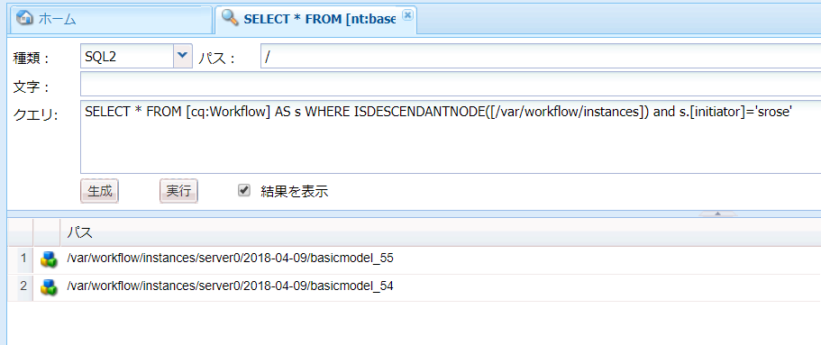
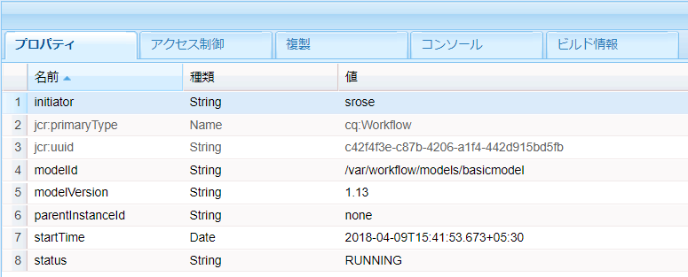
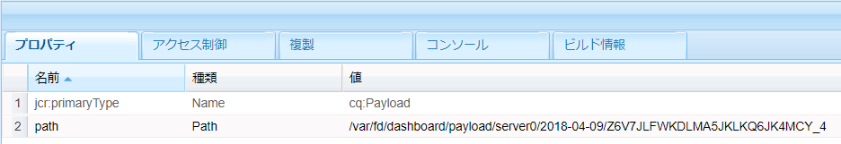

# OSGi 上の Forms 中心のワークフロー | ユーザーデータの処理 {#forms-centric-workflows-on-osgi-handling-user-data}

Forms 中心の AEM ワークフローにより、Forms 中心のビジネスプロセスを実際に自動化できます。ワークフローは、関連するワークフローモデルで指定された順序で実行される一連のステップで構成されます。各ステップで、ユーザーへのタスクの割り当てや電子メールメッセージの送信など、特定の処理が実行されます。ワークフローでは、リポジトリ内のアセット、ユーザーアカウントおよび サービスとやり取りができます。このため、ワークフローでは、Experience Manager のあらゆる側面を含む複雑なアクティビティを連携させることができます。

フォーム中心のワークフローは、次のいずれかの方法でトリガーまたは起動できます。

* AEM インボックスからのアプリケーションの送信
* Submitting an application from AEM [!DNL Forms] App
* アダプティブフォームの送信
* 監視フォルダーの使用
* インタラクティブ通信またはレターの送信

Forms 中心の AEM ワークフローおよび機能について詳しくは、「[OSGi 上の Forms 中心のワークフロー](/help/forms/using/aem-forms-workflow.md)」を参照してください。

## ユーザーデータとデータストア {#user-data-and-data-stores}

ワークフローがトリガーされると、ワークフローインスタンスに対してペイロードが自動生成されます。各ワークフローインスタンスは、一意のインスタンス ID および関連するペイロード ID が割り当てられます。ペイロードには、ワークフローインスタンスに関連付けられたユーザーおよびフォームデータのリポジトリの場所が含まれます。さらに、ワークフローインスタンスのドラフトおよび履歴データも AEM リポジトリに格納されます。

以下に、ワークフローインスタンスのペイロード、ドラフトおよび履歴が存在するデフォルトのリポジトリの場所を示します。

>[!NOTE]
>
>ペイロード、ドラフトおよび履歴データを格納する場所は、ワークフローまたはアプリケーションの作成時に別の場所に設定できます。ワークフローまたはアプリケーションがデータを格納した場所を特定するには、そのワークフローを確認します。

<table>
 <tbody>
  <tr>
   <td> </td>
   <td><b>AEM 6.4 [!DNLForms]</b></td>
   <td><b>AEM 6.3 [!DNLForms]</b></td>
  </tr>
  <tr>
   <td><strong>ワークフロー インスタンス</strong></td>
   <td>/var/workflow/instances/[server_id]/&lt;date&gt;/[workflow-instance]/</td>
   <td>/etc/workflow/instances/[server_id]/[date]/[workflow-instance]/</td>
  </tr>
  <tr>
   <td><strong>ペイロード</strong></td>
   <td>/var/fd/dashboard/payload/[server_id]/[date]/  [payload-id]/</td>
   <td>/etc/fd/dashboard/payload/[server_id]/[date]/  [payload-id]/</td>
  </tr>
  <tr>
   <td><strong>ドラフト</strong></td>
   <td>/var/fd/dashboard/instances/[server_id]/  [date]/[workflow-instance]/draft/[workitem]/</td>
   <td>/etc/fd/dashboard/instances/[server_id]/  [date]/[workflow-instance]/draft/[workitem]/</td>
  </tr>
  <tr>
   <td><strong>History</strong></td>
   <td>/var/fd/dashboard/instances/[server_id]/  [date]/[workflow_instance]/history/</td>
   <td>/etc/fd/dashboard/instances/[server_id]/  [date]/[workflow_instance]/history/</td>
  </tr>
 </tbody>
</table>

## ユーザーデータへのアクセスと削除 {#access-and-delete-user-data}

リポジトリ内のワークフローインスタンスからユーザーデータにアクセスして削除することができます。これを実行するには、ユーザーに関連付けられているワークフローインスタンスのインスタンス ID が分かっている必要があります。ワークフローインスタンスのインスタンス ID は、ワークフローインスタンスを開始したユーザーのユーザー名、またはワークフローインスタンスの現在の担当者を使用して検索することができます。

ただし、以下のシナリオでは、開始者に関連付けられたワークフローを特定しても、特定することができないか、結果があいまいになる場合があります。

* **監視フォルダーを介してトリガーされたワークフロー**：ワークフローが監視フォルダーによりトリガーされた場合、そのワークフローの開始者を使用してワークフローインスタンスを特定することはできません。この場合、ユーザー情報は格納済みデータでエンコードされます。
* **AEM の発行インスタンスから開始されたワークフロー**：すべてのワークフローインスタンスは、アダプティブフォーム、インタラクティブ通信またはレターが AEM の発行インスタンスから送信されたときに、サービスユーザーを使用して作成されます。このような場合、ログインしているユーザーのユーザー名はワークフローインスタンスデータには取り込まれません。

### ユーザーデータへのアクセス {#access}

ワークフローインスタンスに格納されているユーザーデータを特定してアクセスするには、次の手順を実行します。

1. On AEM author instance, go to `https://'[server]:[port]'/crx/de` and navigate to **[!UICONTROL Tools > Query]**.

   「**[!UICONTROL SQL2]**」を「**[!UICONTROL タイプ]**」ドロップダウンから選択します。

1. 使用可能な情報に応じて、次のいずれかのクエリを実行します。

   * ワークフロー開始者が分かっている場合は、次のコマンドを実行します。

   `SELECT &ast; FROM [cq:Workflow] AS s WHERE ISDESCENDANTNODE([path-to-workflow-instances]) and s.[initiator]='*initiator-ID*'`

   * 検索しようとしているデータを現在のワークフローの担当者にしている場合は、次を実行します。

   `SELECT &ast; FROM [cq:WorkItem] AS s WHERE ISDESCENDANTNODE([path-to-workflow-instances]) and s.[assignee]='*assignee-id*'`

   クエリを実行すると、指定されたワークフロー開始者また現在のワークフロー担当者のすべてのワークフローインスタンスの場所が返されます。

   For example, the following query returns two workflow instances path from the `/var/workflow/instances` node whose workflow initiator is `srose`.

   

1. クエリによって返されたワークフローインスタンスのパスに移動します。status プロパティには、ワークフローインスタンスの現在のステータスが表示されます。

   

1. In the workflow instance node, navigate to `data/payload/`. `path` プロパティには、ワークフローインスタンスのペイロードへのパスが格納されます。ペイロードに保存されたデータにアクセスするためのパスに移動できます。

   

1. ワークフローインスタンスのドラフトおよび履歴の場所に移動します。

   次に例を示します。

   `/var/fd/dashboard/instances/server0/2018-04-09/_var_workflow_instances_server0_2018-04-09_basicmodel_54/draft/`

   `/var/fd/dashboard/instances/server0/2018-04-09/_var_workflow_instances_server0_2018-04-09_basicmodel_54/history/`

1. 手順 2 のクエリを実行して返されたすべてのワークフローインスタンスで手順 3 から 5 を繰り返します。

   >[!NOTE]
   >
   >AEM [!DNL Forms] app also stores data in offline mode. It is possible that data for a workflow instance is locally stored on individual devices and gets submitted to the [!DNL Forms] server when the app synchronizes with the server.

### ユーザーデータの削除 {#delete-user-data}

次の手順を実行して、ワークフローインスタンスからユーザーデータを削除するには、AEM 管理者である必要があります。

1. 「[ユーザーデータへのアクセス](/help/forms/using/forms-workflow-osgi-handling-user-data.md#access)」の説明に従って以下をメモします。

   * ユーザーに関連付けられたワークフローインスタンスへのパス
   * ワークフローインスタンスのステータス
   * ワークフローインスタンスのペイロードへのパス
   * ワークフローインスタンスのドラフトおよび履歴へのパス

1. Perform this step for workflow instances in **RUNNING**, **SUSPENDED**, or **STALE** status:

   1. Go to `https://'[server]:[port]'/aem/start.html` and log in with administrator credentials.
   1. **[!UICONTROL ツール／ワークフロー／インスタンス]**&#x200B;の順に移動します。
   1. ユーザーの関連ワークフローインスタンスを選択し、「**[!UICONTROL 終了]**」をタップして実行中のインスタンスを終了します。

      For more information about working with workflow instances, see [Administering Workflow Instances](/help/sites-administering/workflows-administering.md).

1. Go to [!DNL CRXDE Lite] console, navigate to the payload path for a workflow instance, and delete the `payload` node.
1. ワークフローインスタンスのドラフトパスに移動して、`draft` ノードを削除します。
1. Navigate to the history path for a workflow instance, and delete the `history` node.
1. Navigate to the workflow instance path for a workflow instance, and delete the `[workflow-instance-ID]` node for the workflow.

   >[!NOTE]
   >
   >ワークフローインスタンスノードを削除すると、すべてのワークフロー参加者のワークフローインスタンスが削除されます。

1. ユーザーに対して特定されたすべてのワークフローインスタンスで手順 2 から 6 を繰り返します。
1. Identify and delete offline draft and submission data from AEM [!DNL Forms] app outbox of workflow participants to avoid any submission to the server.

また、API を使用してノードおよびプロパティにアクセスしてこれらを削除することができます。詳しくは、次の文書を参照してください。

* [AEM JCR へのプログラムからのアクセス方法](/help/sites-developing/access-jcr.md)
* [ノードおよびプロパティの削除](https://docs.adobe.com/docs/jp/spec/jcr/2.0/10_Writing.html#10.9%20Removing%20Nodes%20and%20Properties)
* [API リファレンス](https://helpx.adobe.com/experience-manager/6-3/sites-developing/reference-materials/javadoc/overview-summary.html)

