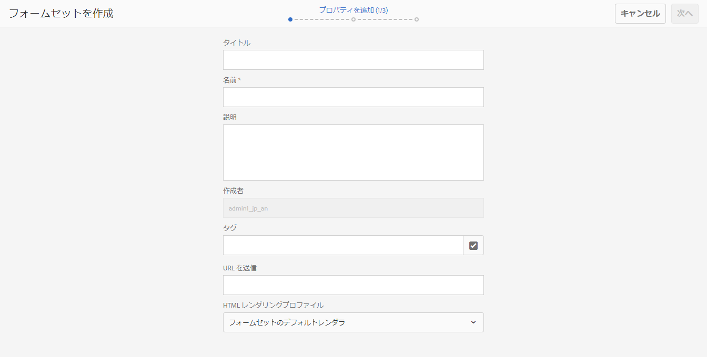
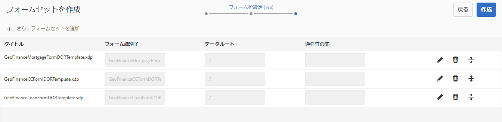
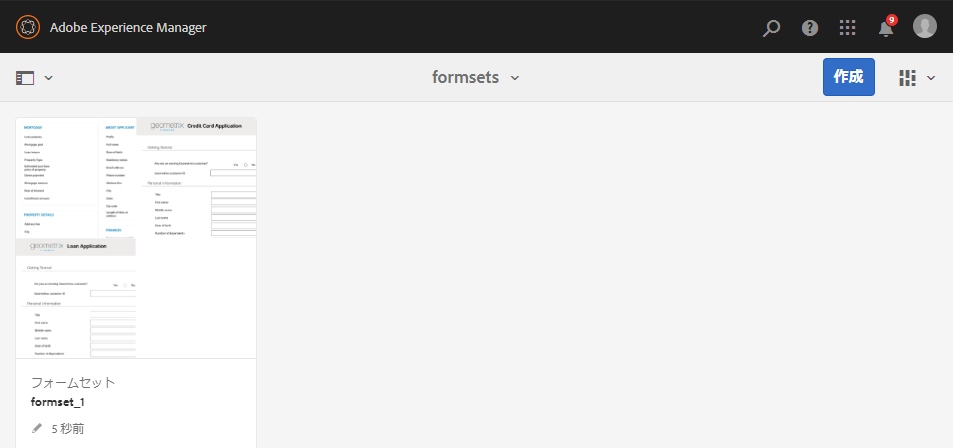

# AEM Forms におけるフォームセット{#form-set-in-aem-forms}

## 概要 {#overview}

顧客は、多くの場合、サービスや特典の申し込みに複数のフォームを送信する必要があります。 関連するすべてのフォームを検索し、それらを個別に入力、送信、および追跡する必要があります。 また、フォーム間で共通の詳細を複数回入力する必要があります。 多数のフォームが含まれる場合、プロセス全体が煩雑で誤りが生じやすくなります。 AEM Formsのフォームセット機能を使用すると、このような状況でのユーザーエクスペリエンスをシンプル化できます。

フォームセットは、1 つにグループ化され、エンドユーザーに対して 1 つのフォームのセットとして提供されるHTML5 のフォームの集まりです。 エンドユーザーがフォームセットの入力を開始すると、フォームを別のフォームにシームレスに切り替えることができます。 最後に、1 回のクリックですべてのフォームを送信できます。

AEM Formsでは、フォーム作成者がフォームセットの作成、設定、管理を直感的なユーザーインターフェイスで行うことができます。 作成者は、エンドユーザーに指示する特定の順序でフォームを並べることができます。 また、個々のフォームに条件や適格性の式を適用して、ユーザーの入力に基づいて表示を制御することもできます。 例えば、配偶者の詳細フォームは、配偶者の有無が [ 既婚 ] に設定されている場合にのみ表示するように設定できます。

さらに、共通のデータバインディングを共有するように、異なるフォームの共通のフィールドを設定できます。 適切なデータバインディングが設定されている場合、エンドユーザーは、後続のフォームで自動入力される一度だけ共通情報を入力する必要があります。

フォームセットはAEM Formsアプリでもサポートされ、現場の従業員がフォームセットをオフラインで取得し、顧客にアクセスし、データを入力し、後でAEM Formsサーバーと同期して、フォームデータをビジネスプロセスに送信できます。

## フォームセットの作成と管理 {#creating-and-managing-form-set}

複数の XDP ファイルや Designer を使用して作成したフォームテンプレートを一つのフォームセットに関連付けることができます。それから、フォームセットを使用して、ユーザーが最初にフォームに入力した値やプロフィールを基に、必要な情報のみを含む XDP ファイルを生成できます。

[AEM Forms ユーザーインターフェイス](../../forms/using/introduction-managing-forms.md)を使用して、すべてのフォームやフォームセット、および関連アセットを一元的に管理できます。

### フォームセットの作成 {#create-a-form-set}

フォームセットを作成するには、次の手順を実行します。

1. Forms/Formsとドキュメントを選択します。
1. 作成／フォームセットを選択します。

1. プロパティを追加ページで、次の詳細を追加し、「次へ」をクリックします。

   * タイトル：ドキュメントのタイトルを指定します。 タイトルを指定すると、AEM Formsユーザーインターフェイス内のフォームセットを識別しやすくなります。
   * 説明：ドキュメントに関する詳細情報を入力します。
   * タグ：フォームセットを一意に識別するタグを指定します。 タグはフォームセットの検索に役立ちます。 タグを作成するには、「タグ」ボックスに新しいタグ名を入力します。
   * 送信 URL：フォームセットのスタンドアロン表示時に送信したデータが公開される URLを指定します。（AEM Forms アプリを使用しない場合）。データは、次のリクエストパラメーターと共に、multipart/formdata としてこのエンドポイントに送信されます。
   * dataXML：このパラメーターには、送信されたフォームセットデータの XML 表現が含まれます。 フォームセット内のすべてのフォームが共通のスキーマを使用している場合、そのスキーマに従って XML が生成されます。 それ以外の場合、XML のルートタグには添付ファイルを含むフォームセットの入力済みの各フォームの子タグが含まれます。
   * formsetPath：送信された CRXDE 内のフォームセットのパス。
   * HTMLレンダリングプロファイル：フローティングフィールド、添付ファイル、ドラフトのサポート（スタンドアロンフォームセットのレンディションの場合）などの特定のオプションを設定して、フォームセットの外観、動作、操作をカスタマイズできます。 既存のプロファイルをカスタマイズまたは拡張して、任意のHTMLフォームプロファイル設定を変更できます。

   

1. フォームを選択画面に、使用可能な XDP フォームまたは XDP ファイルが表示されます。 フォームセットに含めるフォームを検索して選択し、「フォームセットに追加」をクリックします。 必要に応じて、追加するフォームを再度検索します。 すべてのフォームをフォームセットに追加したら、「次へ」をクリックします。

   >[!NOTE]
   >
   >XDP フォーム内のフィールド名にはドット（.）文字を含めないでください。ドット文字が含まれていた場合、スクリプトがそのフィールドを解決できなくなります。

1. フォームを設定のページで、次の操作を実行できます。

   * Form Order：フォームをドラッグ＆ドロップして順番を並べ替えます。このフォームの順番により、AEM Forms アプリと Stand Alone Rendition でエンドユーザーに表示されるフォームの順番が決定します。
   * Form Identifier：実施要件の式で使用するフォームの一意の ID を指定します。
   * データルート：フォームセット内の各フォームに対して、作成者は送信済み XML で特定フォームのデータを配置する XPATH を設定できます。 デフォルト値は/です。 フォームセット内のすべてのフォームがスキーマバインドされ、同じ XML スキーマを共有している場合、この値を変更できます。 フォーム内のすべてのフィールドに、XDP で指定された適切なデータ連結が設定されていることをお勧めします。 2 つの異なるフォーム内の 2 つのフィールドが共通のデータ連結を共有している場合、2 番目のフォーム内のフィールドには、最初のフォームで事前入力された値が表示されます。 同じ内部コンテンツを持つ 2 つのサブフォームを同じ XML ノードに連結しないでください。 XML の構造についての詳細は、「[フォームセットに対する XML の事前入力](../../forms/using/formset-in-aem-forms.md#p-prefill-xml-for-form-set-p)」を参照してください。
   * 適任性の式：ブール値を評価し、フォームセット内のフォームが入力用に適格かどうかを示す JavaScript 式を指定します。 false の場合、ユーザーは入力を求められず、または入力するフォームが表示されることもありません。 通常、式は、このフォームの前に取り込まれるフィールドの値に基づきます。 式には、フォームセット API fs.valueOf への呼び出しも含まれ、フォームセットのフォームのフィールドにユーザーが入力した値を抽出します。

   *fs.valueOf(&lt;Form Identifier>, &lt;fieldSom expression>) > &lt;value>*

   例えば、業務用と旅費という 2 つのフォームがフォームセットにある場合、これらのフォームの「実施要件の式」フィールドに JavaScript スニペットを追加して、フォームの経費のタイプに対するユーザー入力を確認できます。 ユーザーが「ビジネス費」を選択した場合、「ビジネス費」フォームがエンドユーザーに表示されます。 また、ユーザーが旅費を選択した場合は、別のフォームがエンドユーザーに表示されます。 詳しくは、「適格性式」を参照してください。

   また、作成者は、各行の右隅にある削除アイコンを使用してフォームセットからフォームを削除するか、「**+**「 」アイコンを使用して、アイコンをクリックします。 この&#39;**+**「 」アイコンをクリックすると、「フォームを選択」するために使用したウィザードの前の手順に戻ります。 既存の選択内容は維持され、追加の選択内容は、そのページの「フォームセットに追加」アイコンを使用してフォームセットに追加する必要があります。

   

   >[!NOTE]
   >
   >フォームセットで使用されるすべてのフォームは、AEM Formsユーザーインターフェイスで管理されます。

### フォームセットの管理 {#managing-a-form-set}

フォームセットを作成した後は、そのフォームセットに対して次の操作を実行できます。

* シングルクリック：フォームセットが作成され、メインアセットページに表示される場合、フォームセットをシングルクリックして表示できます。 フォームセットが開き、そのフォームセット内のすべてのフォームテンプレート (XDP) が表示されます。
* 編集：フォームセットを選択した後に「編集」をクリックすると、上記のフォームセットの作成手順に示すフォームを設定画面が開きます。 ここでは、で説明するすべての機能を実行できます。
* コピーして貼り付け：フォームセット全体を 1 か所からコピーして、同じ場所、別の場所、別のフォルダーに貼り付けることができます。
* ダウンロード：フォームセットとその依存関係をすべてダウンロードできます。
* レビューの開始/管理：フォームセットが作成されたら、「レビューを開始」をクリックしてレビューを設定できます。 フォームセットのレビューが開始されると、「レビューを管理」オプションがユーザーに表示されます。 レビューを管理画面で、レビューを更新または終了できます。 追加したレビューに対して、必要に応じてレビューを確認し、コメントを追加できます。
* 削除：フォームセット全体を削除します。 削除したフォームセット内のフォームは、リポジトリに残ります。
* 発行/非公開：フォームセットに含まれるすべてのフォームと、これらのフォームの関連アセットも発行または非公開にします。
* プレビュー：プレビューには、HTMLとしてプレビュー（データなし）とサンプルデータと共にカスタムプレビューの 2 つのオプションが用意されています。
* プロパティの表示/編集：選択したフォームセットのメタデータプロパティを表示または編集できます。



### フォームセットの編集 {#edit-a-form-set}

フォームセットを編集するには、次の手順を実行します。

1. Forms/Formsとドキュメントを選択します。
1. 編集するフォームセットを見つけます。 その上にカーソルを置いて、「編集」（）を選択してください。
1. フォームを設定ページで、以下の内容を編集できます。 

   * フォームの順番
   * フォーム識別子
   * データルート
   * 適任性の式

   関連する削除アイコンをクリックして、フォームセットからフォームを削除することもできます。

## Process Management のフォームセット {#form-set-in-process-management}

AEM Forms Management ユーザーインターフェイスを使用してフォームセットを作成したら、Workbench を使用して、そのフォームセットをスタートポイントまたはタスクの割り当てアクティビティで使用できます。

### タスクまたはスタートポイントでのフォームセットの使用 {#using-form-set-in-task-or-start-point}

1. 処理を設計する際、タスクの割り当て / 始点の Presentation &amp; Data セクションの下で、「**CRX アセットを使用**」を選択します。CRX アセットブラウザーが表示されます。 

   

1. フォームセットを選択して、AEM リポジトリ（CRX）のフォームセットをフィルタリングします。

   

1. フォームセットを選択してから「OK」をクリックしてください。 

## 適任性の式 {#eligibility-expressions}

フォームセット内の適任性の式は、ユーザーに表示されるフォームを定義し動的に制御するために使用されます。 例えば、ユーザーが特定の年齢グループに属している場合にのみ特定のフォームを表示する場合などです。 Forms Manager を使用して、適任性の式を指定および編集します。

適任性の式には、ブール値を返す任意の有効な JavaScript ステートメントを指定できます。 JavaScript コードスニペットの最後のステートメントは、JavaScript コードスニペットの残り（前の行）の処理に基づいてフォームの適格性を決定するブール値として扱われます。 式の値が true の場合、フォームはユーザーへの表示の対象となります。 このようなフォームは、適格なフォームと呼ばれます。

>[!NOTE]
>
>フォームセットの最初のフォームの適任性の式は実行されません。 適任性の式に関係なく、最初のフォームが常に表示されます。

標準の JavaScript 関数に加えて、フォームセットでは、フォームセット内のフォームのフィールドの値にアクセスできる fs.valueOf API も公開しています。 この API を使用して、フォームセット内のフォームフィールドの値にアクセスします。 API 構文は fs.valueOf(formUid、fieldSOM) です。ここで、

* formUid（文字列）：フォームセット内のフォームの一意の ID です。 Forms Manager ユーザーインターフェイスでフォームセットを作成する際に指定できます。 デフォルトでは、フォーム名です。
* fieldSOM（文字列）: formUid で指定されたフォーム内のフィールドの SOM 式。 SOM 式または Scripting Object Model 式は、特定の Document Object Model(DOM) 内の値、プロパティ、メソッドを参照するために使用されます。 フィールドを選択した状態で、「スクリプト」タブの下の Form Designer で表示できます。

>[!NOTE]
>
>formUid と fieldSOM の両方のパラメーターは文字列リテラルである必要があります。

### 例 {#examples}

API の有効な使用方法は次のとおりです。

`fs.valueOf("form1", "xfa.form.form1.subform1.field1")`

API の正しくない使用法：

```javascript
var formUid = "form1";
 var fieldSOM = "xfa.form.form1.subform1.field1"; fs.valueOf(formUid, fieldSOM);
```

## フォームセットに対する XML の事前入力 {#prefill-xml-for-form-set}

フォームセットは、共通または異なるスキーマを持つ複数の HTML5 フォームのまとまりです。XML ファイルを使用して、フォームフィールドへの事前入力を行うこともできます。XML ファイルをフォームセットに関連付けることで、フォームセットの中のフォームを開いたときに、いくつかのフィールドは事前入力されます。

事前入力XML ファイルは、フォームセットの URL の、dataRef パラメータを使用して指定します。dataRef パラメーターは、フォームセットと結合される XML データファイルの絶対パスを指定します。

例えば、次の構造を持つフォームセットに 3 つのフォーム (form1、form2、form3) があるとします。

form1

field form1field

form2

field form2field

form3

field form3field

各フォームには、「field」という共通の名前のフィールドと、「formfield」という一意の名前を持つフィールドがあります。

次の構造を持つ XML を使用して、このフォームセットに事前入力できます。

```xml
<?xml version="1.0" encoding="UTF-8" ?>
<formSetRootTag>
 <field>common field value</field>
 <form1field>value1</form1field>
 <form2field>value2</form2field>
 <form3field>value3</form3field>
</formSetRootTag>
```

>[!NOTE]
>
>XML のルートタグには任意の名前を指定できますが、フィールドに対応する要素タグは、フィールドと同じ名前にする必要があります。 XML の階層とフォームの階層は同じでなければなりません。つまり、XML にはサブフォームをラップするための対応するタグがなければなりません。

上記の XML のスニペットでは、フォームセットの事前入力 XML が、個々のフォームの事前入力 XML のスニペットのまとまりであることがわかります。異なるフォームの特定のフィールドがお互いに類似したデータ階層 / スキーマを持つ場合、それらのフィールドは同じ値が事前入力されます。この例では、3 つのすべてのフォームにおいて、共通のフィールド「field」に同じ値が事前入力されています。これは、あるフォームから次のフォームにデータを転送する簡単な方法です。 これは、フィールドを同じスキーマまたはデータ参照に連結することでも実現できます。 フォームのスキーマに基づいてフォームセットのデータを区別する場合。 これは、フォームセットの作成時に、フォームの「データルート」属性を指定することで実現できます（デフォルト値は「/」で、フォームセットのルートタグにマッピングされます）。

前の例では、3 つのフォームに対してそれぞれ「/form1」、「/form2」、「/form3」のデータルートを指定する場合、次の構造の事前入力 XML を使用する必要があります。

```xml
<?xml version="1.0" encoding="UTF-8" ?>
<formSetRootTag>
 <form1>
  <field>field value1</field>
  <form1field>value1</form1field>
 </form1>
 <form2>
  <field>field value2</field>
  <form2field>value2</form2field>
 </form2>
 <form3>
  <field>field value3</field>
  <form3field>value3</form3field>
 </form3>
</formSetRootTag>
```

フォームセットにおいて、XML スキーマは以下の構文で定義されます。

```xml
<formset>
 <fs_data>
  <xdp:xdp xmlns:xdp="https://ns.adobe.com/xdp/">
  <xfa:datasets xmlns:xfa="https://www.xfa.org/schema/xfa-data/1.0/">
   <xfa:data>
   <rootElement>
    ... data ....
   </rootElement>
   </xfa:data>
  </xfa:datasets>
  </xdp:xdp>
 </fs_data>
 <fs_draft>
  ... private data...
 </fs_draft>
</formset>
```

>[!NOTE]
>
>重複するデータルートを持つ 2 つのフォームがある場合、またはあるフォームの要素階層が別のフォームのデータルート階層と重なっている場合、事前入力 XML では、重なっている要素の値が結合されます。 送信 XML は事前入力 XML と同様の構造を持っていますが、送信 XML にはより多くのラッパータグと、一部のフォームセットのコンテキストデータタグが末尾に追加されています。

### XML 要素の事前入力の説明 {#prefill-xml-elements-description}

事前入力 XML ファイルを作成するための構文ルール：

* 親要素：親になる要素。null は要素が XML のルートに配置できることを示します。
* 基数：親要素内で要素を使用できる回数を示します。
* submitXML：送信 XML で要素が常に存在する (P) か、オプション (O) かを示します。
* prefillXML：事前入力 XML で要素が必須 (R) か任意 (O) かを示します。
* 子：どの要素が子になるかを示します。

### FORMSET {#formset}

`parent elements:`

`null`

`cardinality: [0,1]`

`submitXML: P`

`prefillXML: O`

`children: fs_data`

フォームセット XML のルート要素。 フォームセット内のフォームの rootSubform の名前としてこの単語を使用しないことをお勧めします。

### FS_DATA {#fs-data}

`parent elements:`

`formset`

基数：[1]

submitXML：P

prefillXML：O

`children: xdp:xdp/rootElement`

サブツリーはフォームセット内のフォームのデータを示します。 この要素は、フォームセット要素が存在しない場合にのみ、事前入力 XML でのオプションです

### XDP:XDP {#xdp-xdp}

`parent elements: fs_data/null`

`cardinality: [0,1]`

`submitXML: O`

`prefillXML: O`

`children: xfa:datasets`

このタグは、HTML5 フォーム XML の開始を示します。 事前入力 XML に存在する場合、または事前入力 XML がない場合は、送信 XML に追加されます。 このタグは、事前入力 XML から削除できます。

### XFA:DATASETS {#xfa-datasets}

`parent elements: xdp:xdp`

`cardinality: [1]`

`submitXML: O`

`prefillXML: O`

`children: xfa:data`

### XFA:DATA {#xfa-data}

`parent elements: xfa:datasets`

`cardinality: [1]`

`submitXML: O`

`prefillXML: O`

`children: rootElement`

### ROOTELEMENT {#rootelement}

`parent elements: xfa:datasets/fs_data/null`

`cardinality: [0,1]`

`submitXML: P`

`prefillXML: O`

`children: controlled by the Forms in Form set`

「rootElement」という名前はプレースホルダーでしかありません。実際の名前はフォームセットで使用されているフォームから選択されます。「rootElement」で始まるサブツリーは、フォームセットのフォーム内にフィールドのデータとサブフォームを含んでいます。rootElement とその子の構造を決定する複数の要因があります。

事前入力 XML では、このタグはオプションですが、見つからない場合、XML 全体が無視されます。

ルート要素タグの名前

事前入力 XML にルート要素がある場合、その要素の名前は送信 XML にも取り込まれます。 事前入力 XML がない場合、 rootElement の名前は、 dataRoot プロパティが「/」に設定されているフォームセット内の最初のフォームのルートサブフォームの名前になります。 そのようなフォームがない場合、rootElement 名はとなります。 **fs_dummy_root**：予約済みのキーワードです。

## AEM Formsアプリのフォームセット {#formset-in-workspace-app}

AEM Formsアプリを使用すると、フィールドワーカーはモバイルデバイスをAEM Formsサーバーと同期し、タスクを操作できます。 デバイス上のローカルにデータを保存することで、デバイスがオフラインの場合でもアプリケーションが機能します。 写真や現場作業者などの注釈機能を使用すると、ビジネスプロセスに統合する正確な情報を提供できます。

<!-- Update link as it is a 404 - For more information on AEM Forms app, see [AEM Forms app overview](/help/forms/using/mobile-workspace-overview.md).-->

## 既知の制限事項 — フォームセットではパターンは完全にはサポートされていません {#known-limitations-patterns-not-fully-supported-in-form-set}

次のデータパターンは、フォームセットでは完全にはサポートされていません。

<table>
 <tbody>
  <tr>
   <td><strong>フォームセットで完全にはサポートされていないパターン</strong></td>
   <td><strong>例</strong></td>
  </tr>
  <tr>
   <td>入力サイズとパターンサイズの不一致</td>
   <td><p>When pattern= num{z,zzz}</p> <p>および input=</p> <p>12,345 または</p> <p>1,23</p> </td>
  </tr>
  <tr>
   <td>括弧「(" ")」を含むパターン形式文字列</td>
   <td>num{(zz,zzz)}</td>
  </tr>
  <tr>
   <td>複数のデータパターン</td>
   <td>num{zz,zzz} | num{z,zzz,zzz}</td>
  </tr>
  <tr>
   <td>略記法パターン </td>
   <td><p>num.integer{},</p> <p>num.decimal{},</p> <p>num.percent{}または</p> <p>num.currency{}</p> </td>
  </tr>
 </tbody>
</table>
