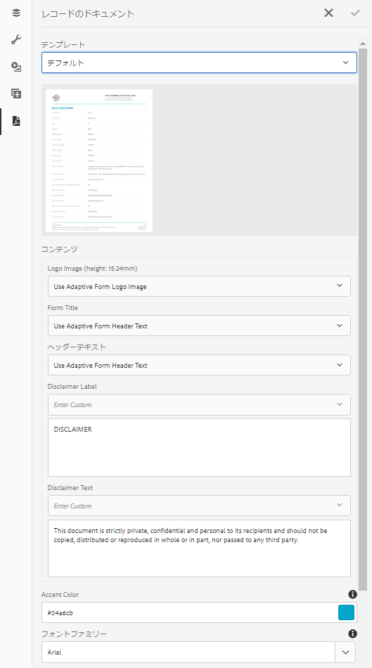
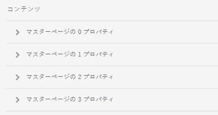

# アダプティブフォームにおけるレコードのドキュメントの生成{#generate-document-of-record-for-adaptive-forms}

## 概要 {#overview}

フォームに記入して送信した顧客は、印刷するかまたはドキュメント形式で保存するかして、同じ情報を今後の参考用に保存しておきたいと考えるのが一般的です。これを、レコードのドキュメントといいます。

この記事では、アダプティブフォーム向けのレコードのドキュメントを生成する方法について説明します。

>[!NOTE]
>
>レコードのドキュメントの自動生成は、XFAベースのアダプティブフォームではサポートされていません。 ただし、アダプティブフォーム作成用の XDP をレコードのドキュメントとして使用することができます。

## アダプティブフォームの種類とレコードのドキュメント {#adaptive-form-types-and-their-documents-of-record}

アダプティブフォームの作成時に、フォームのモデルを指定できます。以下のオプションがあります。

* [フォームテンプレート](../../forms/using/creating-adaptive-form.md#create-an-adaptive-form-based-on-an-xfa-form-template) アダプティブフォームの XFA テンプレートを選択できます。XFAテンプレートを選択すると、前述のように、レコードのドキュメントに関連付けられたXDPファイルを使用できます。

* [XML スキーマ](../../forms/using/creating-adaptive-form.md#create-an-adaptive-form-based-on-xml-or-json-schema) アダプティブフォームの XML スキーマ定義を選択できます。XML スキーマ アダプティブフォームの XML スキーマ定義を選択すると、次のことができます。

   * レコードのドキュメントに XFA テンプレートを関連付ける。関連する XFA テンプレートで、アダプティブフォームと同じ XML スキーマを使用させる。
   * レコードのドキュメントを自動生成

* なし フォームのモデルを指定せずに、アダプティブフォームを作成できます。レコードのドキュメントは、アダプティブフォーム用に自動的に生成されます。

フォームモデルを選択する場合は、「レコードのドキュメントのテンプレート設定」のオプションを使用して、レコードのドキュメントを設定します。 [レコードのドキュメントのテンプレート設定](#document-of-record-template-configuration)を参照してください。

## 自動的に生成されたレコードのドキュメント {#automatically-generated-document-of-record}

レコードのドキュメントを使用すると、顧客は送信したフォームを印刷目的で保存することができます。レコードのドキュメントを自動生成すると、フォームを変更するたびに、そのレコードのドキュメントが直ちに更新されます。 例えば、居住国に米国を選択した顧客のレコードでは、年齢のフィールドを削除したとします。このような顧客がレコードのドキュメントを生成する場合、レコードのドキュメントでは年齢フィールドが表示されません。

自動生成されたレコードのドキュメントには、次の利点があります。

* データ連結が処理されます。
* 送信時にレコードのドキュメントから除外するとマークされたフィールドは自動的に非表示になります。 余分な労力が不要になります。
* レコードのドキュメントテンプレートのデザインにかかる時間を節約できます。
* 様々な基本テンプレートを使用しながら様々なスタイリングと外観を試すことで、レコードのドキュメントにとって最良のスタイルと外観を選択できます。スタイリングを設定することはオプションです。スタイルを指定しない場合は、システムスタイルがデフォルトとして設定されます。
* フォーム内のすべての変更が、確実かつ即座にレコードのドキュメントに反映されます。

## レコードのドキュメントを自動生成するためのコンポーネント {#components-to-automatically-generate-a-document-of-record}

アダプティブフォームのレコードのドキュメントを生成するには、次のコンポーネントが必要です。

**レコ** ードのドキュメントを生成するアダプティブフォーム

**基本テンプレート（推奨）** AEM Designer で作成された XFA テンプレート（XDP ファイル）。基本テンプレートは、レコードのドキュメントテンプレートのスタイルとブランディング情報を指定するために使用されます。

[レコードのドキュメントの基本テンプレート](#base-template-of-a-document-of-record)を参照してください。

>[!NOTE]
>
>レコードのドキュメントの基本テンプレートは、レコードのドキュメントのメタテンプレートとも呼ばれます。

**アダプティブフ** ォームから生成されたレコードのドキュメントtemplateXFAテンプレート（XDPファイル）。

[レコードのドキュメントのテンプレート設定](#document-of-record-template-configuration)を参照してください。

**アダプ** ティブフォームでユーザーが入力したフォームのdataInformation。レコードのドキュメントを生成するために、レコードのドキュメントテンプレートとマージされます。

## アダプティブフォームエレメントのマッピング {#mapping-of-adaptive-form-elements}

次のセクションでは、レコードのドキュメント内でアダプティブフォームエレメントがどのように表示されるかについて説明します。

### フィールド {#fields}

<table>
 <tbody>
  <tr>
   <th>アダプティブフォームコンポーネント</th>
   <th>対応する XFA コンポーネント</th>
   <th>デフォルトでレコードのドキュメントのテンプレートに含まれますか？</th>
   <th>備考</th>
  </tr>
  <tr>
   <td>ボタン</td>
   <td>ボタン</td>
   <td>false</td>
   <td> </td>
  </tr>
  <tr>
   <td>チェックボックス</td>
   <td>チェックボックス</td>
   <td>true</td>
   <td> </td>
  </tr>
  <tr>
   <td>日付選択</td>
   <td>日付／時間フィールド</td>
   <td>true</td>
   <td> </td>
  </tr>
  <tr>
   <td>ドロップダウンリスト</td>
   <td>ドロップダウンリスト</td>
   <td>true</td>
   <td> </td>
  </tr>
  <tr>
   <td>手書き署名</td>
   <td>手書き署名</td>
   <td>true</td>
   <td> </td>
  </tr>
  <tr>
   <td>数値ボックス</td>
   <td>数値フィールド</td>
   <td>true</td>
   <td> </td>
  </tr>
  <tr>
   <td>パスワードボックス</td>
   <td>パスワードフィールド</td>
   <td>false</td>
   <td> </td>
  </tr>
  <tr>
   <td>ラジオボタン</td>
   <td>ラジオボタン</td>
   <td>true</td>
   <td> </td>
  </tr>
  <tr>
   <td>テキストボックス</td>
   <td>テキストフィールド</td>
   <td>true</td>
   <td> </td>
  </tr>
  <tr>
   <td>リセットボタン</td>
   <td>リセットボタン</td>
   <td>false</td>
   <td> </td>
  </tr>
  <tr>
   <td>送信ボタン</td>
   <td><p>メール送信ボタン</p> <p>HTTP 送信ボタン</p> </td>
   <td>false</td>
   <td> </td>
  </tr>
  <tr>
   <td>利用条件</td>
   <td> </td>
   <td>true</td>
   <td> </td>
  </tr>
  <tr>
   <td>ファイル添付</td>
   <td> </td>
   <td>false</td>
   <td>レコードのドキュメントテンプレートでは使用できません。 添付ファイルを介してレコードのドキュメントでのみ使用できます。</td>
  </tr>
 </tbody>
</table>

### コンテナ {#containers}

<table>
 <tbody>
  <tr>
   <th>アダプティブフォームコンポーネント</th>
   <th>対応する XFA コンポーネント</th>
   <th>備考</th>
  </tr>
  <tr>
   <td>パネル<br /> </td>
   <td>サブフォーム<br /> </td>
   <td>反復パネルは繰り返しサブフォームにマッピングされます。</td>
  </tr>
 </tbody>
</table>

### 静的コンポーネント {#static-components}

| アダプティブフォームコンポーネント | 対応する XFA コンポーネント | 備考 |
|---|---|---|
| 画像 | 画像 | レコードのドキュメント設定で除外されない限り、 TextDrawおよびImageコンポーネントは、連結されているかどうかに関わらず、XSDベースのアダプティブフォームのレコードのドキュメントに常に表示されます。 |
| テキスト | テキスト |

>[!NOTE]
>
>従来の UI では、フィールドプロパティを編集する際に別々のタブを開きます。

### テーブル {#tables}

ヘッダー、フッター、および列といった、アダプティブフォームのテーブルコンポーネントは、対応する XFA コンポーネントにマッピングされます。繰り返し可能なパネルを、レコードのドキュメントのテーブルにマッピングすることができます。

## レコードのドキュメントの基本テンプレート {#base-template-of-a-document-of-record}

基本テンプレートは、レコードのドキュメントにスタイリングと外観の情報を提供します。これにより、自動生成されたレコードのドキュメンに対して、デフォルトの外観をカスタマイズすることができます。例えば、レコードのドキュメントのヘッダーに会社のロゴを、そしてフッターに著作権情報を追加するとします。基本テンプレートから作成されたマスターページは、レコードのドキュメントのマスターページとして使用されています。マスターページには、レコードのドキュメントに適用可能なページヘッダー、ページフッター、ページ番号などの情報を含めることができます。レコードのドキュメントを自動生成するための基本テンプレートを使用して、レコードのドキュメントにこのような情報を適用できます。 基本テンプレートを使用すると、フィールドのデフォルトプロパティを変更することができます。

基本テンプレートを設計する際は、「[基本テンプレートの規則](#base-template-conventions)」に従ってください。

## 基本テンプレートの規則 {#base-template-conventions}

基本テンプレートは、レコードのドキュメントのヘッダー、フッター、スタイル、および外観を定義するために使用されます。ヘッダーとフッターには、会社のロゴや著作権テキストなどの情報を含めることができます。基本テンプレート内の最初のマスターページがコピーされ、レコードのドキュメントのマスターページとして使用されます。このページには、ヘッダー、フッター、ページ番号、またはレコードのドキュメント内のすべてのページに表示されるその他の情報が含まれます。 基本テンプレートの規則に準拠していない基本テンプレートを使用している場合、基本テンプレートの最初のマスターページは、レコードのドキュメントテンプレートで引き続き使用されます。 基本テンプレートを規則通りに設計し、レコードのドキュメント自動生成のためにそれを使用することを強くお勧めします。

**マスターページの規則**

* 基本テンプレートでは、ルートサブフォームに `AF_METATEMPLATE`、およびマスターページに `AF_MASTERPAGE` の名前を付ける必要があります。

* ルートサブフォームの `AF_MASTERPAGE` 下に位置する `AF_METATEMPLATE` という名前のマスターページには、ヘッダー、フッター、およびスタイル情報を抽出するための優先順位が与えられています。

* `AF_MASTERPAGE` が存在しない場合は、基本テンプレート中に存在する最初のマスターページが使用されます。

**フィールドのスタイリング規則**

* レコードのドキュメント内のフィールドにスタイルを適用するため、基本テンプレートは `AF_FIELDSSUBFORM` ルートサブフォーム内の `AF_METATEMPLATE` サブフォームにフィールドを作成します。

* これらのフィールドのプロパティは、レコードのドキュメント内のフィールドに適用されます。これらのフィールドは、`AF_<name of field in all caps>_XFO` の命名規則に従う必要があります。例えば、チェックボックスのフィールド名は `AF_CHECKBOX_XFO` とする必要があります。

基本テンプレートを作成するには、AEM Designer で次の手順を実行します。

1. **ファイル／新規**&#x200B;をクリックします。
1. 「**テンプレートに基づく**」のオプションを選択します。

1. 「**フォーム - レコードのドキュメント**」のカテゴリを選択します。
1. **「DoR 基本テンプレート」**&#x200B;を選択します。
1. **「次へ」**&#x200B;をクリックし、必要な情報を入力します。

1. （オプション）レコードのドキュメント内のフィールドに適用する、フィールドのスタイルと外観を変更します。
1. フォームを保存します。

これで、保存されたフォームをレコードのドキュメント用基本テンプレートとして使用することができます。基本テンプレート中に存在するスクリプトについて、いずれも変更したり、削除したりしないでください。

**基本テンプレートの変更**

* 基本テンプレート内のフィールドに対していずれのスタイルも適用していない場合は、基本テンプレートからそれらのフィールドを削除することをお勧めします。これにより、基本テンプレートのアップグレードを自動的に適用することができます。
* 基本テンプレートを変更するときは、スクリプトを削除、追加、変更しないでください。

>[!NOTE]
>
>基本テンプレート規則を使用し、上記の手順を正確に実行してください。

## レコードのドキュメントのテンプレート設定 {#document-of-record-template-configuration}

フォームのレコードのドキュメントテンプレートを設定して、顧客が送信したフォームの印刷用コピーをダウンロードできるようにします。 XDPファイルは、レコードのドキュメントテンプレートとして機能します。 顧客がダウンロードするレコードのドキュメントは、XDPファイルで指定されたレイアウトに従ってフォーマットされます。

次の手順を実行して、アダプティブフォームのレコードのドキュメントを設定します。

1. AEM オーサーインスタンスで、**フォーム／フォームとドキュメント**&#x200B;をクリックします。
1. フォームを選択し、「**プロパティの表示**」をクリックします。
1. 「プロパティ」ウィンドウで、「**フォームモデル**」をタップします。
フォームモデルの選択は、フォームの作成時にも行うことができます。

   >[!NOTE]
   >
   >「フォームモデル」のタブで、必ず「**次から選択**」ドロップダウンから「**スキーマ**」または「**なし**」を選択します。**[!UICONTROL レコードのドキュメントは、フォームモデルとしてフォームテンプレートを使用したXFAベースのフォームやアダプティブフォームではサポートされていません。]**

1. 「フォームモデル」タブの「レコードのドキュメントのテンプレート設定」セクションで、次のいずれかのオプションを選択します。

   **** なしフォームのレコードのドキュメントを設定しない場合は、このオプションを選択します。

   **フォームテンプレートをレコードのドキュメントテンプレートとして関連付け** るXDPファイルをレコードのドキュメントのテンプレートとして使用する場合は、このオプションを選択します。このオプションを選択すると、AEM Forms リポジトリで利用可能なすべての XDP ファイルが表示されます。適切なファイルを選択します。

   選択された XDP ファイルは、アダプティブフォームに関連付けられます。

   **レコードのドキュメ** ントを生成レコードのドキュメントのスタイルと外観を定義する基本テンプレートとしてXDPファイルを使用する場合は、このオプションを選択します。このオプションを選択すると、AEM Forms リポジトリで利用可能なすべての XDP ファイルが表示されます。適切なファイルを選択します。

   >[!NOTE]
   >
   >アダプティブフォーム作成するために使用されるスキーマと、XFA フォームのスキーマ（データスキーマ）が同じであることを確認します。
   >
   >
   >
   >    * アダプティブフォームがスキーマベースの場合
   >    * レコードのドキュメントに対して、「**フォームテンプレートをレコードのドキュメントのテンプレートとして関連付け**」オプションを使用している


1. 「**完了**」をクリックします。

## レコードのドキュメントにあるブランディング情報のカスタマイズ {#customize-the-branding-information-in-document-of-record}

レコードのドキュメントの生成中に、「レコードのドキュメント」タブにあるレコードのドキュメントのブランディング情報を変更できます。「レコードのドキュメント」タブには、ロゴ、外観、レイアウト、ヘッダー、フッター、免責事項などのオプションや、選択されていないチェックボックスやラジオボタンを含めるかどうかのオプションが含まれています。

「レコードのドキュメント」タブに入力するブランディング情報をローカライズするには、ブラウザーのロケールを正しく設定する必要があります。レコードのドキュメントのブランディング情報をカスタマイズするには、次の手順を実行します。

1. レコードのドキュメント内のパネル（ルートパネル）を選択し、をタップします。
1.  をタップします。「レコードのドキュメント」タブが表示されます。
1. レコードのドキュメントをレンダリングする、デフォルトのテンプレートまたはカスタムのテンプレートのいずれかを選択します。デフォルトのテンプレートを選択すると、レコードのドキュメントのサムネイルが「テンプレート」ドロップダウンの下に表示されます。

   

   カスタムのテンプレートを選択する場合は、AEM Forms サーバーで XDP を参照して選択します。使用する AEM Forms サーバーにないテンプレートを使用する場合は、最初に XDP を AEM Forms サーバーにアップロードする必要があります。

1. デフォルトのテンプレートとカスタムのテンプレートのどちらを選択するかにより異なりますが、以下のプロパティの一部または全部が「レコードのドキュメント」タブに表示されます。これらを正しく設定します。

   * **ロゴ画像**:アダプティブフォームのロゴ画像を使用するか、DAMからロゴ画像を選択するか、コンピューターからロゴ画像をアップロードするかを選択できます。
   * **フォームタイトル**
   * **ヘッダーテキスト**
   * **免責事項ラベル**
   * **免責事項**
   * **免責事項テキスト**
   * **アクセントの色**：ヘッダーテキストおよび区切り線の色は、レコードのドキュメントの PDF でレンダリングされます
   * **フォントファミリ**:レコードのドキュメントPDF内のテキストのフォントファミリ
   * **チェックボックスおよびラジオボタンのコンポーネントには、選択した値のみが表示されます**
   * **複数選択されている値のセパレーター**
   * **データモデルにバインドしていないフォームオブジェクトを含める**
   * **レコードのドキュメントから非表示フィールドを除外**
   * **パネルの説明を非表示**

   選択したカスタムXDPテンプレートに複数のマスターページが含まれている場合、それらのページのプロパティは「**[!UICONTROL レコードのドキュメント]**」タブの「**[!UICONTROL content]**」セクションに表示されます。

   

   マスターページのプロパティには、ロゴ画像、ヘッダーテキスト、フォームタイトル、免責事項ラベル、免責事項テキストが含まれます。 アダプティブフォームまたはXDPテンプレートのプロパティは、「レコードのドキュメント」に適用できます。 AEM Formsは、デフォルトでテンプレートのプロパティをレコードのドキュメントに適用します。 マスターページのプロパティにカスタム値を定義することもできます。 レコードのドキュメントに複数のマスターページを適用する方法については、「[レコードのドキュメントに複数のマスターページを適用する](#apply-multiple-master-pages-dor)」を参照してください。

   >[!NOTE]
   >
   >6.3より前のバージョンのDesignerで作成されたアダプティブフォームテンプレートを使用している場合、Accent ColorプロパティとFont Familyプロパティを機能させるには、ルートサブフォームの下のアダプティブフォームテンプレートに次の内容が存在することを確認します。

   ```xml
   <proto>
   <font typeface="Arial"/>
   <fill>
   <color value="4,166,203"/>
   </fill>
   <edge>
   <color value="4,166,203"/>
   </edge>
   </proto>
   ```

1. ブランディングの変更内容を保存するには、「完了」をタップします。

## レコードのドキュメントのパネルに表示される表と列のレイアウト {#table-and-column-layouts-for-panels-in-document-of-record}

アダプティブフォームは、複数のフォームフィールドを持つ長いフォームである場合があります。 その場合、レコードのドキュメントをアダプティブフォームの正確なコピーとして保存することはお勧めしません。テーブルまたは列のレイアウトを 1 つ選択し、このレイアウトを適用して、1 つ以上のアダプティブフォームパネルをレコードのドキュメント PDF に保存できます。

レコードのドキュメントを生成する前に、パネルの設定の「レコードのドキュメントのレイアウト」で、パネル用にテーブルまたは列を選択します。パネル内のフィールドは、レコードのドキュメントに合わせて配置されます。


レコードのドキュメントのテーブルレイアウト内でレンダリングされたパネルのフィールド


レコードのドキュメントの列レイアウト内でレンダリングされたパネルのフィールド

## レコードのドキュメントの設定 {#document-of-record-settings}

レコードのドキュメントの設定では、レコードのドキュメントに含めるオプションを選択できます。 例えば、銀行では、名前、年齢、社会保障番号、電話番号などをフォームから受け取ります。銀行口座番号や支店の詳細は、フォーム上に生成されます。レコードのドキュメントでは、名前、マイナンバー番号、銀行口座、および支店の詳細のみが表示されるように選択できます。

コンポーネントのレコードのドキュメント設定は、そのプロパティで使用できます。 コンポーネントのプロパティにアクセスするには、コンポーネントを選択し、オーバーレイ内の  をクリックします。プロパティはサイドバーにリスト表示され、その中で次の設定を検索できます。

**フィールドレベルの設定**

* **レコードのドキュメントから除外**：プロパティを「true」に設定すると、そのフィールドがレコードのドキュメントから除外されます。これは `excludeFromDoR` という名前のスクリプト可能プロパティです。その動作は、**非表示の場合はレコードのドキュメントからフィールドを除外**&#x200B;フォームレベルプロパティに依存します。

* **パネルをテーブルとして表示：** パネルに含まれるフィールドの数が6個未満の場合、このプロパティを設定すると、パネルがレコードのドキュメントにテーブルとして表示されます。この設定は、パネルにのみ適用されます。
* **レコードのドキュメントからタイトルを除外：**&#x200B;このプロパティを設定すると、レコードのドキュメントからパネルやテーブルのタイトルが除外されます。パネルおよび表に対してのみ適用できます。
* **レコードのドキュメントから説明を除外：**&#x200B;このプロパティを設定すると、レコードのドキュメントからパネルやテーブルの説明が除外されます。パネルおよび表に対してのみ適用できます。
* **[!UICONTROL ページ編集]** / **[!UICONTROL 配置]**:パネルを配置する場所を指定します。
   * **** / **[!UICONTROL 前へ]**&#x200B;を移動：親パネル内の前のオブジェクトの後にパネルを配置します。
   * **** / **[!UICONTROL コンテンツ領域に配置]** /コンテンツ領域の名前：指定したコンテンツ領域にパネルを配置します。
   * **** / **[!UICONTROL 次のコンテンツ領域の先頭]**&#x200B;に移動します。パネルを次のコンテンツ領域の先頭に配置します。
   * **** / **[!UICONTROL コンテンツ領域の先頭]** /コンテンツ領域の名前：パネルを指定されたコンテンツ領域の先頭に配置します。
   * **** / **[!UICONTROL ページ上]** /マスターページの名前を指定します。指定したページにパネルを配置します。改ページが自動的に挿入されない場合、[!DNL AEM Forms]は改ページを追加します。
   * **** / **[!UICONTROL 次のページの先頭]**&#x200B;に移動します。パネルを次のページの先頭に配置します。改ページが自動的に挿入されない場合、[!DNL AEM Forms]は改ページを追加します。
   * **** / **[!UICONTROL ページの先頭]** /マスターページの名前を指定します。指定されたページがレンダリングされる際に、パネルをページの先頭に配置します。改ページが自動的に挿入されない場合、[!DNL AEM Forms]は改ページを追加します。
* **[!UICONTROL ページ編集]** / **[!UICONTROL 後]**:パネルを配置した後に記入する領域を決定します。次のフィールドが「後」セクションで使用 **** できます。
   * **** / **[!UICONTROL 親の入力を続行]**:親パネルに残っているすべてのオブジェクトのデータを結合し続けます。
   * **** / **[!UICONTROL 次のコンテンツ領域に移動]**&#x200B;後：パネルを配置した後に、次のコンテンツ領域への記入を開始します。
   * **** / **[!UICONTROL コンテンツ領域に移動]** /コンテンツ領域の名前：パネルを配置した後に、指定したコンテンツ領域への記入を開始します。
   * **** / **[!UICONTROL 次のページに移動]**&#x200B;後：パネルを配置した後に、次のページへの記入を開始します。
   * **** / **[!UICONTROL ページに移動]** /ページ名の後：パネルを配置した後、指定したページへの記入を開始します。
* **[!UICONTROL ページ編集]** / **[!UICONTROL オーバーフロー]**:パネルまたは複数ページにまたがるテーブルのオーバーフローを設定します。**[!UICONTROL Overflow]**&#x200B;セクションでは、次のフィールドを使用できます。
   * **[!UICONTROL Overflow]** / **[!UICONTROL None]**:次のページへの記入を開始します。改ページが自動的に挿入されない場合、[!DNL AEM Forms]は改ページを追加します。
   * **[!UICONTROL オーバーフロー]** / **[!UICONTROL コンテンツ領域に移動]** /コンテンツ領域名：指定されたコンテンツ領域への記入を開始します。
   * **[!UICONTROL オーバーフロー]** / **[!UICONTROL ページに移動]** /ページ名：指定されたページへの記入を開始します。

レコードのドキュメントに改ページを適用し、複数のマスターページを適用する方法については、「[レコードのドキュメントに改ページを適用する](#apply-page-breaks-in-dor)」および「[レコードのドキュメントに複数のマスターページを適用する](#apply-multiple-master-pages-dor)」を参照してください。

**フォームレベルの設定**

* **バインドされていないフィールドをレコードのドキュメントに含める：**&#x200B;このプロパティを設定すると、スキーマベースのアダプティブフォームのバインドされていないフィールドがレコードのドキュメントに追加されます。デフォルトでは true になっています。
* **非表示の場合はレコードのドキュメントからフィールドを除外**：このプロパティを設定すると、「レコードのドキュメントから除外」フィールドレベルプロパティが true でないときにその動作が上書きされます。フォームの送信時にフィールドが非表示になっている場合、「レコードのドキュメントから除外」プロパティが設定されていない限り、プロパティがtrueに設定されていれば、レコードのドキュメントから除外されます。

## レコードのドキュメントに改ページを適用する {#apply-page-breaks-in-dor}

複数の方法を使用して、レコードのドキュメントに改ページを適用できます。

レコードのドキュメントに改ページを適用するには：

1. パネルをタップし、「」を選択します。

1. **[!UICONTROL レコードのドキュメント]**&#x200B;を展開して、プロパティを表示します。

1. 「**[!UICONTROL ページ編集]**」セクションで、「**[!UICONTROL 配置]**」フィールドの「」をタップします。
1. 「**[!UICONTROL 次のページの先頭]**」をタップし、「**[!UICONTROL 選択]**」をタップします。 「**[!UICONTROL ページの先頭]**」をタップし、マスターページを選択して「**[!UICONTROL 選択]**」をタップして、改ページを適用することもできます。
1. 「」をタップして、プロパティを保存します。

選択したパネルが次のページに移動します。

## レコードのドキュメントに複数のマスターページを適用する {#apply-multiple-master-pages-dor}

選択したカスタムXDPテンプレートに複数のマスターページが含まれている場合、それらのページのプロパティは「[!UICONTROL レコードのドキュメント]」タブの「[!UICONTROL content]」セクションに表示されます。 詳しくは、[レコードのドキュメントのブランディング情報のカスタマイズ](#customize-the-branding-information-in-document-of-record)を参照してください。

アダプティブフォームのコンポーネントに異なるマスターページを適用することで、1つのレコードのドキュメントに複数のマスターページを適用できます。 複数のマスターページを適用するには、レコードのドキュメントプロパティの[ページ編集](#document-of-record-settings)セクションを使用します。

次に、レコードのドキュメントに複数のマスターページを適用する方法の例を示します。
4つのマスターページを含むXDPテンプレートを[!DNL AEM Forms]サーバーにアップロードします。 [!DNL AEM Forms] デフォルトで、テンプレートのプロパティをレコードのドキュメントに適用します。[!DNL AEM Forms] また、テンプレート内の最初のマスターページプロパティをレコードのドキュメントに適用します。

2つ目のマスターページのプロパティをパネルに適用し、3つ目のマスターページのプロパティをそれ以降のパネルに適用するには、次の手順を実行します。

1. パネルをタップして2つ目のマスターページを適用し、「」を選択します。
1. 「**[!UICONTROL ページ編集]**」セクションで、「**[!UICONTROL 配置]**」フィールドの「」をタップします。
1. **[!UICONTROL ページ]**&#x200B;で、2番目のマスターページを選択して「**[!UICONTROL 選択]**」をタップします。
AEM Formsは、2つ目のマスターページをアダプティブフォーム内のパネルとそれ以降のすべてのパネルに適用します。
1. 「**[!UICONTROL ページ編集]**」セクションで、「**[!UICONTROL 後]**」フィールドの「」をタップします。
1. 「**[!UICONTROL ページに移動]**」をタップし、3番目のマスターページを選択して「**[!UICONTROL 選択]**」をタップします。
1. 「」をタップして、プロパティを保存します。AEM Formsは、3番目のマスターページをパネルと、アダプティブフォーム内の後続のすべてのパネルに適用します。


## レコードのドキュメントを使用する場合の主な注意点 {#key-considerations-when-working-with-document-of-record}

アダプティブフォームのレコードのドキュメントを操作する際は、次の点に注意してください。

* レコードのドキュメントテンプレートは、リッチテキストをサポートしていません。 そのため、スタティックアダプティブフォームまたはエンドユーザー入力情報に含まれるリッチテキストは、レコードのドキュメントではプレーンテキストとして表示されます。
* アダプティブフォーム内のドキュメントフラグは、レコードのドキュメントには表示されません。ただし、アダプティブフォームフラグメントはサポートされています。
* XML スキーマベースのアダプティブフォームは、レコードの生成されたドキュメント内でのコンテンツのバインドに対応していません。
* レコードのドキュメントのレンダリングをユーザーが要求すると、レコードのドキュメントのローカライズされたバージョンが、ロケールに合わせてオンデマンドで作成されます。レコードのドキュメントのローカライズは、アダプティブフォームのローカライズと同時に発生します。レコードのドキュメントおよびアダプティブフォームのローカライズについて詳しくは、「[AEM 翻訳ワークフローを使用したアダプティブフォールおよびレコードのドキュメントのローカライズ](/help/forms/using/using-aem-translation-workflow-to-localize-adaptive-forms.md)」を参照してください。
