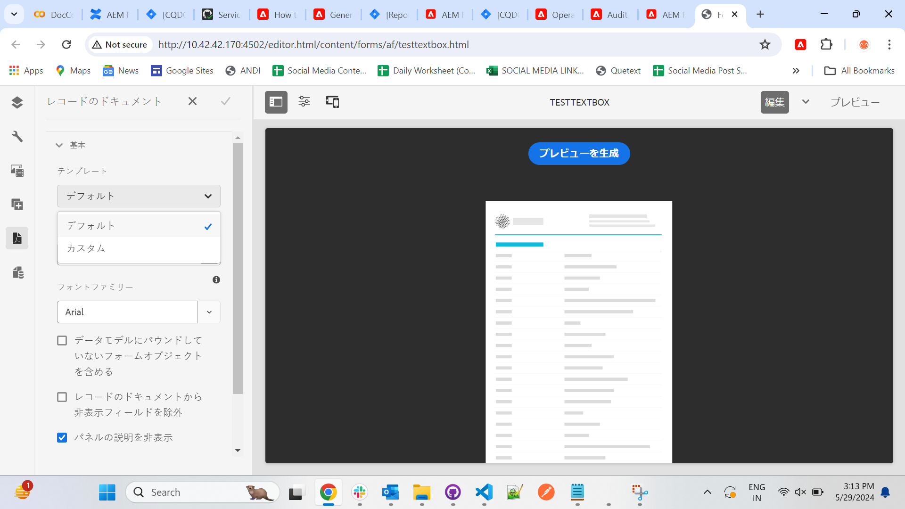

# アダプティブフォームまたはアダプティブフォームフラグメントのレコードのドキュメントを生成 {#generate-document-of-record-for-adaptive-forms}

<span class="preview">[アダプティブフォームの新規作成](/help/forms/using/create-an-adaptive-form-core-components.md)または [AEM Sites ページへのアダプティブフォームの追加](/help/forms/using/create-or-add-an-adaptive-form-to-aem-sites-page.md)には、最新の拡張可能なデータキャプチャ[コアコンポーネント](https://experienceleague.adobe.com/docs/experience-manager-core-components/using/adaptive-forms/introduction.html?lang=ja)を使用することをお勧めします。これらのコンポーネントは、アダプティブフォームの作成における大幅な進歩を表し、ユーザーエクスペリエンスの向上を実現します。この記事では、基盤コンポーネントを使用してアダプティブフォームを作成する古い方法について説明します。</span>

| バージョン | 記事リンク |
| -------- | ---------------------------- |
| AEM as a Cloud Service | [ここをクリックしてください](https://experienceleague.adobe.com/docs/experience-manager-cloud-service/content/forms/adaptive-forms-authoring/authoring-adaptive-forms-foundation-components/generate-document-of-record-for-non-xfa-based-adaptive-forms.html?lang=ja) |
| AEM 6.5 | この記事 |


## 概要 {#overview}

フォームを送信した後、顧客は通常、印刷するかまたはドキュメント形式で保存するかのどちらかで、フォームに記入した情報を今後の参考のために記録しておきたいと考えます。これを、レコードのドキュメントといいます。

この記事では、アダプティブフォームまたはアダプティブフォームフラグメントのレコードのドキュメントを生成する方法について説明します。

>[!NOTE]
>
> アダプティブフォームエディターでアダプティブフォームフラグメントとそのフィールドをカスタマイズするサポートが、AEM 6.5 Forms サービスパック 19（6.5.19.0）で導入されました。


>[!NOTE]
>
>レコードのドキュメントの自動生成は、XFA ベースのアダプティブフォームではサポートされていません。ただし、アダプティブフォームの作成に使用した XDP をレコードのドキュメントとして使用することができます。

## アダプティブフォームのタイプとレコードのドキュメント {#adaptive-form-types-and-their-documents-of-record}

アダプティブフォームの作成時に、フォームモデルを選択できます。以下のオプションがあります。

* [フォームテンプレート](../../forms/using/creating-adaptive-form.md#create-an-adaptive-form-based-on-an-xfa-form-template)
アダプティブフォームの XFA テンプレートを選択できます。XFA テンプレートを選択した場合は、上記のように、レコードのドキュメントに関連付けられている XDP ファイルを使用することができます。

* [XML スキーマ](../../forms/using/creating-adaptive-form.md#create-an-adaptive-form-based-on-xml-or-json-schema)
アダプティブフォームの XML スキーマ定義を選択できます。アダプティブフォームの XML スキーマを選択すると、以下のことが可能になります。

   * レコードのドキュメントに XFA テンプレートを関連付ける。関連する XFA テンプレートで、アダプティブフォームと同じ XML スキーマを使用するようにする。
   * レコードのドキュメントの自動生成

* なし
フォームのモデルを指定せずに、アダプティブフォームを作成できます。レコードのドキュメントは、アダプティブフォーム用に自動的に生成されます。

フォームモデルを選択する場合は、「レコードのドキュメントテンプレート設定」で使用可能なオプションを使用してレコードのドキュメントを設定します。[レコードのドキュメントのテンプレート設定](#document-of-record-template-configuration)を参照してください。

## 自動生成されたレコードのドキュメント {#automatically-generated-document-of-record}

レコードのドキュメントを使用すると、送信したフォームを顧客が印刷目的で保存することができます。レコードのドキュメントを自動的に生成すると、フォームを変更するたびに、そのレコードのドキュメントもすぐに更新されます。例えば、居住国に米国を選択した顧客のレコードでは、年齢のフィールドを削除したとします。このような顧客がレコードのドキュメントを生成する場合、レコードのドキュメントには年齢フィールドが顧客に対して表示されません。

自動生成されたレコードのドキュメントには、次のような利点があります。

* データ連結が処理されます。
* 送信時にレコードのドキュメントから除外されるとマークされたフィールドについて、自動的に非表示にします。余分な労力が不要になります。
* レコードのドキュメントテンプレートの設計時間を節約できます。
* 様々な基本テンプレートを使用しながら様々なスタイリングと外観を試すことで、レコードのドキュメントにとって最良のスタイルと外観を選択できます。スタイリングを設定することはオプションです。スタイルを指定しない場合は、システムスタイルがデフォルトとして設定されます。
* フォーム内のすべての変更が、確実かつ即座にレコードのドキュメントに反映されます。

## レコードのドキュメントを自動生成するためのコンポーネント {#components-to-automatically-generate-a-document-of-record}

アダプティブフォーム用のレコードのドキュメントを生成するには、次のコンポーネントが必要です。

**アダプティブフォーム**&#x200B;レコードのドキュメントを生成するアダプティブフォーム。

**アダプティブフォームフラグメント**&#x200B;レコードのドキュメントを生成するアダプティブフォームフラグメント。

**基本テンプレート（推奨）** AEM Designer で作成された XFA テンプレート（XDP ファイル）。基本テンプレートは、レコードのドキュメントテンプレートのスタイリングとブランディング情報を指定するために使用されます。

[レコードのドキュメントの基本テンプレート](#base-template-of-a-document-of-record)を参照してください

>[!NOTE]
>
>レコードのドキュメントの基本テンプレートは、レコードのドキュメントのメタテンプレートとも呼ばれます。

**レコードのドキュメントのテンプレート**&#x200B;アダプティブフォームから生成された XFA テンプレート（XDP ファイル）。

[レコードのドキュメントのテンプレート設定](#document-of-record-template-configuration)を参照してください。

**フォームデータ**&#x200B;ユーザーがアダプティブフォームに入力した情報。これは、レコードのドキュメントを生成するため、レコードのドキュメントテンプレートと結合されます。

## アダプティブフォーム要素のマッピング {#mapping-of-adaptive-form-elements}

以下の節では、レコードのドキュメント内でアダプティブフォーム要素がどのように表示されるかについて説明します。

### フィールド {#fields}

<table>
 <tbody>
  <tr>
   <th>アダプティブフォームコンポーネント</th>
   <th>対応する XFA コンポーネント</th>
   <th>レコードのドキュメントテンプレートにデフォルトで含まれるか。</th>
   <th>備考</th>
  </tr>
  <tr>
   <td>ボタン</td>
   <td>ボタン</td>
   <td>false</td>
   <td> </td>
  </tr>
  <tr>
   <td>チェックボックス</td>
   <td>チェックボックス</td>
   <td>true</td>
   <td> </td>
  </tr>
  <tr>
   <td>日付選択</td>
   <td>日付／時間フィールド</td>
   <td>true</td>
   <td> </td>
  </tr>
  <tr>
   <td>ドロップダウンリスト</td>
   <td>ドロップダウンリスト</td>
   <td>true</td>
   <td> </td>
  </tr>
  <tr>
   <td>手書き署名</td>
   <td>手書き署名</td>
   <td>true</td>
   <td> </td>
  </tr>
  <tr>
   <td>数値ボックス</td>
   <td>数値フィールド</td>
   <td>true</td>
   <td> </td>
  </tr>
  <tr>
   <td>パスワードボックス</td>
   <td>パスワードフィールド</td>
   <td>false</td>
   <td> </td>
  </tr>
  <tr>
   <td>ラジオボタン</td>
   <td>ラジオボタン</td>
   <td>true</td>
   <td> </td>
  </tr>
  <tr>
   <td>テキストボックス</td>
   <td>テキストフィールド</td>
   <td>true</td>
   <td> </td>
  </tr>
  <tr>
   <td>リセットボタン</td>
   <td>リセットボタン</td>
   <td>false</td>
   <td> </td>
  </tr>
  <tr>
   <td>送信ボタン</td>
   <td><p>メール送信ボタン</p> <p>HTTP 送信ボタン</p> </td>
   <td>false</td>
   <td> </td>
  </tr>
  <tr>
   <td>利用条件</td>
   <td> </td>
   <td>true</td>
   <td> </td>
  </tr>
  <tr>
   <td>ファイル添付</td>
   <td> </td>
   <td>false</td>
   <td>レコードのドキュメントテンプレートでは使用できません。添付ファイルを介した場合のみレコードのドキュメントで使用できます。</td>
  </tr>
 </tbody>
</table>

### コンテナ {#containers}

<table>
 <tbody>
  <tr>
   <th>アダプティブフォームコンポーネント</th>
   <th>対応する XFA コンポーネント</th>
   <th>備考</th>
  </tr>
  <tr>
   <td>パネル<br /> </td>
   <td>サブフォーム<br /> </td>
   <td>繰り返し可能なパネルは、繰り返し可能なサブフォームにマッピングされます。</td>
  </tr>
 </tbody>
</table>

### 静的コンポーネント {#static-components}

| アダプティブフォームコンポーネント | 対応する XFA コンポーネント | 備考 |
|---|---|---|
| 画像 | 画像 | レコードのドキュメントの設定を使用して除外しない限り、TextDraw と Image の各コンポーネントは、連結されているかどうかを問わず、XSD ベースのアダプティブフォーム用のレコードのドキュメントに常に表示されます。 |
| テキスト | テキスト |

>[!NOTE]
>
>クラシック UI では、フィールドプロパティの編集用に表示されるタブは異なります。

### テーブル {#tables}

ヘッダー、フッター、および列といった、アダプティブフォームのテーブルコンポーネントは、対応する XFA コンポーネントにマッピングされます。反復パネルをレコードのドキュメントのテーブルにマッピングできます。

## レコードのドキュメントの基本テンプレート {#base-template-of-a-document-of-record}

基本テンプレートは、レコードのドキュメントにスタイリングとアピアランスの情報を提供します。これにより、自動生成されたレコードのドキュメントに対して、デフォルトのアピアランスをカスタマイズできます。例えば、レコードのドキュメントのヘッダーに会社のロゴを、そしてフッターに著作権情報を追加するとします。基本テンプレートから作成されたメインページは、レコードのドキュメントのテンプレートのメインページとして使用されます。メインページには、レコードのドキュメントに適用可能なページヘッダー、ページフッター、ページ番号などの情報を含めることができます。レコードのドキュメント自動生成用の基本テンプレートを使用することで、この情報をレコードのドキュメントに適用できます。基本テンプレートを使用すると、フィールドのデフォルトプロパティを変更することができます。

基本テンプレートを設計する際は、[基本テンプレートの規則](#base-template-conventions)に従ってください。

## 基本テンプレートの規則 {#base-template-conventions}

基本テンプレートは、レコードのドキュメントのヘッダー、フッター、スタイル、およびアピアランスを定義するために使用されます。ヘッダーとフッターには、会社のロゴや著作権テキストなどの情報を含めることができます。基本テンプレートの最初のマスターページはコピーされ、レコードのドキュメント用のマスターページとして使用されます。この中には、ヘッダー、フッター、ページ番号、またはレコードのドキュメント内のすべてのページに表示される他の情報が含まれています。基本テンプレートの規則に準拠していない基本テンプレートを使用している場合、その最初のマスターページは依然としてレコードのドキュメントテンプレートで使用されます。基本テンプレートを規則通りに設計し、レコードのドキュメント自動生成に使用することを強くお勧めします。

**マスターページの規則**

* 基本テンプレートでは、ルートサブフォームに `AF_METATEMPLATE`、およびマスターページに `AF_MASTERPAGE` の名前を付ける必要があります。

* ルートサブフォームの `AF_MASTERPAGE` 下に位置する `AF_METATEMPLATE` という名前のマスターページには、ヘッダー、フッター、およびスタイル情報を抽出するための優先順位が与えられています。

* `AF_MASTERPAGE` が存在しない場合は、基本テンプレート中に存在する最初のマスターページが使用されます。

**フィールドのスタイリング規則**

* レコードのドキュメント内のフィールドにスタイルを適用するため、基本テンプレートは `AF_METATEMPLATE` ルートサブフォーム内の `AF_FIELDSSUBFORM` サブフォームにフィールドを作成します。

* これらのフィールドのプロパティは、レコードのドキュメント内のフィールドに適用されます。これらのフィールドは、`AF_<name of field in all caps>_XFO` の命名規則に従う必要があります。例えば、チェックボックスのフィールド名は `AF_CHECKBOX_XFO` とする必要があります。

基本テンプレートを作成するには、AEM Designer で次の手順を実行します。

1. **ファイル／新規**&#x200B;をクリックします。
1. 「**テンプレートに基づく**」のオプションを選択します。

1. 「**Forms - レコードのドキュメント**」のカテゴリを選択します。
1. 「**DoR 基本テンプレート**」を選択します。
1. 「**次へ**」をクリックし、必要な情報を入力します。

1. （オプション）レコードのドキュメント内のフィールドに適用する、フィールドのスタイル設定と外観を変更します。
1. フォームを保存します。

これで、保存されたフォームをレコードのドキュメント用基本テンプレートとして使用できます。基本テンプレート中に存在するスクリプトについて、いずれも変更したり、削除したりしないでください。

**基本テンプレートの変更**

* 基本テンプレート内のフィールドに対していずれのスタイルも適用していない場合は、基本テンプレートからそれらのフィールドを削除することをお勧めします。これにより、基本テンプレートのアップグレードを自動的に適用することができます。
* 基本テンプレートを変更するときは、スクリプトを削除、追加、変更しないでください。

>[!NOTE]
>
>基本テンプレート規則を使用し、上記の手順を正確に実行してください。

## レコードのドキュメントのテンプレート設定 {#document-of-record-template-configuration}

フォームのレコードのドキュメントテンプレートを設定して、顧客が送信したフォームを印刷用ファイルとしてダウンロードできるようにします。XDP ファイルは、レコードのドキュメントテンプレートとして機能します。顧客がダウンロードしたレコードのドキュメントは、XDP ファイルで指定されたレイアウトに従ってフォーマットされます。

次の手順を実行し、アダプティブフォーム向けレコードのドキュメントを設定します。

1. AEM オーサーインスタンスで、**フォーム／フォームとドキュメント**&#x200B;をクリックします。
1. フォームを選択し、「**プロパティの表示**」をクリックします。
1. プロパティウィンドウで、「**フォームモデル**」を選択します。
フォームモデルの選択は、フォームの作成時にも行うことができます。

   >[!NOTE]
   >
   >「フォームモデル」のタブで、必ず「**次から選択**」ドロップダウンから「**スキーマ**」または「**なし**」を選択します。**[!UICONTROL レコードのドキュメントは、XFA ベースのフォームや、フォームテンプレートがフォームモデルとして使用されたアダプティブフォームではサポートされません。]**

1. 「フォームモデル」タブの「レコードのドキュメントのテンプレート設定」セクションで、次のいずれかのオプションを選択します。

   **なし**：フォームにレコードのドキュメントを設定しない場合は、このオプションを選択します。

   **フォームテンプレートをレコードのドキュメントとして関連付ける**&#x200B;レコードのドキュメント用のテンプレートとして使用する XDP ファイルがある場合は、このオプションを選択します。このオプションを選択すると、AEM Forms リポジトリで利用可能なすべての XDP ファイルが表示されます。適切なファイルを選択します。

   選択された XDP ファイルは、アダプティブフォームに関連付けられます。

   **レコードのドキュメントの生成**&#x200B;レコードのドキュメントのスタイルと外観が定義された基本テンプレートとして XDP ファイルを使用するには、このオプションを選択します。このオプションを選択すると、AEM Forms リポジトリで利用可能なすべての XDP ファイルが表示されます。適切なファイルを選択します。

   >[!NOTE]
   >
   >次の場合は、アダプティブフォーム作成するために使用されるスキーマと、XFA フォームのスキーマ（データスキーマ）が同じであることを確認します。
   >
   >
   >
   >    * アダプティブフォームがスキーマベースの場合
   >    * レコードのドキュメント用の「**フォームテンプレートをレコードのドキュメントテンプレートとして関連付ける**」オプションを使用している場合
   >
   >

1. 「**完了**」をクリックします。

## レコードのドキュメントにあるブランディング情報をカスタマイズ {#customize-the-branding-information-in-document-of-record}

レコードのドキュメントの生成中に、「レコードのドキュメント」タブにあるレコードのドキュメントのブランディング情報を変更できます。「レコードのドキュメント」タブには、ロゴ、外観、レイアウト、ヘッダー、フッター、免責事項などのオプションや、選択されていないチェックボックスやラジオボタンを含めるかどうかのオプションが含まれています。

「レコードのドキュメント」タブに入力するブランディング情報をローカライズするには、ブラウザーのロケールが正しく設定されている必要があります。レコードのドキュメントのブランディング情報をカスタマイズするには、以下の手順を実施します。

1. レコードのドキュメント内でパネル（ルートパネル）を選択して、「」を選択します。
1.  を選択します。「レコードのドキュメント」タブが表示されます。
1. レコードのドキュメントをレンダリングするために、デフォルトテンプレートまたはカスタムテンプレートのいずれかを選択します。デフォルトテンプレートを選択すると、レコードのドキュメントのサムネイルがテンプレートドロップダウンの下に表示されます。

   

   カスタムのテンプレートを選択する場合は、AEM Forms サーバーで XDP を参照して選択します。AEM Forms サーバーにないテンプレートを使用する場合は、最初に XDP を AEM Forms サーバーにアップロードする必要があります。

### マスターページのプロパティ（#master-page-properties）

デフォルトのテンプレートとカスタムのテンプレートのどちらを選択するかに応じて、上の図に示すように、次のマスターページのプロパティの一部またはすべてが「レコードのドキュメント」タブに表示されます。これらを正しく設定します。

* **ロゴ画像**：アダプティブフォームのロゴ画像を使用するか、DAM から選択するか、コンピューターからアップロードすることができます。
* **フォームタイトル**
* **ヘッダーテキスト**
* **免責事項ラベル**
* **免責事項**
* **免責事項テキスト**

  <!--
    * **Accent Color**: The color in which header text and separator lines are rendered in the document or record PDF
    * **Font Family**: Font family of the text in the document of record PDF
    * **For Check Box and Radio Button components, show only the selected values**
    * **Separator for multiple selected value(s)**
    * **Include form objects that are not bound to data model**
    * **Exclude hidden fields from the document of record**
    * **Hide description of panels**
    -->

  選択したカスタム XDP テンプレートに複数のマスターページが含まれている場合、これらのページのプロパティは「**[!UICONTROL レコードのドキュメント]**」タブの「**[!UICONTROL コンテンツ]**」セクションに表示されます。

  

  マスターページのプロパティには、ロゴ画像、ヘッダーテキスト、フォームタイトル、免責事項ラベル、免責事項テキストが含まれます。アダプティブフォームまたは XDP テンプレートのプロパティは、レコードのドキュメントに適用できます。AEM Forms は、デフォルトでテンプレートのプロパティをレコードのドキュメントに適用します。マスターページのプロパティにカスタム値を定義することもできます。レコードのドキュメントに複数のマスターページを適用する方法については、[レコードのドキュメントに複数のマスターページを適用する](#apply-multiple-master-pages-dor)を参照してください。

  >[!NOTE]
  >
  >バージョン 6.3 より前の Designer で作成されたアダプティブフォームテンプレートを使用している場合、アクセントの色およびフォントファミリーのプロパティを適用するには、ルートサブフォームの下にあるアダプティブフォームテンプレートに以下が存在することを確認してください。

  ```xml
  <proto>
  <font typeface="Arial"/>
  <fill>
  <color value="4,166,203"/>
  </fill>
  <edge>
  <color value="4,166,203"/>
  </edge>
  </proto>
  ```

1. ブランディングの変更内容を保存するには、「完了」を選択します。

## レコードのドキュメントのパネルに表示される表と列のレイアウト {#table-and-column-layouts-for-panels-in-document-of-record}

いくつかのフォームフィールドを使用すると、アダプティブフォームのサイズが大きくなる場合があります。レコードのドキュメントをアダプティブフォームの正確なコピーとして保存したくない場合があります。これで、1 つまたは複数のアダプティブフォームパネルをレコードのドキュメント PDF に保存するために、表や列のレイアウトを選択できます。

レコードのドキュメントを生成する前に、パネルの設定で、そのパネルの「レコードのドキュメントのレイアウト」として「表または列」を選択します。パネル内のフィールドは、レコードのドキュメントに合わせて配置されます。


レコードのドキュメントのテーブルレイアウト内でレンダリングされたパネルのフィールド


レコードのドキュメントの列レイアウト内でレンダリングされたパネルのフィールド

## レコードのドキュメントの設定 {#document-of-record-settings}

レコードのドキュメント設定では、レコードのドキュメントに含めるオプションを選択できます。例えば、銀行では、名前、年齢、社会保障番号、電話番号などをフォームから受け取ります。このフォームで、銀行口座番号や支店の詳細が生成されます。レコードのドキュメントでは、名前、社会保障番号、銀行口座、および支店の詳細のみが表示されるように選択できます。

コンポーネントのレコードのドキュメント設定は、そのプロパティ内で使用できます。コンポーネントのプロパティにアクセスするには、コンポーネントを選択し、オーバーレイ内の  をクリックします。プロパティはサイドバーにリスト表示され、その中で次の設定を検索できます。

**フィールドレベルの設定**

* **レコードのドキュメントから除外**：プロパティを「true」に設定すると、そのフィールドがレコードのドキュメントから除外されます。これは `excludeFromDoR` という名前のスクリプト可能プロパティです。その動作は、**非表示の場合はレコードのドキュメントからフィールドを除外**&#x200B;フォームレベルプロパティに依存します。

* **パネルをテーブルとして表示：**&#x200B;パネルに含まれるフィールドの数が 6 個未満の場合、このプロパティを設定することでパネルがテーブルとしてレコードのドキュメントに表示されます。この設定は、パネルにのみ適用されます。
* **レコードのドキュメントからタイトルを除外：**&#x200B;このプロパティを設定すると、レコードのドキュメントからパネルやテーブルのタイトルが除外されます。パネルおよびテーブルに対してのみ適用できます。
* **レコードのドキュメントから説明を除外：**&#x200B;このプロパティを設定すると、レコードのドキュメントからパネルやテーブルの説明が除外されます。パネルおよびテーブルに対してのみ適用できます。
* **[!UICONTROL ページネーション]**／**[!UICONTROL 場所]**：パネルを配置する場所を指定します。
   * **[!UICONTROL 場所]**／**[!UICONTROL 前に従う]**：親パネル内の前のオブジェクトの後にパネルを配置します。
   * **[!UICONTROL 場所]**／**[!UICONTROL コンテンツ領域内]** ／コンテンツ領域名：指定したコンテンツ領域にパネルを配置します。
   * **[!UICONTROL 場所]**／**[!UICONTROL 次のコンテンツ領域の先頭]**：パネルを次のコンテンツ領域の先頭に配置します。
   * **[!UICONTROL 場所]**／**[!UICONTROL コンテンツ領域の先頭]**／コンテンツ領域名：指定したコンテンツ領域の先頭にパネルを配置します。
   * **[!UICONTROL 場所]**／**[!UICONTROL ページ上]**／マスターページの名前：指定したページにパネルを配置します。改ページが自動的に挿入されない場合、[!DNL AEM Forms] は改ページを追加します。
   * **[!UICONTROL 場所]**／**[!UICONTROL 次のページの先頭]**：パネルを次のページの先頭に配置します。改ページが自動的に挿入されない場合、[!DNL AEM Forms] は改ページを追加します。
   * **[!UICONTROL 場所]**／**[!UICONTROL ページの先頭]**／マスターページの名前：指定したページがレンダリングされる際に、パネルをページの先頭に配置します。改ページが自動的に挿入されない場合、[!DNL AEM Forms] は改ページを追加します。
* **[!UICONTROL ページネーション]**／**[!UICONTROL 後]**：パネルを配置した後に入力する領域を決定します。**[!UICONTROL 後]**&#x200B;セクションでは次のフィールドを使用できます。
   * **[!UICONTROL 後]**／**[!UICONTROL 親の入力を続行]**：親パネルに入力されたまま残っているすべてのオブジェクトのデータを引き続き結合します。
   * **[!UICONTROL 後]**／**[!UICONTROL 次のコンテンツ領域に移動]**：パネルを配置した後に、次のコンテンツ領域の埋め込みを開始します。
   * **[!UICONTROL 後]**／**[!UICONTROL コンテンツ領域に移動]**／コンテンツ領域名：パネルを配置した後に、指定したコンテンツ領域の入力を開始します。
   * **[!UICONTROL 後]**／**[!UICONTROL 次のページに移動]**：パネルを配置した後で、次のページへの入力を開始します。
   * **[!UICONTROL 後]**／ **[!UICONTROL ページに移動]**／ページ名：パネルを配置した後に、指定したページへの入力を開始します。
* **[!UICONTROL ページネーション]**／**[!UICONTROL オーバーフロー]**：パネルまたはページに広がるテーブルのオーバーフローを設定します。「**[!UICONTROL オーバーフロー]**」セクションでは次のフィールドを使用できます。
   * **[!UICONTROL オーバーフロー]**／**[!UICONTROL なし]**：次のページへの入力を開始します。改ページが自動的に挿入されない場合、[!DNL AEM Forms] は改ページを追加します。
   * **[!UICONTROL オーバーフロー]**／**[!UICONTROL コンテンツ領域に移動]**／コンテンツ領域名：指定したコンテンツ領域への入力を開始します。
   * **[!UICONTROL オーバーフロー]**／**[!UICONTROL ページに移動]**／ページ名：指定したページへの入力を開始します。

  >[!NOTE]
  >
  > ページネーションプロパティは、アダプティブフォームフラグメントでは使用できません。

レコードのドキュメントで改ページを適用し、複数のマスターページを適用する方法について詳しくは、 [レコードのドキュメントに対する改ページの適用](#apply-page-breaks-in-dor)および[レコードのドキュメントに対する複数のマスターページの適用](#apply-multiple-master-pages-dor)を参照してください。

**フォームレベルの設定**

* **[!UICONTROL 基本]**
   * **テンプレート：**テンプレートは、「デフォルト」または「カスタム」から選択できます。
     
   * **アクセントカラー：**[!UICONTROL レコードのドキュメント]のテンプレートカラーを事前に定義できます。
   * **フォントファミリー：**[!UICONTROL レコードのドキュメント]のテキストのフォントタイプを選択します。
   * **バインドされていないフィールドをレコードのドキュメントに含める：**&#x200B;このプロパティを設定すると、スキーマベースのアダプティブフォームのバインドされていないフィールドが、[!UICONTROL レコードのドキュメント]に追加されます。デフォルトでは true になっています。
   * **非表示の場合に DoR からフィールドを除外：**&#x200B;フォーム送信時に[!UICONTROL レコードのドキュメント]から非表示のフィールドを除外するようにプロパティを設定します。[サーバーで再検証](/help/forms/using/configuring-submit-actions.md#server-side-revalidation-in-adaptive-form-server-side-revalidation-in-adaptive-form)を有効にすると、サーバーは非表示のフィールドを再計算してから、[!UICONTROL レコードのドキュメント]から非表示のフィールドを除外します。
* **[!UICONTROL フォームフィールドのプロパティ]**
   * 「**チェックボックスおよびラジオボタンのコンポーネントには、選択した値のみを表示**」オプションをオンにすると、選択した値のみを含む DoR 出力が生成されます。
   * 複数の選択した値に対して区切り記号を選択することや、他の区切り記号タイプを選択することができます。
   * オプションの位置揃え
      * 垂直方向
      * 水平方向
      * アダプティブフォームと同じ
     >[!NOTE]
     > 垂直および水平配置はラジオボタンとチェックボックスにのみ適用されます。
* **[!UICONTROL マスターページのプロパティ]** 詳しくは、[マスターページのプロパティ](#master-page-properties-master-page-properties)をクリックしてください

## レコードのドキュメントに対する改ページの適用 {#apply-page-breaks-in-dor}

複数の方法を使用して、レコードのドキュメントに改ページを適用できます。

レコードのドキュメントに改ページを適用するには：

1. パネルを選択し、「」を選択します。
1. 「**[!UICONTROL レコードのドキュメント]**」を展開すると、プロパティが表示されます。

1. 「**[!UICONTROL ページネーション]**」セクションで、「**[!UICONTROL 場所]**」フィールドの「」を選択します。
1. 「**[!UICONTROL 次のページの先頭]**」を選択し、「**[!UICONTROL 選択]**」を選択します。また、「**[!UICONTROL ページの先頭]**」を選択してマスターページを選択し、「**[!UICONTROL 選択]**」を選択して改ページを適用することもできます。
1. 「」を選択して、プロパティを保存します。

選択したパネルは次のページに移動します。

## レコードのドキュメントに対する複数のマスターページの適用 {#apply-multiple-master-pages-dor}

選択したカスタム XDP テンプレートに複数のマスターページが含まれている場合、これらのページのプロパティは、「 [!UICONTROL レコードのドキュメント]」タブの「[!UICONTROL コンテンツ]」セクションに表示されます。詳しくは、[レコードのドキュメントにあるブランディング情報のカスタマイズ](#customize-the-branding-information-in-document-of-record)を参照してください。

アダプティブフォームのコンポーネントに異なるマスターページを適用することで、レコードのドキュメントに複数のマスターページを適用できます。複数のマスターページを適用する場合は、レコードのドキュメントプロパティの「[ページネーション](#document-of-record-settings)」セクションを使用します。

レコードのドキュメントに複数のマスターページを適用する方法の例を以下に示します。
4 つのマスターページを含む XDP テンプレートを [!DNL AEM Forms] サーバーにアップロードします。[!DNL AEM Forms] は、デフォルトでレコードのドキュメントにテンプレートのプロパティを適用します。また、[!DNL AEM Forms] はテンプレートにおける最初のマスターページのプロパティをレコードのドキュメントに適用します。

2 つ目のマスターページのプロパティをパネルに適用し、3 つ目のマスターページのプロパティをそれ以降のパネルに適用するには、以下の手順を実行します。

1. パネルを選択して 2 つ目のマスターページを適用し、「」を選択します。
1. 「**[!UICONTROL ページネーション]**」セクションで、「**[!UICONTROL 場所]**」フィールドの「」を選択します。
1. 「**[!UICONTROL ページ上]**」を選択して、2 つ目のマスターページを選択し、「**[!UICONTROL 選択]**」を選択します。
AEM Forms は、アダプティブフォーム内の該当するパネルとそれ以降のすべてのパネルに 2 つ目のマスターページを適用します。
1. 「**[!UICONTROL ページネーション]**」セクションで、「**[!UICONTROL 後]**」フィールドの「」を選択します。
1. 「**[!UICONTROL ページに移動]**」を選択して、3 つ目のマスターページを選択し、「**[!UICONTROL 選択]**」を選択します。
1. 「」を選択して、プロパティを保存します。
AEM Forms は、アダプティブフォーム内の該当するパネルとそれ以降のすべてのパネルに 3 つ目のマスターページを適用します。

>[!NOTE]
>
> アダプティブフォームフラグメントのレコードのドキュメントに複数のメインページを適用することはできません。

## レコードのドキュメントで作業する場合の主な注意点 {#key-considerations-when-working-with-document-of-record}

アダプティブフォーム用のレコードのドキュメントで作業する際は、以下の点に注意してください。

* レコードのドキュメントのテンプレートは、リッチテキストをサポートしていません。そのため、スタティックアダプティブフォームまたはエンドユーザー入力情報に含まれるリッチテキストは、レコードのドキュメントではプレーンテキストとして表示されます。
* アダプティブフォーム内のドキュメントフラグメントは、レコードのドキュメントには表示されません。ただし、アダプティブフォームのフラグメントはサポートされています。
* XML スキーマベースのアダプティブフォームは、レコードの生成されたドキュメント内でのコンテンツのバインドに対応していません。
* ユーザーがレコードのドキュメントのレンダリングを要求すると、ローカライズされたバージョンのレコードのドキュメントが、ロケールに合わせてオンデマンドで作成されます。レコードのドキュメントのローカライゼーションは、アダプティブフォームのローカライゼーションと同時に発生します。レコードのドキュメントおよびアダプティブフォームのローカライゼーションの詳細については、「[AEM 翻訳ワークフローを使用したアダプティブフォールおよびレコードのドキュメントのローカライズ](/help/forms/using/using-aem-translation-workflow-to-localize-adaptive-forms.md)」を参照してください。

## カスタム XCI ファイルの使用

XCI ファイルは、ドキュメントの様々なプロパティを設定する場合に役立ちます。<!-- Forms as a Cloud Service has a master XCI file.-->カスタム XCI ファイルを使用して、既存の XCI ファイルで指定された 1 つ以上のデフォルトのプロパティを上書きできます。例えば、ドキュメントにフォントを埋め込むか、すべてのドキュメントに対してタグ付きプロパティを有効にするかを選択できます。XCI オプションを次の表に示します。

| XCI オプション | 説明 |
|--- |--- |
| config/present/pdf/creator | ドキュメント情報ディクショナリの Creator エントリを使用して、ドキュメント作成者を識別します。このディクショナリについては、[PDF リファレンスガイド](https://opensource.adobe.com/dc-acrobat-sdk-docs/acrobatsdk/)を参照してください。 |
| config/present/pdf/producer | ドキュメント情報ディクショナリの Producer エントリを使用して、ドキュメントプロデューサーを識別します。このディクショナリについては、[PDF リファレンスガイド](https://opensource.adobe.com/dc-acrobat-sdk-docs/acrobatsdk/)を参照してください。 |
| config/present/layout | 出力を単一ページとするか連続ページとするかを制御します。 |
| config/present/pdf/compression/level | PDF ドキュメントの生成時に使用する圧縮レベルを指定します。 |
| config/present/pdf/fontInfo/embed | 出力ドキュメントに埋め込むフォントを制御します。 |
| config/present/pdf/scriptModel | 出力 PDF ドキュメントに XFA 固有の情報を含めるかどうかを制御します。 |
| config/present/common/data/adjustData | 結合後に XFA アプリケーションでデータを調整するかどうかを制御します。 |
| config/present/pdf/renderPolicy | ページコンテンツをサーバー側で生成するか、後でクライアント側で生成するかを制御します。 |
| config/present/common/locale | 出力ドキュメントで使用するデフォルトのロケールを指定します。 |
| config/present/destination | present 要素に含まれている場合は、出力形式を指定します。openAction 要素に含まれている場合は、インタラクティブクライアントでドキュメントを開いたときに実行されるアクションを指定します。 |
| config/present/output/type | ファイルに適用する圧縮の種類または生成する出力の種類を指定します。 |
| config/present/common/temp/uri | フォームの URI を指定します。 |
| config/present/common/template/base | フォームデザインの URI のベースを指定します。この要素がない場合や空の場合は、フォームデザインの場所がベースとして使用されます。 |
| config/present/common/log/to | ログデータまたは出力データの書き込み先を制御します。 |
| config/present/output/to | ログデータまたは出力データの書き込み先を制御します。 |
| config/present/script/currentPage | ドキュメントを開いたときの初期ページを指定します。 |
| config/present/script/exclude | 無視するイベントを Forms as a Cloud Service に通知します。 |
| config/present/pdf/linearized | 出力 PDF ドキュメントを線形化するかどうかを制御します。 |
| config/present/script/runScripts | Forms as a Cloud Service が実行するスクリプトのセットを制御します。 |
| config/present/pdf/tagged | 出力 PDF ドキュメントへのタグの組み込みを制御します。タグは、PDF のコンテキストでは、ドキュメントの論理構造を公開するためにドキュメントに組み込まれる追加情報です。タグは、アクセシビリティの支援や書式の再設定に役立ちます。例えば、スクリーンリーダーがテキストの途中でページ番号を読み上げてしまわないように、ページ番号を装飾としてタグ付けすることができます。タグを使用すると、ドキュメントの有用性が高まる反面、ドキュメントのサイズが大きくなり、作成にかかる処理時間も長くなります。 |
| config/present/pdf/fontInfo/alwaysEmbed | 出力ドキュメントに埋め込むフォントを指定します。 |
| config/present/pdf/fontInfo/neverEmbed | 出力ドキュメントに埋め込まないフォントを指定します。 |
| config/present/pdf/pdfa/part | ドキュメントが準拠する PDF/A 仕様のバージョン番号を指定します。 |
| config/present/pdf/pdfa/amd | PDF/A 仕様の修正レベルを指定します。 |
| config/present/pdf/pdfa/conformance | PDF/A 仕様の適合レベルを指定します。 |
| config/present/pdf/version | 生成する PDF ドキュメントのバージョンを指定します |
| config/present/pdf/version/map | ドキュメントのフォールバックフォントを指定します |


<!--

### Use a custom XCI file in your AEM Forms environment

  1. Add the custom XCI file to your development project.
  1. Specify the following inline property:(/help/implementing/deploying/configuring-osgi.md)
  1. Deploy the project to your AEM Forms environment. <!--Cloud Service environment
  
-->

### ローカルの Forms 開発環境でのカスタム XCI ファイルの使用

1. XCI ファイルをローカル開発環境にアップロードします。
1. <!--Cloud Service SDK--> Configuration Manager を開きます。<!--The default URL is: <http://localhost:4502/system/console/configMgr>.-->
1. 「**[!UICONTROL アダプティブフォームおよびインタラクティブ通信 Web チャネル]**」の設定を検索して開きます。
1. XCI ファイルのパスを指定し、「**[!UICONTROL 保存]**」をクリックします。
