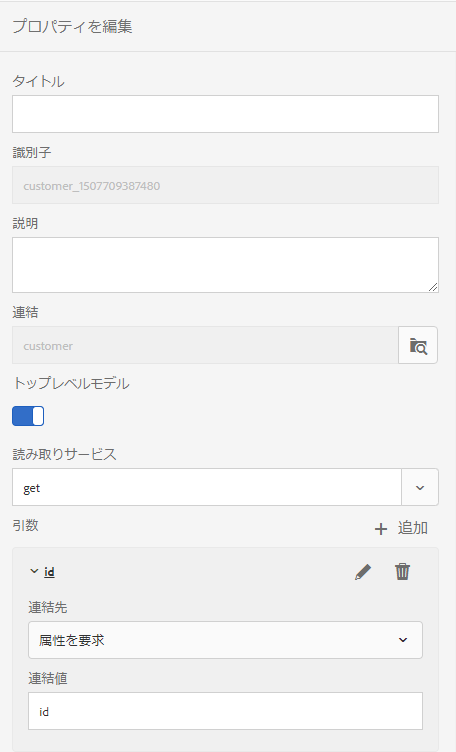

# Batch APIを使用して複数の対話型通信を生成する {#use-batch-api-to-generate-multiple-ic}

Batch APIを使用すると、テンプレートから複数のインタラクティブな通信を作成できます。 テンプレートは、データを一切使用しないインタラクティブな通信です。 Batch APIは、データとテンプレートを組み合わせてインタラクティブな通信を行います。 このAPIは、インタラクティブ通信の大量生産に役立ちます。 例えば、電話料金、複数の顧客のクレジットカード明細などです。

Batch APIは、JSON形式のレコード（データ）およびフォームデータモデルから受け取ります。 インタラクティブ通信が生成される数は、設定されたフォームデータモデルの入力JSONファイルで指定されたレコードと等しくなります。 このAPIを使用して、印刷出力とWeb出力の両方を生成できます。 「印刷」オプションではPDFドキュメントが生成され、「WEB」オプションでは個々のレコードに対してJSON形式のデータが生成されます。

## Batch APIの使用 {#using-the-batch-api}

Batch APIは監視フォルダーと組み合わせて使用することも、スタンドアロンのRest APIとして使用することもできます。 Batch APIを使用するために、生成されるインタラクティブ通信のテンプレート、出力形式（HTML、PRINTまたはその両方）、ロケール、事前入力サービスおよび名前を設定します。

レコードと対話型通信テンプレートを組み合わせて、対話型通信を作成します。 Batch APIは、レコード（インタラクティブな通信テンプレートのデータ）をJSONファイルから、またはフォームデータモデルを介してアクセスされた外部データソースから直接読み取ることができます。 各レコードを個別のJSONファイルに保持するか、すべてのレコードを1つのファイルに保持するJSON配列を作成できます。

**JSONファイル内の単一のレコード**

```json
{
   "employee": {
       "name": "Sara",
       "id": 3,
       "mobileNo": 9871996463,
       "age": 37
   }
}
```

**JSONファイル内の複数のレコード**

```json
[{
   "employee": {
       "name": "John",
       "id": 1,
       "mobileNo": 9871996461,
       "age": 39
   }
},{
   "employee": {
       "name": "Jacob",
       "id": 2,
       "mobileNo": 9871996462,
       "age": 38
   }
},{
   "employee": {
       "name": "Sara",
       "id": 3,
       "mobileNo": 9871996463,
       "age": 37
   }
}]
```

### Batch APIと監視フォルダーの連携 {#using-the-batch-api-watched-folders}

APIを簡単に体験できるように、AEM FormsはBatch APIを使用するように設定されたWatched Folderサービスをすぐに提供できます。 AEM FormsUIを介してサービスにアクセスし、複数の対話型通信を生成できます。 また、必要に応じてカスタムサービスを作成することもできます。 次に示す方法を使用して、監視フォルダーとBatch APIを使用できます。

* インタラクティブな通信を生成するために、JSONファイル形式で入力データ（レコード）を指定する
* 外部データソースに保存され、フォームデータモデルを介してアクセスされる入力データ（レコード）を使用して、インタラクティブな通信を作成する

#### インタラクティブな通信を生成するために、JSONファイル形式の入力データレコードを指定する {#specify-input-data-in-JSON-file-format}

レコードと対話型通信テンプレートを組み合わせて、対話型通信を作成します。 レコードごとに個別のJSONファイルを作成するか、またはJSON配列を作成してすべてのレコードを単一のファイルに保持することができます。

JSONファイルに保存されたレコードからインタラクティブな通信を作成するには：

1. Batch APIを使用する [ように監視フォルダーを作成](https://docs.adobe.com/content/help/en/experience-manager-64/forms/publish-process-aem-forms/creating-configure-watched-folder.html) 、設定します。
   1. AEM Forms作成者インスタンスにログインします。
   1. **[!UICONTROL ツール]** / **[!UICONTROL フォーム]** /監視フォルダーの ****&#x200B;設定に移動します。 「**[!UICONTROL 新規]**」をタップします。
   1. フォルダーの **[!UICONTROL 名前]** と物理 **** パスを指定します。 例： `c:\batchprocessing`
   1. 「次を使用してフ **[!UICONTROL ァイルを]** 処理」フィールドで「 **[!UICONTROL サービス]** 」オプションを選択します。
   1. 「サー **[!UICONTROL ビス名]** 」フィールドで、com.adobe.fd.ccm.multichannel.batch.impl.service.InteractiveCommunicationBatchServiceImpl **** サービスを選択します。
   1. 「 **[!UICONTROL 出力ファイルパターン]**」を指定します。 例えば、%F/ [パターン](https://helpx.adobe.com/experience-manager/6-5/forms/using/admin-help/configuring-watched-folder-endpoints.html#about_file_patterns) は、監視フォルダーがWatched Folder\inputフォルダーのサブフォルダー内の入力ファイルを検索できるように指定します。
1. 高度なパラメーターの設定：
   1. 「 **[!UICONTROL 詳細]** 」タブを開き、次のカスタムプロパティを追加します。

      | プロパティ | 型 | 説明 |
      |--- |--- |--- |
      | templatePath | String | 使用する対話型通信テンプレートのパスを指定します。 例：/content/dam/formsanddocuments/testsample/mediumic これは必須プロパティです。 |
      | recordPath | String | recordPathフィールドの値は、インタラクティブ通信の名前を設定するのに役立ちます。 レコードのフィールドのパスは、recordPathフィールドの値として設定できます。 例えば、/employee/Idを指定した場合、idフィールドの値は、対応する対話型通信の名前になります。 デフォルト値はランダム [ランダムUUID](https://docs.oracle.com/javase/7/docs/api/java/util/UUID.html#randomUUID())です。 |
      | usePrefillService | Boolean | 値をFalseに設定します。 usePrefillServiceパラメーターを使用すると、対応する対話型通信用に設定された事前入力サービスから取得したデータを使用して、対話型通信を事前入力できます。 usePrefillServiceがtrueに設定されている場合、（各レコードの）入力JSONデータはFDM引数として扱われます。 デフォルト値は false です。 |
      | batchType | String | 値をPRINT、WEBまたはWEB_AND_PRINTに設定します。 デフォルト値はWEB_AND_PRINTです。 |
      | locale | String | Outputのインタラクティブ通信のロケールを指定します。 標準搭載のサービスではロケールオプションを使用しませんが、カスタムサービスを作成してローカライズされたインタラクティブ通信を生成することができます。 デフォルト値はen_USです。 |

   1. 「 **[!UICONTROL 作成]** 」をタップします。監視フォルダーが作成されます。
1. インタラクティブな通信を生成するには、監視フォルダーを使用します。
   1. 監視フォルダーを開きます。 入力フォルダーに移動します。
   1. 入力フォルダーにフォルダーを作成し、新しく作成したフォルダーにJSONファイルを配置します。
   1. 監視フォルダーがファイルを処理するのを待ちます。 処理開始ーが存在する場合、入力ファイルとそのファイルを含むサブフォルダーがステージングフォルダーに移動されます。
   1. 出力フォルダーを開き、出力を表示します。
      * 監視フォルダー設定でPRINTオプションを指定すると、インタラクティブ通信用のPDF出力が生成されます。
      * 監視フォルダー設定でWEBオプションを指定すると、レコードごとのJSONファイルが生成されます。 このJSONファイルを使用して、Webテンプレートに [事前入力できます](#web-template)。
      * 「PRINT」と「WEB」の両方のオプションを指定すると、PDFドキュメントとレコードあたりのJSONファイルの両方が生成されます。

#### 外部データソースに保存され、フォームデータモデルを介してアクセスされる入力データを使用して、インタラクティブな通信を作成する {#use-fdm-as-data-source}

外部データソースに保存されたデータ（レコード）を対話型通信テンプレートと組み合わせて、対話型通信を作成します。 インタラクティブな通信を作成する場合は、フォームデータモデル(FDM)を介して外部データソースに接続し、データにアクセスします。 外部データソースから同じフォームデータモデルを使用してデータを取得するように、監視フォルダーバッチプロセスサービスを設定できます。 外部データ・ソースに保存されたレコードからインタラクティブな通信を [作成する手順は、次のとおりです](https://docs.adobe.com/content/help/en/experience-manager-64/forms/form-data-model/work-with-form-data-model.html):

1. テンプレートのフォームデータモデルの設定：
   1. インタラクティブ通信テンプレートに関連付けられたフォームデータモデルを開きます。
   1. トップレベルモデルのオブジェクトを選択し、「プロパティを編集」をタップします。
   1. 「プロパティの編集」ペインの「サービスの読み取り」フィールドから、取得または取得サービスを選択します。
   1. 読み取りサービスの引数に使用する鉛筆アイコンをタップして、引数をリクエスト属性に連結し、連結値を指定します。 これにより、指定したバインド属性またはリテラル値にサービスの引数がバインドされ、それが引数としてサービスに渡され、指定した値に関連付けられている詳細情報がデータソースから取得されます。

      <br>
        この例では、id引数はユーザープロファイルのid属性の値を受け取り、それを引数として読み取りサービスに渡します。 指定したIDの従業員データモデルオブジェクトから、関連するプロパティの値を読み取って返します。 So, if you specify 00250 in the id field in the form, the read service will read details of the employee with 00250 employee id.
        <br>

      

   1. プロパティとフォームデータモデルを保存します。
1. リクエスト属性の値の設定：
   1. ファイルシステム上に.jsonファイルを作成し、編集用に開きます。
   1. JSON配列を作成し、フォームデータモデルからデータを取得するための主な属性を指定します。 例えば、次のJSONは、FDMにIDが27126または27127のレコードのデータを送信するように要求します。

      ```json
          [
              {
                  "id": 27126
              },
              {
                  "id": 27127
              }
          ]
      ```

   1. ファイルを保存して閉じます。

1. Batch APIサービスを使用する [ように監視フォルダーを作成](https://docs.adobe.com/content/help/en/experience-manager-64/forms/publish-process-aem-forms/creating-configure-watched-folder.html) 、設定します。
   1. AEM Forms作成者インスタンスにログインします。
   1. **[!UICONTROL ツール]** / **[!UICONTROL フォーム]** /監視フォルダーの ****&#x200B;設定に移動します。 「**[!UICONTROL 新規]**」をタップします。
   1. フォルダーの **[!UICONTROL 名前]** と物理 **** パスを指定します。 例： `c:\batchprocessing`
   1. 「次を使用してフ **[!UICONTROL ァイルを]** 処理」フィールドで「 **[!UICONTROL サービス]** 」オプションを選択します。
   1. 「サー **[!UICONTROL ビス名]** 」フィールドで、com.adobe.fd.ccm.multichannel.batch.impl.service.InteractiveCommunicationBatchServiceImpl **** サービスを選択します。
   1. 「 **[!UICONTROL 出力ファイルパターン]**」を指定します。 例えば、%F/ [パターン](https://helpx.adobe.com/experience-manager/6-5/forms/using/admin-help/configuring-watched-folder-endpoints.html#about_file_patterns) は、監視フォルダーがWatched Folder\inputフォルダーのサブフォルダー内の入力ファイルを検索できるように指定します。
1. 高度なパラメーターの設定：
   1. 「 **[!UICONTROL 詳細]** 」タブを開き、次のカスタムプロパティを追加します。

      | プロパティ | 型 | 説明 |
      |--- |--- |--- |
      | templatePath | String | 使用する対話型通信テンプレートのパスを指定します。 例：/content/dam/formsanddocuments/testsample/mediumic これは必須プロパティです。 |
      | recordPath | String | recordPathフィールドの値は、インタラクティブ通信の名前を設定するのに役立ちます。 レコードのフィールドのパスは、recordPathフィールドの値として設定できます。 例えば、/employee/Idを指定した場合、idフィールドの値は、対応する対話型通信の名前になります。 デフォルト値はランダム [ランダムUUID](https://docs.oracle.com/javase/7/docs/api/java/util/UUID.html#randomUUID())です。 |  |
      | usePrefillService | Boolean | 値をTrueに設定します。 デフォルト値は false です。この値をtrueに設定すると、Batch APIは設定されたForm Data Modelからデータを読み取り、インタラクティブ通信に入力します。 usePrefillServiceがtrueに設定されている場合、（各レコードの）入力JSONデータはFDM引数として扱われます。 |
      | batchType | String | 値をPRINT、WEBまたはWEB_AND_PRINTに設定します。 デフォルト値はWEB_AND_PRINTです。 |
      | locale | String | Outputのインタラクティブ通信のロケールを指定します。 標準搭載のサービスではロケールオプションを使用しませんが、カスタムサービスを作成してローカライズされたインタラクティブ通信を生成することができます。 デフォルト値はen_USです。 |

   1. 「 **[!UICONTROL 作成]** 」をタップします。監視フォルダーが作成されます。
1. インタラクティブな通信を生成するには、監視フォルダーを使用します。
   1. 監視フォルダーを開きます。 入力フォルダーに移動します。
   1. 入力フォルダーにフォルダーを作成します。 手順2で作成したJSONファイルを新しく作成したフォルダーに配置します。
   1. 監視フォルダーがファイルを処理するのを待ちます。 処理開始ーが存在する場合、入力ファイルとそのファイルを含むサブフォルダーがステージングフォルダーに移動されます。
   1. 出力フォルダーを開き、出力を表示します。
      * 監視フォルダー設定でPRINTオプションを指定すると、インタラクティブ通信用のPDF出力が生成されます。
      * 監視フォルダー設定でWEBオプションを指定すると、レコードごとのJSONファイルが生成されます。 このJSONファイルを使用して、Webテンプレートに [事前入力できます](#web-template)。
      * 「PRINT」と「WEB」の両方のオプションを指定すると、PDFドキュメントとレコードあたりのJSONファイルの両方が生成されます。

## REST要求を使用してBatch APIを呼び出す

Representational State Transfer(REST)要求 [を通じてBatch API](https://helpx.adobe.com/jp/experience-manager/6-5/forms/javadocs/index.html) （バッチAPI）を呼び出すことができます。 これにより、他のユーザーがAPIにアクセスできるようにRESTエンドポイントを提供し、インタラクティブ通信を処理、保存、カスタマイズするための独自のメソッドを設定できます。 独自のカスタムJavaサーブレットを開発して、AEMインスタンスにAPIをデプロイできます。

Javaサーブレットをデプロイする前に、インタラクティブな通信を行い、対応するデータファイルの準備が整っていることを確認します。 次の手順を実行して、Javaサーブレットを作成しデプロイします。

1. AEMインスタンスにログインし、インタラクティブ通信を作成します。 以下のサンプルコードで説明している対話型の通信を使用するには、ここを [クリックしてください](assets/SimpleMediumIC.zip)。
1. [AEMインスタンスでApache Mavenを使用してAEMプロジェクトを構築](https://helpx.adobe.com/experience-manager/using/maven_arch13.html) 、デプロイします。
1. AEMプロジェクトのPOMファイルの依存関係リストにある追加AEM FormsクライアントSDKバージョン6.0.12 [](https://repo.adobe.com/nexus/content/repositories/public/com/adobe/aemfd/aemfd-client-sdk/) 以降。 例：

   ```xml
       <dependency>
           <groupId>com.adobe.aemfd</groupId>
           <artifactId>aemfd-client-sdk</artifactId>
           <version>6.0.122</version>
       </dependency>
   ```

1. Javaプロジェクトを開き、CCMBatchServlet.javaなどの.javaファイルを作成します。 次のコードを ファイルに追加します。

   ```java
           package com.adobe.fd.ccm.multichannel.batch.integration;
   
           import java.io.File;
           import java.io.FileInputStream;
           import java.io.FileOutputStream;
           import java.io.IOException;
           import java.io.InputStream;
           import java.io.PrintWriter;
           import java.util.List;
           import javax.servlet.Servlet;
           import org.apache.commons.io.IOUtils;
           import org.apache.sling.api.SlingHttpServletRequest;
           import org.apache.sling.api.SlingHttpServletResponse;
           import org.apache.sling.api.servlets.SlingAllMethodsServlet;
           import org.json.JSONArray;
           import org.json.JSONObject;
           import org.osgi.service.component.annotations.Component;
           import org.osgi.service.component.annotations.Reference;
   
           import com.adobe.fd.ccm.multichannel.batch.api.builder.BatchConfigBuilder;
           import com.adobe.fd.ccm.multichannel.batch.api.factory.BatchComponentBuilderFactory;
           import com.adobe.fd.ccm.multichannel.batch.api.model.BatchConfig;
           import com.adobe.fd.ccm.multichannel.batch.api.model.BatchInput;
           import com.adobe.fd.ccm.multichannel.batch.api.model.BatchResult;
           import com.adobe.fd.ccm.multichannel.batch.api.model.BatchType;
           import com.adobe.fd.ccm.multichannel.batch.api.model.RecordResult;
           import com.adobe.fd.ccm.multichannel.batch.api.model.RenditionResult;
           import com.adobe.fd.ccm.multichannel.batch.api.service.BatchGeneratorService;
           import com.adobe.fd.ccm.multichannel.batch.util.BatchConstants;
           import java.util.Date;
   
   
           @Component(service=Servlet.class,
           property={
                   "sling.servlet.methods=GET",
                   "sling.servlet.paths="+ "/bin/batchServlet"
           })
           public class CCMBatchServlet extends SlingAllMethodsServlet {
   
               @Reference
               private BatchGeneratorService batchGeneratorService;
               @Reference
               private BatchComponentBuilderFactory batchBuilderFactory;
               public void doGet(SlingHttpServletRequest req, SlingHttpServletResponse resp) {
                   try {
                       executeBatch(req,resp);
                   } catch (Exception e) {
                       e.printStackTrace();
                   }
               }
               private void executeBatch(SlingHttpServletRequest req, SlingHttpServletResponse resp) throws Exception {
                   int count = 0;
                   JSONArray inputJSONArray = new JSONArray();
                   String filePath = req.getParameter("filePath");
                   InputStream is = new FileInputStream(filePath);
                   String data = IOUtils.toString(is);
                   try {
                       // If input file is json object, then create json object and add in json array, if not then try for json array
                       JSONObject inputJSON = new JSONObject(data);
                       inputJSONArray.put(inputJSON);
                   } catch (Exception e) {
                       try {
                           // If input file is json array, then iterate and add all objects into inputJsonArray otherwise throw exception
                           JSONArray inputArray = new JSONArray(data);
                           for(int i=0;i<inputArray.length();i++) {
                               inputJSONArray.put(inputArray.getJSONObject(i));
                           }
                       } catch (Exception ex) {
                           throw new Exception("Invalid JSON Data. File name : " + filePath, ex);
                       }
                   }
                   BatchInput batchInput = batchBuilderFactory.getBatchInputBuilder().setData(inputJSONArray).setTemplatePath("/content/dam/formsanddocuments/[path of the interactive communcation]").build();
                   BatchConfig batchConfig = batchBuilderFactory.getBatchConfigBuilder().setBatchType(BatchType.WEB_AND_PRINT).build();
                   BatchResult batchResult = batchGeneratorService.generateBatch(batchInput, batchConfig);
                   List<RecordResult> recordList = batchResult.getRecordResults();
                   JSONObject result = new JSONObject();
                   for (RecordResult recordResult : recordList) {
                       String recordId = recordResult.getRecordID();
                       for (RenditionResult renditionResult : recordResult.getRenditionResults()) {
                           if (renditionResult.isRecordPassed()) {
                               InputStream output = renditionResult.getDocumentStream().getInputStream();
                               result.put(recordId +"_"+renditionResult.getContentType(), output);
   
                               Date date= new Date();
                               long time = date.getTime();
   
                               // Print output
                               if(getFileExtension(renditionResult.getContentType()).equalsIgnoreCase(".json")) {
                                   File file = new File(time + getFileExtension(renditionResult.getContentType()));
                                   copyInputStreamToFile(output, file);
                               } else
                               {
                                   File file = new File(time + getFileExtension(renditionResult.getContentType()));
                                   copyInputStreamToFile(output, file);
                               }
                           }
                       }
                   }
                   PrintWriter writer = resp.getWriter();
                   JSONObject resultObj = new JSONObject();
                   resultObj.put("result", result);
                   writer.write(resultObj.toString());
               }
   
   
               private static void copyInputStreamToFile(InputStream inputStream, File file)
                       throws IOException {
   
                       try (FileOutputStream outputStream = new FileOutputStream(file)) {
   
                           int read;
                           byte[] bytes = new byte[1024];
   
                           while ((read = inputStream.read(bytes)) != -1) {
                               outputStream.write(bytes, 0, read);
                           }
   
                       }
   
                   }
   
   
               private String getFileExtension(String contentType) {
                   if (contentType.endsWith(BatchConstants.JSON)) {
                       return ".json";
                   } else return ".pdf";
               }
   
   
           }
   ```

1. 上記のコードで、テンプレートパス(setTemplatePath)をテンプレートのパスに置き換え、setBatchType APIのset値を設定します。
   * インタラクティブ通信用のPRINTオプションを指定すると、PDF出力が生成されます。
   * WEBオプションを指定すると、レコードごとにJSONファイルが生成されます。 このJSONファイルを使用して、Webテンプレートに [事前入力できます](#web-template)。
   * 「PRINT」と「WEB」の両方のオプションを指定すると、PDFドキュメントとレコードあたりのJSONファイルの両方が生成されます。

1. [mavenを使用して、更新したコードをAEMインスタンスにデプロイします](https://helpx.adobe.com/experience-manager/using/maven_arch13.html#BuildtheOSGibundleusingMaven)。
1. バッチAPIを呼び出して、インタラクティブな通信を生成します。 バッチAPIは、レコード数に応じてPDFファイルと.jsonファイルのストリームを印刷します。 このJSONファイルを使用して、Webテンプレートに [事前入力できます](#web-template)。 上記のコードを使用する場合、APIはにデプロイされ `http://localhost:4502/bin/batchServlet`ます。 このコードは、PDFファイルとJSONファイルのストリームを印刷して返します。

### Webテンプレートの事前入力 {#web-template}

batchTypeを設定してWebチャネルをレンダリングする場合、APIは各データレコードに対してJSONファイルを生成します。 次の構文を使用して、JSONファイルと対応するWebチャネルーをマージし、インタラクティブな通信を生成できます。

**構文**
`http://host:port/<template-path>/jcr:content?channel=web&mode=preview&guideMergedJsonPath=<guide-merged-json-path>`

**例** JSONファイルがにあり、次のインタラクティブ通信テンプレート `C:\batch\mergedJsonPath.json` を使用する場合： `http://host:port/content/dam/formsanddocuments/testsample/mediumic/jcr:content?channel=web`

次に、公開ノード上の次のURLは、対話型通信のWfcチャネルを表示する
`http://host:port/<path-to-ic>/jcr:content?channel=web&mode=preview&guideMergedJsonPath=file:///C:/batch/mergedJsonData.json`

データをファイルシステムに保存する以外にも、JSONファイルをCRX-repository、ファイルシステム、Webサーバーに保存したり、OSGI事前入力サービスを介してデータにアクセスしたりできます。 様々なプロトコルを使用してデータを結合するための構文を次に示します。

* **CRXプロトコル**

   `http://host:port/<path-to-ic>/jcr:content?channel=web&mode=preview&guideMergedJsonPath=crx:///tmp/fd/af/mergedJsonData.json`

* **ファイルプロトコル**

   `http://host:port/<path-to-ic>/jcr:content?channel=web&mode=preview&guideMergedJsonPath=file:///C:/Users/af/mergedJsonData.json`

* **事前入力サービスプロトコル**

   `http://host:port/<path-to-ic>/jcr:content?channel=web&mode=preview&guideMergedJsonPath=service://[SERVICE_NAME]/[IDENTIFIER]`

   SERVICE_NAME は OSGI 事前入力サービスの名前を参照します。「事前入力サービスの作成と実行」を参照してください。

   IDENTIFIER は、事前入力データを取得するために OSGI 事前入力サービスが必要とするメタデータを参照します。ログイン済みユーザーの識別子は、使用できるメタデータの一例です。

* **HTTPプロトコル**

   `http://host:port/<path-to-ic>/jcr:content?channel=web&mode=preview&guideMergedJsonPath=http://localhost:8000/somesamplexmlfile.xml`

>[!NOTE]
>
>デフォルトでは、CRXプロトコルのみが有効になっています。 サポートされている他のプロトコルを有効にするには、「Configuration Managerを使用した事前入力サービスの [設定](https://helpx.adobe.com/experience-manager/6-5/forms/using/prepopulate-adaptive-form-fields.html#ConfiguringprefillserviceusingConfigurationManager)」を参照してください。
