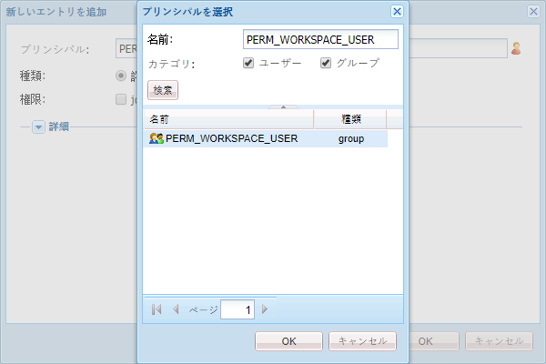

# AEM Forms Workspace のカスタマイズの一般的な手順に従います。{#generic-steps-for-aem-forms-workspace-customization}

カスタマイズを実行するための一般的な手順を以下に示します。

1. にアクセスしてCRXDE Liteにログインしま `https://'[server]:[port]'/lc/crx/de/index.jsp`す。
1. Create a folder named `ws`at `/apps`, if it does not exist. 「**[!UICONTROL すべて保存]**」をクリックします。
1. Browse to `/apps/ws`, and navigate to the **[!UICONTROL Access Control]** tab.
1. In the **[!UICONTROL Access Control]** list, click **[!UICONTROL +]** to add a new entry. もう一度「**[!UICONTROL +]**」をクリックします。
1. Search and select the **PERM_WORKSPACE_USER** Principal.

   

1. Give `jcr:read` privilege to the Principal.
1. 「**[!UICONTROL すべて保存]**」をクリックします。
1. Copy the `GET.jsp` and `html.jsp`files from the `/libs/ws`folder to the `/apps/ws` folder.
1. フォルダー内 `/libs/ws/locales` のフォルダーをコピ `/apps/ws` ーします。 「**[!UICONTROL すべて保存]**」をクリックします。
1. Update the references and relative paths in the `GET.jsp` file, as shown below, and click **[!UICONTROL Save all]**.

   ```
   <meta http-equiv="refresh" content="0;URL='/lc/apps/ws/index.html'" />
   ```

1. CSS のカスタマイズは以下のようにして実行します。

   1. Navigate to the `/apps/ws` folder and create a new folder named `css`.

   1. `css` フォルダに `newStyle.css` という名前の新しいファイルを作成します。

   1. Open `/apps/ws/html`.jsp and change from

   ```css
   <link lang="en" rel="stylesheet" type="text/css" href="css/style.css" />
   <link lang="en" rel="stylesheet" type="text/css" href="css/jquery-ui.css"/>
   ```

   を

   ```css
   <link lang="en" rel="stylesheet" type="text/css" href="../../libs/ws/css/style.css" />
   <link lang="en" rel="stylesheet" type="text/css" href="css/newStyle.css" />
   <link lang="en" rel="stylesheet" type="text/css" href="../../libs/ws/css/jquery-ui.css"/>
   ```

   >[!NOTE]
   >
   >上記のように、newStyle.css のエントリの後ろにユーザー定義された CSS ファイルのエントリを配置します。

1. /apps/ws/html.jsp ファイルで、

   ```css
   <script data-main="js/main" src="js/libs/require/require.js"></script>
   ```

   を

   ```css
   <script data-main="js/main" src="../../libs/ws/js/libs/require/require.js"></script>
   ```

1. 以下の操作を実行してください。

   1. Create a folder named `js`at `/apps/ws`. 「**[!UICONTROL すべて保存]**」をクリックします。

   1. Create a folder named `libs`at `/apps/ws/js`. 「**[!UICONTROL すべて保存]**」をクリックします。

   1. Create a folder named `jqueryui`at `/apps/ws/js/libs`. 「**[!UICONTROL すべて保存]**」をクリックします。

   1. にコピ `/libs/ws/js/libs/jqueryui/jquery.ui.datepicker-ja.js` ーしま `/apps/ws/js/libs/jqueryui`す。 「**[!UICONTROL すべて保存]**」をクリックします。

1. HTML のカスタマイズは以下のようにして実行します。

   1. の下で、 `/apps/ws/js`という名前のフォルダを作成しま `runtime`す。 「**[!UICONTROL すべて保存]**」をクリックします。

   1. の下で、 `/apps/ws/js/runtime`という名前のフォルダを作成しま `templates`す。 「**[!UICONTROL すべて保存]**」をクリックします。

   1. にコピ `/libs/ws/js/main.js` ーしま `/apps/ws/js/main.js`す。

   1. Copy /libs/ws/js/registry.js to `/apps/ws/js/registry.js`.

1. 「**[!UICONTROL Save All]**」をクリックし、キャッシュをクリアして AEM Forms Workspace を更新します。

   URLにアクセスし、管 `https://'[server]:[port]'/lc/ws` 理者/パスワードの資格情報を使用してログインします。 ブラウザーがにリダイレクトされま `https://'[server]:[port]'/lc/apps/ws/index.html`す。
