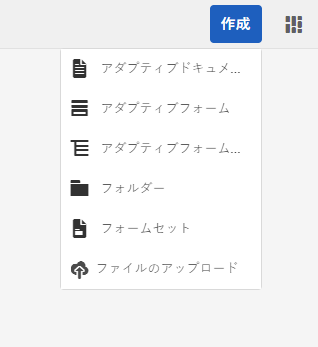
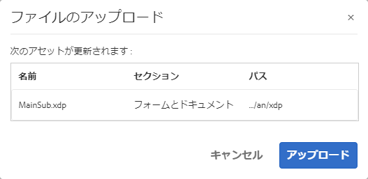
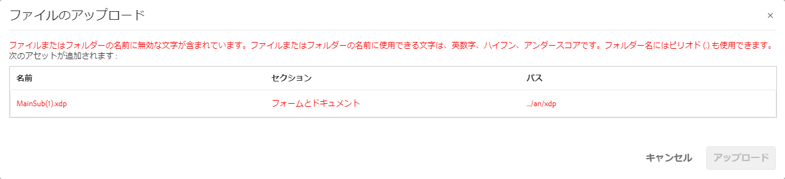
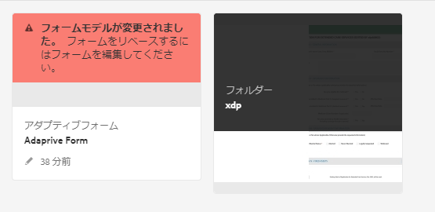
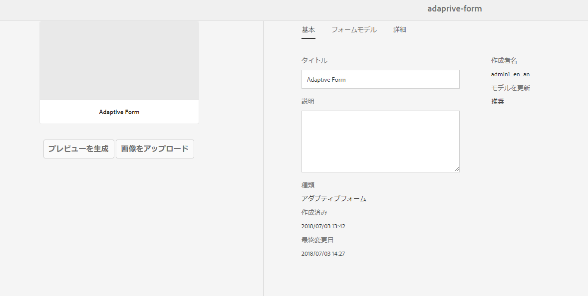

# AEM Forms での XDP および PDF ドキュメントの取得{#getting-xdp-and-pdf-documents-in-aem-forms}

## 概要 {#overview}

AEM Forms でアップロードすることで、ローカルファイルシステムのフォームを CRX リポジトリに読み込むことができます。アップロード操作は、次のアセットタイプに対してサポートされています。

* フォームテンプレート（XFA フォーム）
* PDF のフォーム
* ドキュメント（非インタラクティブ PDF ドキュメント）

サポートされているアセットタイプを個別にまたは ZIP アーカイブとしてアップロードできます。You can upload an asset of the type `Resource`, only alongside an XFA form in a ZIP archive.

>[!NOTE]
>
>XDP ファイルをアップロードすることができる `form-power-users` グループのメンバーであることを確認してください。このグループのメンバーになるには、管理者に連絡します。

## フォームのアップロード {#uploading-forms}

1. Log in to the AEM Forms user interface by accessing `https://'[server]:[port]'/aem/forms.html`.
1. フォームまたはフォームを含むフォルダーをアップロードしたいフォルダーに移動します。
1. アクションツールバーで、**作成／ファイルのアップロード**&#x200B;をタップします。

   

1. フォームまたはパッケージをアップロードダイアログでは、アップロードするファイルを参照および選択できます。ファイルブラウザーには、サポートされているファイル形式（ZIP、XDP、および PDF）のみが表示されます。

   >[!NOTE]
   >
   >ファイル名には、英数字、ハイフン、下線のみを含めることができます。

1. ファイルを選択したら「アップロード」をクリックしてファイルをアップロードするか、「キャンセル」をクリックしてアップロードを中止します。追加されたアセットおよび現在場所にアップロードされたアセットの一覧がポップアップに表示されます。

   >[!NOTE]
   >
   >ZIP ファイルの場合は、サポートされているすべてのアセットの相対パスが表示されます。ZIP 内の未サポートアセットは無視され、一覧には表示されません。ただし、ZIP アーカイブに未サポートアセットのみが含まれている場合は、エラーメッセージが表示され、ポップアップダイアログは表示されません。

   

1. アセットに無効のファイル名がある場合は、エラーが表示されます。赤で強調表示されているファイル名を修正し、再びアップロードしてください。

   

アップロードが完了すると、アセットのプレビューに基づいて、バックグラウンドワークフローが各アセットごとにサムネイルを生成します。新しいバージョンのアセットがアップロードされた場合は、既存のアセットに上書きされます。

### 保護モード {#protected-mode}

AEM Forms サーバーを使用することで、JavaScript コードを実行できます。悪質な JavaScript コードの場合、AEM Forms 環境に障害が発生する可能性があります。保護モードは、信頼済みのアセットおよび場所からのみ XDP ファイルを実行するように制限します。AEM Forms UI で使用可能なすべての XDP は、信頼済みのアセットと見なされます。

保護モードは、デフォルトではオンになっています。必要に応じて、保護モードを無効にすることができます。

1. AEM Web コンソールに管理者としてログインします。The URL is https://&#39;[server]:[port]&#39;/system/console/configMgr
1. Mobile Forms の設定を編集用に開きます。
1. 「保護モード」オプションの選択を解除し、「**保存**」をクリックします。保護モードは無効です。

## 参照先 XFA フォームの更新 {#updating-referenced-xfa-forms}

AEM Forms では、XFA フォームテンプレートは、アダプティブフォームまたは別の XFA フォームテンプレートによって参照されることができます。また、テンプレートはリソースまたは別の XFA テンプレートを参照することもできます。

XFA を参照しているアダプティブフォームは、そのフィールドが、XFA で使用できるフィールドによってバインディングされています。フォームテンプレートを更新すると、関連のアダプティブフォームは XFA との同期を試みます。詳細については、[アダプティブフォームと関連 XXFA との同期](../../forms/using/synchronizing-adaptive-forms-xfa.md)を参照してください。

フォームテンプレートを削除すると、依存関係にあるアダプティブフォームまたはフォームテンプレートが破損されます。このようなアダプティブフォームは、dirty なフォームとして非公式に参照されている場合があります。AEM Forms ユーザーインターフェイスで、次の 2 つの方法で dirty フォームを見つけ出すことができます。

* アセットリスト内のアダプティブフォームサムネイルに警告アイコンが表示され、警告アイコンの上にポインターを置くと次のメッセージが表示されます。\
   `Schema/Form Template for this adaptive form has been updated so please go to Authoring mode and rebase it with new version.`

アダプティブフォームが dirty かどうかを示すフラグが保持されます。この情報は、フォームのメタデータと一緒にフォームプロパティページにあります。Only for dirty adaptive forms, a metadata property `Model Refresh` displays `Recommended` value.

