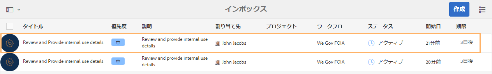
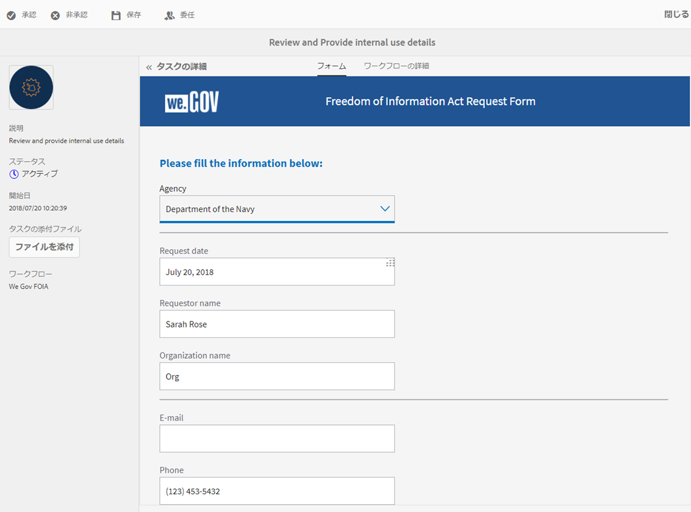
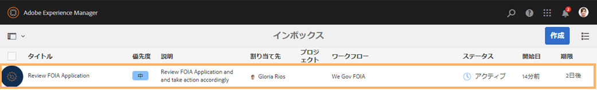
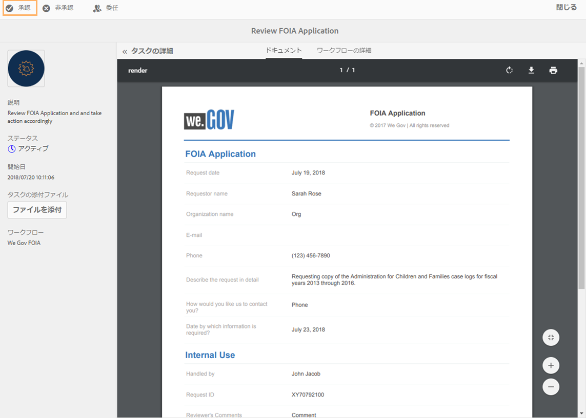

# We.Gov リファレンスサイトの FOIA チュートリアル {#we-gov-reference-site-foia-walkthrough}

## リファレンスサイトの情報公開法シナリオ {#reference-site-freedom-of-information-act-scenario}

We.Gov は、養子縁組をした場合に養親がチャイルドサポートの申込を行う公的機関です。We.Gov では、情報公開法の下、養親が下記の政府機関に情報を請求することが許可されています。

* アメリカ国防兵站局
* 国防総省監察総監室
* 司法省 - 情報政策室
* 海軍省
* 環境保護庁

For more information on the Freedom Of Information Act, see [www.foia.gov](https://www.foia.gov).

このシナリオでは、以下の人物が登場します。

* Sarah Rose（情報を要求する担当者）
* John Jacobs（請求を処理し適切な部門へ転送する担当者）
* Gloria Rios（請求に応じて情報を提供する政府機関職員）

## Sarah が FOIA の下、情報の請求を開始 {#sarah-initiates-request-for-information-under-foia}

Freedom of Information Act（情報の自由法）に基づき、Sarahは、2013年から2016年までの間、Administration for Children and Familiesのケースログのコピーを要求します。 Sarah は、この請求を司法省 - 情報政策室に提出し、印刷と郵送の費用として最大 100 米ドルを支払うことに署名します。

### 仕組み {#how-it-works}

### 実際の動作確認 {#see-it-yourself}

In your browser, open `https://<hostname>:<PublishPort>/wegov`. We.Gov サイトで、Applications（申し込み）／All Applications（すべての申し込み）をクリックします。すべてのアプリ管理ページで、「FOIA申請」の下の「適用」をタップします。

## Sarah が FOIA の下、情報公開の申し込みを開始 {#sarah-starts-her-application-for-information-under-foia}

Sarah clicks **Apply** and in the Freedom of Information Act Request Form page, Sarah enters information including the following:

* **代理店：** Sarahは、リクエストの宛先となったエージェンシーを法務省 — 情報ポリシーに指定します。

* **支払い期限**:Sarahは、印刷費用と送料費用に対して、最大100米ドルを支払うつもりであることを指定します。
* **リクエストの詳細を説明します**。Sarahは、「2013年度から2016年度の、子どもと家族の管理のケースログのコピーをリクエストしています」と指定します。

児童家庭援護庁の 2013 年度から 2016 年度までの訴訟の記録のコピーの請求

いつでも、Sarah は「Save」（保存）をタップしてドラフトを保存し、後でフォームを記入して送信することができます。Sarah はフォームを送信します。

>[!NOTE]
>
>resume-from-email ワークフローは、ログインしているユーザーでのみ機能します。リファレンスサイトのシナリオでは、ユーザー Sarah Rose が追加されていることを確認します。Sarah&#39;s login credentials are `srose/password`.

## John Jacobs が申込書を受信および承認 {#john-jacobs-receives-and-approves-the-application}

John Jacobs が請求を受信してそれを担当者に送ります。AEM インボックスでは、Gloria はすべての送信済み申込を 1 つの場所で見ることができます。

### 仕組み {#how-it-works-1}

Sarah が FOIA の申込書に入力して送信すると、請求のレコードが John Jacobs のインボックスに送信されます。John Jacobs は送信された申込書を確認し、承認または拒否することができます。

### 実際の動作確認 {#see-it-yourself-1}

AEMインボックスにアクセスするには、https://&lt;***hostname***>:&lt;***PublishPort***>/content/we-finance/global/en/login.html?resource=/aem/inbox.htmlにアクセスします。 John Jacobsのユーザー名/パスワードとしてjjacobs/passwordを使用し、AEMのインボックスにログインし、FOIAアプリケーションを確認します。 For information about using AEM Inbox for forms-centric workflow tasks, see [Manage Forms applications and tasks in AEM Inbox](/help/forms/using/manage-applications-inbox.md).

John Jacobs は申し込みダッシュボードから申し込みを確認、承認、または拒否することができます。John Jacobs は申し込みの詳細を選択して開き、確認後に承認します。

### <strong>Sarah が送信確認の電子メールを受信</strong> {#strong-sarah-receives-an-acknowledgement-email-strong}

John Jacobs が申し込みを承認した後、Sarah は We.Gov サイトから送信確認の電子メールを受け取ります。Sarah は、申し込みの処理にかかる料金と時間について通知を受けます。電子メールには、Sarah が申請を更新する場合の問い合わせ先として、電子メールと電話の詳細も含まれています。

## Gloria は 2 次承認として FOIA の請求を受信 {#gloria-receives-the-foia-request-for-second-level-approval}

John Jacobs が必要な情報を記入し Sarah の請求を承認すると、請求は最終承認として Gloria Rios に進められます。Gloria は添付されたレコードのドキュメントを確認して、請求を承認します。

### 仕組み {#how-it-works-2}

John Jacobs が FOIA の請求を承認すると、申込書の PDF またはレコードのドキュメントが作成され、Gloria Rios のインボックスに送信されます。Gloria は送信された請求を確認し、請求を承認または拒否することができます。

### 実際の動作確認 {#see-for-yourself}

AEMインボックスにアクセスするには、https://&lt;***hostname***>:&lt;***PublishPort***>/content/we-finance/global/en/login.html?resource=/aem/inbox.htmlにアクセスします。 Gloria Riosのユーザー名とパスワードにgrios/passwordを使用してAEMインボックスにログインし、FOISリクエストを確認します。

Gloria は FOIA 請求を開いて詳細を確認します。請求の詳細を確認し、請求されたドキュメントの提供の可能性を確認した後、Gloria は請求を承認します。

## Sarah は、請求が承認されたことを伝える通知を受信します。{#sarah-receives-notification-that-her-request-is-approved}

Gloria がFOIA の請求を承認した後、Sarah は We.Gov サイトから申請が承認されたことを知らせる電子メールを受信します。電子メールには、ドキュメント提供の仮の予定と請求を追跡するための問い合わせの詳細も含まれています。

