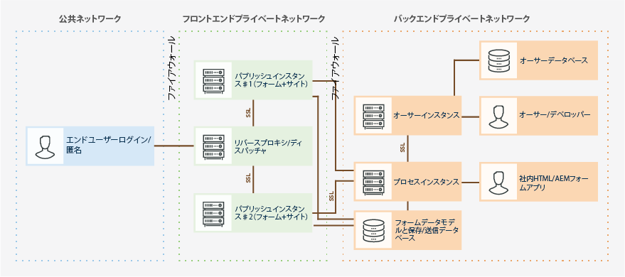

# OSGi 環境における AEM Forms のセキュリティの強化 {#hardening-and-securing-aem-forms-on-osgi-environment}

OSGi サーバー上で AEM Forms を保護する場合の推奨事項とベストプラクティス

サーバー環境のセキュリティを強化することは、企業にとって最も重要な課題です。この記事では、AEM Forms が稼働するサーバーを保護する場合の推奨事項とベストプラクティスについて説明します。この記事では、オペレーティングシステム用のホストを保護するための包括的な情報ではなく、デプロイされているアプリケーションのセキュリティを強化するために実装する必要があるさまざまなセキュリティ設定について説明します。ただし、アプリケーションサーバーのセキュリティを確保するには、この記事に記載されている推奨事項だけでなく、セキュリティのモニター手順、検出手順、応答手順についても実施する必要があります。この記事では、PII（個人の特定が可能な情報）を保護する場合のベストプラクティスとガイドラインについても説明します。

この記事は、アプリケーションの計画、インフラストラクチャの開発、AEM Forms のデプロイメントを担当するコンサルタント、セキュリティスペシャリスト、システムアーキテクト、IT 専門スタッフを対象としています。また、この対象読者には、次のような一般的な職務の担当者も含まれます。

* 自社または顧客の組織に、Web アプリケーションとサーバーを保護した状態でデプロイする必要がある IT エンジニアおよびオペレーションエンジニア。
* 組織内のクライアントマシンのアーキテクチャ計画に責任を負うアーキテクトおよびプランナー.
* 組織内のプラットフォーム全体のセキュリティ保護に取り組む IT セキュリティ専門家。
* 顧客とパートナーの詳細なリソースを必要とするアドビおよびパートナーのコンサルタント。

以下の図は、適切なファイアウォールトポロジーが設定された、AEM Forms の一般的なデプロイメント環境で使用されるコンポーネントとプロトコルを示しています。

AEM Forms は非常にカスタマイズ性が高いため、さまざまな環境で使用することができます。ここで紹介するいくつかの推奨事項は、お客様の組織に該当しない場合があります。

## トランスポート層の保護 {#secure-transport-layer}

トランスポート層の脆弱性は、インターネットやイントラネットに接続されているアプリケーションサーバーにとって、最も重大な脅威の 1 つです。ここでは、このような脆弱性に対してネットワーク上のホストを堅牢化する手順について説明します。具体的には、ネットワークのセグメント化、TCP/IP（Transmission Control Protocol/Internet Protocol）スタックの堅牢化、ホスト保護のためのファイアウォールの使用などの手順を取り上げます。

### エンドポイントのアクセスの制限  {#limit-open-endpoints}

外部のファイアウォールを使用して、エンドユーザーによる AEM Forms パブリッシュファームへのアクセスを制限することができます。また、内部のファイアウォールを使用して、社内の他の要素（オーサーインスタンス、処理インスタンス、データベースなど）とパブリッシュファーム間のアクセスを制限することもできます。エンドユーザーおよび組織の要素内で、限られた数のAEM FormsURLへのアクセスをファイアウォールで有効にできるようにします。

#### 外部ファイアウォールの設定  {#configure-external-firewall}

外部のファイアウォールを設定することにより、AEM Forms の特定の URL に対して、インターネットへのアクセスを許可することができます。アダプティブフォーム、HTML5、Correspondence Managementレターの入力または送信、またはAEM Formsサーバーへのログインには、次のURLへのアクセスが必要です。

<table> 
 <tbody>
  <tr>
   <td>コンポーネント</td> 
   <td>URI</td> 
  </tr>
  <tr>
   <td>アダプティブフォーム</td> 
   <td>
    <ul> 
     <li>/content/dam/formsanddocuments/AF_PATH/jcr:content</li> 
     <li>/etc/clientlibs/fd/</li> 
     <li>/content/forms/af/AF_PATH</li> 
     <li>/libs/granite/csrf/</li> 
    </ul> </td> 
  </tr>
  <tr>
   <td>HTML5 のフォーム</td> 
   <td>
    <ul> 
     <li>/content/forms/formsets/profiles/</li> 
    </ul> </td> 
  </tr>
  <tr>
   <td>Correspondence Management </td> 
   <td>
    <ul> 
     <li>/aem/forms/createcorrespondence* </li> 
    </ul> </td> 
  </tr>
  <tr>
   <td>フォームポータル </td> 
   <td>
    <ul> 
     <li>/content/forms/portal/</li> 
     <li>/libs/cq/ui/widgets*</li> 
     <li>/libs/cq/security/</li> 
    </ul> </td> 
  </tr>
  <tr>
   <td> AEM Forms アプリケーション</td> 
   <td>
    <ul> 
     <li>/j_security_check*</li> 
     <li>/soap/services/AuthenticationManagerService</li> 
    </ul> </td> 
  </tr>
 </tbody>
</table>

#### 内部ファイアウォールの設定  {#configure-internal-firewall}

内部のファイアウォールを設定することにより、特定の AEM Forms コンポーネント（オーサーインスタンス、処理インスタンス、データベースなど）に対して、パブリッシュファームや、トポロジーダイアグラムに記述されている他の内部コンポーネントとの通信を許可することができます。

<table> 
 <tbody>
  <tr>
   <td>ホスト  </td> 
   <td>URI</td> 
  </tr>
  <tr>
   <td>パブリッシュファーム（パブリッシュノード）</td> 
   <td>/bin/receive</td> 
  </tr>
  <tr>
   <td>処理サーバー</td> 
   <td>/content/forms/fp/*</td> 
  </tr>
  <tr>
   <td>Forms ワークフローのアドオンサーバー（JEE サーバー上の AEM Forms）</td> 
   <td>/soap/sdk</td> 
  </tr>
 </tbody>
</table>

#### リポジトリの権限とアクセス権限リスト（ACL）の設定 {#setup-repository-permissions-and-access-control-lists-acls}

パブリッシュノード上で使用可能なアセットには、デフォルトですべてのユーザーがアクセスすることができます。すべてのアセットで、読み取り専用アクセス権が有効になっています。匿名アクセスを有効にするには、読み取り専用アクセス権が必要になります。フォームの表示アクセス権と送信アクセス権を認証済みユーザーだけに制限する場合は、共通グループを使用して、パブリッシュノード上で使用可能なアセットに対する読み取り専用アクセス権を、認証ユーザーに対してのみ付与します。以下に示す場所（ディレクトリ）には、保護する必要があるフォームアセットが保管されています。これらのアセットには、認証済みユーザーに対する読み取り専用アクセス権が設定されています。

* /content/&amp;ast;
* /etc.clientlibs/fd/&amp;ast;
* /libs/fd/&amp;ast;

## フォームデータの安全な操作  {#securely-handle-forms-data}

AEM Forms では、事前に定義された場所と一時フォルダーにデータが保管されます。これらのデータを保護して、データの不正使用を防ぐ必要があります。

### 一時フォルダーの定期的なクリーンアップの設定 {#setup-periodic-cleanup-of-temporary-folder}

ファイルの添付、コンポーネントの検証、コンポーネントのプレビュー用のフォームを設定すると、対応するデータが、/tmp/fd/ のパブリッシュノードに保管されます。これらのデータは定期的に削除されます。デフォルトのデータ削除ジョブを変更して、データの削除間隔を短くすることができます。スケジュール設定されているデータ削除ジョブを変更するには、AEM Web コンソールを開いて AEM Forms 一時ストレージクリーニングタスクを起動し、Cron 式を変更します。

上記のシナリオの場合、認証済みユーザーのデータだけが保存されます。また、アクセス制御リスト（ACL）によってデータが保護されます。そのため、データの削除間隔を短くすると、データの保護をさらに強化することができます。

### フォームポータル送信アクションによる保存データの保護 {#secure-data-saved-by-forms-portal-submit-action}

デフォルトでは、アダプティブフォームのフォームポータル送信アクションを実行すると、パブリッシュノードのローカルレポジトリにデータが保存されます。このデータは、/content/forms/fp に保存されます。**パブリッシュインスタンスにデータを保存することはお勧めしません。**

ストレージサービスを設定して、データを有線で処理クラスターに送信することができます。ローカルのパブリッシュノード上にデータを保存する必要はありません。処理クラスターは、プライベートファイアウォールによって保護された安全な場所に配置されているため、データのセキュリティを確保することができます。

パブリッシュノードから処理サーバーにデータをポストするには、AEM DS 設定サービスに対する処理サーバーの資格情報を使用します。処理サーバーのリポジトリに対する読み取りアクセス権と書き込みアクセス権が設定された、権限が制限されている非管理者ユーザーの資格情報を使用することをお勧めします。詳しくは、「[ドラフトと送信に使用するストレージサービスの設定](/help/forms/using/configuring-draft-submission-storage.md)」を参照してください。

### フォームデータモデル（FDM）で使用するデータの保護 {#secure-data-handled-by-form-data-model-fdm}

最低限必要な権限だけが設定されているユーザーアカウントを使用して、フォームデータモデル（FDM）のデータソースを設定してください。管理者権限が設定されているアカウントを使用すると、認証されていないユーザーがメタデータとスキーマエンティティにアクセスする可能性があります。\
 データを統合して、FDM サービス要求を認証する方法を提供することもできます。実行前と実行後の認証メカニズムを挿入して、サービス要求を検証することができます。サービス要求は、フォームの事前入力時、フォームの送信時、ルールを使用したサービスの呼び出し時に生成されます。

**処理前認証機能：**&#x200B;処理前認証機能を使用すると、要求を実行する前に、その要求の妥当性を検証することができます。入力、サービス、要求の詳細情報を使用して、要求の実行を許可するか停止するかを選択することができます。実行を停止する場合は、データ統合例外として OPERATION_ACCESS_DENIED を返すことができます。また、クライアント要求を実行用として送信する前に、その要求を変更することもできます。例えば、入力を変更して追加情報を指定することができます。

**処理後認証機能：**&#x200B;処理後認証機能を使用すると、実行結果を要求者に返す前に、その結果の検証と制御を行うことができます。また、実行結果のフィルタリングやプルーニング、実行結果に対する追加データの挿入を行うこともできます。

### ユーザーアクセスの制限 {#limit-user-access}

オーサーインスタンス、パブリッシュインスタンス、処理インスタンスに対して、それぞれ異なるユーザー役割を設定する必要があります。いずれのインスタンスについても、管理者の資格情報を使用して実行することは避けてください。

**パブリッシュインスタンスの場合：**

* forms-users グループに属しているユーザーだけが、プレビュー、ドラフトの作成、フォームの送信を実行することができます。
* cm-user-agent グループに属しているユーザーだけが、Correspondence Management のレターをプレビューすることができます。
* 不要な匿名アクセスをすべて無効にしてください。

**オーサーインスタンスの場合：**

* 各役割に対して、特定の権限が設定された異なる事前定義グループのセットが用意されています。ユーザーを各グループに割り当ててください。

   * forms-user グループに属しているユーザーの権限は、以下のようになっています。

      * フォームの作成、入力、発行、送信を行うことができます。
      * XDP ベースのアダプティブフォームを作成することはできません。
      * アダプティブフォームのスクリプトを作成することはできません。
      * XDP のインポートや、XDP が含まれているパッケージのインポートを実行することはできません。
   * forms-power-user グループに属しているユーザーは、すべてのタイプのフォームについて、作成、入力、発行、送信を行うことができます。また、アダプティブフォームのスクリプトの作成と、XDP が含まれているパッケージのインポートも実行することができます。
   * template-authors グループと template-power-user グループに属しているユーザーは、テンプレートのプレビューと作成を行うことができます。
   * fdm-authors グループに属しているユーザーは、フォームデータモデルの作成と変更を行うことができます。
   * cm-user-agent グループに属しているユーザーは、Correspondence Management レターの作成、プレビュー、発行を行うことができます。
   * workflow-editors グループに属しているユーザーは、インボックスアプリケーションとワークフローモデルを作成することができます。

**処理インスタンスの場合：**

* リモート側でフォームの保存と送信を行う場合、読み取り権限を持つユーザーを作成し、crx-repository の content/form/fp パスで権限の作成と変更を行ってください。
* ユーザーによる AEM インボックスアプリケーションの使用を許可するには、そのユーザーを workflow-user グループに追加してください。

## AEM Forms 環境のイントラネット要素の保護 {#secure-intranet-elements-of-an-aem-forms-environment}

通常、処理クラスタと Forms ワークフローアドオン（JEE 上の AEM Forms）は、ファイアウォールの背後で稼働します。そのため、これらのクラスタとアドオンのセキュリティは確保されています。これらの環境を強化する手順は、引き続きいくつか実行できます。

### 処理クラスターの保護 {#secure-processing-cluster}

処理クラスターはオーサーモードで稼働しますが、開発作業で処理クラスターを使用しないでください。また、一般ユーザーを、処理クラスターの content-authors グループや form-users グループに追加しないでください。

### AEM のベストプラクティスの実施による AEM Forms 環境の保護 {#use-aem-best-practices-to-secure-an-aem-forms-environment}

以下に示す「AEM セキュリティチェックリスト」には、AEM Forms 環境のセキュリティを確保するための手順が記載されています。デプロイメントを行う際に、ベースとなる AEM インストール環境のセキュリティを確保する必要があります。詳しい手順については、「[AEM セキュリティチェックリスト](/help/sites-administering/security-checklist.md)」を参照してください。
