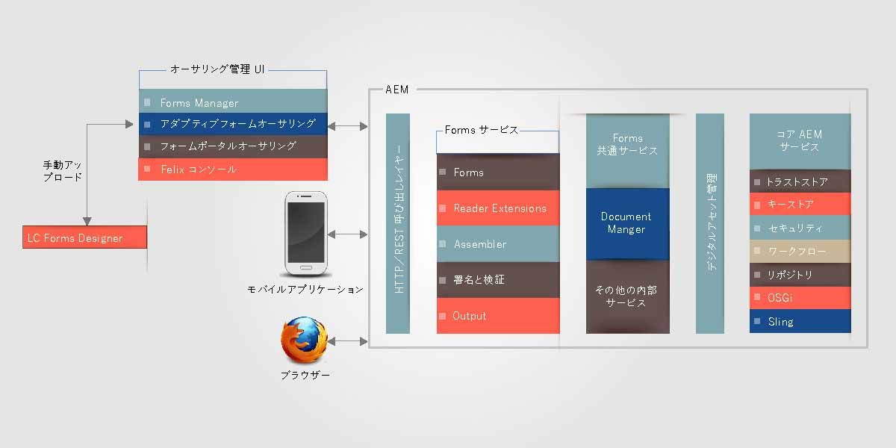
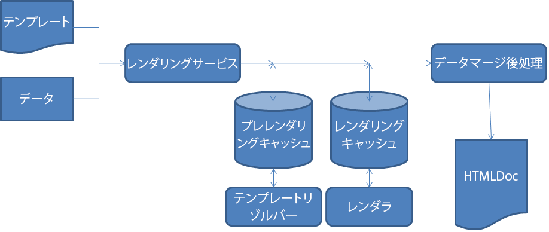

# アーキテクチャ of HTML5 forms{#architecture-of-html-forms}

## アーキテクチャ {#architecture}

HTML5 forms functionality is deployed as a package within the embedded AEM instance and is exposesd as a REST end point over HTTP/S using RESTful [Apache Sling Architecture](https://sling.apache.org/).

`` [ 01-aem-forms-architecture *表示（フルサイズ）*](javascript:void(0).md)

.md)

### Sling フレームワークの使用 {#using-sling-framework}

[Apache Sling](https://sling.apache.org/) はリソースを中心としています。それは 要求 URL を使用してまずリソースを解決します。それぞれのリソースには **sling:resourceType**（または **sling:resourceSuperType**）プロパティがあります。このプロパティ、要求メソッド、および要求プロパティのプロパティに基づき、要求を処理するために Sling スクリプトが選択されます。この Sling スクリプトは JSP またはサーブレットにすることができます。HTML5 フォームの場合、**Profile** ノードは Sling リソースとして機能し、**プロファイルレンダラー**&#x200B;はモバイルフォームをレンダリングするために特定のプロファイルで要求を処理する Sling スクリプトとして機能します。**プロファイルレンダラー**&#x200B;は要求からパラメーターを読み取り、Forms OSGi サービスを呼び出す JSP です。

For details on REST endpoint and supported request parameters, see [Rendering Form Template](/help/forms/using/rendering-form-template.md).

ユーザーがiOSやAndroidブラウザーなどのクライアントデバイスから要求を行うと、Slingはまず要求URLに基づいてプロファイルノードを解決します。 この Profile ノードから、それは **sling:resourceSuperType** と **sling:resourceType** を読み取り、このフォームレンダリング要求を処理できる使用可能なスクリプトをすべて特定します。次に、それは Sling 要求セレクターを要求メソッドとともに使用して、この要求の処理に最適なスクリプトを特定します。要求がプロファイルレンダラー JSP に達したら、JSP は Forms OSGi サービスを呼び出します。

Sling スクリプトの解決について詳しくは、「[AEM Sling Cheat Sheet](https://docs.adobe.com/content/docs/en/cq/current/developing/sling_cheatsheet.html)」または「[Apache Sling Url decomposition](https://sling.apache.org/site/url-decomposition.html)」を参照してください。

#### 一般的なフォーム処理呼び出しのフロー {#typical-form-processing-call-flow}

HTML5 フォームは、最初のリクエスト時にフォームを処理（レンダリングまたは送信）するために必要なすべての中間オブジェクトをキャッシュします。データに依存するオブジェクトはキャッシュしません（このようなオブジェクトは変更されることが多いからです）。

Mobile Forms は、PreRender キャッシュと Render キャッシュの 2 つの異なるレベルのキャッシュを持っています。preRender キャッシュは解決されたテンプレートのすべてのフラグメントと画像含み、Render キャッシュはレンダリングされたコンテンツ（例えば HTML）を含みます。

HTML5 フォームのワークフロー

HTML5 フォームは、フラグメントと画像の参照がないテンプレートはキャッシュしません。HTML5 フォームの処理にかかる時間が通常より長くなる場合は、サーバーログをチェックして、不足している参照や警告を調べてください。また、オブジェクトの最大サイズに達していないことも確認してください。

Forms OSGi サービスは次の 2 つの手順でリクエストを処理します。

* **レイアウトと初期フォーム状態の生成**：Forms OSGi レンダリングサービスは、フォームキャッシュコンポーネントを呼び出して、このフォームがすでにキャッシュされていて無効化されていないかを調べます。 フォームがキャッシュされ有効になっている場合は、キャッシュから生成 HTML を提供します。フォームが無効化されている場合、Forms OSGi レンダリングサービスは、初期フォームレイアウトとフォーム状態を XML 形式で生成します。この XML は Forms OSGi サービスによって HTML レイアウトと初期 JSON フォーム状態に変換されてから、後続の要求のためにキャッシュされます。
* **事前入力されたフォーム**:レンダリング時に、ユーザーが事前入力されたデータを含むフォームを要求した場合、Forms OSGiレンダリングサービスはFormsサービスコンテナを呼び出し、マージされたデータを含む新しいフォーム状態を生成します。 ただし、上記の手順でレイアウトはすでに生成されているので、この呼び出しのほうが最初の呼び出しよりも高速です。この呼び出しはデータの結合とデータへのスクリプトの実行のみを実施します。

フォームまたはフォーム内で使用されているアセットに更新がある場合、フォームキャッシュコンポーネントはその更新を検出し、その特定のフォームのキャッシュは無効になります。 Forms OSGi サービスが処理を完了したら、プロファイルレンダラー JSP はこのフォームに JavaScript ライブラリの参照とスタイル設定を追加し、応答をクライアントに返します。[Apache](https://httpd.apache.org/) のような一般的な Web サーバーは HTML 圧縮オンでここで使用できます。Webサーバーは、応答サイズ、ネットワークトラフィック、およびサーバーとクライアントコンピューター間でのデータのストリーミングに要する時間を大幅に短縮します。

When a user submits the form, the browser sends state of form in JSON format to the [submit service proxy](../../forms/using/service-proxy.md); then the submit service proxy generates a data XML using JSON data and submits that data XML to submit endpoint.

## コンポーネント {#components}

HTML5 フォームを有効にするには AEM Forms アドオンパッケージが必要です。アドオンパッケージのインストールについて詳しくは、「[AEM Forms のインストールと設定](../../forms/using/installing-configuring-aem-forms-osgi.md)」を参照してください。

### OSGi コンポーネント（adobe-lc-forms-core.jar） {#osgi-components-adobe-lc-forms-core-jar}

**Adobe XFA Forms Renderer(com.adobe.livecycle.adobe-lc-forms-core)** は、Felix管理コンソールのバンドル表示(https://[host]:[port]/system/console/bundles)から表示した場合の、HTML5 forms OSGiバンドルの表示名です。

このコンポーネントにはレンダリング、キャッシュの管理、および環境設定用の OSGi コンポーネントが含まれています。

#### Forms OSGi サービス {#forms-osgi-service}

この OSGi サービスには XDP を HTML としてレンダリングするロジックが含まれていて、データ XML を生成するためにフォームの送信を処理します。このサービスは Forms サービスコンテナを使用します。Forms サービスコンテナは処理を実行するネイティブコンポーネント `XMLFormService.exe` を内部的に呼び出します。

レンダリング要求を受け取った場合、このコンポーネントはFormsサービスコンテナを呼び出して、レイアウトと状態の情報を生成し、HTMLおよびJSONフォームのDOM状態を生成するためにさらに処理されます。

また、このコンポーネントは送信されたフォーム状態の JSON からデータ XML も生成します。

#### キャッシュコンポーネント {#cache-component}

HTML5 フォームはキャッシュを使用して、スループットと応答時間を最適化します。キャッシュサービスのレベルを設定して、パフォーマンスとスペース使用率のトレードオフを微調整できます。

<table>
 <tbody>
  <tr>
   <th>キャッシュ方法</th>
   <th>説明</th>
  </tr>
  <tr>
   <td>なし</td>
   <td>アーティファクトをキャッシュしない  </td>
  </tr>
  <tr>
   <td>保守的</td>
   <td>インラインフラグメントと画像を含むテンプレートのようなフォームのレンダリング前に生成される中間アーティファクトのみをキャッシュ</td>
  </tr>
  <tr>
   <td>アグレッシブ</td>
   <td>レンダリングされた HTML コンテンツをキャッシュ 保守的レベルでキャッシュされたすべてのアーティファクトをキャッシュ <strong>注意</strong>：この方法は最適なパフォーマンスにつながりますが、キャッシュされたアーティファクトの保存のためにより多くのメモリを消費します。</td>
  </tr>
 </tbody>
</table>

HTML5 フォームは LRU 方法を使用してメモリ内キャッシングを実行します。キャッシュ方法が「なし」に設定されている場合、キャッシュは作成されず、既存のキャッシュデータがある場合は消去されます。キャッシング方法の他に、合計メモリ内キャッシュサイズの設定も可能で、それはキャッシュサイズの最大限界値を適用するのに役立ち、その限界値を越えるとキャッシュリソースを空けるために LRU モードが使用されます。

>[!NOTE]
>
>メモリ内キャッシュはクラスターノード間で共有されません。

#### 設定サービス {#configuration-service}

設定サービスは HTML5 フォームの設定パラメータとキャッシュ設定の調整を可能にします。

To update these settings, go to the CQ Felix Admin Console (available at https://&lt;&#39;[server]:[port]&#39;/system/console/configMgr), search for and select Mobile Forms Configuration.

設定サービスを使用して、キャッシュサイズを設定したりキャッシュを無効化したりできます。また、デバッグオプションパラメーターの使用によるデバッグも有効化できます。More information about debugging forms can be found at [Debugging HTML5 forms](/help/forms/using/debug.md).

### ランタイムコンポーネント（adobe-lc-forms-runtime-pkg.zip）{#runtime-components-adobe-lc-forms-runtime-pkg-zip}

HTML フォームのレンダリングに使用されるクライアント側ライブラリが含まれています。

**ランタイムパッケージの一部として使用できる重要なコンポーネント：**

#### スクリプティングエンジン {#scripting-engine}

Adobe XFA の実装は、フォームにおけるユーザー定義のロジックの実行を有効化するために、JavaScript と FormCalc の 2 種類のスクリプティング言語をサポートしています。

HTML フォームのスクリプティングエンジンはこれらの両方の言語で XFA スクリプティング API をサポートするために、JavaScript で記述されています。

レンダリング時に、FormCalc スクリプトはユーザーやデザイナーに対して透過的なサーバー上で JavaScript に変換（およびキャッシュ）されます。

このスクリプティングエンジンは Object.defineProperty のような、いくつかの ECMAScript5 の機能を使用します。エンジン／ライブラリはカテゴリ名 **xfaforms.profile** で CQ クライアントライブラリとして提供されます。It also provides **FormBridge API** to enable external portals or apps to interact with form. FormBridge を使用することで、外部アプリは特定の要素をプログラムで非表示にしたり、それらの値を取得または設定したり、それらの属性を変更したりできます。

詳しくは、「[Form Bridge](/help/forms/using/form-bridge-apis.md)」の記事を参照してください。

#### レイアウトエンジン {#layout-engine}

HTML5 フォームのレイアウトと視覚的な側面は SVG 1.1、jQuery、BackBone、および CSS3 の機能に基づいています。サーバーでフォームの初期の外観が生成およびキャッシュされます。初期のレイアウトへの変更、およびフォームレイアウトへのさらなるインクリメンタルな変更はクライアントで管理されます。これを達成するために、ランタイムパッケージには JavaScript で記述されていて、jQuery／Backbone がベースのレイアウトエンジンが含まれています。このエンジンは繰り返し可能インスタンスの追加／削除、拡張可能オブジェクトレイアウトなどの、すべてのダイナミック動作を処理します。このレイアウトエンジンは 1 ページずつフォームをレンダリングします。最初、1 ページのみが表示され、水平スクロールバーは先頭ページのみを示します。ただし、ユーザーがスクロールダウンすると、次のページがレンダリングし始めます。このページごとのレンダリングはブラウザーで最初のページをレンダリングするために必要な時間を削減し、フォームの認識されるパフォーマンスを強化します。このエンジン／ライブラリはカテゴリ名が **xfaforms.profile** の CQ クライアントライブラリの一部です。

レイアウトエンジンにもユーザーからフォームフィールドの値を取得するために使用されるウィジェットのセットが含まれています。これらのウィジェットはレイアウトエンジンとシームレスに機能するように、特定の追加のコントラクトを実装する [jQuery UI ウィジェット](https://api.jqueryui.com/jQuery.widget/)としてモデルされます。

ウィジェットとそれに対応するコントラクトについて詳しくは、「[HTML5 フォームのカスタムウィジェット](/help/forms/using/introduction-widgets.md)」を参照してください。

#### スタイル設定 {#styling}

HTML要素に関連付けられたスタイルは、インラインまたは埋め込みCSSブロックに基づいて追加されます。 フォームに依存しない一般的なスタイルの一部は、xfaforms.プロファイルというカテゴリ名のCQクライアントライブラリの一部です。

デフォルトのスタイル設定プロパティに加え、各フォーム要素には要素タイプ、名前、および他のプロパティに基づいた、特定の CSS クラスが含まれています。これらのクラスを使用し、独自の CSS を指定することで要素を再スタイル設定することができます。

デフォルトのスタイル設定とクラスについて詳しくは、「[スタイルの概要](/help/forms/using/css-styles.md)」を参照してください。

#### サーバー側スクリプトと Web サービス {#server-side-script-and-web-services}

サーバーで実行されるようにマークされている、または Web サービスを呼び出すようにマークされているスクリプトは、必ずサーバーで実行されます。

クライアントスクリプトエンジンは：

1. 現在のフォーム状態を JSON 形式で渡しながら、サーバーに同期呼び出しします。
1. サーバー上でスクリプトまたは Web サービスを実行します。
1. 新しい JSON 状態を生成します。
1. 応答が返されるときにクライアントで新しい JSON 状態を結合します。

#### ローカライズのリソースバンドル {#localization-resource-bundles}

HTML5フォームは、イタリア語(it)、スペイン語(es)、ポルトガル語(pt_BR)、簡体字中国語(zh_CN)、繁体字中国語（限定的なサポートのみ）、韓国語(ko_KR)、英語(en_US)、フランス語(fr_FR)、ドイツ語(de_DE)をサポートしています。、日本語(ja)の言語を使用します。 要求ヘッダーで受信されるロケールに基づいて、それに対応するリソースバンドルがクライアントに送信されます。このリソースバンドルはカテゴリ名が **xfaforms.I18N** の CQ クライアントライブラリとして、プロファイル JSP に追加されます。ロケールパッケージを取得するロジックを上書きすることができます。プロファイル

### Sling コンポーネント（adobe-lc-forms-content-pkg.zip）{#sling-components-adobe-lc-forms-content-pkg-zip}

Sling パッケージにはプロファイルとプロファイルレンダラーに関係するコンテンツが含まれています。

#### プロファイル {#profiles}

プロファイルはフォームまたはフォームのファミリーを表現する Sling のリソースノードです。CQ レベルで、これらのプロファイルは JCR ノードです。ノードは JCR リポジトリの **/content** フォルダーにあり、**/content** フォルダー内のどのサブフォルダー内にでも含めることができます。

#### プロファイルレンダラー {#profile-renderers}

Profile ノードに **xfaforms/profile** の値を持つ **sling:resourceSuperType** プロパティがあります。This property internally sends forward requests to the sling script for Profile nodes located in the **/libs/xfaforms/profile** folder. これらのスクリプトは、HTML フォームと必要な JS／CSS アーティファクトを組み合わせるためのコンテナである、JSP ページです。それらのページには、次への参照が含まれます。

* **xfaforms.I18N.&lt;locale>**：このライブラリには、ローカライズされたデータが含まれています。
* **xfaforms.profile**：このライブラリには XFA スクリプティングとレイアウトエンジンの実装が含まれています。

これらのライブラリは、CQ フレームワークの JavaScript ライブラリの自動連結、縮小、および圧縮の機能を利用する CS クライアントライブラリをモデルとしています。CQ クライアントについて詳しくは、「[CQ Clientlib Documentation](https://docs.adobe.com/docs/en/cq/current/developing/components/clientlibs.html)」を参照してください。

上記のとおり、プロファイルレンダラー JPS は Sling include をとおして Forms サービスをを呼び出します。また、この JSP は管理設定または要求パラメーターに応じて、さまざまなデバッグオプションも設定します。

HTML5 フォームを使用することで、開発者はプロファイルとプロファイルレンダラーを作成してフォームの外観をカスタマイズできるようになります。例えば、HTML5 フォームでは、開発者はフォームをパネル内または既存の HTML ポータルの &lt;div> セクションに統合できます。カスタムフォームの作成について詳しくは、「[カスタムプロファイルの作成](/help/forms/using/custom-profile.md)」を参照してください。[サポートへのお問い合わせ](https://www.adobe.com/account/sign-in.supportportal.html)
