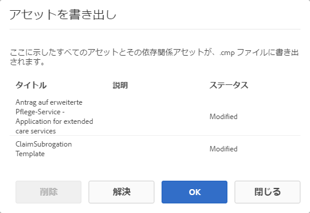
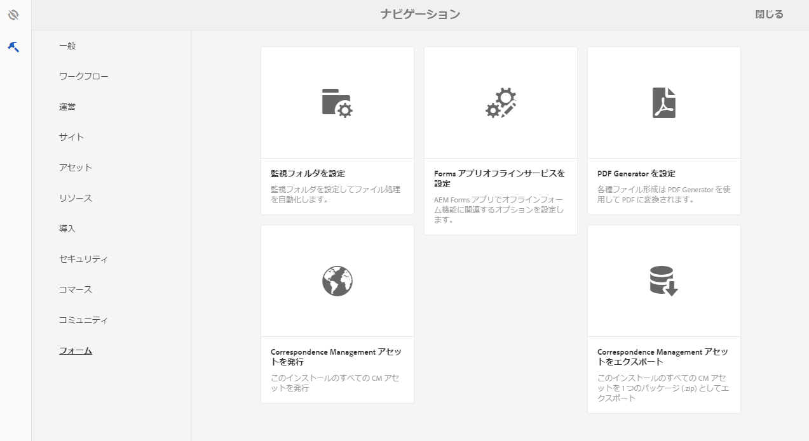
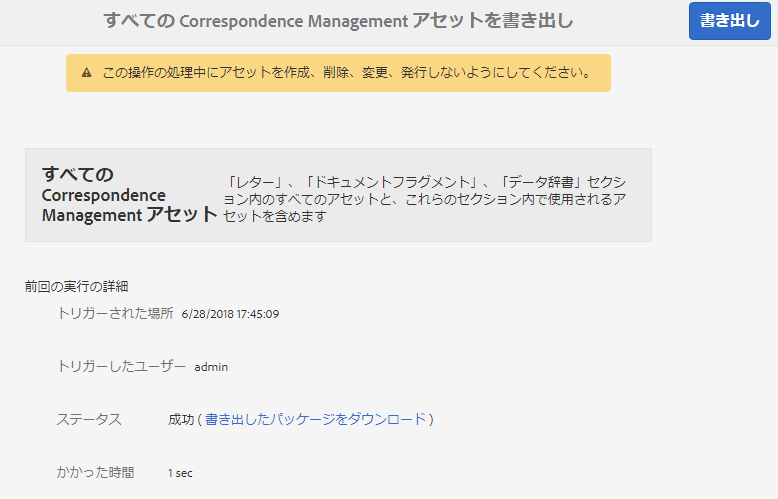
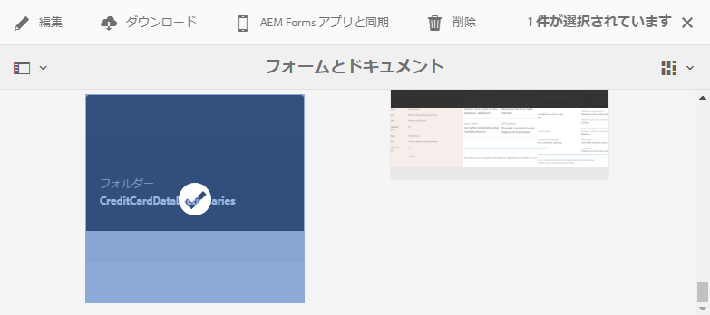
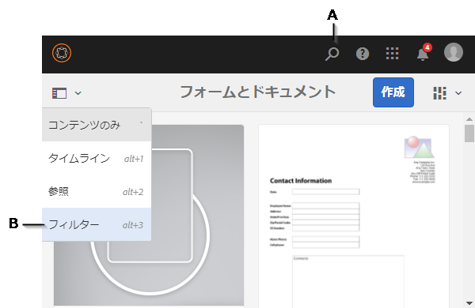
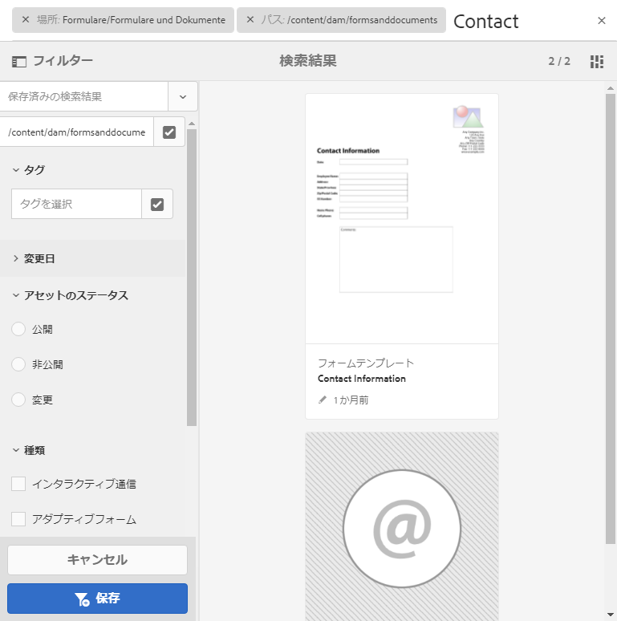

# AEM Forms におけるアセットの読み込みと書き出し{#importing-and-exporting-assets-to-aem-forms}

フォームおよび関連アセット、テーマ、データディクショナリ、ドキュメントフラグメント、レターは、別々のAEM Formsインスタンス間で移動できます。 そうした移動が必要になるのは、システムを移行する場合か、ステージサーバーから実稼働サーバーへ AEM Form を移動する場合です。AEM Forms UI を介したアップロードおよび読み込みがサポートされるアセットの場合、Forms UI を使用して書き出しと読み込みを行うことをお勧めします。このようなアセットの書き出しと読み込みに AEM Package Manager を使用するのは、お勧めしません。

>[!NOTE]
>
>* AEM 6.4Formsでは、crx-repositoryの構造とパスが変更されました。 以前のバージョンのアセットをAEM 6.4Formsに読み込んだ場合、フォームが古い構造に依存しているときは、依存関係を手動で書き出す必要があります。 リポジトリの構造とパスの変更の詳細は、AEMでの [リポジトリ再構築を参照してください](/help/sites-deploying/repository-restructuring.md)。

>

## フォームとドキュメントアセットのダウンロードまたはアップロード {#download-or-upload-forms-amp-documents-assets}

AEM Forms ユーザーインターフェイスを使用すると、アセットを AEM CRX パッケージまたはバイナリファイルとしてダウンロードして、AEM インスタンスからアセットを書き出すことができます。その後、ダウンロードした AEM CRX パッケージまたはバイナリファイルを別の AEM インスタンスに読み込むことができます。

AEM Formsユーザーインターフェイスを介した書き出しと読み込みは、アダプティブフォームテンプレートとアダプティブフォームコンテンツポリシーを除くすべてのアセットでサポートされます。 したがって、AEM Forms UI からのアダプティブフォームの書き出し時に、関連するアダプティブフォームテンプレートおよびコンテンツポリシーは、他の関連するアセットのように自動的に書き出されません。

これらのアセットタイプの場合、AEM Package Manager を使用してソースの AEM サーバー上で CRX パッケージを作成し、書き出し先のサーバーにパッケージをインストールする必要があります。パッケージの作成とインストールについて詳しくは、「[パッケージの操作](/help/sites-administering/package-manager.md)」を参照してください。

### フォームとドキュメントアセットのダウンロード {#download-forms-amp-documents-assets}

Formsおよびドキュメントのアセットをダウンロードするには：

1. AEM Forms インスタンスにログインします。
1. Tap Experience Manager  icon > navigation  icon> Forms > Forms &amp; Documents.
1. フォームアセットを選択し、「**ダウンロード**」アイコンをタップします。
1. In the Download Asset(s), choose one of the following options, and tap **Download**.

   * 「**CRX パッケージとしてダウンロード**」：選択したすべてのアセットおよび関連する依存関係を AEM Forms インスタンスからダウンロードして、別のインスタンスに移動するオプションを使用します。すべてのアセットとフォルダーを、CRX パッケージとしてダウンロードします。AEM で作成されたフォーム（アダプティブフォーム、インタラクティブ通信、アダプティブフォームフラグメント）、フォームセット、フォームテンプレート、PDF ドキュメント、各種リソース（XSD、XFS、画像）など、すべてのフォームアセットを AEM Forms の UI からパッケージとしてダウンロードすることができます。アセットをパッケージとしてダウンロードすることのメリットは、ダウンロード用に選択されたアセットによって使用されてきたアセットをもダウンロードできることです。例えば、フォームテンプレート、XSD、1 枚の画像を使用するアダプティブフォームがあるとします。このアダプティブフオームを選択してパッケージとしてダウンロードする場合、ダウンロードされるパッケージにはフォームテンプレート、XSD、画像が含まれています。そのアセットに関連付けられているメタデータプロパティ（カスタムプロパティを含む）も同様にダウンロードされます。

   * 「**アセットをバイナリファイルとしてダウンロード**」：フォームテンプレート（XDP）、PDF フォーム（PDF）、ドキュメント（PDF）、リソース（画像、スキーマ、スタイルシート）のみをダウンロードするオプションを使用します。これらのアセットは外部アプリケーションで編集できます。バイナリを持つフォームアセット（XSD、XDP、画像、PDF、XDP など）を .zip ファイルとしてダウンロードします。You cannot download adaptive forms, Interactive Communications, adaptive form fragments, themes, and form sets with **Download asset(s) as binary files** option. このアセットをダウンロードするには、「**パッケージとしてダウンロード**」オプションを使用する必要があります。

   選択したアセットはアーカイブ（.zip ファイル）としてダウンロードされます。

   >[!NOTE]
   >
   >AEM パッケージとバイナリファイルはどちらもアーカイブ（.zip ファイル）としてダウンロードされます。アセットと一緒にアセット用のテンプレートがダウンロードされることはありません。アセット用のテンプレートは、個別にエクスポートする必要があります。

### フォームとドキュメントアセットのアップロード {#upload-forms-amp-documents-assets}

フォームとドキュメントアセットをアップロードするには：

>[!VIDEO](https://vimeo.com/)

1. AEM Forms インスタンスにログインします。
1. Tap Experience Manager  icon > navigation  icon> Forms> Forms &amp; Documents.
1. **作成**／**ファイルのアップロード**&#x200B;の順にタップします。フォームのアップロードまたはパッケージのアップロードダイアログが表示されます。
1. ダイアログボックスで、読み込むパッケージまたはアーカイブを参照し、選択します。PDFドキュメント、XSD、画像、スタイルシート、XDPフォームを選択することもできます。 「**開く**」をタップします。選択するフォルダーまたはファイル名に特殊文字を含めないでください。

   On the dialog box, verify the details of assets being uploaded, and tap **Upload**.

   既存のフォームアセットをアップロードすると、そのアセットが更新されます。

   >[!NOTE]
   >
   >パッケージのアップロードによって既存のフォルダー階層が置換されることはありません。例えば、あるサーバーの /content/dam/formsanddocuments という URL 上に「Training」という名前のアダプティブフォームがあるとします。ユーザーがそのアダプティブフォームをダウンロードし、他のサーバーにアップロードします。しかしアップロード先のサーバーにも、同じ /content/dam/formsanddocuments 上に「Training」というフォルダーがあります。アップロードは失敗します。

## テーマのダウンロードとアップロード {#downloading-or-uploading-a-theme}

AEM Forms では、テーマを作成、ダウンロード、アップロードすることができます。テーマは、フォーム、ドキュメント、レターなど他のアセットと同様に作成することができます。テーマを作成、ダウンロードし、別のインスタンスにアップロードして再利用することができます。テーマの詳細については、「[AEM Forms におけるテーマ](../../forms/using/themes.md)」を参照してください。

### テーマのダウンロード {#downloading-a-theme}

他のプロジェクトやインスタンスで使用する AEM Forms のテーマをエクスポートできます。AEM では、テーマを zip ファイルとしてダウンロードし、それをインスタンスにアップロードすることができます。

テーマをダウンロードするには、次の手順を実行します。

1. AEM Forms インスタンスにログインします。
1. Tap Experience Manager  icon > navigation  icon> Forms> Themes.
1. テーマを選択し、「**ダウンロード**」をタップします。テーマはアーカイブ（.zipファイル）としてダウンロードされます。

### テーマのアップロード {#uploading-a-theme}

プロジェクトにスタイル設定がプリセットされた作成済みのテーマを使用することができます。他の人が作成したテーマのパッケージをプロジェクトにアップロードしてインポートすることができます。

テーマをアップロードするには、次の手順を行います。

1. Experience Manager で、**フォーム／テーマ**&#x200B;に移動します。
1. テーマページで、**作成／ファイルのアップロード**&#x200B;をクリックします。
1. ファイルのアップロードプロンプトで、コンピュータ上のテーマパッケージを参照して選択し、「**アップロード**」をクリックします。アップロードしたテーマは、テーマページで使用できます。

1. AEM Forms インスタンスにログインします。
1. Tap Experience Manager  icon > navigation  icon> Forms> Themes.
1. **作成**／**ファイルのアップロード**&#x200B;をクリックします。ファイルのアップロードプロンプトで、コンピュータ上のテーマパッケージを参照して選択し、「**アップロード**」をクリックします。テーマがアップロードされます。

## Correspondence Management におけるアセットの読み込みと書き出し {#import-and-export-assets-in-correspondence-management}

データ辞書、レター、ドキュメントフラグメントなどのアセットを 2 つの異なる Correspondence Management の実装間で共有するには、.cmp ファイルを作成して共有します。.cmp ファイルには、1 つ以上のデータ辞書、レター、ドキュメントフラグメント、フォームを含めることができます。

### ドキュメントフラグメント、レターまたはデータ辞書の書き出し {#export-document-fragments-letters-and-or-data-dictionaries}

1. レター、ドキュメントフラグメントまたはデータ辞書のページの中で、単一のパッケージとして書き出すアセットをタップして選択し、次に「ダウンロードのキュー」をタップします。書き出し用のアセットが一覧表示されます。
1. 必要に応じて上記の手順を繰り返し、レター、ドキュメントフラグメント、データ辞書を追加します。
1. 「**ダウンロード**」をタップします。
1. Correspondence Managementにアセットのダウンロードダイアログが表示され、書き出しリストにアセットのリストが表示されます。

   

1. 書き出された依存関係を表示するには、「解決」をタップします。または、スキップして次の手順に進みます。依存関係は「解決」をタップしなくても書き出されます。
1. To download the .cmp file, tap **OK**.
1. Correspondence Management によって .cmp ファイルがお使いのコンピューターにダウンロードされます。

   .cmp ファイル には書き出されたアセットが含まれています。他のユーザーと .cmp ファイルを共有することができます。他のユーザーは、異なるサーバーに .cmp ファイルを読み込んで、新しいサーバーですべてのアセットを取得することができます。

### すべての Correspondence Management アセットをパッケージとして書き出し {#export-all-the-correspondence-management-assets-as-a-package}

このオプションを使用して、すべての Correspondence Management アセットおよび関連する依存関係を、AEM Forms インスタンスからパッケージとしてダウンロードします。

例えば、Correspondence Management に画像とテキストを使用しているレターが含まれている場合、ダウンロードしたパッケージにもレターに関連する画像とテキストが含まれます。そのアセットに関連付けられているメタデータプロパティ（カスタムプロパティを含む）も同様にダウンロードされます。Once you have downloaded the package (.cmp), you can [import the package to a different AEM Forms instance](../../forms/using/import-export-forms-templates.md#p-upload-forms-documents-assets-p).

すべての Correspondence Management アセットおよび関連する依存関係をパッケージとしてダウンロードするには、次の手順を実行します。

1. AEM Forms サーバーに Forms ユーザーとしてログインします。
1. グローバルナビゲーションバーで「**Adobe Experience Manager**」をタップします。
1. Tap tools ( ) and then tap **Forms**.
1. Tap **Export Correspondence Management Assets**.

   

   (「すべてのCorrespondence Managementアセットを書き出し」ページが表示され、前回試行された書き出し処理の情報と、前回正常に書き出されたパッケージをダウンロードするためのリンクが表示されます。

   

1. Tap **Export** and, in the confirm message, tap **OK**.

   バッチ処理が完了すると、前回の実行詳細とパッケージをダウンロードするためのリンクが更新されます。これには管理者ログインや、バッチが正常に実行されたか、失敗したかなどの情報が含まれます。アセットがパッケージに書き出されて、「書き出したパッケージをダウンロード」リンクが表示されます。

   >[!NOTE]
   >
   >「すべてのアセットを書き出し」処理は、開始してからキャンセルすることはできません。また、すべてのアセットを書き出している間は、アセットを作成、削除、変更、発行したり、「すべてのアセットを発行」処理を開始したりしないでください。

1. 「**書き出したパッケージをダウンロード**」リンクをタップして、パッケージファイルをダウンロードします。

   To add the assets in the package to another instance of Correspondence Management, [import the package to an AEM Forms instance](../../forms/using/import-export-forms-templates.md#p-upload-forms-documents-assets-p).

### ドキュメントフラグメント、レターまたはデータ辞書の Correspondence Management への読み込み {#import-document-fragments-letters-and-or-data-dictionaries-into-correspondence-management}

.cmp ファイルに書き出されたアセットを読み込むことができます。.cmp ファイルには、1 つ以上のレター、データ辞書、ドキュメントフラグメント、依存アセットが含まれています。

>[!NOTE]
>
>移行したい古い Correspondence Management アセットを読み込んでいる間、管理者アカウントを使用してログインします。For more information on Migrating old Correspondence Management assets, see [Migrate Correspondence Management assets to AEM 6.1 forms](/help/forms/using/migration-utility.md).

1. On the data dictionary, letters, or document fragments page, tap **Create > File Upload** and select the .cmp file.
1. Correspondence Management にアセットの読み込みダイアログが表示され、読み込まれるアセットが一覧表示されます。Tap **Import**.

   アセットが読み込まれると、次のアセットのプロパティが更新されます（その他のプロパティは変更されません）。

   * 作成者：アセットをサーバーに読み込んだユーザーの ID を表示します。
   * 変更済み：アセットがサーバーに読み込まれた時刻

   >[!NOTE]
   >
   >XDP を cmp ファイルの一部として、または別の方法でアップロードできるようにするには、ユーザーは forms-power-users グループに含まれている必要があります。アクセス権については、管理者に連絡してください。

## ワークフローアプリケーションの書き出し {#export-a-workflow-application}

AEM Package Manger を使用して、ワークフローアプリケーションを書き出すことができます。手順は次のとおりです。

1. AEM Forms Package Manager を開きます。パッケージマネージャーのURLはhttps://&lt;サーバー>:&lt;ポート>/crx/packmgrです。
1. 「**[!UICONTROL パッケージを作成]**」をクリックします。**[!UICONTROL 新規パッケージ]**&#x200B;ダイアログボックスが表示されます。
1. パッケージの名前、バージョン、グループを指定します。「**[!UICONTROL OK]**」をクリックします。
1. **[!UICONTROL 編集]**&#x200B;をクリックし、「**[!UICONTROL フィルター]**」タブを開きます。「**[!UICONTROL フィルターを追加]**」をクリックします。ワークフローアプリケーションのパスを指定します。例えば、/etc/fd/dashboard/startpoints/homemortgage などです。「**[!UICONTROL ツールを追加]**」をクリックします。

1. 「**[!UICONTROL 詳細]**」タブを開きます。ACL Handling フィールドで、「**[!UICONTROL 結合]**」または「**[!UICONTROL 上書き]**」を選択します。「**[!UICONTROL 保存]**」をクリックします。
1. 「**[!UICONTROL 作成]**」をクリックし、パッケージを作成します。

   パッケージが作成されたら、パッケージをダウンロードして別のサーバーに読み込むことができます。パッケージがアップロードされるサーバーにワークフローアプリケーションが表示されます。

   >[!NOTE]
   >
   >ワークフローアプリケーションを正しく動作させるために、作業アプリケーションを使用して対応するアダプティブフォームとワークフローモデルも書き出します。

## フォルダーとアセットの整理 {#folders-and-organizing-assets}

AEM Forms のユーザーインターフェイスは、フォルダーを利用してアセットを整理します。これらのフォルダーは、AEM Forms ユーザーインターフェイスで作成されたアセットの整理に使用されます。これらのフォルダーでは、名前の変更やサブフォルダーの作成、アセットおよびドキュメントの保存を行うことができます。フォルダー内でドキュメントおよびアセットを整理すると、ファイルをグループ化して容易に管理することができます。フォルダーを選択し、ダウンロードするか削除するかを選択します。

フォルダーを作成するには、次の手順を実行します。

### フォルダーの作成 {#create-a-folder}

1. Log in to the AEM Forms user interface at `https://<server>:<port>/aem/forms.html`.
1. フォルダーを作成する場所に移動します。
1. 作成／フォルダーをタップします。
1. 次の詳細を入力します。

   * **タイトル：** フォルダの表示名
   * **名前：***（必須）*&#x200B;リポジトリ内のフォルダーを保存するノード名

   >[!NOTE]
   >
   >デフォルトでは、nameフィールドの値はタイトルから自動的に入力されます。 名前には、英数字、ハイフン（-）、下線（_）のみを含めることができます。タイトルにその他の特殊文字を入力すると、それらは自動的にハイフンに置換され、この新しい名前を確認するよう指示されます。提示された名前をそのまま使用するか、あるいはそれを編集することができます。

1. 定義したタイトルを持つ新しいフォルダーは、アセットリスト内の現在の場所に表示されます。

   指定した名前を持つフォルダーがすでに存在する場合は、送信はエラーになり失敗します。You can view the error message by hovering over the error  icon that appears beside the name field.

   新しく作成されたフォルダーをタップしてフォルダー内に移動し、フォルダー内でアセットまたはフォルダーを作成できます。さらに、フォルダーを選択し、ダウンロード、削除、名前の編集用にそのフォルダーをキューに入れることができます。

   

### 1 つ以上のアセットまたはレターのコピーの作成 {#create-copies-of-one-or-more-assets-or-letters}

既存のアセットまたはレターを使用して、同じプロパティのアセットまたはレター、コンテンツ、継承されたアセットをすばやく作成できます。データ辞書、ドキュメントフラグメントおよびレターをコピー &amp; ペーストできます。

次の手順を実行して、アセットまたはレターのコピーを作成します。

1. 関連するアセットまたはレターのページで、1 つ以上のアセットまたはレターを選択します。UI に「コピー」アイコンが表示されます。
1. 「コピー」をタップします。UI に「貼り付け」アイコンが表示されます。また、貼り付ける前にフォルダー内を移動 / ナビゲートすることもできます。複数のフォルダーに同じ名前のアセットを保管することができます。For more information on folders, see [Folders and organizing assets](#folders-and-organizing-assets).
1. 「貼り付け」をタップします。貼り付けダイアログが表示されます。アセット/レターの新しいコピーに対して名前とタイトルが自動生成されますが、アセット/レターのタイトルと名前を編集することもできます。

   アセット/レターを同じ場所にコピー&amp;ペーストする場合、アセット/レターの既存の名前に接尾辞「 —CopyXX」が追加されます。 コピーしたアセットまたはレターにタイトルが付いていない場合は、自動生成されたタイトルフィールドは空のままです。

1. 必要に応じて、コピーを保存するアセットまたはレターのタイトルと名前を編集します。
1. 「貼り付け」をタップします。コピーしたアセットの新しいコピーが作成されます。

## 検索 {#search-forms}

AEM Forms の UI を使用して、コンテンツを検索することができます。Using the top bar, you can tap Search **[A]** to search your content for resources such as assets and documents.

アセットを検索する場合、AEM Forms にサイドパネルが表示されます。You can also tap  > Filter **[B]** to invoke the side panel. サイドパネルに表示される各種フィルターを使用して、検索範囲を絞り込むことができます。サイドパネルを使用して、検索を保存することもできます。

**A.** Search **B.** Filter

サイドパネル - フィルター

サイドパネルで、次のフィルターを使用して検索範囲を絞り込むことができます。

* 検索ディレクトリ
* タグ
* 検索基準（変更日、公開ステータス、ライブコピーのステータスなど）。

サイドパネルを使用して、選択した名前を使用して検索設定を保存することもできます。

For more information and instructions on using search, filters, saved search, and side panel, see [Search](/help/sites-authoring/search.md).
