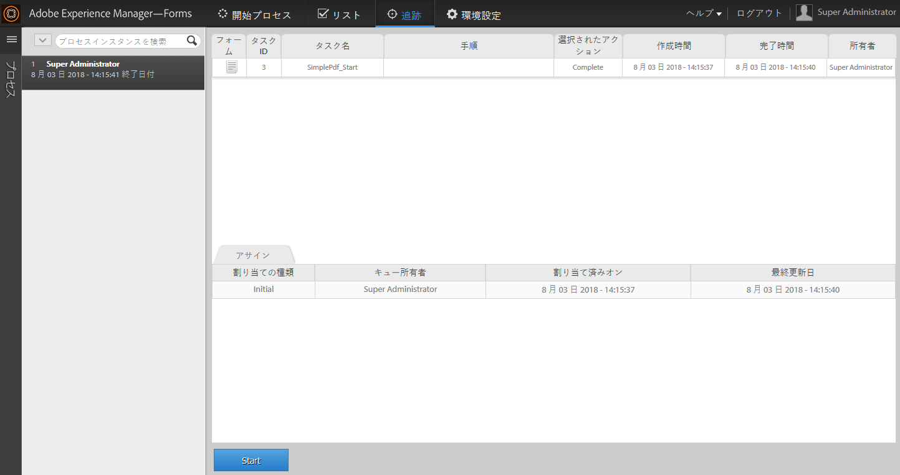
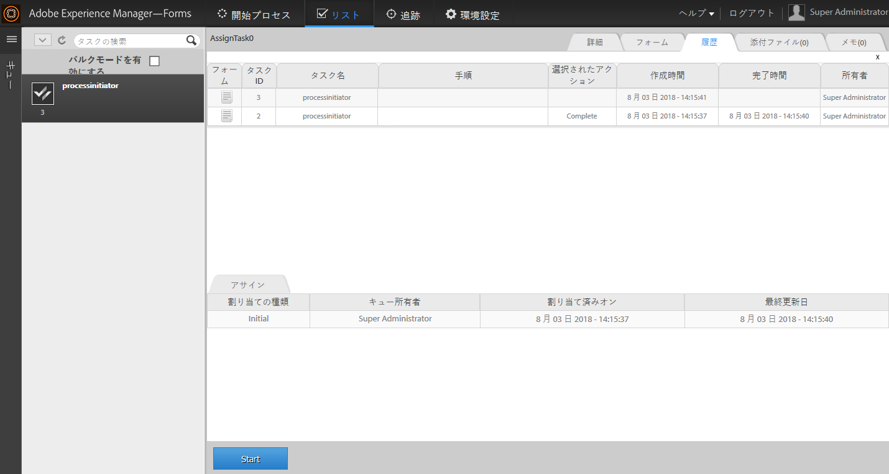

# AEM Forms Workspace における既存のプロセスデータを使用した新しいプロセスの開始{#initiating-a-new-process-with-existing-process-data-in-aem-forms-workspace}

既存のプロセスデータを使用して新しいプロセスを開始することができます。既存のプロセスデータから新しいプロセスを開始する必要が生じるのは、同一のフォームを頻繁に使用する必要があり、その内容が有給休暇フォームとほとんど変わらないような場合です。この機能を使用すると、フォームの入力が多い場合など、ユーザーが時間と労力を節約できます。

以下は既存のプロセスデータから新しいフォームを開始する手順です。

1. 次のいずれかの操作を行います。

   * 「追跡」で、使用するデータが含まれているプロセスインスタンスをクリックします。右ペインにある「プロセス履歴」ビューでスタートポイントに対応するタスク行をクリックします。
   * 「追跡」で、プロセスインスタンスのリストを表示する検索テンプレートを検索します。使用するデータが含まれているインスタンスを選択します。
   * 「**[!UICONTROL TODO]**」タブで、タスクを選択します。「**[!UICONTROL 履歴]**」タブをクリックし、プロセスインスタンスを開始したタスクを選択します。

    

1. 「タスクアクション」ツールバーで、「**[!UICONTROL 開始]**」をクリックします。データが事前入力された新しいプロセスインスタンスのアダプティブフォームが表示されます。

1. 必要に応じてデータを更新し、「**[!UICONTROL 完了]**」またはフォーム上の適切なボタンをクリックします。
