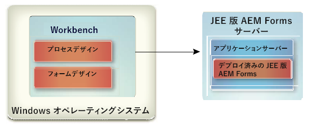

# Workbenchのインストール {#install-workbench}

このドキュメントでは、AEM Formsワークベンチのインストールと設定の手順について説明します。 インストールプログラムは、Formsデザイナーもインストールします。

## Who should read this document? {#who-should-read-this-doc}

このドキュメントは、インストール、設定、管理または Workbench のデプロイを担当している管理者または開発者を対象としています。また、アップグレードしたAEM Formsプロセスをサポートするためにシステムを設定するために必要な情報も含まれています。 このドキュメントで扱う内容は、Microsoft® Windows®オペレーティングシステムに関する十分な知識がある読者を想定しています。

## 追加情報 {#additional-information}

次の表に、AEM Formsの詳細を示し、使用を開始する際に役立つ情報を示します。
<table>
 <tbody>
  <tr>
   <td>
<strong>情報</strong>
 </td>
   <td>
<strong>参照先</strong>
 </td>
  </tr>
  <tr>
   <td>
Workbench の手順に関する情報
 </td>
   <td>
<a href="https://helpx.adobe.com/jp/content/dam/help/en/experience-manager/6-5/forms/pdf/WorkbenchHelp.pdf">Workbench ヘルプ</a>    
 </td>
  </tr>
  <tr>
   <td>
AEM Formsに関する一般的な情報と他のAdobe製品との統合
 </td>
   <td>
<a href="http://adobe.com/go/learn_aemforms_introduction_65">AEM Forms概要</a>    
 </td>
  </tr>
  <tr>
   <td>
AEM Forms向けのすべてのドキュメント
 </td>
   <td>
<a href="http://adobe.com/go/learn_aemforms_introduction_65">AEM Forms文書</a>    
 </td>
  </tr>
  <tr>
   <td>
現在のバージョンに関するパッチアップデート、テクニカルノート、および追加情報
 </td>
   <td>
アドビの販売代理店にお問い合わせください。</a>    
 </td>
  </tr>
 </tbody>
</table>

>[!NOTE]
>
>AEM FormsのFlexワークスペースは非推奨です。 AEM Forms版で利用可能。

## インストールの準備 {#before-you-install}

### Workbench のインストールの概要 {#workbench-installation-overview}

Workbench は、開発者およびフォーム作成者が自動化されたビジネスプロセスおよびフォームを作成するための統合開発環境（IDE）です。また、Workbench はそれらのプロセスおよびフォームで使用するリソースやサービスを管理するためにも使用されます。

次の図に、以下を含む Workbench のインストールについて示します。
* Workbench を使用した Process Design
* Designer を使用した Form Design

>[!NOTE]
>
>AEM Formsサーバには、別のインストールプログラムが必要です。 詳しくは、JEE上のAEM Formsのインストールドキュメントを参照してください。

## システムの前提条件 {#system-prerequisites}

このセクションでは、ハードウェアとソフトウェアの要件とサポートされるプラットフォームについて説明します。

### ハードウェアおよびソフトウェアの最小要件 {#minimum-hardware-software-requirements}

**Workbench**&#x200B;最小要件として、次の要件が推奨されます。インストール用のディスク容量：
* 680 MB（Workbench のみの場合）.
* 2.15 GB（Workbench 、Designer およびサンプルアセンブリを 1 つのドライブにフルインストールした場合）.
* 一時インストールディレクトリ用に 400 MB（ユーザーの ¥temp ディレクトリに 200 MB、Windows 一時ディレクトリに 200 MB）.

>[!NOTE]
>
>これらの場所がすべて1台のドライブ上にある場合は、インストール時に1.5 GBの空き容量が必要です。 一時ディレクトリにコピーされるファイルは、インストールが完了すると削除されます。

* ハードウェア要件： Intel® Pentium® 4 または AMD の同等の 1 GHz プロセッサー.
* Java™ Runtime環境(JRE)7.0 Update 51以降の7.0へのアップデート。
* 1024 X 768 ピクセル以上のモニター解像度、16 ビットカラー以上.
* AEM FormsサーバーへのTCP/IPv4またはTCP/IPv6ネットワーク接続。
* Visual C++再配布可能ランタイムパッケージ2012 32ビットをインストールします。
* Visual C++再配布可能ランタイムパッケージ2013 32ビットをインストールします。

>[!NOTE]
>
>Workbench をインストールするには、管理者権限が必要です。管理者以外のアカウントを使用してインストールする場合は、適切なアカウントの資格情報が求められます。

### サポートされているプラットフォーム {#supported-platforms}

Workbenchでサポートされるプラットフォームの完全なリストについては、 [AEM Formsでサポートされるプラットフォームを参照してください](http://adobe.com/go/learn_aemforms_supportedplatforms_65_jp)。

## Designer のインストールに関する考慮事項 {#designer-installation-considerations}

Workbench のインストールには、対応する Designer（英語版のみ）がデフォルトで含まれています。Workbenchインストールアプリケーションがコンピューター上に既存のバージョンのDesignerを検出した場合は、インストールが終了する場合があります。続行するには、現在のバージョンのDesignerを削除する必要があります。
次の表に、発生する可能性のある Designer のすべてのインストールシナリオと、Workbench をインストールするときに行う必要のあるすべてのアクションを一覧で示します。

<table>
 <tbody>
  <tr>
   <td>
<strong>現在インストールされている Designer のバージョン</strong>
 </td>
   <td>
<strong>必要なアクション</strong>
 </td>
  </tr>
  <tr>
   <td>
Acrobat Pro または Acrobat Pro Extended（Designer が付属）
 </td>
   <td>
なし. Workbench のインストールで、Acrobat Pro または Acrobat Pro Extended と共にインストールされた Designer のインスタンスがコンピューター上で検出されます。 
Workbench 6.4用Designer 6.4.xとWorkbench 6.5用Designer 6.5.0.xなど、異なるバージョンのDesignerは同じシステム上で共存できます。Acrobat10 ProまたはAcrobat10 Pro Extended以降と共にインストールされたDesignerのバージョンをアンインストールする必要はありません。
 
 </td>
  </tr>
  <tr>
   <td>
Designer（スタンドアロン）
 </td>
   <td>
なし.  Workbench に付属する Designer のバージョンは英語版のみです。 Workbench インストーラーでは、新しいバージョンの Designer は再インストールされません。代わりに、Workbench インストーラーにバンドルされている更新バージョンにパッチが適用されます。これにより、ローカライズバージョンの Designer を Workbench 内で使用することができます。  
 </td>
  </tr>
 </tbody>
</table>

### To uninstall Designer (stand-alone) on Windows 10 {#uninstall-designer-standalone-windows10}

1. [ **Campaign コントロールパネル] > [プログラム] > [プログラムと機能]に移動します。**
1. 「現在インストールされているプログラム」リストで、「**Adobe Designer**」を選択します。
1. Click **Uninstall** and then click **Yes**.

## Workbench のインストール {#installing-workbench}

この章では、Workbench をインストールする方法について説明します。

### Workbench のインストールと実行 {#installing-and-running-workbench}

Before you install Workbench, you must ensure that your environment includes the software and hardware required to run it (See section: **Before You Install**).

**Workbench をインストールして実行するには：**

1. 次のいずれかのタスクを実行します。
   * インストールメディアの ¥workbench ディレクトリに移動して、run_windows_installer.bat ファイルをダブルクリックします。
   * Workbench をファイルシステムにダウンロードして解凍します。ダウンロード後、¥workbench ディレクトリに移動して run_windows_installer.bat ファイルをダブルクリックします。

   >[!IMPORTANT]
   >
   >Workbenchのインストーラーは、ローカルドライブからのみ実行できます。 リモートサイトから実行することはできません。

   >[!NOTE]
   >
   >「Could not create the Java Virtual Machine」というエラーが発生した場合は、_JAVA_OPTIONSという名前の環境変数を値 —Xmx512Mと共に作成し、インストーラーを実行します。

1. はじめに画面で「次へ」をクリックします。
1. 使用許諾契約書を読み、「使用許諾契約書の条件に同意します」を選択して、「次へ」をクリックします。
1. （オプション）フォームを作成および変更するツールが必要な場合は、「Adobe Designer のインストール」を選択します。

   >[!NOTE]
   >
   >Acrobat 10 と共にインストールされた Designer を引き続き使用するには、このオプションの選択を解除したままにします。

1. 表示されるデフォルトのディレクトリをそのまま使用するか、「選択」をクリックしてWorkbenchをインストールするディレクトリに移動し、「次へ」をクリックします。

   >[!NOTE]
   >
   >インストールディレクトリのパスには、#（ポンド）および $（ドル）文字を含めることはできません。

1. インストール前の概要を確認して、「インストール」をクリックします。インストールプログラムによりインストールの進行状況が表示されます。
1. インストールの概要を確認します。「開始AEM Formsワークベンチ」を選択してWorkbenchを起動し、「次へ」をクリックします。
1. リリースノートを確認して「完了」をクリックします。
1. コンピューターに以下のアイテムがインストールされました。
   * **Workbench**:開始メニューからWorkbenchを実行するには、すべてのプログラム/AEM Forms/Workbenchを選択します（ショートカットフォルダーをそこに保存する場合）。 詳しくは、『Workbench <a href="https://helpx.adobe.com/jp/content/dam/help/en/experience-manager/6-5/forms/pdf/WorkbenchHelp.pdf">の使用</a> 』ドキュメントを参照してください。
   * **Designer**:Designerは、Workbench内からアクセスできます。 For information, see Getting Started topic in <a href="https://helpx.adobe.com/content/dam/help/en/experience-manager/6-5/forms/pdf/using-designer.pdf">Designer Help</a>.
   * **AEM FormsSDK**:SDKの使用について詳しくは、「 <a href="http://www.adobe.com/go/learn_aemforms_programming_65">AEM Formsでのプログラミング</a>」を参照してください。

## プロセスのアップグレード {#upgrading-processes}

JEE上のAEM Formsのプロセスは、アップグレードウィザードを使用してAEM Formsアプリケーションにアップグレードできます。 詳しくは、Workbenchヘルプの既存のアーティファクトのドキュメントのアップグレードを参照してください。

### サーバーの設定およびログイン {#configuring-and-logging-server}

Workbenchを使用するには、通常は別のコンピューターで、AEM Formsのインスタンスが実行されている必要があります。 AEM Formsにログインするには、ユーザー名とパスワード、およびサーバーの場所に関する詳細が必要です。

>[!NOTE]
>
>EMC DocumentumまたはIBM FileNetリポジトリプロバイダーを使用するようにAEM Formsを設定し、AEM forms管理コンソールのデフォルトとして設定されたリポジトリ以外のリポジトリにログインする場合は、ユーザー名をusername@Repositoryに指定します。

### タイムアウトの設定 {#configuring-timeout-settings}

デフォルトでは、Workbench は動作状況に関係なく 2 時間後にタイムアウトになります。To edit the time-out setting, see “Configuring User Management > Configure advanced system attributes” in the <a href="https://docs.adobe.com/content/help/en/experience-manager-65/forms/administrator-help/configure-user-management/configure-advanced-system-attributes.html">administration console Help</a>.

### HTTPS 経由で接続するための Workbench の設定 {#configuring-workbench-to-connect-over-HTTPS}

HTTPS経由でWorkbenchをAEM Formsサーバーに接続するには、公開鍵を発行した認証局(CA)がWorkbenchで信頼できると認識されることを確認する必要があります。 If the certificate is not recognized as coming from a trusted source, you must update the cacert file located in the [Workbench_HOME]/workbench/jre/lib/security directory.

>[!NOTE]
>
>[Workbench_HOME] は、Workbenchをインストールしたディレクトリを表します。 デフォルトの場所は、C:\Program Files (x86)\Adobe Experience Managerforms Workbenchです。

HTTPS には、証明書で指定されている名前を使用して接続してください。この名前は通常、完全修飾ホスト名です。

**cacertsファイルを更新するには**:
1. Secure Sockets Layer（SSL）証明書のコピーがあることを確認します。SSLサーバーを設定した管理者に問い合わせるか、または Web ブラウザーを使用して証明書を書き出します。

   >[!NOTE]
   >
   >To export the certificate, open a web browser and log in to administration console, install the certificate in the browser, then export the certificate from the browser to a temporary storage location (or directly to the [Workbench_HOME]/workbench/jre/lib/security directory).

1. Copy the certificate to the [Workbench_HOME]/workbench/jre/lib/security directory.

1. Open a command prompt window, navigate to [Workbench_HOME]/workbench/jre/bin, and then type the following command:
   `keytool -import -storepass changeit -file [Workbench_HOME]\workbench\jre\lib\security\ssl_cert_for_certname.cer -keystore [Workbench_HOME]\workbench\jre\lib\security\cacerts -alias example`この場合：
   * changeit：cacerts キーストアのデフォルトのパスワードです。
   * certname：手順 1 で選択した証明書です。
   * example：証明書用に選択したエイリアスです。この値は変更できます

1. 証明書を信頼するように求めるプロンプトが表示されたら、「Yes」と入力し、Enter キーを押します。The keytool proceeds to import the cacerts file in to the [Workbench_HOME]/workbench/jre/lib/security directory.

1. Workbenchを閉じて再起動し、変更を適用します。

### 動的に生成されるテンプレート用のキャッシュ設定の指定 {#configuring-cache-settings-for-dynamically-generated-templates}

アプリケーションで、XFA コンテンツを自動的に更新することによって固有のテンプレートをすばやく生成する場合は、キャッシュ操作の以下の側面を考慮する必要があります。実際には、各トランザクションで新しい固有のテンプレートが使用されています。

Forms Generator または Output が、特定のフォームテンプレートのキャッシュ内のエントリを検索または更新する場合は、以下の複数のキー値を使用して、アクセスする特定のキャッシュエントリを探します。

* **テンプレートファイルの名前**：キャッシュされているフォームの固有のプライマリ識別子として使用される、テンプレートの場所およびファイル名です。
* **タイムスタンプ**：テンプレートファイルには、フォームの最終更新時間の確定に使用するタイムスタンプが含まれています。
* **テンプレートの UUID**：各テンプレートには、Designer により、フォームとそのバージョンに応じて固有の識別子（UUID）が挿入されます。埋め込まれた UUID は、フォームが更新されるびに更新されます。例えば、XDP テンプレートには次の内容が表示されます。

   `<?xml version="1.0" encoding="UTF-8"?>`
   `<?xfa generator="AdobeAEM formsDesignerES_V8.2" APIVersion="2.6.7185.0"?><xdp:xdp xmlns:xdp=http://ns.adobe.com/xdp/ timeStamp="2008-07-29T21:22:12Z" uuid="823e538f-ff6c-4961-b759-f7626978a223"><template xmlns="http://www.xfa.org/schema/xfa-template/2.6/">`

* **レンダリングオプション**：キャッシュの内容は、固有のレンダリングオプションのセットごとにレンダリングフォームキャッシュ内に個別に保存されます。

Forms サービスは、ファイル名またはリポジトリの場所を参照するか、メモリ内で XML オブジェクトとしての値を使用することによって、テンプレートを受け取ります。
* **参照によって渡されるテンプレート**：コンテンツルートおよびファイル名を使用します。この方法を使用して、固有のテンプレートが、要求ごとに異なるファイル名で渡されると、ディスクキャッシュは無制限に増えて再利用できなくなります。これを防ぐには、固有のテンプレートは同じファイル名を使用して渡し、すべての要求で同じキャッシュが更新されるようにします。
* **値によって渡されるテンプレート**：theinDataDoc パラメーターを使用して、データと共に渡されるテンプレートのバイトを使用します。この方法を使用して、固有のテンプレートが、異なる UUID を指定して渡されると、ディスクキャッシュは無制限に増えて再利用できなくなります。これを防ぐには、すべてのテンプレートから UUID 属性を削除し、テンプレートのキャッシュが作成されないようにします。または、Null 以外の同一の UUID を渡すと、キャッシュオブジェクトは作成されますがすべての要求で同じキャッシュが更新されるようになります。

キャッシュが無制限に増えないようにするには、新しいAEM FormsAPI（renderHTMLForm2およびrenderPDFForm2）を使用して動的に生成されるテンプレートのレンダリングに関して、次の要因を考慮します。

新しいAPIを使用する場合、テンプレートはドキュメントオブジェクトとして渡され、パッシブにするかしないかに基づいて、Formsサービス内で処理されます。

UUID およびコンテンツルートがキャッシュのキーとして機能するパッシブにしたドキュメントの場合は、以下の側面を考慮します。
* UUID が含まれないパッシブにした入力テンプレートに対しては、キャッシュは作成されません。
* UUID とコンテンツルートが同一の、パッシブにした複数の入力テンプレートが渡される場合は、同じキャッシュが上書きされます。

ファイル名およびコンテンツルートがキャッシュのキーとして機能する、パッシブにしていないドキュメントの場合は、以下の側面を考慮します。
* パッシブにしていない入力テンプレートの場合、キャッシュは、ドキュメントの生成元となったコンテンツルートとファイル名に依存します。コンテンツルートとテンプレートのファイル名が同じ要求についてのみ、同じキャッシュが使用されます。動的に生成されたテンプレートが Forms サービスに渡されるとき、以下のベストプラクティスによってにキャッシュが無制限に増えないようになります。
   * UUID を削除するか、動的に生成されたすべてのテンプレートで同一の UUID を渡します。
   * テンプレートのバイト、またはディスク上の同じファイル名からドキュメントを生成します。

### Workbench のアンインストール {#uninstalling-workbench}

Campaign コントロールパネルのプログラム機能追加または削除を使用して、アンインストーラを開始します。 Workbench および Designer アプリケーションには、個別のアンインストールプログラムがあります。

## Configuring AEM Forms XDC Editor {#configuring-aem-forms-xdc-editor}

XDC Editor を使用すると、ネットワークプリンターの管理者は XML Forms Architecture Device Configuration（XDC）ファイルの作成および変更ができます。XDC ファイルには、プリンターの機能が記述されます。例えば、プリンター言語、用紙サイズとトレイ位置との関係付けなどが記述されます。

ネットワークプリンターの管理者が XDC Editor を使用する前に、サンプルの XDC ファイルを配置し直して、『XDC Editor を使用したデバイスプロファイルの作成』を確認してください。

**サンプルのXDCファイルを入手するには**:
1. On the AEM Forms server, locate the XDC folder in [AEM Forms root]\sdk\samples\Output\IVS.
1. このフォルダーの内容を、Workbench または Eclipse システムからアクセス可能なディレクトリにコピーします。

**XDC Editorのヘルプを入手するには**:
1. AEM FormsのドキュメントWebサイトにアクセスします。
1. 「**開発**」タブをクリックし、「XDC Editor を使用したデバイスプロファイルの作成」へ移動します。xdc_editor_help_web.zip ファイルをダウンロードし、「お読みください」ファイル内の手順に従ってヘルプファイルをインストールします。

