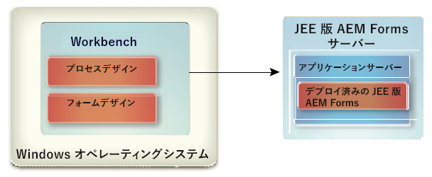

# ワークベンチのインストール {#install-workbench}

このドキュメントでは、AEM Forms ワークベンチのインストールと設定の手順を示します。 このインストールプログラムは Forms Designer もインストールします。

## このドキュメントは誰を対象としていますか。 {#who-should-read-this-doc}

このドキュメントは、ワークベンチのインストール、設定、管理またはデプロイを担当する管理者または開発者を対象としています。 また、アップグレードした AEM Forms プロセスをサポートするためのシステム設定に必要な情報も含まれています。 このドキュメントで扱う内容は、Microsoft® Windows® オペレーティングシステムに関する十分な知識がある読者を想定しています。

## 追加情報 {#additional-information}

次の表に、AEM Forms の学習およびこの使用を開始する際に役立つリソースを示します。
<table>
 <tbody>
  <tr>
   <td>
<strong>詳しくは、</strong>
 </td>
   <td>
<strong>参照先</strong>
 </td>
  </tr>
  <tr>
   <td>
ワークベンチの手順情報
 </td>
   <td>
<a href="https://helpx.adobe.com/jp/content/dam/help/en/experience-manager/6-5/forms/pdf/WorkbenchHelp.pdf">Workbench ヘルプ</a>    
 </td>
  </tr>
  <tr>
   <td>
AEM Forms および AEM Forms を他の Adobe 製品と統合するための方法に関する一般的な情報
 </td>
   <td>
<a href="https://experienceleague.adobe.com/docs/experience-manager-65/forms/getting-started/introduction-aem-forms.html?lang=ja">AEM Forms の概要</a>    
 </td>
  </tr>
  <tr>
   <td>
AEM Forms 用のすべてのドキュメント
 </td>
   <td>
<a href="https://experienceleague.adobe.com/docs/experience-manager-65/forms/getting-started/introduction-aem-forms.html?lang=ja">AEM Forms のドキュメント</a>    
 </td>
  </tr>
  <tr>
   <td>
この製品バージョンに関するパッチアップデート、テクニカルノートおよび追加情報
 </td>
   <td>
Adobe Enterprise サポートへのお問い合わせ</a>    
 </td>
  </tr>
 </tbody>
</table>

>[!NOTE]
>
>AEM Forms の Flex Workspace は非推奨（廃止予定）となりました。 AEM Forms のリリースで使用できます。

## インストールの準備 {#before-you-install}

### ワークベンチのインストールの概要 {#workbench-installation-overview}

ワークベンチは、開発者とフォーム作成者が、自動化されたビジネスプロセスおよびフォームを作成するために使用する統合開発環境（IDE）です。 また、プロセスおよびフォームが使用するリソースおよびサービスの管理にも使用されます。

次の図は、ワークベンチのインストールを示しています。
* ワークベンチを使用したプロセスデザイン
* Designer を使用したフォームデザイン

>[!NOTE]
>
>AEM Forms サーバーでは個別のインストールプログラムが必要です。 詳しくは、JEE 上の AEM Forms インストールドキュメントを参照してください。

## システムの前提条件 {#system-prerequisites}

この節では、ハードウェアとソフトウェアの要件およびサポートされているプラットフォームの概要を説明します。

### ハードウェアおよびソフトウェアの最小要件 {#minimum-hardware-software-requirements}

**Workbench**
以下の要件を最小限に抑えることをお勧めします。
インストール用のディスク領域：
* 680 MB（ワークベンチのみの場合）.
* 2.15 GB（ワークベンチ、Designer およびサンプルアセンブリを 1 つのドライブにフルインストールした場合）
* 一時インストールディレクトリ用に 400 MB（ユーザーの ¥temp ディレクトリに 200 MB、Windows 一時ディレクトリに 200 MB）.

>[!NOTE]
>
>これらの場所がすべて 1 つのドライブ上にある場合は、インストール時に 1.5 GB の空き容量が必要です。 一時ディレクトリにコピーされるファイルは、インストールが完了すると削除されます。

* ハードウェア要件：Intel® Pentium® 4 または AMD® の同等の 1 GHz プロセッサー。
* Java™ ランタイム環境（JRE）7.0 アップデート 51 または 7.0 の以降のアップデート。
* 1024 X 768 ピクセル以上のモニター解像度、16 ビットカラー以上。
* AEM Forms サーバーに対する TCP/IPv4 または TCP/IPv6 ネットワーク接続。
* Visual C++ 再頒布可能ランタイムパッケージ 2012 32 ビットをインストールします。
* Visual C++ 再頒布可能ランタイムパッケージ 2013 32 ビットをインストールします。

>[!NOTE]
>
>ワークベンチをインストールするには、管理者権限が必要です。 管理者以外のアカウントを使用してインストールする場合は、適切なアカウントの資格情報が求められます。

### サポートされているプラットフォーム {#supported-platforms}

ワークベンチでサポートされているプラットフォームの完全なリストについては、[AEM Forms でサポートされているプラットフォーム](https://www.adobe.com/go/learn_aemforms_supportedplatforms_65_ja)を参照してください。

## Designer のインストールに関する考慮事項 {#designer-installation-considerations}

ワークベンチのインストールには、対応する英語版の Designer がデフォルトで含まれています。 ワークベンチインストールアプリケーションがコンピューター上で既存バージョンの Designer を検出した場合、インストールが終了することがあります。この場合、続行するには現在のバージョンの Designer を削除する必要があります。
次の表に、ワークベンチのインストール時に発生する可能性のある Designer のインストールシナリオおよび実行する必要のあるアクションの一覧を示します。

<table>
 <tbody>
  <tr>
   <td>
<strong>現在インストールされている Designer のバージョン</strong>
 </td>
   <td>
<strong>必要なアクション</strong>
 </td>
  </tr>
  <tr>
   <td>
Acrobat Pro または Acrobat Pro Extended（Designer 付属）
 </td>
   <td>
なし。  
Workbench インストールでは、Acrobat ProまたはAcrobat Pro Extendedのいずれかでインストールされたコンピューター上のDesignerのインスタンスが検出されます。 
同じシステム上に異なるバージョンのDesignerを共存させることができます。たとえば、Workbench 6.4の場合はDesigner 6.4.x、Workbench 6.5の場合はDesigner 6.5.0.xです。 Acrobat 10 ProまたはAcrobat 10 Pro Extended以降にインストールされたDesignerのバージョンをアンインストールする必要はありません。
 
 </td>
  </tr>
  <tr>
   <td>
Designer（スタンドアロン）
 </td>
   <td>
なし.  ワークベンチに付属する Designer のバージョンは英語版のみです。  ワークベンチインストーラーでは、新しいバージョンの Designer は再インストールされません。 代わりに、ワークベンチインストーラーにバンドルされている更新バージョンにパッチが適用されます。 これにより、ワークベンチ内でローカライズ版の Designer を使用することもできます。  
 </td>
  </tr>
 </tbody>
</table>

### Windows 10 で Designer（スタンドアロン）をアンインストールするには： {#uninstall-designer-standalone-windows10}

1. **コントロールパネル／プログラム／プログラムと機能**&#x200B;に移動します。
1. 「現在インストールされているプログラム」リストで、「**Adobe Designer**」を選択します。
1. 「**アンインストール**」をクリックしてから、「**はい**」をクリックします。

## ワークベンチのインストール {#installing-workbench}

この章では、ワークベンチのインストール方法について説明します。

### ワークベンチのインストールと実行 {#installing-and-running-workbench}

ワークベンチをインストールする前に、ワークベンチの実行に必要なソフトウェアとハードウェアが使用環境に含まれていることを確認してください（**インストールの前に**&#x200B;の節を参照してください）。

**ワークベンチをインストールして実行するには：**

1. 次のいずれかのタスクを実行します。
   * インストールメディアの\workbench ディレクトリに移動し、run_windows_installer.bat ファイルをダブルクリックします。
   * ワークベンチをダウンロードして、ファイルシステムに解凍します。 ダウンロード後、\workbench ディレクトリに移動し、 run_windows_installer.bat ファイルをダブルクリックします。

   >[!IMPORTANT]
   >
   >ワークベンチインストーラーは、ローカルドライブからのみ実行できます。 リモートサイトから実行することはできません。

   >[!NOTE]
   >
   >「Java™ 仮想マシンを作成できませんでした」というエラーが表示された場合は、_JAVA_OPTIONS という名前の環境変数を -Xmx512M という値で作成し、インストーラーを実行します。

1. はじめに画面で「次へ」をクリックします。
1. 使用許諾契約書を読み、「使用許諾契約書の条件に同意します」を選択して、「次へ」をクリックします。
1. （オプション）フォームを作成および変更するツールが必要な場合は、「Adobe Designer のインストール」を選択します。

   >[!NOTE]
   >
   >Acrobat 10 と共にインストールされた Designer を引き続き使用するには、このオプションの選択を解除したままにします。

1. 表示されるデフォルトのディレクトリをそのまま使用するか、「選択」をクリックしてワークベンチのインストール先ディレクトリを選択し、「次へ」をクリックします。

   >[!NOTE]
   >
   >インストールディレクトリのパスには、#（ポンド）および $（ドル）文字を含めることはできません。

1. インストール前の概要を確認して、「インストール」をクリックします。 インストールの進行状況がインストールプログラムに表示されます。
1. インストールの概要を確認します。 「AEM Forms ワークベンチの起動」を選択してワークベンチを起動し、「次へ」をクリックします。
1. リリースノートを確認して「完了」をクリックします。
1. コンピューターに以下のアイテムがインストールされました。
   * **ワークベンチ**：スタートメニューにショートカットフォルダーを保存するよう選択した場合にこのメニューからワークベンチを起動するには、すべてのプログラム／AEM Forms／ワークベンチを選択します。 詳しくは、<a href="https://helpx.adobe.com/jp/content/dam/help/en/experience-manager/6-5/forms/pdf/WorkbenchHelp.pdf">ワークベンチの使用</a>ドキュメントを参照してください。
   * **Designer**：Designer はワークベンチ内部からアクセスできます。 詳しくは、<a href="https://helpx.adobe.com/content/dam/help/en/experience-manager/6-5/forms/pdf/using-designer.pdf">Designer ヘルプ</a>のはじめにのトピックを参照してください。
   * **AEM Forms SDK**：SDK 使用方法の詳細については、<a href="https://helpx.adobe.com/pdf/aem-forms/6-3/programming-with-aem-forms.pdf">AEM Forms によるプログラミング</a>を参照してください。

## プロセスのアップグレード {#upgrading-processes}

JEE 上の AEM Forms プロセスは、アップグレードウィザードを使用して AEM Forms アプリケーションにアップグレードできます。 詳しくは、ワークベンチヘルプの既存のアーティファクトのアップグレードドキュメントを参照してください。

### サーバーの設定およびログイン {#configuring-and-logging-server}

ワークベンチを使用するには、通常は別のコンピューターで AEM Forms のインスタンスを実行させる必要があります。 AEM Forms にログインにするには、ユーザー名とパスワードおよびサーバーの場所に関する詳細情報が必要です。

>[!NOTE]
>
>EMC Documentum® または IBM® FileNet リポジトリプロバイダーを使用するように AEM Forms を設定している場合、AEM Forms 管理コンソールでデフォルトとして設定されている以外のリポジトリにログインするには、ユーザー名を username@Repository と指定します。

### タイムアウトの設定 {#configuring-timeout-settings}

デフォルトでは、ワークベンチは動作状況に関係なく 2 時間後にタイムアウトになります。 タイムアウトの設定を編集するには、<a href="https://experienceleague.adobe.com/docs/experience-manager-65/forms/administrator-help/configure-user-management/configure-advanced-system-attributes.html?lang=ja">管理コンソールヘルプ</a> の「ユーザー管理の設定」の「詳細なシステム属性の設定」を参照してください。

### HTTPS 経由で接続するためのワークベンチの設定 {#configuring-workbench-to-connect-over-HTTPS}

HTTPS 経由でワークベンチを AEM Forms サーバーに接続するには、公開鍵を発行した認証局（CA）が信頼できることをワークベンチが認識する必要があります。 この証明書が信頼できるソースに由来すると認識されない場合、[ワークベンチ_HOME]/workbench/jre/lib/security ディレクトリにある cacert ファイルを更新する必要があります。

>[!NOTE]
>
>[ワークベンチ_HOME] は、ワークベンチをインストールしたディレクトリを表します。 デフォルトの場所は C:¥Program Files (x86)¥Adobe Experience Manager forms ワークベンチです。

HTTPS には、証明書で指定されている名前を使用して接続してください。 この名前は通常、完全修飾ホスト名です。

**cacert ファイルを更新するには**：
1. Secure Sockets Layer（SSL）証明書のコピーがあることを確認します。 SSL サーバーを設定した管理者に問い合わせるか、web ブラウザーを使用して証明書を書き出します。

   >[!NOTE]
   >
   >証明書を書き出すには、web ブラウザーを開いて管理コンソールにログインします。 ブラウザーに証明書をインストールし、次にブラウザーから一時的な保存場所（または直接 [Workbench_HOME]/workbench/jre/lib/security ディレクトリ）に証明書を書き出します。

1. 証明書を [Workbench_HOME]/workbench/jre/lib/security ディレクトリにコピーします。

1. コマンドプロンプトウィンドウを開き、[Workbench_HOME]/workbench/jre/bin に移動して、次のコマンドを入力します。
   `keytool -import -storepass changeit -file [Workbench_HOME]\workbench\jre\lib\security\ssl_cert_for_certname.cer -keystore [Workbench_HOME]\workbench\jre\lib\security\cacerts -alias example`ここで、
   * `changeit` は、cacerts キーストアのデフォルトのパスワードです。
   * certname は、手順 1 で選択した証明書です。
   * example は、証明書用に選択したエイリアスです。 この値は変更できます。

1. 証明書を信頼するように求めるプロンプトが表示されたら、「Yes」と入力し、Enter キーを押します。 次に、keytool が cacerts ファイルを [Workbench_HOME]/workbench/jre/lib/securit ディレクトリに読み込みます。

1. ワークベンチを閉じて再起動し、変更を適用します。

### 動的に生成されるテンプレートのキャッシュ設定の指定 {#configuring-cache-settings-for-dynamically-generated-templates}

アプリケーションで XFA コンテンツを自動的に更新することで一意のテンプレートをその場で生成する場合は、キャッシュ操作の以下の側面を考慮する必要があります。 事実上、各トランザクションで新しい一意のテンプレートが使用されます。

Forms Generator または Output が、特定のフォームテンプレートのキャッシュ内のエントリを検索または更新する場合は、いくつかのキー値を使用して、アクセスする特定のキャッシュエントリを探します。

* **テンプレートファイル名**：キャッシュされたフォームの一意のプライマリ識別子として使用されるテンプレートの場所とファイル名です。
* **タイムスタンプ**：テンプレートファイルには、フォームの最終更新時刻の判断に使用されるタイムスタンプが含まれます。
* **テンプレート UUID**：Designer は、各テンプレートに、フォームとそのバージョンの一意識別子（UUID）を挿入します。 埋め込まれた UUID は、フォームが更新されるたびに更新されます。 例えば、XDP テンプレートには次の内容が表示されます。

  `<?xml version="1.0" encoding="UTF-8"?>`
  `<?xfa generator="AdobeAEM formsDesignerES_V8.2" APIVersion="2.6.7185.0"?><xdp:xdp xmlns:xdp=https://ns.adobe.com/xdp/ timeStamp="2008-07-29T21:22:12Z" uuid="823e538f-ff6c-4961-b759-f7626978a223"><template xmlns="https://www.xfa.org/schema/xfa-template/2.6/">`

* **レンダリングオプション**：キャッシュの内容は、一意のレンダリングオプションのセットごとに、レンダリングされたフォームキャッシュ内に別々に保存されます。

Forms サービスは、ファイル名またはリポジトリの場所を参照するか、メモリ内の XML オブジェクトとして値を使用して、テンプレートを受け取ります。

* **参照によって渡されるテンプレート**：コンテンツルートとフォーム名を使用します。 このメソッドを使用して、リクエストごとに異なるファイル名を持つ一意のテンプレートが渡されると、ディスクキャッシュは無限に増え、再利用されなくなります。 これを防ぐには、一意のテンプレートを同じファイル名で渡して、すべてのリクエストで同じキャッシュが更新されるようにする必要があります。
* **値によって渡されるテンプレート**：theinDataDoc パラメーターを使用して、データと共に渡されるテンプレートのバイトを使用します。 このメソッドを使用して、異なる UUID を持つ一意のテンプレートを渡すと、ディスクキャッシュは無限に増え、再利用されなくなります。 これを防ぐには、テンプレートのキャッシュが作成されないように、すべてのテンプレートから UUID 属性を削除する必要があります。 また、同じ null 以外の UUID を渡すと、キャッシュオブジェクトを作成できますが、リクエストのたびに同じキャッシュが更新されます。

キャッシュが無制限に増えないようにするために、新しい AEM Forms API（renderHTMLForm2 および renderPDFForm2）を使用して動的に生成されるテンプレートのレンダリングについて、次の要因を考慮します。

新しい API を使用する場合、テンプレートはドキュメントオブジェクトとして渡され、パッシブにするかしないかに基づいて Forms サービス内で処理されます。

UUID およびコンテンツルートがキャッシュキーとして機能するパッシブにしたドキュメントの場合は、の側面を考慮してください。

* UUID のないパッシブにした入力テンプレートに対しては、キャッシュは作成されません。
* 同じ UUID とコンテンツルートを持つ、パッシブにした複数の入力テンプレートが渡された場合、同じキャッシュが上書きされます。

ファイル名とコンテンツルートがキャッシュキーとして機能する、パッシブにしないドキュメントの場合は、次の側面を考慮してください。

* パッシブにしていない入力テンプレートの場合、キャッシュは、ドキュメントの生成元となったコンテンツルートとファイル名に依存します。
コンテンツルートとテンプレートのファイル名が同じである要求に対してのみ、同じキャッシュが使用されます。
次のベストプラクティスは、動的に生成されたテンプレートが Forms サービスに渡される際に、キャッシュが無限に増えないようにするものです。
  * 動的に生成されるすべてのテンプレートで、UUID を取り除くか、同じ UUID を渡します。
  * テンプレートのバイトまたはディスク上の同じファイル名からドキュメントを生成します。

### ワークベンチのアンインストール {#uninstalling-workbench}

コントロールパネルのプログラムの追加と削除機能を使用して、アンインストーラーを起動します。 ワークベンチおよび Designer アプリケーションには、個別のアンインストールプログラムがあります。

## AEM Forms XDC Editor の設定 {#configuring-aem-forms-xdc-editor}

XDC エディターを使用すると、ネットワークプリンター管理者は、XML Forms Architecture Device Configuration（XDC）ファイルの作成および変更ができます。 XDC ファイルは、プリンターの機能を記述したもので、例えば、プリンターの言語または用紙サイズとトレイの位置との関係などを記述したものです。

ネットワークプリンターの管理者が XDC Editor を使用する前に、サンプルの XDC ファイルを配置し直して、『XDC Editor を使用したデバイスプロファイルの作成』を確認してください。

**サンプルの XDC ファイルを入手するには**：

1. AEM Forms サーバーで、[AEM Forms root]\sdk\samples\Output\IVS から XDC フォルダーを探します。
1. このフォルダーの内容を、ワークベンチまたは Eclipse システムからアクセス可能なディレクトリにコピーします。

**XDC Editor のヘルプを入手するには**：

1. AEM Forms ドキュメントの web サイトへ移動します。
1. 「**開発**」タブをクリックし、「XDC Editor を使用したデバイスプロファイルの作成」へ移動します。 xdc_editor_help_web.zip ファイルをダウンロードし、「お読みください」ファイル内の手順に従ってヘルプファイルをインストールします。
