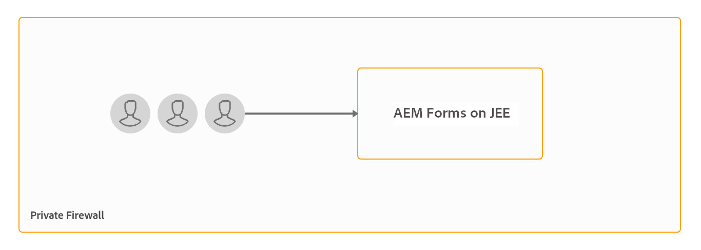

# Document Security サーバーのインストールと設定 {#installing-and-configuring-the-document-security-server}

Document Security を使用すると、サポートされる形式で保存した情報を安全に配布できます。許可されたユーザーのみが保護されたドキュメントにアクセスできます。

Adobe Experience Manager Forms の Document Security を使用して、許可されたユーザーだけがドキュメントを使用するように指定できます。Document Security を使用すると、サポートされる形式で保存した情報を安全に配布できます。Adobe Portable Document Format （PDF）、Microsoft Word、Excel および PowerPoint を含むファイル形式に対応しています。

ドキュメントを保護するには、ポリシーを使用します。ポリシーに指定する機密設定によって、ポリシーを適用したドキュメントを受信者が使用できる方法が決まります。例えば、テキストの印刷やコピー、テキストの編集、または保護されたドキュメントへの署名や注釈の追加を実行できるかどうかを指定することができます。

ポリシーは Document Security に保存されます。クライアントアプリケーションを使用してそのポリシーをドキュメントに適用します。ドキュメントにポリシーを適用すると、ドキュメントに含まれる情報は、ポリシーで指定されている機密設定で保護されます。ポリシーで保護されたドキュメントを、ポリシーで許可された受信者に配布できます。

また、Document Security は、ドキュメントの保護、保護されたドキュメントの表示、保護されたドキュメントのインデックス作成を行うためのクライアント、ビューア、およびインデクサーも提供します。Document Security について詳しくは、 [Document Security について](/help/forms/using/admin-help/document-security.md)を参照してください。

## デプロイメントトポロジ  {#deployment-topology}

Document Security 機能は、JEE 上の AEM Forms でのみ使用できます。JEE 上の AEM Forms のインスタンスが 1 つ必要です。必要に応じて、AEM Forms サーバーのクラスターまたはファームを作成することもできます。次のトポロジは、Document Security 機能を実行するための指標トポロジです。トポロジーについて詳しくは、「[AEM Forms のアーキテクチャとデプロイメントトポロジー](aem-forms-architecture-deployment.md)」を参照してください。

<!--fix above link-->

次の図は、AEM Forms Document Security の一般的なアーキテクチャを示しています。

## JEE 上の AEM Forms のインストール {#installing-aem-forms-on-jee}

次の手順を実行して、JEE 上で AEM Forms をインストールして設定します。

1. JEE 上の AEM 6.5 Forms のインストーラーを、[アドビライセンス Web サイト（LWS）](https://licensing.adobe.com/)からダウンロードします。インストーラーをダウンロードするには、有効なメンテナンス＆サポートの契約が必要です。
1. 詳しくは、 [JEE 上の AEM Forms でサポートされているプラットフォームのドキュメント](/help/forms/using/aem-forms-jee-supported-platforms.md)を参照し、JEE 上に AEM Formsをインストールするためのソフトウェア、ハードウェア、オペレーティングシステム、アプリケーションサーバー、データベース、JDK、その他のインフラストラクチャが準備されていることを確認します。
1. （自動インストール以外のインストールのみ） [AEM Forms シングルサーバーのインストールの準備](https://www.adobe.com/go/learn_aemforms_prepareInstallsingle_64_jp) または [AEM Forms Server Cluster のインストールの準備](https://www.adobe.com/go/learn_aemforms_prepareInstallcluster_64_jp)を参照し、JEE 上で AEM Forms をインストールして設定する環境の準備を整えます。
1. 環境とアプリケーションサーバーに応じて、下のいずれかのドキュメントを選択し、その指示に従ってインストールしてください。

   * [JEE 上の AEM Forms のインストールとデプロイ（JBoss 自動インストールを使用）](https://www.adobe.com/go/learn_aemforms_installTurnkey_64_jp)
   * [JEE 上の AEM Forms のインストールとデプロイ（JBoss 版）](https://www.adobe.com/go/learn_aemforms_installJBoss_64_jp)
   * [JEE 上の AEM Forms のインストールおよびデプロイ（WebLogic 版）](https://www.adobe.com/go/learn_aemforms_installWebLogic_64_jp)
   * [JEE 上の AEM Forms のインストールおよびデプロイ（WebSphere 版）](https://www.adobe.com/go/learn_aemforms_installWebSphere_64_jp)
   * [JBoss クラスター上の JEE での AEM Forms の設定](https://www.adobe.com/go/learn_aemforms_clusterJBoss_64_jp)
   * [WebLogic クラスター上の JEE での AEM Forms の設定](https://www.adobe.com/go/learn_aemforms_clusterWebLogic_64_jp)
   * [WebSphere クラスター上の JEE での AEM Forms の設定](https://www.adobe.com/go/learn_aemforms_clusterWebSphere_64_jp)

   >[!NOTE]
   >
   >JEE Configuration Manager 上での AEM Forms モジュール選択画面で、「Document Security」オプションを選択します。「Document Security」オプションでは、他のモジュールを選択する必要はありません。

## 次の手順 {#next-steps}

* [クライアントおよびサーバーオプションの設定](/help/forms/using/admin-help/configuring-client-server-options.md)
* [ポリシーの作成と管理](/help/forms/using/admin-help/creating-policies.md)
* [ポリシーセットの作成と管理](/help/forms/using/admin-help/creating-policy-sets.md)
