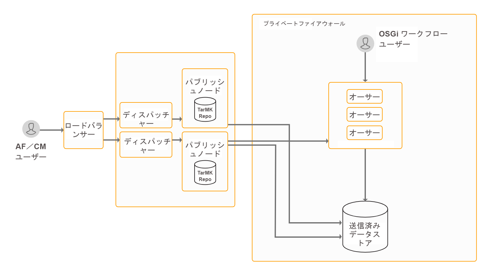

# OSGiでのフォーム中心のワークフローのインストールと設定{#installing-and-configuring-forms-centric-workflow-on-osgi}

## 概要 {#introduction}

企業は、複数のフォーム、バックエンドシステム、その他のデータソースからデータを収集し、処理します。 データの処理には、レビューと承認の手順、繰り返し型のタスク、データのアーカイブが含まれます。 例えば、フォームの確認とPDFドキュメントへの変換を行います。 手動で行うと、繰り返しタスクに多くの時間とリソースがかかる場合があります。

OSGiで [フォーム中心のワークフローを使用して](../../forms/using/aem-forms-workflow.md) 、アダプティブフォームベースのワークフローを迅速に構築できます。 これらのワークフローは、レビューと承認のワークフロー、ビジネスプロセスのワークフロー、その他の繰り返し型のタスクの自動化に役立ちます。 これらのワークフローは、ドキュメント(PDFドキュメントの作成、アセンブリ、配布およびアーカイブ、電子署名の追加、ドキュメントへのアクセス制限、バーコードフォームのデコードなど)の処理や、フォームとドキュメントでのAdobe Sign署名ワークフローの使用にも役立ちます。

設定が完了すると、これらのワークフローを手動でトリガーして、定義済みのプロセスを完了したり、ユーザーがフォームやインタラクティブな通信を送信したときにプログラムを実行したりできます。 これは、AEM Forms のアドオンパッケージに含まれる機能で、

AEM Forms は強力なエンタープライズクラスのプラットフォームです。OSGi上のフォーム中心のワークフローは、AEM Formsの機能の1つにすぎません。 機能の完全な一覧については、「[AEM Forms の概要](introduction-aem-forms.md)」を参照してください。

>[!NOTE]
>
>OSGi 上の Forms 中心のワークフローにより、OSGi スタック上の様々なタスクに対するワークフローをすばやく作成してデプロイすることができます。完全な Process Management 機能を JEE スタックにインストールする必要はありません。機能の違いと類似点について詳しくは、OSGi上のForms中心のAEMワークフローとJEE上のProcess Managementの [](capabilities-osgi-jee-workflows.md) 比較を参照してください。
>
>比較の後、JEEスタックにProcess Management機能をインストールする場合は、JEEスタックのインストールと設定およびプロセス管理機能に関する詳細は、「JEE [上のAEM Formsのインストールまたはアップグレード](/help/forms/home.md) 」を参照してください。

## デプロイメントトポロジ {#deployment-topology}

AEM Forms アドオンパッケージは AEM にデプロイされるアプリケーションです。OSGi機能上でフォーム中心のワークフローを実行するのに必要なAEM Authorまたは処理インスタンス（実稼動作成者）は、最低1つだけです。 A processing instance is a [hardened AEM Author](/help/forms/using/hardening-securing-aem-forms-environment.md) instance. 実稼動版の作成者は、ワークフローやアダプティブフォームの作成など、実際のオーサリングを実行しないでください。

次のトポロジは、AEM Forms のインタラクティブ通信、Correspondence Management、AEM Forms のデータ取得および OSGi 機能にあるフォーム中心のワークフローを実行するための指標トポロジです。トポロジーについて詳しくは、「[AEM Forms のアーキテクチャとデプロイメントトポロジー](/help/forms/using/aem-forms-architecture-deployment.md)」を参照してください。



OSGiでのAEM Formsフォーム中心のワークフローは、AEM FormsのオーサーインスタンスでAEMインボックスとAEM Workflow Model作成UIを実行します。

## システム要件 {#system-requirements}

>[!NOTE]
>
>「Data Capabilitiesの [インストールと設定」の記事の説明に従って、OSGiにAEM Formsを既にインストールしている場合は、ドキュメントの](../../forms/using/installing-configuring-forms-centric-workflow-on-osgi.md#next-steps) 次の手順 [](../../forms/using/installing-configuring-aem-forms-osgi.md) 」の節に進みます。

OSGiでフォーム中心のワークフローのインストールと設定を開始する前に、以下を確認します。

* ハードウェアとソフトウェアのインフラが正しく設定されていること。サポート対象のハードウェアおよびソフトウェアの詳細な一覧については、「[技術的要件](/help/sites-deploying/technical-requirements.md)」を参照してください。

* AEM インスタンスのインストールパスに空白が含まれていないこと。
* AEM インスタンスが稼働していること。AEM の用語では、「インスタンス」は、サーバー上でオーサーモードまたはパブリッシュモードで実行されている AEM のコピーのことです。OSGi上でフォーム中心のワークフローを実行するには、少なくとも1つのAEMインスタンス（作成者または処理）が必要です。

   * **作成者：**&#x200B;コンテンツを作成、アップロード、編集し、Web サイトを管理する AEM インスタンス。公開する準備ができたコンテンツは、パブリッシュインスタンスにレプリケートされます。
   * **処理：**&#x200B;処理インスタンスは、[強化された AEM オーサー](/help/forms/using/hardening-securing-aem-forms-environment.md)インスタンスです。作成者インスタンスを設定し、インストールの実行後に強化できます。

   * **パブリッシュ**：発行されたコンテンツをインターネットまたは社内ネットワークを通じて公開する AEM インスタンス。

* メモリ要件が満たされていること。AEM Forms アドオンパッケージには次の一時領域が必要となります。

   * Microsoft Windows ベースのインストールの場合、15 GB の一時的な空きスペースが必要です。
   * Unix ベースのインストールの場合、6 GB の一時的な空きスペースが必要です。

* Unix ベースのシステムの追加必要システム構成：Unix ベースのオペレーティングシステムを使用する場合は、それぞれのオペレーティングシステムのインストールメディアから、次のパッケージをインストールしてください。

<table>
 <tbody>
  <tr>
   <td>expat</td>
   <td>libxcb</td>
   <td>freetype</td>
   <td>libXau</td>
  </tr>
  <tr>
   <td>libSM</td>
   <td>zlib</td>
   <td>libICE</td>
   <td>libuuid</td>
  </tr>
  <tr>
   <td>glibc</td>
   <td>libXext</td>
   <td><p>nss-softokn-freebl</p> </td>
   <td>fontconfig</td>
  </tr>
  <tr>
   <td>libX11</td>
   <td>libXrender</td>
   <td>libXrandr</td>
   <td>libXinerama</td>
  </tr>
 </tbody>
</table>

## AEM Forms アドオンパッケージのインストール {#install-aem-forms-add-on-package}

AEM Forms アドオンパッケージは AEM にデプロイされるアプリケーションです。このパッケージには、OSGiおよびその他の機能に対するフォーム中心のワークフローが含まれています。 次の手順を実行してアドオンパッケージをインストールします。

1. Open [Software Distribution](https://experience.adobe.com/downloads)（ソフトウェア配布）。 Adobe IDがソフトウェア配布物にログインする必要があります。
1. ヘッダーメニューで **[!UICONTROL Adobe Experience Manager]** をタップします。
1. In the **[!UICONTROL Filters]** section:
   1. 「 **[!UICONTROL ソリューション]** 」ドロップダウンリストから「 **[!UICONTROL フォーム]** 」を選択します。
   2. パッケージのバージョンと種類を選択します。 また、「 **[!UICONTROL 検索のダウンロード数]** 」オプションを使用して結果をフィルターすることもできます。
1. お使いのオペレーティングシステムに対応するパッケージ名をタップし、「EULA条項に **[!UICONTROL 同意します]**」を選択して、「 **[!UICONTROL ダウンロード]**」をタップします。
1. パッ [ケージマネージャーを開き](https://docs.adobe.com/content/help/ja-JP/experience-manager-65/administering/contentmanagement/package-manager.html) 、「パッケージを **[!UICONTROL アップロード]** 」をクリックしてパッケージをアップロードします。
1. Select the package and click **[!UICONTROL Install]**.

   「 [AEM Formsリリース](https://helpx.adobe.com/jp/aem-forms/kb/aem-forms-releases.html) 」記事に記載されている直接リンクからパッケージをダウンロードすることもできます。

1. パッケージのインストールが完了したら、AEM インスタンスを再起動するよう指示されます。**すぐにはサーバーを再起動しないでください。** AEM Formsサーバーを停止する前に、ServiceEvent REGISTEREDメッセージとServiceEvent UNREGISTEREDメッセージが [AEM-Installation-Directory]/crx-quickstart/logs/error.logファイルに表示されなくなるまで待ち、ログは安定しています。
1. 手順 1 から 7 を、すべてのオーサーインスタンスとパブリッシュインスタンスで繰り返します。

## インストール後の設定 {#post-installation-configurations}

AEM Forms には、いくつかの必須およびオプションの設定があります。必須の設定には、BouncyCastle ライブラリおよびシリアル化エージェントの設定が含まれます。オプションの設定には、ディスパッチャーおよび Adobe Target の設定が含まれます。

### インストール後の必須の設定 {#mandatory-post-installation-configurations}

#### RSA ライブラリと BouncyCastle ライブラリの設定  {#configure-rsa-and-bouncycastle-libraries}

すべての作成者インスタンスと発行インスタンスで次の手順を実行し、ライブラリの委任をブートします。

1. 基になる AEM インスタンスを停止します。
1. Open the [AEM installation directory]\crx-quickstart\conf\sling.properties file for editing.

   If you used [AEM installation directory]\crx-quickstart\bin\start.bat to start AEM, then edit the sling.properties located at [AEM_root]\crx-quickstart\.

1. 以下のプロパティを sling.properties ファイルに追加します。

   ```
   sling.bootdelegation.class.com.rsa.jsafe.provider.JsafeJCE=com.rsa.*
   sling.bootdelegation.class.org.bouncycastle.jce.provider.BouncyCastleProvider=org.bouncycastle.*
   ```

1. ファイルを保存して閉じ、AEM インスタンスを起動します。
1. 手順 1 から 4 を、すべてのオーサーインスタンスとパブリッシュインスタンスで繰り返します。

#### シリアル化エージェントの設定 {#configure-the-serialization-agent}

すべての作成者インスタンスと発行インスタンスで次の手順を実行し、パッケージを許可リストに追加します。

1. ブラウザーウィンドウで、AEM Configuration Manager を開きます。The default URL is https://&#39;[server]:[port]&#39;/system/console/configMgr.
1. **デシリアライゼーションファイアウォール設定**&#x200B;を検索して開きます。
1. Add the **sun.util.calendar** package to the **allowlist** field. 「保存」をクリックします。
1. 手順 1 から 3 を、すべてのオーサーインスタンスとパブリッシュインスタンスで繰り返します。

### インストール後のオプションの設定 {#optional-post-installation-configurations}

#### Dispatcher の設定 {#configure-dispatcher}

ディスパッチャーは AEM のキャッシングおよびロードバランスツールです。AEM ディスパッチャーはまた、AEM サーバーを攻撃から保護することにも役立ちます。エンタープライズクラスの Web サーバーと一緒にディスパッチャーを使用することで、AEM インスタンスのセキュリティを向上できます。[Dispatcherを使用する場合](https://helpx.adobe.com/jp/experience-manager/dispatcher/using/dispatcher-configuration.html)、AEM Formsに対して次の設定を実行します。

1. AEM Forms のアクセスの設定:

   dispatcher.any ファイルを開いて編集します。フィルターセクションに移動し、次のフィルターをフィルターセクションに追加します。

   `/0025 { /type "allow" /glob "* /bin/xfaforms/submitaction*" } # to enable AEM Forms submission`

   ファイルを保存して閉じます。フィルターについて詳しくは、「[ディスパッチャードキュメント](https://helpx.adobe.com/jp/experience-manager/dispatcher/using/dispatcher-configuration.html)」を参照してください。

1. リファラーフィルターサービスの設定：

   管理者として Apache Felix Configuration Manager にログインします。The Default URL of the configuration manager is https://&#39;server&#39;:[port_number]/system/console/configMgr. **Configurations**&#x200B;メニューで「**Apache Sling Referrer Filter**」を選択します。「Allow Hosts」フィールドで、ディスパッチャーのホスト名を入力してそれをリファラーとして許可し、「**保存**」をクリックします。The format of the entry is `https://'[server]:[port]'`.

#### キャッシュの設定 {#configure-cache}

キャッシングは、データへのアクセスにかかる時間を短縮し、遅延を削減して I/O 速度を改善するメカニズムです。アダプティブフォームのキャッシュは、アダプティブフォームの HTML コンテンツと JSON の構造のみを保存し、事前入力されたデータは保存しません。これにより、アダプティブフォームのレンダリングの時間を短縮します。

* アダプティブフォームのキャッシュを使用するときは、[AEM ディスパッチャー](https://helpx.adobe.com/jp/experience-manager/dispatcher/using/dispatcher-configuration.html) を使用してアダプティブフォームのクライアントライブラリ（CSS および JavaScript）をキャッシュします。
* カスタムコンポーネントの開発時には、開発に使用されるサーバー上でアダプティブフォームのキャッシュを無効にしておく必要があります。

次の手順を実行してアダプティブフォームのキャッシュを設定します。

1. Go to AEM web console configuration manager at `https://'[server]:[port]'/system/console/configMgr`.
1. Click **Adaptive Form Configuration Service** to edit its configuration values. In the edit configuration values dialog, specify the maximum number of forms or documents an instance of the AEM Forms server can cache in the **Number of Adaptive Forms** field. デフォルト値は 100 です。「**保存**」をクリックします。

   >[!NOTE]
   >
   >キャッシュを無効にするには、「アダプティブフォームの数」フィールドの値を **0** に設定します。キャッシュの設定を無効または変更すると、キャッシュがリセットされ、フォームとドキュメントがすべてキャッシュから削除されます。

#### Adobe Sign の設定 {#configure-adobe-sign}

Adobe Sign により、アダプティブフォームの電子署名ワークフローを有効にすることができます。電子署名を使用すると、法務、販売、給与、人事管理など、さまざまな分野におけるドキュメント処理ワークフローが改善されます。

In a typical Adobe Sign and Forms-centric workflow on OSGi scenario, a user fills an adaptive form to **apply for a service**. 例えば、クレジットカードの申込フォームや住民サービスフォームなどです。ユーザーが申込フォームを入力、送信し、署名すると、承認/拒否のワークフローが開始されます。 サービスプロバイダーはAEMのインボックスで申込書を確認し、Adobe Signを使用して申込書に電子署名を行います。 これに類似した電子署名ワークフローを有効にするには、Adobe Sign を AEM Forms に統合します。

AEM Forms で Adobe Sign を使用するには、「[Adobe Sign を AEM Forms に統合する](../../forms/using/adobe-sign-integration-adaptive-forms.md)」を参照してください。

## 次の手順 {#next-steps}

OSGi機能でフォーム中心のワークフローを使用するように環境を設定済み。 この機能を使用するための手順は次のとおりです。

* [OSGiでのフォーム中心のワークフローの使用](../../forms/using/aem-forms-workflow.md)
* [ワークフローステップのリファレンス](/help/sites-developing/workflows-step-ref.md)
* [レターとインタラクティブ通信の後処理](../../forms/using/submit-letter-topostprocess.md)

