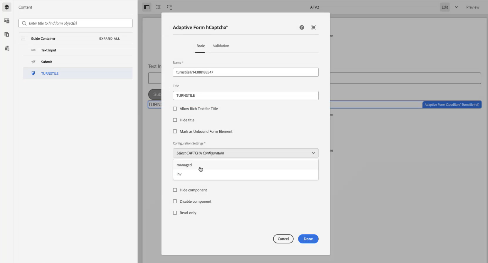

# AEM Forms環境と Turnstile の連携 {#connect-your-forms-environment-with-turnstile-service}

<!--
This feature is based on Feature Toggle id `FT_FORMS-12407`. To enable the feature, follow the steps given in the [Enable Feature Toggle](/help/forms/using/enable-feature-toggle.md) article. 
-->

 この機能はデフォルトでは有効になっていません。 公式アドレスからaem-forms-ea@adobe.comに書き込んで、機能へのアクセスをリクエストできます。

CAPTCHA（コンピュータと人間を区別する完全に自動化された公開チューリングテスト）は、人間と自動化されたプログラム／ボットを区別するために、オンライントランザクションで一般的に使用されるプログラムです。テストを行ってユーザーの反応を評価し、サイトを使用しているのが人間かボットかを判断します。テストが失敗した場合の続行を防ぎ、ボットによるスパムの投稿や悪意のある目的を防止することで、オンライントランザクションの安全性を高めます。

AEM Forms 6.5 は、次の CAPTCHA ソリューションをサポートしています。

* [Turnstile Captcha](/help/forms/using/integrate-adaptive-forms-turnstile.md)
* [Google reCAPTCHA](/help/forms/using/captcha-adaptive-forms.md)
* [hCaptcha](/help/forms/using/integrate-adaptive-forms-hcaptcha.md)

<!-- -->

## AEM Forms環境と Turnstile Captcha の統合

Cloudflare の Turnstile Captcha は、自動ボット、悪意のある攻撃、スパム、不要な自動トラフィックからフォームとサイトを保護することを目的としたセキュリティ対策です。 フォームの送信を許可する前に、フォームの送信時にユーザーが人間であることを確認するチェックボックスが表示されます。

>[!VIDEO](https://video.tv.adobe.com/v/3440940/)

### AEM Forms環境と Turnstile Captcha を統合するための前提条件 {#prerequisite}

AEM Forms用に Turnstile を設定するには、Turnstile Web サイトから [Turnstile サイトキーと秘密鍵 ](https://developers.cloudflare.com/turnstile/get-started/) を取得する必要があります。

### ターンスタイルを設定 {#steps-to-configure-hcaptcha}

AEM Formsを Turnstile サービスと統合するには、次の手順を実行します。

1. お使いのAEM Forms環境に設定コンテナを作成します。 設定コンテナは、AEM Formsを外部サービスに接続するために使用されるクラウド設定を保持します。 設定コンテナを作成するには：
   1. AEM Formsを開きます。
   1. **[!UICONTROL ツール／一般／設定ブラウザー]**&#x200B;に移動します。
   1. 設定ブラウザーで、既存のフォルダーを選択するか、新しいフォルダーを作成します。
      * **新規フォルダー** を作成し、クラウド設定を有効にするには：
         1. 設定ブラウザーで「**[!UICONTROL 作成]**」をタップします。
         1. 設定を作成ダイアログで、名前とタイトルを指定し、「**[!UICONTROL クラウド設定]**」をオンにします。
         1. 「**[!UICONTROL 作成]**」をクリックします。
      * **既存のフォルダー** のクラウド設定を有効にするには：
         1. 設定ブラウザーでフォルダーを選択し、「**[!UICONTROL プロパティ]**」をクリックします。
         1. 設定プロパティダイアログで、「**[!UICONTROL クラウド設定]**」を有効にします。
         1. **[!UICONTROL 保存して閉じる]** をクリックして、設定を保存します。

1. Cloud Serviceを設定します。
   1. AEM オーサーインスタンスで、/**[!UICONTROL Cloud Service]** に移動し、「**[!UICONTROL Turnstile]**」をクリックします。
      
   1. 前の節で説明したように、作成または更新された設定コンテナを選択します。 「**[!UICONTROL 作成]**」をクリックします。
      
   1. **[!UICONTROL ウィジェットタイプ]** を管理対象、非インタラクティブ、非表示のいずれかに指定します。
   1. **[!UICONTROL タイトル]**、**[!UICONTROL 名前]** など、その他の詳細を指定します。
   1. Turnstile サービス用に **[!UICONTROL サイトキー]** と **[!UICONTROL 秘密鍵]** を指定します [ 前提条件で取得 ](#prerequisite)。
   1. 「**[!UICONTROL 作成]**」をクリックします。

      

   >[!NOTE]
   > 自動スタイル検証用に既にクライアントサイドのJavaScript検証 URL とサーバーサイドの検証 URL が入力されているので、変更する必要はありません。

   Turnstile Captcha サービスを設定すると、アダプティブフォームで使用できるようになります。

## アダプティブフォームフ {#using-turnstile-aem-6.5} ームでのターンスタイルの使用

1. AEM Formsを開きます。
1. **[!UICONTROL Forms]**／**[!UICONTROL フォームとドキュメント]**&#x200B;に移動します。
1. アダプティブフォームを選択し、**[!UICONTROL プロパティ]** をクリックします。 **[!UICONTROL 設定コンテナ]** で、AEM Formsと Turnstile を接続するクラウド設定を含む設定コンテナを選択します。
1. 「**[!UICONTROL 保存して閉じる]**」をクリックします。

   Captcha サービスを設定するための設定コンテナがない場合、設定コンテナの作成方法については、[ 自動スタイルの設定 ](#configure-turnstile-steps-to-configure-hcaptcha) の節を参照してください。

   

1. アダプティブフォームを選択し、**[!UICONTROL 編集]** をクリックして、アダプティブフォームをエディターで開きます。
1. コンポーネントブラウザーから **[!UICONTROL Captcha]** コンポーネントを、アダプティブフォームにドラッグ＆ドロップします。
1. **[!UICONTROL Captcha]** コンポーネントを選択し、プロパティ  アイコンをクリックします。 プロパティダイアログが開きます。次のプロパティを指定します。

   <!---->
   

   * **[!UICONTROL タイトル ]:** Captcha コンポーネントのタイトルを指定します。 フォームコンポーネントは、フォーム内とルールエディター内の両方で一意のタイトルを使用して簡単に識別できます。
   * **[!UICONTROL 設定 ]:** 自動で設定するクラウド設定を選択します。
   * **[!UICONTROL 検証メッセージ ]:** フォーム送信時またはユーザーアクション時に Captcha を検証するための検証メッセージを提供します。
   * **[!UICONTROL Captcha サービス ]:** フォーム送信用の CAPTCHA サービスを選択します。ここでは、「Turnstile®」を選択します。
   * **[!UICONTROL 設定 ]:** Turnstile 用に設定したクラウド設定を選択します®。
     >[!NOTE]
     >同様の目的のために、環境内に複数のクラウド設定を持つことができます。 そのため、サービスは慎重に選択してください。サービスがリストに表示されない場合は、AEM Forms環境と Turnstile サービスを接続するCloud Serviceの作成方法について、[AEM Forms環境と Turnstile の接続 ](#connect-your-forms-environment-with-turnstile-service) を参照してください。

   * **[!UICONTROL エラーメッセージ ]:** Captcha 送信が失敗した場合にユーザーに表示するエラーメッセージを指定します。
   * **Captcha サイズ：** hCaptcha® チャレンジダイアログの表示サイズを選択できます。 「**[!UICONTROL コンパクト]**」オプションを使用すると小さいサイズを表示し、「**[!UICONTROL 標準]**」を使用すると比較的大きいサイズの hCaptcha® チャレンジダイアログを表示します。

1. 「**[!UICONTROL 完了]**」を選択します。

現在は、フォームの入力者が Turnstile サービスによって発生する課題を正常にクリアした正当なフォームのみがフォーム送信に許可されています。

## よくある質問

* **Q:1 つのアダプティブフォームで複数の Captcha コンポーネントを使用できますか？**
* **A:** アダプティブフォームでの複数の Captcha コンポーネントの使用はサポートされていません。 また、遅延読み込みのためにマークされたフラグメントまたはパネルで Captcha コンポーネントを使用することはお勧めしません。

## 関連トピック {#see-also}

* [アダプティブフォームの CAPTCHA の使用](/help/forms/using/captcha-adaptive-forms.md)
* [アダプティブフォームで hCaptcha を使用する](/help/forms/using/integrate-adaptive-forms-hcaptcha.md)
