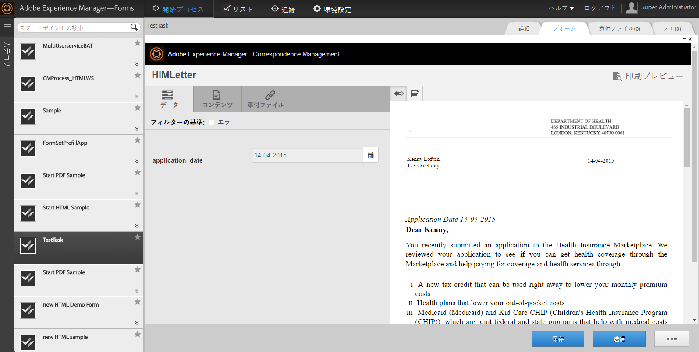

# AEM Forms Workspace でのサードパーティアプリケーションの統合{#integrating-third-party-applications-in-aem-forms-workspace}

AEM Forms Workspace では、フォームおよびドキュメントでタスクの割り当ておよび完了アクティビティの管理をサポートしています。これらのフォームおよびドキュメントは、XDP、PDF、HTML、または Flex 形式にレンダリングされた XDP フォーム、Flex® フォーム、または Guide （推奨されていません）にすることができます。

これらの機能はさらに拡張されます。AEM Forms では、AEM Forms Workspace と同じ機能をサポートするサードパーティアプリケーションとの統合をサポートしています。この機能の共通の部分は、割り当てのワークフローとタスクの事後承認です。AEM Forms では、AEM Forms エンタープライズユーザーに単一の統合された操作性を提供することによって、タスクの割り当てやサポートされているアプリケーションの承認などのすべてを AEM Forms Workspace 経由で処理できるようにします。

例として、AEM Forms Workspace との統合にサンプル候補として Correspondence Management を考慮してみましょう。Correspondence Management には、「レター」という概念があります。レターをレンダリングし、レターに対してアクションを実行できます。

## Correspondence Management アセットの作成 {#create-correspondence-management-assets}

AEM Forms WorkspaceでレンダリングされるサンプルのCorrespondence Managementテンプレートを作成することによる開始。 For more details, see [Create a letter template](../../forms/using/create-letter.md).

URLでCorrespondence Managementテンプレートにアクセスし、Correspondence Managementテンプレートが正常にレンダリングできるかどうかを確認します。 URLは、 `https://'[server]:[port]'/lc/content/cm/createcorrespondence.html?cmLetterId=encodedLetterId&cmUseTestData=1&cmPreview=0;`

ここで、`encodedLetterId` は URL エンコードされたレター ID です。Workbench で Workspace タスクにレンダリングプロセスを定義する場合は、同じレター ID を指定します。

## AEM Workspace でレターをレンダリングして送信するタスクを作成する {#create-a-task-to-render-and-submit-a-letter-in-aem-workspace}

これらの手順を実行する前に、次のグループのメンバーであることを確認してください。

* cm-agent-users
* Workspace ユーザー

詳しくは、「[Add and configure users](/help/forms/using/admin-help/adding-configuring-users.md)（ユーザーを追加して設定する）」を参照してください。

AEM Workspace でレターをレンダリングして送信するタスクを作成するには、次の手順を実行します。

1. Workbench を起動します。ローカルホストに管理者としてログインします。
1. 「ファイル／新規／アプリケーション」をクリックします。アプリケーション名フィールドで、`CMDemoSample` を入力して「終了」をクリックします。
1. を選択 `CMDemoSample/1.0` し、右クリックしま `NewProcess`す。 名前フィールドで、`CMRenderer` を入力して「終了」をクリックします。
1. 開始ポイントアクティビティピッカーをドラッグして設定します。

   1. プレゼンテーションデータで、「CRX アセットの使用」を選択します。

      

   1. アセットを参照します。フォームアセットの選択ダイアログの「レター」タブに、サーバーのすべてのレターが表示されます。

      

   1. Select the appropriate letter and click **OK**.

1. 「アクションプロファイルの管理」をクリックします。アクションプロファイルの管理ダイアログが表示されます。レンダリングプロセスと送信プロセスが正しく選択されていることを確認します。
1. データ XML ファイルを使用してレターを開くために、データの準備プロセスで適切なデータファイルを参照して選択します。
1. 「OK」をクリックします。
1. Start Point Output とタスクの添付ファイルの変数を定義します。定義した変数には、Start Point Output とタスクの添付ファイルのデータが格納されます。
1. （オプション）ワークフローに別のユーザーを追加するには、アクティビティピッカーをドラッグして設定し、ユーザーに割り当てます。カスタムラッパー（以下のサンプルを参照）を作成するか、DSC（以下参照）をダウンロードしてインストールし、レターテンプレート、Start Point Output、タスクの添付ファイルを展開します。

   カスタムラッパーのサンプルは次のとおりです。

   ```java
   public LetterInstanceInfo getLetterInstanceInfo(Document dataXML) throws Exception {
   try {
   if(dataXML == null)
   throw new Exception("dataXML is missing");
   
   CoreService coreService = getRemoteCoreService();
   if (coreService == null)
   throw new Exception("Unable to retrive service. Please verify connection details.");
   Map<String, Object> result = coreService.getLetterInstanceInfo(IOUtils.toString(dataXML.getInputStream(), "UTF-8"));
   LetterInstanceInfo letterInstanceInfo = new LetterInstanceInfo();
   
   List<Document> attachmentDocs = new ArrayList<Document>();
   List<byte[]> attachments = (List<byte[]>)result.get(CoreService.ATTACHMENT_KEY);
   if (attachments != null){
   for (byte[] attachment : attachments)
   { attachmentDocs.add(new Document(attachment)); }
   
   }
   letterInstanceInfo.setLetterAttachments(attachmentDocs);
   
   byte[] updateLayout = (byte[])result.get(CoreService.LAYOUT_TEMPLATE_KEY);
   if (updateLayout != null)
   { letterInstanceInfo.setLetterTemplate(new Document(updateLayout)); }
   
   else
   { throw new Exception("template bytes missing while getting Letter instance Info."); }
   
   return letterInstanceInfo;
   } catch (Exception e)
   { throw new Exception(e); }
   
   }
   ```

   [Get File](assets/dscsample.zip)Download DSC:サンプルDSCは、上述のDSCSample.zipファイルで入手できます。 DSCSample.zip ファイルをダウンロードして展開します。DSC サービスを使用する前に、設定する必要があります。For information, see [Configure the DSC Service](../../forms/using/add-action-button-in-create-correspondence-ui.md#p-configure-the-dsc-service-p).

   Define Activity ダイアログで、getLetterInstanceInfo などの適切なアクティビティを選択し、「**OK**」をクリックします。

1. アプリケーションをデプロイします。指示があったら、アセットをチェックインして保存します。
1. Log in to the AEM forms workspace at https://&#39;[server]:[port]&#39;/lc/content/ws.
1. 追加したタスク CMRenderer を開きます。Correspondence Management レターが表示されます。

   

1. 必要なデータを入力してレターを送信します。ウィンドウが閉じます。 このプロセスでは、ステップ 9 で、ワークフローに指定されているユーザーにタスクが割り当てられます。

   >[!NOTE]
   >
   >「送信」ボタンはレターの必須変数がすべて入力されるまで有効になりません。

[サポートへのお問い合わせ](https://www.adobe.com/account/sign-in.supportportal.html)
