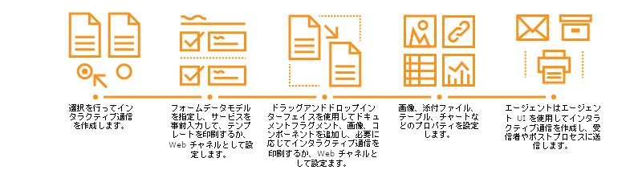

# インタラクティブ通信の概要 {#interactive-communications-overview}

この記事では、インタラクティブ通信の概要、サンプルのユースケース、作成ワークフロー、インタラクティブ通信とレターの違いについて説明します。

Interactive Communicationsは、ビジネス通信、ドキュメント、明細書、メリット通知、マーケティングメール、請求書、ウェルカムキットなど、安全でパーソナライズされたインタラクティブな通信の作成、アセンブリ、配信を一元化および管理します。

## 主な機能 {#key-capabilities}

以下に、インタラクティブ通信の主要な機能を示します。

* すぐに使用できる、フォームデータモデルとの統合機能が付属しています。この機能により、バックエンドのデータベースと、MS® Dynamics などの CRM システムに簡単にアクセスすることができます。
* 印刷チャネルと Web チャネル用の統合オーサリングインターフェイスが用意されています。このインターフェイスにより、印刷チャネルから Web チャネルを自動的に生成することができます。
* 印刷チャネルと Web チャネルでグラフを使用して、視覚的に分かりやすい形式で情報を表現することができます。
* ドキュメントフラグメントで、ルールエディターとフォームデータモデルを使用することができます。
* エージェント・ユーザー・インタフェースは、インタラクティブ通信の印刷およびWebプレビューを表示
* ドラッグアンドドロップ操作でコンポーネントを配置し、印刷チャネルと Web チャネルを短時間で作成することができます。

## インタラクティブ通信の作成  {#interactive-communication-creation}

### ワークフロー {#workflow}

To create an Interactive Communication, have the [building blocks](#buildingblocks) for Interactive Communication ready and then complete the following steps:

1. Choose to [create an Interactive Communication](/help/forms/using/create-interactive-communication.md).

1. [フォームデータモデル](/help/forms/using/data-integration.md)、事前入力サービス、[印刷チャネルと Web チャネルのテンプレート](/help/forms/using/web-channel-print-channel.md)を指定します。印刷チャネルからWebチャネルを生成するように選択できます。

1. Using the [drag-and-drop interface](/help/forms/using/introduction-interactive-communication-authoring.md), add document fragments, images, components to print and web channel of the Interactive Communication as required.
1. 追加したコンポーネントのプロパティを設定します。例えば、以下のようなコンポーネントがあります。

   1. [画像](/help/forms/using/create-interactive-communication.md#step2)
   1. [テーブル](/help/forms/using/create-interactive-communication.md#tables) （レイアウトフラグメントを含む）
   1. [グラフ](/help/forms/using/chart-component-interactive-communications.md)
   1. [ドキュメントフラグメント](/help/forms/using/create-interactive-communication.md#document-fragment-properties)

1. 印刷チャネルと Web チャネルのプレビューを表示し、必要に応じてインタラクティブ通信を編集します。
1. エージェントはエージェント UI を使用して、インタラクティブ通信を受信者または後処理に送信するための[準備](/help/forms/using/prepare-send-interactive-communication.md)を行います。

### 構築ブロック {#buildingblocks}

インタラクティブ通信を作成するために必要な構築ブロックを以下に示します。

* [フォームデータモデル](/help/forms/using/data-integration.md)
* [印刷チャネルと Web チャネルのテンプレート](/help/forms/using/web-channel-print-channel.md)
* [ドキュメントフラグメント](/help/forms/using/document-fragments.md)
* 画像
* [Webチャネルのテーマ](/help/forms/using/themes.md)

## インタラクティブ通信と Correspondence Management の比較 {#interactive-communications-vs-correspondence-management}

顧客とのコミュニケーションを作成するための、Interactive Communicationはデフォルトで推奨されるアプローチです。 AEM 6.3 Forms または AEM 6.2 Forms で作成したレターを引き続き使用する場合は、[互換性パッケージをインストールする必要があります](/help/forms/using/compatibility-package.md)。以下は、対話型通信とレターの機能の比較です。

<table>
 <tbody>
  <tr>
   <td><strong>機能</strong></td>
   <td><strong>インタラクティブコミュニケーション</strong></td>
   <td><strong>レター</strong></td>
  </tr>
  <tr>
   <td>出力</td>
   <td>印刷出力と Web 出力</td>
   <td>印刷出力</td>
  </tr>
  <tr>
   <td>スキーマ</td>
   <td>フォームデータモデル </td>
   <td>データディクショナリ </td>
  </tr>
  <tr>
   <td>ローカリゼーション</td>
   <td>フォームデータモデルではサポートされていない</td>
   <td>データディクショナリでサポートされている</td>
  </tr>
  <tr>
   <td>ルールエディター</td>
   <td>
    <ul>
     <li>テキストと条件でルールエディターを使用して、インライン条件を作成できる</li>
     <li>インタラクティブ通信エディターで、Web チャネルのコンポーネントにルールを適用できる</li>
    </ul> </td>
   <td>条件式を作成するための UI はない</td>
  </tr>
  <tr>
   <td>オーサリング</td>
   <td>ドラッグアンドドロップ方式のインターフェイスを使用して、印刷チャネルと Web チャネルを作成できる</td>
   <td>ドラッグ&amp;ドロップメカニズムなし </td>
  </tr>
  <tr>
   <td>グラフ</td>
   <td>印刷チャネルと Web チャネルでグラフがサポートされている</td>
   <td>サポートされていない</td>
  </tr>
  <tr>
   <td>テーマ</td>
   <td>テーマを使用して Web チャネルのスタイルを設定できる</td>
   <td>テーマはサポートされていない</td>
  </tr>
  <tr>
   <td>監査とバージョン管理</td>
   <td>サポートされていない</td>
   <td>サポート対象</td>
  </tr>
  <tr>
   <td>下書きとインスタンスの管理</td>
   <td>サポートされていない</td>
   <td>サポート対象</td>
  </tr>
  <tr>
   <td>バッチ処理</td>
   <td>サポート対象 </td>
   <td>サポート対象</td>
  </tr>
  <tr>
   <td>エージェント署名</td>
   <td>サポートされていない</td>
   <td>サポート対象</td>
  </tr>
  <tr>
   <td>リモート関数</td>
   <td>サポートされていない</td>
   <td>サポート対象</td>
  </tr>
 </tbody>
</table>

