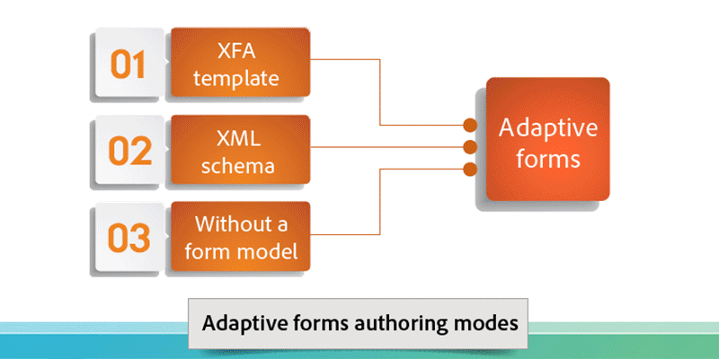
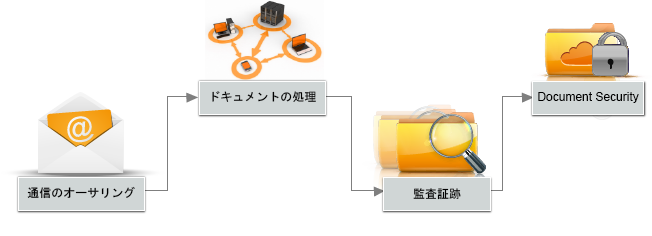

# AEM Forms の概要{#introduction-to-aem-forms}

AEM Forms における新機能や改良点に関しては、「[AEM Forms における新機能](../../forms/using/whats-new.md)」を参照してください。

## AEM Forms について  {#about-aem-forms}

Adobe Experience Manager（AEM）は、複雑なデジタルフォームの作成、管理、公開、および更新に特化した、使いやすいソリューションです。また、バックエンドプロセス、ビジネスルール、およびデータとの統合も実現されています。

AEM Forms では、通信管理機能、ドキュメントセキュリティ、統合された分析とともに、フォームのオーサリング、管理、公開を組み合わせて、魅力的なエンドツーエンドのエクスペリエンスを作成できます。AEM Forms は、すべての Web チャネルやモバイルチャネルで動作するように設計されており、ビジネスプロセスに効率的に統合することができます。これにより、効率を向上させながらも、文書業務やエラーを削減することができます。

大企業では、一度フォームを作成し、その後はコンテンツ管理システムにコピーして再利用されることも多くあります。フォームの大規模なデータベースを最新状態に維持し、検索可能な状態に保つことは非常に頭の痛い課題となることもあります。AEM はカスタマイズ可能な「フォームポータル」を提供することにより、Web チャネルおよびモバイルチャネルの双方から必要なフォームを見つけ、アクセスできる状態に保ちます。

AEM Forms は、アダプティブフォームだけでなく、XFA フォーム、PDF ォーム、および関連アセットも管理できるフォーム管理ツールを提供します。詳しくは、「[フォーム管理の概要](../../forms/using/introduction-managing-forms.md)」を参照してください。

### 主な機能 {#key-capabilities}

要約すると、AEM Forms は次のような強力なフォーム管理機能を提供することで、手作業の削減と、顧客満足度の向上に貢献します。

* 「フォームポータル」により、PDF、HTML5、およびアダプティブフォームを含む動的フォームのデザインと展開を中央管理
* 使いやすいグラフィカルユーザーインターフェースにより、ビジネスユーザーは簡単にフォームのインポート、管理、プレビュー、および発行が可能
* キーワード、タグ、およびメタデータをサポートする、強力な検索機能を備えたレスポンシブなフォームディレクトリ
* ユーザーのデバイスや場所を動的に検出することにより、Web チャネルやモバイルチャネルに最適化されたフォーム描画を実現
* Adobe Analytics との統合により、フォームの使用メトリクスを効果的に測定可能
* Adobe Document Cloud eSign サービスや Scribble との統合により、機密情報を含むドキュメントへの電子署名に対応
* 自動化されたフォーム公開機能と、パーソナライズされたコミュニケーションを複数のチャネルを通じてタイムリーに届ける能力

## AEM フォームの種類  {#aem-form-types}

AEM Forms では、新規および既存のフォームを拡張することで、

* ほとんどの紙のように見える、ピクセルパーフェクトなページ番号付き HTML フォームや PDF フォーム、または
* ユーザーのデバイスやブラウザに自動的に適応するアダプティブフォームを作成できるようになります。

**PDF のフォーム**

PDF フォームでは、オフラインで入力してローカルに保存し、次回オンラインになったときにフォームデータを送信することができます。2 次元バーコードを使用してフォームデータをキャプチャしたり、デジタル署名を使用してユーザー確認を行ったりすることができます。

**HTML のフォーム**

HTML5 ブラウザベースのフォームは、モバイルデバイスとデスクトップブラウザの両方で表示することができます。Scribble や eSign サービスを使用して、HTML フォームに電子署名することができます。

**アダプティブフォーム**

アダプティブフォームは、ユーザーの応答に基づいてフィールドやセクションを追加または削除することにより、ユーザーの応答に動的に対応します。AEM では、アダプティブフォームを作成する際に、Adobe XML フォームテンプレートを再利用することができます。

### サポートされている機能 {#supported-features}

次の機能は、すべてのフォームタイプでサポートされています。

* ダイナミックレイアウト
* フォームフィールドの検証
* 状況依存ヘルプ
* スクリプトとXMLデータの取り扱い
* アクセシビリティの設計と確認
* サーバー側でフォームを保存する機能
* ファイル添付に対応
* データキャプチャ用の HTML Workspace との統合

## オフラインのデータ収集 {#offline-data-collection}

フォームデータが提出されると、Adobe Experience Manager により、フォームデータは既存のシステム、ビジネスルール、および必要な人材に接続されます。

AEM Forms では、モバイルアプリケーションとして Forms Workspace を備えており、デジタルビジネスプロセスをモバイルデバイスにも拡張することができます。Forms Workspace を使用することにより、オフライン時であってもデータを収集し記録することができます。Forms Workspace は、モバイルデバイスの機能を活用することで、写真やビデオをキャプチャし、タイムスタンプ情報などのデータを収集することができます。次回ネットワークに接続した際に、ユーザが収集したデータを同期させることができます。

データをオフラインでキャプチャし、オンラインになった際に同期する機能は、現場で作業する場合に特に有用です。これにより、生産性を向上させ、エラーを削減することができます。

**オフラインデータ収集用の Forms Workspace を使用する利点**

* タスク割り当てと追跡の作業を容易にする HTML 形式のワークスペースアプリケーション
* ドラッグアンドドロップによるワークフローデザイン環境
* エンタープライズコンテンツ管理コネクタ（ECM）
* フォームのデータをエンタープライズシステムに接続するための XML や SOAP といったオープンスタンダードをサポート
* モニターバックログ、作業キュー、および主要業績評価指標（KPI）の HTML レポートにデフォルトで対応
* 事業活動をリアルタイムで把握できる、カスタマイズ可能なダッシュボード
* サードパーティのレポートツールと接続するための API

## パーソナライズされた通信 {#personalized-communication}

効率的なデジタルセルフサービス体験を実現する上で重要な要素は、パーソナライズされた情報をタイムリーにやり取りすること、そしてどのようなデバイスからでも場所を問わずにアクセスできることです。パーソナライズされたタイムリーなコミュニケーションにより、ユーザーのコンバージョン率と満足度の両方を向上させることができます。

AEM Forms を使用するビジネスユーザーは、ドキュメントテンプレートをカスタマイズし、バックエンドプロセスからの情報を取り入れ、インタラクティブなコンポーネントを組み込むことにより、パーソナライズされた魅力的なユーザーエクスペリエンスを提供することができます。直感的なユーザーインターフェイスにより、技術的なスキルを持たないユーザーでもビジネスルールを開発し、問い合わせに基づいてコミュニケーションを生成するタイミングや、ユーザーが生成した応答を開始するタイミングを決めることができます。

領収書、ウエルカムキットや明細書などのパーソナライズされたドキュメントを、複数のチャネルにわたって簡単に配信することができます。組織では、パーソナライズされた Web ポータルへトラフィックを引き込み、別のサービスへの登録や購入を促進することができます。

**主な機能**

* テンプレート、コンテンツブロックやビジネスルールなどをサポートする対応オーサリング環境
* ドキュメントの変換およびアセンブリ
* Web、電子メール、および紙面などの複数のチャネルを介した、オンデマンドまたはバッチ文書配信のサポート
* 変更履歴を伴う監査証跡
* コンテンツの完全性と署名者の身元を検証するデジタル署名をサポート
* ドキュメントの AEM Forms 用セキュリティアドオンにより、暗号化、使用ポリシー、追跡、および監査などに対応

合理化され、パーソナライズされたコミュニケーションのワークフロー
