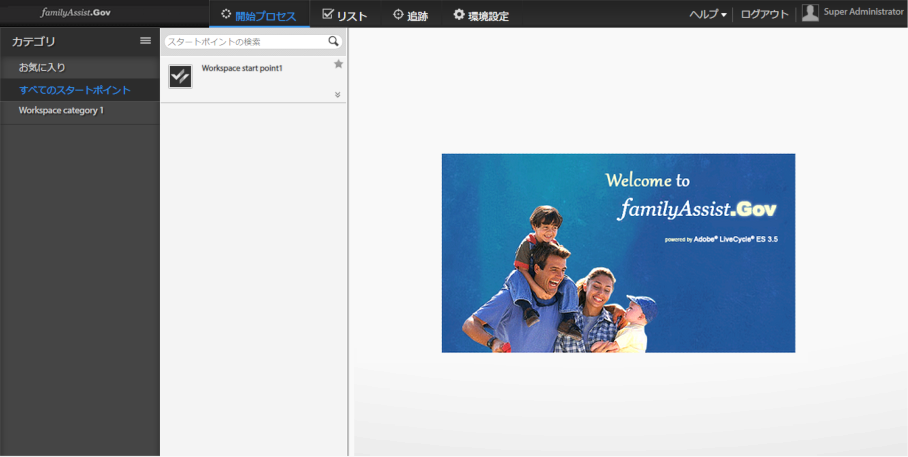

# AEM Forms Workspace のカスタマイズの概要{#introduction-to-customizing-aem-form-workspace}

AEM Form Workspaceは、プレゼンテーションのセマンティックとインターフェイスの機能を変更する機能を提供します。 スタイル、レイアウト、書式設定、ブランド、およびコア機能を変更するカスタマイズのタイプについては、以下に説明します。

カスタマイズされた Workspace の例

## カスタマイズの種類 {#types-of-customizations}

AEM Forms Workspace では、幅広く様々なカスタマイズをサポートしてユーザーインターフェイスのレイアウト、その表示方法、機能などを更新します。カスタマイズでは以下のうちの 1 つ以上を更新します。

* ユーザーインターフェイスの表示方法
* セマンティックのカスタマイズを使用した機能
* 他のアプリケーションでの HTML コンポーネントの再利用

### ユーザーインターフェイスの変更 {#user-interface-changes}

AEM Forms Workspace の表示方法、レイアウト、およびその他のプレゼンテーションセマンティックを変更できます。CSS、HTML テンプレートおよび JavaScript™ ファイルをカスタマイズすることによって、Workspace を変更します。すべてのデフォルトファイルはデフォルトのインストレーションで提供されます。

The most commonly applicable steps are covered in [Generic steps for AEM Forms workspace customization](../../forms/using/generic-steps-html-workspace-customization.md). 詳細な手順を含む、カスタマイズの特殊な例については、この記事の最後にある関連項目を参照してください。

#### スタイルシートの理解 {#understanding-the-style-sheet}

Workspace をカスタマイズする前に、/libs/ws/css/style.css にある AEM Forms 付属のデフォルトスタイルシートを理解しておいてください。

Workspace をカスタマイズするには、/libs/ws/css フォルダー内にある既存のスタイルシート style.css を理解しておくことをお勧めします。新しい主なコンポーネントを以下に説明します。

<table>
 <tbody>
  <tr>
   <th>
CSS 要素
 </th>
   <th>
変更されたユーザーインターフェイスコンポーネント
 </th>
  </tr>
  <tr>
   <td>
#ヘッダー
 </td>
   <td>
AEM Forms Workspaceのヘッダー
 </td>
  </tr>
  <tr>
   <td>
.categoryList
 </td>
   <td>
カテゴリーリスト
 </td>
  </tr>
  <tr>
   <td>
.categoryList .header
 </td>
   <td>
カテゴリーリストのヘッダー
 </td>
  </tr>
  <tr>
   <td>
.categories、.filters
 </td>
   <td>
カテゴリーリストの下の空白
 </td>
  </tr>
  <tr>
   <td>
.category、.filter
 </td>
   <td>
カテゴリ
 </td>
  </tr>
  <tr>
   <td>
.category:hover、.category.selected、.filter:hover、.filter.selected
 </td>
   <td>
選択されたカテゴリーとカテゴリーのマウスオーバースタイル
 </td>
  </tr>
  <tr>
   <td>
categoryListBar .tool、categoryListBar .content
 </td>
   <td>
開始プロセスページ (終了したカテゴリーリスト)
 </td>
  </tr>
  <tr>
   <td>
filterListBar .tool、filterListBar .content
 </td>
   <td>
To Do ページ (終了したフィルターリスト)
 </td>
  </tr>
  <tr>
   <td>
processNameListBar .tool、processNameListBar .content
 </td>
   <td>
トラッキングページ (終了したプロセス名リスト)
 </td>
  </tr>
  <tr>
   <td>
.startPointList、.tasklist
 </td>
   <td>
スタートポイントリストまたはタスクリスト
 </td>
  </tr>
  <tr>
   <td>
.startPointList .header、.tasklist .header
 </td>
   <td>
スタートポイントリストまたはタスクリストのヘッダー
 </td>
  </tr>
  <tr>
   <td>
.startpoint.selected、.task.selected
 </td>
   <td>
選択されたスタートポイントまたはタスク
 </td>
  </tr>
  <tr>
   <td>
.startpoint.selected .description、.task.selected .description
 </td>
   <td>
選択されたスタートポイントまたはタスクの説明
 </td>
  </tr>
  <tr>
   <td>
#taskarea
 </td>
   <td>
タスク領域
 </td>
  </tr>
  <tr>
   <td>
#header .dropdown
 </td>
   <td>
ヘッダー内のユーザードロップダウン
 </td>
  </tr>
  <tr>
   <td>
.sortDrop dd ul
 </td>
   <td>
ソートタスクドロップダウン
 </td>
  </tr>
 </tbody>
</table>

#### CSS {#css}

AEM Forms Workspaceの外観は、CSSの外観を借用します。 CSS をカスタマイズすることにより、フォント、色、ブランド、レイアウトなどの Workspace のプレゼンテーションセマンティックを変更することができます。

CSS カスタマイズのためのトップレベルの手順を以下に示します。

* CSS ファイルを作成します。
* この CSS にスタイルアイテムを追加します。詳細については、「CSS スタイルについて」を参照してください。
* Update its references in `html.jsp`.

For the exact steps to do these customizations, see [Generic steps for AEM Forms workspace customization](../../forms/using/generic-steps-html-workspace-customization.md). AEM Forms Workspaceに付属のCSSファイルは、/libs/ws/css/にあります。 CSS 関連のカスタマイズの場合は、[出荷パッケージ](../../forms/using/introduction-customizing-html-workspace.md#p-crx-package-p)を使用します。CSS 関連のカスタマイズの特殊な例については、この記事の最後にある関連項目を参照してください。

#### 画像 {#image}

AEM Forms Workspaceをカスタマイズして、ユーザーのアバターを追加したり、組織のロゴを追加したりできます。 これらのカスタマイズの場合は、[出荷パッケージ](../../forms/using/introduction-customizing-html-workspace.md#p-crx-package-p)を使用します。

画像をカスタマイズするためのトップレベルの手順を以下に示します。

* WebDAV をインストールして設定します。
* 新しい画像を追加します。
* 追加した画像に対応する新しいスタイルを追加します。
* `html.jsp` ファイル内の新しい CSS ファイルにリンクします。

To get started with customizing the images in AEM Forms workspace, follow the [Generic steps for AEM Forms workspace customization](../../forms/using/generic-steps-html-workspace-customization.md). 画像に関係するカスタマイズの特殊な例については、この記事の最後にある関連項目を参照してください。

#### HTML テンプレート {#html-template}

HTMLテンプレートは、Workspaceユーザーインターフェイスの外観とレイアウトを定義するのに役立ちます。 デフォルトの HTML テンプレートを更新することによって、デフォルトのユーザーインターフェイスのレイアウトをカスタマイズできます。

HTML テンプレートをカスタマイズするためのトップレベルの手順を以下に示します。

* ユーザーが作成したフォルダーで、必要なデフォルトのファイルのコピーを作成します。
* 新しいテンプレートをユーザー定義フォルダーに追加します。
* 新しいテンプレートのパスなど、コピーしたファイルに関連する更新を行います。

このようなカスタマイズの特殊な例については、この記事の最後にある関連項目を参照してください。カスタマイズするテンプレートに応じて、[Ship パッケージ](../../forms/using/introduction-customizing-html-workspace.md#p-crx-package-p)または [Dev パッケージ](../../forms/using/introduction-customizing-html-workspace.md#p-crx-package-p)のいずれかを選択します。

### セマンティックの変更 {#semantic-changes}

AEM Forms Workspaceの機能を変更するには、JavaScriptソースコードを変更します。 コア機能の変更は、セマンティックの変更としてラベル付けされます。AEM Forms Workspace のソースコードの一部として、モデル、ビュー、およびテンプレートを変更します。

セマンティックの変更を行ってAEM Forms Workspaceの機能を変更するための最上位の手順は、次のとおりです。

* ユーザーが作成したフォルダーで、該当するデフォルトのファイルのコピーを作成します。
* ユーザー定義フォルダーに新しいモデルおよびビューを追加します。
* デフォルトの JavaScript ファイルで新しく追加したモデルおよびビューのパスを更新するなど、関連する更新を行います。
* パッケージを縮小してパフォーマンスを最適化します。

ソースコードの一部であるコンポーネントに関する概念的詳細については、「[再利用可能なコンポーネントの詳細](/help/forms/using/description-reusable-components.md)」を参照してください。これらのカスタマイズの場合は、Dev パッケージを使用します。

### 再利用可能なコンポーネント {#reusable-components}

AEM Forms Workspaceはコンポーネントベースのソフトウェアなので、簡単にカスタマイズして再利用できます。 Workspace コンポーネントを Web アプリケーションで容易に統合できます。

For more conceptual information, see the [Description of reusable components](/help/forms/using/description-reusable-components.md) and for instruction about using the components, see [Integrating AEM Forms workspace components in web applications](/help/forms/using/description-reusable-components.md).

## AEM Forms Workspace コードの構築 {#building-html-workspace-code}

### SDK パッケージ {#sdk-package}

パッケージには AEM Forms Workspace のソースコードが含まれます。パッケージは、で入手できま `[LC root]\sdk\html-workspace\adobe-lc-workspace-src.zip`す。

これは主としてカスタマイズ向けで、

* Ship、Debug、および Dev プロファイルの CRX パッケージ（下記の [CRX パッケージ](../../forms/using/introduction-customizing-html-workspace.md#p-crx-package-p)に記載しています）
* カスタマイズされたコードの縮小バージョン（セマンティックの変更用）

#### WS コンテンツ {#ws-content}

* client-pkg:

   * src - CRX ノードを作成するのに必要なアーティファクトを含みます。
   * pom.xml - 様々なプロファイルのデプロイパッケージを構築するスクリプト（WS-デプロイパッケージ）

* client-html:

   * assembly - AEM Forms Workspace SDKを作成するスクリプトで使用されるzip.xmlを含みます。
   * src/main/webapp -

      * css - AEM Forms Workspace のスタイルシートを含みます。
      * images - AEM Forms Workspace で使用する画像を含みます。
      * js:

         * libs - AEM Forms Workspace で使用されているすべてのサードパーティライブラリを含みます。
         * licenses - HTML および JS ファイルのライセンス、およびこれらのライセンスをそれぞれのソースファイルの前に置くコードを含みます。
         * minifier - カスタマイズされた javascript コードの結合、縮小、および醜怪化に使用されます。
         * resourcejs_optimizer -javascript ソースの結合、縮小、および醜怪化に使用されます。
         * resource_generator - register.js および modelcontrollerpath.js の生成に使用されます。
         * runtime:

            * initializer - AEM Forms Workspace で使用するバックボーンビューやモデルを初期化するために使用する initializer.js を含みます。
            * models - AEM Forms Workspace にあるすべてのコンポーネントのバックボーンモデルを含みます。
            * routes - AEM Forms Workspace に開始プロセス、todo、トラッキングおよび環境設定を読み込む javascript ファイルと HTML ファイルを含みます。
            * services - AEM Forms Workspace 内で使用されている service.js を含みます。すべてのサーバー呼び出しは service.js を介して行われます。
            * templates - AEM Forms Workspace 内にあるすべてのテンプレート、すなわちすべてのビューの HTML ファイルを含みます。
            * util - AEM Forms Workspace 内で使用されているすべてのユーティリティファイル（javascrip）を含みます。
            * views - AEM Forms Workspace 内のすべてのコンポーネントのバックボーンビューを含みます。
         * main.js
         * router.js
      * libs/ws:pdf.htmlとpluginPing.pdfはAEM Forms WorkspaceでPDFフォームを読み込むために使用され、WSNextAdapter.swfはAEM Forms WorkspaceでSWFフォームとガイドを読み込むために使用されます。
      * locales:

         * de-DE - ドイツ語の translation.json を含みます。
         * en-US - 英語の translation.json を含みます。
         * fr-FR - フランス語の translation.json を含みます。
         * ja-JP - 日本語の translation.json を含みます。
         * html.jsp - 現在のブラウザーのロケールを調べるコードを含みます。
      * html.jsp
      * GET.jsp

### CRX パッケージ {#crx-package}

CRX パッケージは CRX™ リポジトリにデプロイすることができます。It is available at `[LC root]\crx-repository\install\adobe-lc-workspace-pkg.zip`.

このパッケージは、以下の 3 つのプロフィルを使用して構築することができます。

| **プロファイル** | **説明** | **使用方法** |
|---|---|---|
| Ship プロファイル | このプロファイルは縮小を使用して最も小さい CRX パッケージを作成します。このパッケージが最も効率的です。すべての JavaScript™ ファイルは単一の JS ファイルに結合されて縮小されます。 | このプロファイルは、JS ファイルにこれ以上セマンティックの変更が必要でない場合に使用します。 |
| Debug プロファイル | このプロファイルは、適度に効率的な CRX パッケージを作成します。このパッケージのサイズは、Ship プロファイルを使用して作成したパッケージよりも若干大きくなります。このパッケージにはほとんどの JavaScript ファイルが単一の JS ファイルに結合されています。 | このプロファイルはデバッグに使用します。 |
| Dev プロファイル | このプロファイルは、最も大きなサイズの CRX パッケージを作成します。すべての JavaScript ファイルは SDK パッケージ内にあるため、別々に入手することができます。 | セマンティックの変更を組み込む場合はこのプロファイルを使用します。 |

#### Ship プロファイル {#ship-profile}

#### Command {#command}

* クライアントに出荷される Source パッケージの client-pkg フォルダーへの mvn clean -P Ship install
* 出荷プロファイルコマンドの実行は、64ビットJVMでのみ機能します。

#### WS コンテンツ {#ws-content-1}

* css - style.css、ie.css および jquery-ui.css を含みます。
* images - すべての画像を含みます。
* js:

   * libs:

      * require - require.js を含みます。
      * jqueryui - jquery.ui.datepicker.ja.js を含みます。
   * runtime:

      * templates - AEM Forms Workspace 内にあるすべてのテンプレート、すなわちすべてのコンポーネントの HTML ファイルを含みます。
   * main.js （combined、minified および uglified）。
   * registry.js

* libs:

   * ws - pluginPing.pdf、pdf.html および WSNextAdapter.swf を含みます。

* Locale - .content.xml を含みます。
* locales:

   * de-DE - ドイツ語の translation.json を含みます。
   * en-US - 英語の translation.json を含みます。
   * fr-FR - フランス語の translation.json を含みます。
   * ja-JP - 日本語の translation.json を含みます。
   * html.jsp - 現在のブラウザーのロケールを調べるコードを含みます。

* Index - .content.xml を含みます。
* profile - offline.jsp を含みます。
* GET.jsp
* html.jsp
* content.xml
* _rep_policy.xml

#### Debug プロファイル {#debug-profile}

#### Command {#command-1}

* client-pkg への mvn clean -P Debug install
* Debug プロファイルコマンド実行は 64 ビット JVM でのみ機能します。

#### WS コンテンツ {#ws-content-2}

* css - style.css、ie.css および jqueri-ui.css を含みます。
* images - すべての画像を含みます。
* js:

   * libs:

      * require - require.js を含みます。
      * jqueryui - jquery.ui.datepicker.ja.js を含みます。
   * runtime:

      * templates - AEM Forms Workspace 内にあるすべてのテンプレート、すなわちすべてのコンポーネントの HTML ファイルを含みます。
   * main.js (組み合わせ)
   * registry.js

* libs:

   * ws - pluginPing.pdf、pdf.html および WSNextAdapter.swf を含みます。

* Locale - .content.xml を含みます。
* locales:

   * de-DE - ドイツ語の translation.json を含みます。
   * en-US - 英語の translation.json を含みます。
   * fr-FR - フランス語の translation.json を含みます。
   * ja-JP - 日本語の translation.json を含みます。
   * html.jsp - 現在のブラウザーのロケールを調べるコードを含みます。

* Index - .content.xml を含みます。
* profile - offline.jsp を含みます。
* GET.jsp
* html.jsp
* content.xml
* _rep_policy.xml

#### Dev プロファイル {#dev-profile}

#### Command {#command-2}

client-pkg への mvn clean -P Dev install

#### WS コンテンツ {#ws-content-3}

* css - style.css、ie.css および jqueri-ui.css を含みます。
* images - すべての画像を含みます。
* js:

   * libs - AEM Forms Workspace で使用されているすべてのライブラリを含みます。
   * require - require.js を含みます。
   * jqueryui - jquery.ui.datepicker.ja.js を含みます。
   * runtime:

      * initializer - initializer.js と modelcontrollerpath.js を含みます。
      * models - AEM Forms Workspace 内のすべてのコンポーネントのモデルを含みます。
      * routes - AEM Forms Workspace に開始プロセス、todo、トラッキングおよび環境設定を読み込む javascript ファイルと HTML ファイルを含みます。
      * services - AEM Forms Workspace 内で使用されている service.js を含みます。
      * templates - AEM Forms Workspace 内にあるすべてのテンプレート、すなわちすべてのコンポーネントの HTML ファイルを含みます。
      * util - AEM Forms Workspace 内で使用されているすべてのユーティリティファイル（javascrip）を含みます。
      * views - AEM Forms Workspace 内のすべてのコンポーネントのビューを含みます。
   * main.js
   * registry.js
   * router.js

* libs:

   * ws - pluginPing.pdf、pdf.html および WSNextAdapter.swf を含みます。

* Locale - .content.xml を含みます。
* locales:

   * de-DE - ドイツ語の translation.json を含みます。
   * en-US - 英語の translation.json を含みます。
   * fr-FR - フランス語の translation.json を含みます。
   * ja-JP - 日本語の translation.json を含みます。
   * html.jsp - 現在のブラウザーのロケールを調べるコードを含みます。

* Index - .content.xml を含みます。
* profile - offline.jsp を含みます。
* GET.jsp
* html.jsp
* content.xml
* _rep_policy.xml
