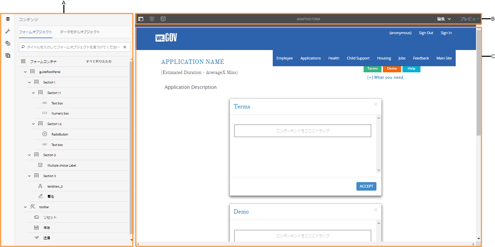
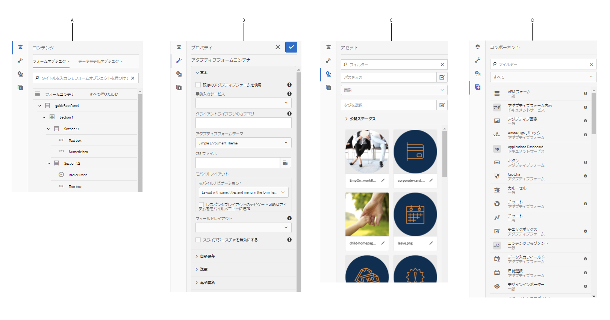
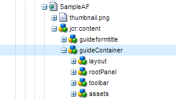

# アダプティブフォームのオーサリングの概要 {#introduction-to-authoring-adaptive-forms}

## 概要 {#overview}

アダプティブフォームを使用すると、動的で柔軟で応答の速い、魅力的なフォームを作成することができます。AEM Forms には、アダプティブフォームを作成して操作するための直感的なユーザーインターフェースと、すぐに使用できる各種のコンポーネントが用意されています。フォームモデルやスキーマをベースとしてアダプティブフォームを作成することも、フォームモデルを使用せずにアダプティブフォームを作成することもできます。フォームモデルを選択する場合は、そのモデルが業務上の要件を満たしているかどうかだけでなく、インフラに対する現在の投資や既存のアセットを拡張できるモデルであるかどうかについても慎重に検討することが重要になります。アダプティブフォームは、以下のいずれかの方法で作成することができます。

* **フォームデータモデルの使用**
   [データ統合](../../forms/using/data-integration.md) ：異なるデータソースのエンティティやサービスを、アダプティブフォームの作成に使用できるフォームデータモデルに統合できます。 作成するアダプティブフォームで、複数のデータソースからのデータの取得と、複数のデータソースへのデータの書き込みが含まれる場合は、フォームデータモデルを選択します。

* **XDP フォームテンプレートを使用する** XFA ベースのフォームや XDP フォームを使用している場合は、このテンプレートをフォームモデルとして使用することをお勧めします。XFA ベースのフォームをアダプティブフォームに直接変換する方法を提供します。すべての既存の XFA ルールは、関連付けられたアダプティブフォームに保持されます。このアダプティブフォームは、検証、イベント、プロパティ、パターンなどの XFA 構成をサポートします。

* **XML スキーマ定義 (XSD) または JSON スキーマを使用する** XML スキーマと JSON スキーマは、組織内のバックエンドシステムによって生成されて使用されるデータの構造を表します。スキーマをアダプティブフォームに関連付け、その要素を使用して、アダプティブフォームに動的なコンテンツを追加することができます。 スキーマの要素は、アダプティブフォームの作成時に、コンテンツブラウザーの「データモデルオブジェクト」タブで使用できるようになります。

* **フォームモデルを使用せずに作成する** この方法で作成されたアダプティブフォームの場合、フォームモデルは使用されません。このようなフォームで生成されるデータ XML は、フィールドと対応する値を持つフラットな構造です。

アダプティブフォーム作成方法について詳しくは、「[アダプティブフォームの作成](../../forms/using/creating-adaptive-form.md)」を参照してください。

## アダプティブフォームオーサリング UI {#adaptive-form-authoring-ui}

タッチ操作向け UI によるアダプティブフォームのオーサリングは直観的で、次の機能が提供されます。

* ドラッグ＆ドロップ機能
* フォームの標準コンポーネント
* アセットの統合リポジトリ

新しいアダプティブフォームを作成するときまたは既存のものを編集するときは、次の UI エレメントを使用します。

* [サイドバー](#sidebar)
* [ページツールバー](#page-toolbar)
* [コンポーネントのツールバー](#component-toolbar)
* [アダプティブフォームページ](#af-page)

**A.** Sidebar **B.** Page toolbar **C.** Adaptive form page

### サイドバー {#sidebar}

サイドバーでは次の操作が可能です。

* パネル、コンポーネント、フィールド、レイアウトなどフォームのコンテンツを表示する。
* コンポーネントのプロパティを編集する。
* AEM Digital Asset Management（DAM）リポジトリのアセットを検索、表示、使用する。
* フォームにコンポーネントを追加する。

**A.** Content browser **B.** Properties browser **C.** Assets browser **D.** Components browser

<!--Click to enlarge

](assets/sidebar-comps-1.png) -->

サイドバーは次のブラウザーで構成されます。

* **コンテンツブラウザー**&#x200B;コンテンツブラウザーには以下の項目が表示されます。

   * **フォームオブジェクト**&#x200B;フォームのオブジェクトの階層を表示します。作成者は、フォームオブジェクトのツリーで目的の要素をタップし、特定のフォームコンポーネントに移動することができます。作成者は、このツリーでオブジェクトを探したりオブジェクトの配置を調整することができます。 

   * **データモデルオブジェクト**&#x200B;フォームモデルの階層を確認することができます。フォームモデルのエレメントをアダプティブフォームにドラッグ＆ドロップできます。追加されたエレメントは自動的にフォームのコンポーネントに変換され、元のプロパティは保持されます。XML スキーマ、JSON スキーマ、または XDP テンプレートをフォームで使用している場合は、データモデルオブジェクトを表示することができます。

* **プロパティブラウザー**

   コンポーネントのプロパティを編集できます。 コンポーネントに応じて、プロパティは異なります。アダプティブフォームコンテナのプロパティを表示するには：

   コンポーネントを選択し、  / **[!UICONTROL アダプティブフォームコンテナ]**(Adaptive Form)をタップし、 。

* **アセットブラウザー**

   画像、ドキュメント、ページ、動画など、様々なタイプのコンテンツを分類します。

* **コンポーネントブラウザー**

   アダプティブフォームの構築に使用できるコンポーネントが含まれます。 コンポーネントをアダプティブフォームにドラッグしてフォームエレメントを追加し、必要に応じて追加しエレメントを設定できます。次の表に、コンポーネントブラウザーに一覧表示されるコンポーネントを示します。

<table>
 <tbody>
  <tr>
   <th><strong>コンポーネント</strong></th>
   <th><strong>機能</strong></th>
  </tr>
  <tr>
   <td>Adobe Sign ブロック</td>
   <td>Adobe Sign を使用して署名する際に入力するフィールドのプレースホルダーを持つテキストブロックを追加します。</td>
  </tr>
  <tr>
   <td>ボタン</td>
   <td>ボタンを追加します。ボタンは、保存、リセット、進む、戻るなどのアクションを実行するように設定できます。。</td>
  </tr>
  <tr>
   <td>Captcha</td>
   <td>Google reCAPTCHA サービスを使用して、CAPTCHA 検証機能を追加します。詳しくは、「<a href="../../forms/using/captcha-adaptive-forms.md" target="_blank">アダプティブフォームの CAPTCHA の使用</a>」を参照してください。</td>
  </tr>
  <tr>
   <td>グラフ</td>
   <td>アダプティブフォームとドキュメントで使用できるグラフを追加して、繰り返し可能なパネルとテーブル行で 2 次元のデータを視覚的に表現します。</td>
  </tr>
  <tr>
   <td>チェックボックス</td>
   <td>チェックボックスを追加します。。</td>
  </tr>
  <tr>
   <td>データ入力フィールド</td>
   <td>フォームのデータ入力フィールドコンポーネントを使用して、顧客が日、月、年の 3 つのボックスに個別に入力できるようにします。コンポーネントの外観はカスタマイズできます。また、日付形式を変更することもできます。例えば、MM/DD/YYYY または DD/MM/YYYY の形式で顧客は入力できます。</td>
  </tr>
  <tr>
   <td>日付選択</td>
   <td>日付を選択するためのカレンダーフィールドを追加します。。</td>
  </tr>
  <tr>
   <td>ドキュメントフラグメント</td>
   <td>再利用可能な通信のコンポーネントを追加することができます。</td>
  </tr>
  <tr>
   <td>ドキュメントフラグメントグループ</td>
   <td>関連するドキュメントフラグメントのグループを追加することができます。このグループは、レターテンプレートで単一のユニットとして使用できます。</td>
  </tr>
  <tr>
   <td>ドロップダウンリスト</td>
   <td>ドロップダウンリストを追加します（単独または複数選択）。</td>
  </tr>
  <tr>
   <td>電子メール</td>
   <td>
電子メールアドレスをキャプチャするためのフィールドを追加します。電子メールコンポーネントは、デフォルトで、以下の正規表現を使用して電子メールアドレスを検証します。
 
<code>^[a-zA-Z0-9.!#$%&amp;’*+/=?^_`{|}~-]+@[a-zA-Z0-9-]+(?:.[a-zA-Z0-9-]+)*$</code>
 </td>
  </tr>
  <tr>
   <td>添付ファイル</td>
   <td>
サポート対象のドキュメントを参照してフォームに添付するためのボタンを追加します。複数のファイルを添付ファイルコンポーネントに添付できます。
 
<strong> 注意： </strong><ul> <li> このコンポーネントでは、ファイル名が文字(.)で始まり、文字\ / ：を含むファイルの添付はサポートされていません。* ? " &lt; &gt; | ;% $、またはnul、prn、con、lpt、comなど、Windowsオペレーティングシステム用に予約されている特殊なファイル名を含みます。 </li> <li> Apple Safariブラウザーで開いた添付ファイルコンポーネントに複数のファイルを添付するには、ファイルを1つずつ選択して添付します。 一度に複数のファイルを選択して添付することはできません。</li> <li>添付ファイルコンポーネントは、Adobe Sign向けに有効なアダプティブフォームで、事前定義されたファイル形式のセットをサポートします。 詳しくは、「<a href="https://helpx.adobe.com/document-cloud/help/supported-file-formats-fill-sign.html#main-pars_text">サポートされているファイル形式</a>」を参照してください。 </li> </ul>
 </td>
  </tr>
  <tr>
   <td>ファイル添付リスト</td>
   <td>ファイル添付のコンポーネントを使用してアップロードされたすべての添付を一覧表示するフィールドを追加します。</td>
  </tr>
  <tr>
   <td>フッター  </td>
   <td>通常、企業のロゴ、フォームのタイトル、概要を含むページヘッダーを追加します。  </td>
  </tr>
  <tr>
   <td>ヘッダー</td>
   <td>通常、著作権情報と他のページへのリンクを含むページフッターを追加します。 </td>
  </tr>
  <tr>
   <td>画像</td>
   <td>画像を挿入できるようにします。。</td>
  </tr>
  <tr>
   <td>画像選択</td>
   <td>情報を提供するための画像を顧客が選択できるようにします。画像の情報により、パーソナライズされたサービスを顧客に提供することができます。</td>
  </tr>
  <tr>
   <td>次へボタン</td>
   <td>フォーム内の次のパネルに移動するためのボタンを追加します。</td>
  </tr>
  <tr>
   <td>数値ボックス</td>
   <td>数値を取得するためのフィールドを追加します。</td>
  </tr>
  <tr>
   <td>数値ステッパー</td>
   <td>フォームの数値ステッパーを使用して、事前に定義された手順に基づいて増減可能な数値を顧客は入力できます。</td>
  </tr>
  <tr>
   <td>パネル</td>
   <td>
パネルまたはサブパネルを追加します。。
 
子パネルの追加</code>ボタンを使用して親パネルツールバーからパネルコンポーネントを追加することもできます。Similarly, you can add a panel-specific toolbar using the Add Panel Toolbar</code> button. パネルツールバーの位置は、パネルを編集ダイアログを使用して設定できます。</code></code>
 </td>
  </tr>
  <tr>
   <td>パスワードボックス</td>
   <td>パスワードを取得するためのフィールドを追加します。。</td>
  </tr>
  <tr>
   <td>前へボタン</td>
   <td>ユーザーが前のページまたはパネルに戻ることができるボタンを追加します。</td>
  </tr>
  <tr>
   <td>ラジオボタン</td>
   <td>ラジオボタンを追加します。。</td>
  </tr>
  <tr>
   <td>リセットボタン</td>
   <td>フォームのフィールドをリセットするボタンを追加します。。</td>
  </tr>
  <tr>
   <td>保存ボタン</td>
   <td>フォームデータを保存するためのボタンを追加します。</td>
  </tr>
  <tr>
   <td>手書き署名</td>
   <td>手書き書名を取得するためのフィールドを追加します。。</td>
  </tr>
  <tr>
   <td>区切り文字</td>
   <td>フォーム内のパネルを視覚的に分類できるようにします。。</td>
  </tr>
  <tr>
   <td>署名ステップ</td>
   <td>フォームフィールドと署名フィールドに入力された情報を表示します。ユーザーはこの情報を使用して、フォームの確認と署名を行います。</td>
  </tr>
  <tr>
   <td>テキスト</td>
   <td>静的なテキストを指定することができます。</td>
  </tr>
  <tr>
   <td>送信ボタン</td>
   <td>フォームを設定済みの送信アクションに送信するための送信ボタンを追加します。</td>
  </tr>
  <tr>
   <td>概要 ステップ</td>
   <td>フォームを送信し、フォームの作成者がフォームの送信後に指定した概要テキストを表示します。 </td>
  </tr>
  <tr>
   <td>切り替え</td>
   <td>切り替えまたは有効化／無効化のアクションを行う切り替えスイッチを追加します。切り替えコンポーネントでは、オプションを 3 つ以上追加することはできません。スイッチには2つの値しか設定できないため、次の2つの値を使用できます。オンまたはオフの場合、必須は適用されません。 At-least one value is saved irrespective of the user input.   </td>
  </tr>
  <tr>
   <td>テーブル</td>
   <td>行と列のデータを整理するためのテーブルを追加することができます。 </td>
  </tr>
  <tr>
   <td>電話番号</td>
   <td>
電話番号をキャプチャするためのフィールドを追加します。電話コンポーネントを使用すると、作成者は次の電話番号の種類のいずれかを設定できます。 各タイプは、検証用のデフォルトの正規表現に関連付けられます。

    <ul>
     <li>Type International is validated by <code>^[+][0-9]{0,14}$</code>.</li>
     <li>Type USPhoneNumber is validated by <code>{'+1 ('999') '999-9999}</code>.</li>
     <li>Type UKPhoneNumber is validated by <code>text{'+'99 999 999 9999}</code>.</li>
     <li>Custom タイプには、デフォルトの検証パターンは設定されていません。このタイプの場合、最後に選択された電話番号タイプの値が使用されます。独自の検証パターンを指定することもできます。</li>
    </ul> </td>
  </tr>
  <tr>
   <td>利用条件  </td>
   <td>ユーザーがフォームに記入する前に確認する利用条件を作成者が指定するためのフィールドを追加します。</td>
  </tr>
  <tr>
   <td>テキストボックス </td>
   <td>
ユーザーが必要な情報を指定できるテキストボックスを追加します。。 
 
デフォルトでは、テキストボックスコンポーネントに入力できるのはプレーンテキストだけです。テキストボックスコンポーネントにリッチテキストを入力することもできます。テキストボックスコンポーネントにリッチテキストを入力できるようにすると、ヘッダーの追加オプション、文字スタイル（太字、斜体、下線）の変更オプション、順序付きリストおよび順不同リストの作成オプション、テキストの背景色およびテキストの色の変更オプション、ハイパーリンクの追加オプションを使用できるようになります。To enable rich text for a text box, enable the<strong> Allow Rich Text</strong> option in the component properties.
 </td>
  </tr>
  <tr>
   <td>タイトル</td>
   <td>アダプティブフォームのタイトルを指定します。</td>
  </tr>
  <tr>
   <td>ステップを検証</td>
   <td>
ユーザーが入力済みフォームを検証できるように表示するためのプレースホルダーを追加します。
 
<strong>注</strong>：検証コンポーネントが含まれているアダプティブフォームの場合、匿名ユーザーはサポートされません。また、アダプティブフォームフラグメントで検証コンポーネントを使用することはお勧めしません。
 </td>
  </tr>
 </tbody>
</table>

#### コンポーネントを使用する場合のベストプラクティス {#best-practices}

ここでは、アダプティブフォームの各種コンポーネントを使用する場合のベストプラクティスと重要事項について説明します。

* 各コンポーネントには、そのコンポーネントの外観と機能をコントロールするプロパティが関連付けられています。To configure the properties of a component, tap the component and tap  to open the component properties in the Properties browser.
* コンポーネントは要素名で識別されます。When you tap , you can change the name of the component by changing the **[!UICONTROL Element Name]** field value in the properties browser. 要素名フィールドに使用できるのは、英字、数字、ハイフン（-）、およびアンダースコア（_）のみです。その他の特殊文字は使用できません。また、要素名は英字で始まる必要があります。

* フォーム上にタイトルが表示されている場合は、プロパティブラウザーを起動することなく、アダプティブフォームコンポーネントのタイトルプロパティをフォームエディター内でインライン編集することができます。この作業を行うには：

   1. 「**[!UICONTROL タイトル]**」プロパティが設定されていて、「**[!UICONTROL タイトルを非表示]**」プロパティが無効になっているコンポーネントをタップして選択します。

   1. タイトルを編集可能にするには、  をタップします。

   1. タイトルを変更し、Return キーをタップするかコンポーネント以外の場所をタップして、変更内容を保存します。変更を破棄するには、Escキーをタップします。

* 電子メールコンポーネントや電話番号コンポーネントなど、一部のアダプティブフォームコンポーネントには、すぐに使用できる検証パターンが用意されています。ただし、コンポーネントプロパティのパターンアコーディオンの下に表示されている「**[!UICONTROL 検証パターン]**」フィールドを更新することにより、カスタムの検証パターンを指定することができます。デフォルトの検証パターンについて詳しくは、上記の表に記載されているコンポーネントの説明を参照してください。

* 特殊な HTML5 入力タイプを許可するようにアダプティブフォームのフィールド（数値ボックスや電子メールフィールドなど）を設定することができます。モバイルデバイスやタブレットでこれらのフィールドにフォーカスを置くと、これらのフィールドで情報を入力する際に共通して使用される特定のアルファベット、数値、文字がキーパッドに表示されます。これにより、キーパッド上の文字セットを切り替える必要がなくなるため、情報をすばやく入力することができます。To allow specialized input for a component, enable the **[!UICONTROL Use HTML Type Number]** check box in its component properties.

* テキストボックスコンポーネントにリッチテキストを入力することもできます。To enable rich text for a text box, enable the **[!UICONTROL Allow Rich Text]** check box in the component properties.

* テキストボックスコンポーネント、電子メールコンポーネント、電話番号コンポーネントを有効にすると、ブラウザーの自動入力設定に保存されている情報から各種フィールドの値（名前、住所、クレジットカード番号、電話番号、電子メールアドレスなど）が取得され、自動的に入力されます。To enable this feature, select **[!UICONTROL Enable Autofill]** in the component properties and select an **[!UICONTROL Autofill Attribute]**. アダプティブフォームの入力時に、ブラウザーの自動入力プロファイルまたは以前に入力された値に基づいて、入力値の候補が表示されます。自動入力機能を使用するには、ブラウザーの自動入力設定がオンになっている必要があります。

* Specify values for Radio Button and Check Box items in `{value}={text}` format in component properties.
* 添付ファイルコンポーネントの場合、デフォルトで添付できるファイルの数は 1 つだけです。ただし、複数のファイルを添付できるようにコンポーネントプロパティを設定することができます。複数のファイルを同じ名前で添付すると、問題が発生する場合があります。そのため、フォームを送信する際に、一意の ID を各添付ファイルに関連付けることをお勧めします。この作業を行うには：

   1. On your AEM Forms server, navigate to **[!UICONTROL Adobe Experience Manager]** > **[!UICONTROL Tools]** > **[!UICONTROL Operations]** > **[!UICONTROL Web Console]**.
   1. Find and tap **[!UICONTROL Adaptive Forms Configuration Service]**.
   1. In the Adaptive Forms Configuration Service dialog, enable **[!UICONTROL Make File Names Unique]**. このオプションは、デフォルトで無効になっています。

* Safari ブラウザーを使用して PDF ファイルを添付できるようにするには、添付ファイルコンポーネントの「サポート対象ファイルタイプ」プロパティに **application/pdf** を追加します。旧バージョンの AEM Forms で作成されたアダプティブフォームでは、**application/pdf** ではなく **.pdf** が、「サポート対象ファイルタイプ」プロパティに設定される場合があります。

For more best practices around adaptive forms, see [Best practices for working with adaptive forms](/help/forms/using/adaptive-forms-best-practices.md).

>[!NOTE]
>
>アダプティブフォームコンポーネントは、右から左に書く(RTL)言語をサポートしていません。 例えば、ヘブライ語。

### ページツールバー {#page-toolbar}

上部のページツールバーを使用し、フォームのプレビュー、フォームプロパティの変更、フォームレイアウトの変更を行うことができます。フォームの作成者はフォームをプレビューして変更を加えることができます。ページのツールバーには、以下の項目が表示されます。

* **サイドパネル**：サイドパネル：サイドバーの表示/非表示を切り替えることができます。

* **ページ情報**:ページのプロパティの表示、フォームの発行と非公開、フォームワークフローの開始、フォームをクラシックUIで開く操作を行うことができます。

* **エミュレータ**:タブレットやスマートフォンなど、様々な画面サイズでのフォームの外観をエミュレートします。

* **編集**:次のような他のモードを選択できます。 **[!UICONTROL 編集]**、 **[!UICONTROL スタイル]**、 **[!UICONTROL 開発者]**、 **[!UICONTROL デザイン]**。

   * **編集**：フォームとフォームのコンポーネントのプロパティを編集します。例えば、コンポーネントの追加、画像の削除、必須フィールドの指定などを行うことができます。
   * **スタイル**：フォームのコンポーネントのスタイルを調整します。例えば、スタイルモードでパネルを選択して、パネルの背景色を指定することができます。

   * **開発者**:開発者は次のことができます。

      * 開発者はフォームの構成要素を確認することができます。
      * 開発者はいつどこでどのような不具合が発生しているか確認し、問題の解決を図ることができます。
   * **デザイン**. サイドバーに表示されていないカスタムコンポーネントまたはあらかじめ用意されているコンポーネントを有効または無効にできます。

* **プレビュー**：フォーム発行時の外観をプレビューします。

### コンポーネントのツールバー {#component-toolbar}

コンポーネントを選択すると、以下の機能を使用できるツールバーが表示されます。切り取り、貼りつけ、移動、およびコンポーネントのプロパティを指定するオプションを使用することができます。次のオプションがあります。

A. **設定**：「**[!UICONTROL 設定]**」をタップすると、サイドバーにコンポーネントの各種プロパティが表示されます。これらのプロパティを設定することで、データ取得の方法をカスタマイズすることができます。コンポーネントのタイトルフィールドのラベルテキストを指定して、コンポーネントの要素名を変更することができます。要素名によって、ユーザーがコンポーネントを使用して入力した値を取得することができます。コンポーネントのプロパティでは、コンポーネントの動作を指定し、ユーザーの入力を管理することができます。サイドバーでプロパティを設定し、ユーザーデータを取得して、そのデータをその後の処理に使用することができます。アダプティブフォームコンテナのプロパティを使用すると、クライアントライブラリ、レイアウト、テーマ、レコードのドキュメント、保存設定、送信設定、メタデータの設定を指定できます。

B. **コピー**：コピーのオプションでは、コンポーネントをコピーしてフォーム内の別の場所にペーストすることができます。コンポーネントを貼り付けると、貼り付けられたコンポーネントに新しい要素名が付けられますが、コピーされたコンポーネントのプロパティは保持されます。

C. **カット**：カットのオプションでは、コンポーネントをアダプティブフォーム内の別の場所に移動させることができます。

D. **Delete**: Lets you delete the component from the form.

E. **Insert**: Lets you insert a component above the selected component.

F. **Paste**: Lets you paste the component you cut or copied using the options described above.

G. **ルールを編集**：ルールエディターを開きます。For more information, see [Rule Editor](../../forms/using/rule-editor.md).

H. **Group**: Lets you select multiple components if you want to cut, copy, or paste more than one component together.

I. **親**：コンポーネントの親を選択します。例えば、テキストフィールド行がセクション内のサブセクションの中にある場合、そのセクションはガイドのルートパネル内に位置し、アダプティブフォームコンテナはガイドのルートパネルの親にあたります。コンポーネントでは、すべてのオプションは下位階層から順に表示されます。

For example, if you tap **[!UICONTROL Parent]** for a text box, you can see:

* サブセクション
* セクション
* guideRootPanel
* アダプティブフォームコンテナ

J. **その他**： 選択したコンポーネントを操作するための追加のオプションを提供します。

* SOM 式を表示
* パネルをフラグメントとして保存（パネルのみ）
* 子パネルを追加（パネルのみ）
* パネルツールバーを追加（パネルのみ）
* 置換（パネル以外）

### アダプティブフォームページ {#af-page}

アダプティブフォームページは実際のフォームです。これは、WCM `cq:Page` コンポーネントとしてモデル化されたその他すべての WCM ページと似ています。一般的なアダプティブフォームのコンテンツ構造を以下の図に示します。

コンテンツ構造は一般に、次の一次コンポーネントを含みます。

* **guideContainer**: アダプティブフォームのルートです。これは、アダプティブフォーム UI 内で&#x200B;**[!UICONTROL アダプティブフォームの開始]**&#x200B;としてマークされています。このコンポーネントでは、次のことを指定できます。

   * *アダプティブフォームのモバイルレイアウト*： モバイルデータにおけるフォームの外観を定義します。
   * *ありがとうページ*： フォームの送信後にユーザーがリダイレクトされるページを定義します。
   * *送信アクション*： ユーザーがフォームを送信した後に、サーバーでフォームを処理する方法を定義します。
   * *スタイリング*： フォームの外観をカスタマイズするために使用する CSS ファイルへのパスを指定します。

* **rootPanel:** アダプティブフォームのルートパネル これは項目ノードの下にサブパネルを含むことができます。ルートパネルを含む各パネルは、それに関連付けられたレイアウトを持つことができます。パネルのレイアウトは、フォームをレイアウトする方法を指示します。例えば、アコーディオンレイアウトでは、その項目はアコーデオン手順としてレイアウトされます。

* **ツールバー**： アダプティブフォームコンテナは関連付けられたグローバルツールバーを持ち、これはフォームに対してグローバルです。This toolbar can be added using the **[!UICONTROL Add Toolbar]** action in the edit bar, which allows authors to add actions, such as Submit, Save, Reset, and so on.

* **アセット：**&#x200B;このノードは、フォームのオーサリングのために使用する追加情報を含みます。例えば、フォームモデルの詳細、ローカリゼーションの詳細など。

