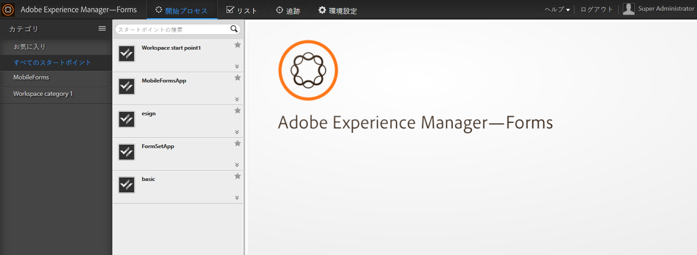

# AEM Forms Workspace の概要{#introduction-to-aem-forms-workspace}

Forms ワークフローは自動化を実現し、重要なドキュメントやフォーム関連のビジネスプロセスを可視化することにより、組織の効率化を促進します。Process Management モジュールを使用すると、人員、システム、コンテンツ、ビジネス規則を含め、合理化されたエンドツーエンドのワークフローを構築できます。ワークフローにはオンラインおよびオフラインでアクセスできます。Forms ワークフローには AEM Forms ワークスペースが含まれます。AEM Forms Workspace にはワークスペースを拡張、統合するための新しい機能が追加されており、より使いやすくなっています。

AEM Forms Workspace はより多くのデバイスやフォームファクターと互換性があります。Flash® Player と Adobe® Reader® を使用しなくてもクライアントでタスク管理が可能です。PDF フォームに加え、HTML フォームのレンダリングを容易にします。

**主な機能**:

* プロセスの参加者はどこにいても動的な PDF フォーム、モバイルインターフェース、 Web アプリケーションで連絡が取れます。
* Workspace コンポーネントを Web アプリケーションで容易に統合できます。AEM Forms Workspace は容易にカスタマイズや再利用が可能なコンポーネントベースのソフトウェアです。
* AEM Forms Workspace アプリケーションを使用し、オンラインおよびオフラインのモバイル作業者にビジネスプロセスを拡張します。
* レポートを表示してバックログ、作業クエリ、KPIs (key performance indicators)をモニタリングします。APIs を使用して、第三者報告ツールによる将来の分析のためのデータ抽出が可能です。
