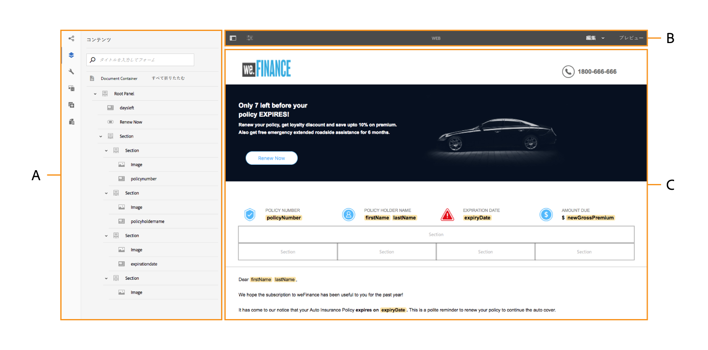
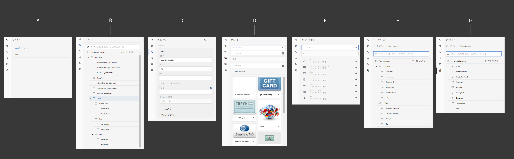

# インタラクティブ通信オーサリング UI の概要{#introduction-to-interactive-communication-authoring-ui}

The user interface for authoring [Interactive Communication](/help/forms/using/interactive-communications-overview.md) is intuitive and provides the following for authoring print and web channel of the Interactive Communication:

* WYSIWYG ドラッグアンドドロップドキュメントエディター
* アセットの統合リポジトリ — サーバーにアップロードされ、サーバー上で作成されたアセットは、Interactive Communicationオーサリングインターフェイスのアセットブラウザーで使用できます。

[新しいインタラクティブ通信の作成または既存のインタラクティブ通信の編集](../../forms/using/create-interactive-communication.md)を行う場合は、以下のユーザーインターフェイス要素を使用します。

* [サイドバー](#sidebar)
* [ページツールバー](#page-toolbar)
* [コンポーネントのツールバー](#component-toolbar)
* コンテンツ領域

**A.** サイドバ **ーB.** ページツー **ルバーC.** Content領域

## サイドバー {#sidebar}

**A.** チャネルブ **ラウザB** コンテンツブ **ラウザC.** Propertiesブラウザ **D.** アセットブラ **ウザE** コンポーネントブ **ラウザF** データソースブラウザ — データモ **デルG** データソースブラウザ — マスターコンテンツ

<!-- Click to enlarge

-->

サイドバーには、以下のブラウザーが用意されています。

* **チャネルブラウザー**

チャネルブラウザーにより、インタラクティブ通信の印刷チャネルと Web チャネルを切り替えることができます。チャネルブラウザーで選択したチャネルに基づいて、コンテンツブラウザーやコンポーネントブラウザーなどのブラウザーに対応するオプションが表示されます。

* **コンテンツブ**&#x200B;ラウザコンテンツブラウザでは、選択したブラウザのドキュメントのオブジェクト階層を表示できます。 作成者は、ドキュメントオブジェクトツリーで目的の要素をタップして、特定のコンポーネントに移動することができます。作成者は、Web チャネルでオブジェクトを検索したり、ドキュメントオブジェクトツリーでオブジェクトの配置を変更したりすることができます。

* **プロパティブラウザー**

   コンポーネントのプロパティを編集できます。 表示されるプロパティは、コンポーネントによって異なります。For example, to see properties of the document container:
Select a component, then tap  > **Document Container**, and then tap .

* **アセットブラウ**&#x200B;ザーレイアウトフラグメント、画像、ドキュメント、ページ、ビデオなど、様々なタイプのコンテンツを分類します。 作成者は、アセットをインタラクティブコミュニケーションにドラッグ&amp;ドロップできます。

* **コンポーネントブラウザー**&#x200B;ドキュメントの印刷チャネルと Web チャネルを作成するためのコンポーネントが表示されます。コンポーネントをインタラクティブ通信にドラッグして要素を追加し、必要に応じて追加した要素を設定できます。 以下の表に、印刷チャネルと Web チャネルについてコンポーネントブラウザーに表示されるコンポーネントを示します。

| **コンポーネント** | **印刷チャネル** | **Web チャネル** | **機能** |
|---|---|---|---|
| グラフ | ✓ | ✓ | インタラクティブ通信で使用できるグラフを追加して、フォームデータモデルのコレクションアイテムから取得された 2 次元のデータを視覚的に表現します。 |
| ドキュメントフラグメント | ✓ | ✓ | 再利用可能なコンポーネント、テキスト、リスト、または条件をインタラクティブ通信に追加できます。 インタラクティブ通信に追加する再利用可能なコンポーネントは、フォームデータモデルベースのコンポーネントでも、フォームデータモデルなしのコンポーネントでもかまいません。 |
| 画像 | ✓ | ✓ | 画像を挿入できるようにします。。 |
| パネル | - | ✓ | パネルコンポーネントは、他のコンポーネントをグループ化するためのプレースホルダーです。パネルコンポーネントにより、インタラクティブ通信内でのコンポーネントグループの配置方法が制御されます。パネルコンポーネントを使用して、エンドユーザーが繰り返し使用できるコンポーネントグループ（学歴を入力するための複数のエントリなど）を作成することもできます。また、複数のタブを持つインタラクティブ通信のタブに対して各パネルを使用することもお勧めします。 |
| テーブル | * | ✓ | 行と列のデータを整理するためのテーブルを追加することができます。 |
| ターゲット領域 | ** | ✓ | Web チャネル固有のコンポーネントを整理するためのターゲット領域を、その Web チャネルに挿入します。 |
| テキスト | - | ✓ | インタラクティブ通信の Web チャネルにテキストを追加します。追加されたテキストでフォームデータオブジェクトを使用すると、動的なコンテンツを作成することができます。 |

* テーブルを追加するには、印刷チャネル内でレイアウトフラグメントを使用する必要があります。

** 印刷チャネルの場合、XDP テンプレートまたは印刷テンプレート内でターゲット領域が事前に設定されています。インタラクティブ通信オーサリング UI を使用して新しいターゲット領域を追加することはできません。

* **データソースブラウザ**&#x200B;データソースブラウザには、インタラクティブ通信の作成時に選択したフォームデータモデルで使用可能なデータソースが表示されます。

### コンポーネントを操作する場合のキーポイント {#key-points-for-working-with-components}

インタラクティブ通信のコンポーネントを操作する場合のキーポイントを以下に示します。

* 各コンポーネントには、そのコンポーネントの外観と機能をコントロールするプロパティが関連付けられています。To configure the properties of a component, tap the component and tap  to open the component properties in the Properties browser.
* コンポーネントは要素名で識別されます。When you tap , you can change the name of the component by changing the Element Name field value in the properties browser. 要素名フィールドに使用できるのは、英字、数字、ハイフン（-）、およびアンダースコア（_）のみです。その他の特殊文字は使用できません。また、要素名は英字で始まる必要があります。
* インタラクティブ通信でタイトルが表示されている限り、プロパティブラウザを開かずに、エディターでインラインでインタラクティブ通信コンポーネントのタイトルプロパティを変更できます。 この作業を行うには：

   1. 「タイトル」プロパティが設定されていて、「タイトルを非表示」プロパティが無効になっているコンポーネントをタップして選択します。
   1. 「  」をタップして、タイトルを編集可能にします。

   1. タイトルを変更し、Return キーをタップするかコンポーネント以外の場所をタップして、変更内容を保存します。Escキーをタップして、変更を破棄します。

## コンポーネントのツールバー {#component-toolbar}

コンポーネントを選択すると、そのコンポーネントを操作するためのツールバーが表示されます。切り取り、貼りつけ、移動、およびコンポーネントのプロパティを指定するオプションを使用することができます。次のオプションがあります。

A. **設定**：「**設定**」をタップすると、サイドバーにコンポーネントの各種プロパティが表示されます。

B.**Edit Rules**: When you tap Edit Rules, Rule Editor appears in which you can edit and create rules for the selected component. ルールエディターでは、他のフォームオブジェクト（コンポーネント）を選択し、それらのフォームオブジェクトのルールを編集/作成することもできます。

C.**Copy**: You can use the copy option to copy a component and paste it in other places in the Interactive Communication.

D.**Cut**: You can use the cut option to move a component from one place to another in the Interactive Communication.

E. **Delete**: Lets you delete the component from the Interactive Communication.

F. **Insert Component**: Lets you insert a component above the selected component.

G. **Paste**: Lets you paste the component you cut or copied using the options described above.

H. **Group**: Lets you select multiple components if you want to cut, copy, or paste more than one component together.

I. **親**：コンポーネントの親を選択します。

J.表示 **SOM式:** コンポーネントの [SOM式を表示できます](../../forms/using/using-som-expressions-adaptive-forms.md) 。

K:パネル内 **のオブジェクトのグループ化：** パネル内のコンポーネントをグループ化して、それらのコンポーネントに対する操作を同時に実行できます。 詳しくは、パネルでのオブジェクトのグ [ループ化を参照してくださ](create-interactive-communication.md#groupobjectspanel)い。

ル・デ・ラン **追加子パネル** （パネルのみ）:子パネルをパネルに追加できます。

M:パネ **追加ルツールバー** （パネルのみ）：パネルコンポーネントのツールバーを追加できます。 その後、ツールバーでさらにアクションを実行できます。

また、ツールバーの「置 **換** 」オプションを使用すると、既存のコンポーネントを別のコンポーネントに置き換えることができます。 このオプションは、パネルコンポーネントでは使用できません。

## ページツールバー {#page-toolbar}

上部のページツールバーには、インタラクティブコミュニケーションをプレビューし、そのプロパティを変更するオプションが用意されています。 インタラクティブプレビューは、作成時にコミュニケーションを作成し、それに応じて変更を加えることができます。 ページのツールバーには、以下の項目が表示されます。

* Toggle Side Panel : Lets you show or hide Sidebar.
* Page information : Lets you view page properties.
* Emulator : Lets you emulate the look of your Interactive Communication for different display sizes such as tablets and phones.
* 編集：次のような他のモードを選択できます。編集、スタイル、開発者およびデザインを参照してください。

   * 編集：Interactive Communicationとそのコンポーネントのプロパティを編集できます。 例えば、コンポーネントの追加、画像の削除、必須フィールドの指定などを行うことができます。
   * スタイル：このモードでは、インタラクティブ通信のコンポーネントの外観を調整することができます。例えば、スタイルモードでパネルを選択して、パネルの背景色を指定することができます。
   * 開発者：開発者は次の操作を行えます。

      * Interactive Communicationの構成要素を見つけます。
      * エラーが発生したタイミングと場所を特定し、問題を修正する。
   * ターゲット:サイドバーに表示されていないカスタムコンポーネントまたはあらかじめ用意されているコンポーネントを有効または無効にできます。

* プレビュー:インタラクティブプレビューを公開する際の外観を選択できます。

