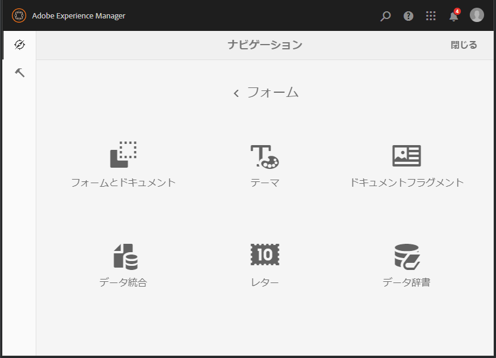

# フォームの管理の概要 {#introduction-to-managing-forms}

AEM [!DNL Forms] は、フォーム、ドキュメント、テーマ、レター、ドキュメントフラグメント、データディクショナリおよび関連アセットを作成および管理するためのシンプルかつパワフルなユーザーインターフェイスを提供します。デベロッパーのデスクトップから、ポータルサーバーでのエンドユーザーへの提供まで、フォーム、ドキュメントおよび関連アセットのライフサイクル全体を管理するために役立ちます。AEM [!DNL Forms] のユーザーインターフェイスを使用して次の操作を実行できます。

* AEM [!DNL Forms] コンポーネントへのアクセス
* AEM [!DNL Forms] 設定へのアクセス

>[!NOTE]
>
>その他の AEM ツールおよびオプションについて詳しくは、[オーサリング](/help/sites-authoring/author.md)を参照してください。

## AEM Forms コンポーネントへのアクセス {#access-aem-forms-components}

AEM には、フォーム、ドキュメントおよび関連アセットを作成するためのオプションに加えて、サイトの作成、アセットの作成、AEM インスタンスの管理などのオプションが用意されています。 Experience Manager ロゴをクリックすると、使用可能なすべてのツールに移動できます。他のコンポーネントのコンソールへのリンクに加えて、AEM [!DNL Forms] のリンクもあります。AEM [!DNL Forms] に移動するには、Experience Manager ロゴ ／ナビゲーション ／**[!UICONTROL Forms]** をクリックします。次のコンソールのリンクが表示されます。

* フォームとドキュメント
* テーマ
* レター
* ドキュメントフラグメント
* データディクショナリ

   

### フォームとドキュメント  {#forms-documents}

フォームとドキュメントには、インタラクティブ通信、アダプティブフォーム、アダプティブフォームフラグメント、フォームセットを作成するためのオプションが用意されています。JEE 上の AEM [!DNL Forms] の場合のみ、ローカルストレージからファイルを読み込むオプションと AEM [!DNL Forms] アセットを Workbench と同期するオプションが「フォームとドキュメント」に表示されます。

作成ボタンは、AEM [!DNL Forms] アセットを作成またはアップロードする処理の開始点になります。次の項目を作成するためのオプションが用意されています。

* **インタラクティブ通信**：インタラクティブ通信は、パーソナライズされ、デバイスで使いやすい HTML ベースのインタラクティブなデジタルの通信、取引明細、ドキュメントを示します。インタラクティブ通信はレスポンシブな特性を持っているため、使用するデバイスや設定に応じて、レイアウトとデザインが自動的に変わります。詳しくは、[インタラクティブ通信の概要](/help/forms/using/interactive-communications-overview.md)を参照してください。

* **アダプティブフォーム：**&#x200B;アダプティブフォームは、魅力的でレスポンシブなフォームです。アダプティブフォームをオーサリングし、ユーザーの応答、デバイスまたは作業環境に基づいてフォームのセクションを追加または削除して、ユーザーの入力に動的に対応することができます。アダプティブフォームについて詳しくは、[アダプティブフォームの作成について](../../forms/using/introduction-forms-authoring.md)を参照してください。

* **アダプティブフォームフラグメント：**&#x200B;すべてのフォームは特定の目的のためにデザインされますが、ほとんどのフォームにはいくつかの共通するセグメントがあります。例えば、名前と住所、家族の詳細、収入の詳細などの個人の詳細を入力するためのものなどです。このようなセクションに対して個別のアセットを作成できます。これらの再利用可能なスタンドアロンのセグメントを、アダプティブフォームフラグメントと呼びます。詳しくは、[アダプティブフォームフラグメント](../../forms/using/adaptive-form-fragments.md)を参照してください。

* **フォームセット：**&#x200B;フォームセットは HTML5 フォームの集まりであり、エンドユーザーには 1 つのフォームのセットとして提供されます。エンドユーザーがフォームセットへの入力を始めると、フォームはシームレスにその内容を別のフォームにも写します。最終的に、ユーザーはワンクリックですべてのフォームを単一のエンティティとして送信することができます。詳しくは、[AEM Forms におけるフォームセット](../../forms/using/formset-in-aem-forms.md)を参照してください。

* **フォルダー**：AEM [!DNL Forms] ユーザーインターフェイスは、フォルダーを利用してアセットを整理します。サポートされているフォルダーは 2 種類あります。

   * **一般フォルダー**：これらのフォルダーは、AEM [!DNL Forms] ユーザーインターフェイスで作成されたアセットに対して使用されます。これらのフォルダーには、厳密なフォルダー構造はありません。これらのフォルダーでは、フォルダー名の変更とサブフォルダーの作成を行うことができます。また、アダプティブフォーム、インタラクティブ通信、アダプティブフォームフラグメント、フォームテンプレート（XDP）、PDF Forms、ドキュメント、関連アセットを、これらのフォルダーに保存することができます。
   * **Forms Workflow フォルダー**：Forms Workflow フォルダーは、AEM [!DNL Forms] ユーザーインターフェイスで Workbench プロセス（LiveCycle アーカイブ）が移行および同期される際に作成されます。このフォルダーの名前を変更することはできません。また、このフォルダー内に、サブフォルダー、インタラクティブ通信、アダプティブフォームフラグメントを作成することはできません。さらに、バージョンフォルダーを削除したり、アダプティブフォーム、アダプティブフォームフラグメント、インタラクティブ通信を同時に作成してバージョンフォルダーにアップロードしたりすることはできません。

   

   **A.** 一般フォルダー **B.** Forms Workflow フォルダー

フォームとドキュメントパネルには、以下のオプションも用意されています。

* **ローカルストレージからのファイルの読み込み：** PDF フォームとドキュメント、フォームテンプレート（XFA フォーム）およびその他のリソース（画像や XSD の XML スキーマ）を読み込むことができます。詳しい手順については、「[AEM Forms におけるアセットの読み込みと書き出し](../../forms/using/import-export-forms-templates.md)」を参照してください。
* **AEM Forms アセットの Workbench との同期：**「Workbench のファイル」オプションを使用して、AEM Forms ユーザーインターフェイスと Workbench の間でアセットを同期することができます。AEM [!DNL Forms] ユーザーインターフェイスと Workbench の crx-repository アセットの選択で、すべてのアセットが使用できるようになります。

### テーマ  {#themes}

テーマには、コンポーネントやパネルのスタイル設定の詳細が含まれています。テーマには個別の ID があります。このため、1 つのテーマを複数のアダプティブフォームで再利用できます。コンポーネントに対してスタイルを指定したり、複数のフォームで使用されている様々なコンポーネントの CSS プロパティを変更したりできます。スタイルには、背景色、状態色、透明度、およびサイズなどのプロパティが含まれます。テーマのカスタマイズを保存し、プリセットとしてフォームのコンポーネントにそれらを移植することができます。テーマをフォームに追加すると、指定されたスタイルがフォームの対応コンポーネントに反映されます。AEM 6.2 [!DNL Forms] では、テーマを作成してフォームに適用できます。

テーマの作成と使用について詳しくは、「[AEM Forms のテーマ](../../forms/using/themes.md)」を参照してください。

### レター  {#letters}

AEM [!DNL Forms] のレターは、安全でパーソナライズされたインタラクティブな通信です。AEM [!DNL Forms] を使用すると、合理化されたプロセスで承認済みコンテンツとカスタム作成コンテンツの両方からレター（通信とも呼ばれます）を簡単に作成できます。

レターの作成と使用について詳しくは、「[レターの作成](../../forms/using/create-letter.md)」を参照してください。

### ドキュメントフラグメント {#document-fragments}

ドキュメントフラグメントは、レターの作成時に使用する再利用可能な通信のパーツやコンポーネントです。ドキュメントフラグメントのタイプとして、テキスト、リスト、条件およびレイアウトフラグメントがあります。ドキュメントフラグメントの作成と使用について詳しくは、「[ドキュメントフラグメントの作成](/help/forms/using/document-fragments.md)」を参照してください。

### データディクショナリ {#data-dictionaries}

一般のビジネスユーザーにとって、XSD（xml スキーマ）や Java クラスといった、メタデータ表現に関する知識は必要ありません。しかし、通常はソリューションを構築するために、これらのデータ構造や属性の利用が必要となります。AEM [!DNL Forms] でデータ要素を使用することにより、ビジネスユーザーはバックエンドデータソースの情報を使用できます。基礎となるデータモデルの技術的な詳細情報を把握する必要はありません。

データ要素の作成と使用について詳しくは、[データ要素に関する記事](../../forms/using/data-dictionary.md)を参照してください。

## AEM [!DNL Forms] 設定へのアクセス {#accessing-aem-forms-configurations}

AEM ツールパネルには、様々なコンポーネント用のツールが含まれています。AEM Forms 固有のツールに移動するには、Experience Manager ロゴ ／ツール ／**[!UICONTROL Forms]** をクリックします。以下の機能を実行するためのツールが表示されます。

* **監視フォルダーを設定：**&#x200B;管理者は、監視フォルダーと呼ばれるネットワークフォルダーを設定できます。ユーザーがファイル（PDF ファイルなど）を監視フォルダーに配置すると、設定済みの操作が開始され、ファイルが操作されます。詳しくは、[監視フォルダーの作成と設定](/help/forms/using/creating-configure-watched-folder.md)を参照してください。
* **Forms アプリオフラインサービスを設定**：AEM [!DNL Forms] アプリケーションのオフラインサービスでは、フォームで使用されるリソースのパスや URL をキャッシュに保存します。フォームで使用されるリソースのパスや URL をキャッシュに保存することで、サーバー側のパフォーマンスが向上します。AEM Forms アプリケーションのサーバーサイドのオフラインコンポーネントを設定するには「[オフラインモードの使用](/help/forms/using/work-offline-mode.md)」を参照してください。

   

* **PDF Generator を設定：**&#x200B;管理者は、AEM [!DNL Forms] PDF Generator の設定、ユーザーアカウントの追加、PDF Generator 設定のインポートまたはエクスポートを行うことができます。
* **Correspondence Management アセットを公開：** AEM [!DNL Forms] では、すべてのレター、ドキュメントフラグメント、データディクショナリおよび関連する依存関係を作成者インスタンスから同時に発行できます。公開済みのアセットには、すべての Correspondence Management アセットと関連する依存性が含まれます。詳しくは、[フォームとドキュメントの公開と非公開](../../forms/using/publishing-unpublishing-forms.md#publishallthecorrespondencemanagementassets)を参照してください。
* **Correspondence Management アセットをエクスポート：**&#x200B;すべての Correspondence Management アセットおよび関連する依存関係を、AEM [!DNL Forms] インスタンスからパッケージとしてダウンロードできます。手順について詳しくは、[AEM Forms におけるアセットのインポートとエクスポート](../../forms/using/import-export-forms-templates.md#importandexportassetsincorrespondencemanagement)を参照してください。

## 共通のユーザーインターフェイス要素 {#commonelements}

* **左パネル**：左パネルのアイコン  をクリックすると、AEM [!DNL Forms] のタイムライン機能と参照機能が表示されます。

   * **タイムライン：**&#x200B;タイムラインで確認可能なアセットに対して、コメントを追加して表示できます。手順について詳しくは、[フォームのアセットのレビューの作成と管理](../../forms/using/create-reviews-forms.md)を参照してください。
   * **参照：** 1 つの AEM [!DNL Forms] アセットを複数の AEM [!DNL Forms] アセットで使用できます。例えば、1 つのドキュメントフラグメントを複数のレターで使用できます。参照は、選択したアセットを使用しているアセット（他のフォームまたはリソース）のリストであり、選択したアセットが使用している他のアセットのリストでもあります。

* **パンくず：**&#x200B;パンくずは、現在のコンソールまたはフォルダーのタイトルを表します。「パンくず」オプションをクリックすると、フォルダー階層の上位のフォルダーに移動することができます。
* **表示切り替え：**「表示切り替え」アイコン  または  をクリックすると、リスト表示とカード表示をすばやく切り替えることができます。一般的なユーザーインターフェイスコンポーネントについて詳しくは、[オーサリング](/help/sites-authoring/author.md)を参照してください。
* **検索：**&#x200B;検索オプション  を使用すると、必要なコンテンツとツールをすばやく見つけて移動できます。コンテンツまたは製品機能の名前を入力し、提案から選択します。例えば、「ドキュメント」と入力すると、**[!UICONTROL フォームとドキュメント]**&#x200B;コンソールやドキュメントフラグメントコンソールをすばやく見つけて移動できます。検索について詳しくは、AEM 6.2 の[検索](/help/sites-authoring/search.md)に関する記事を参照してください。

* **アクションツールバー**：アセットを選択すると、アセット一覧の上にアクションツールバーが表示されます。このツールバーには、選択したアセットに対応するすべての管理ツールが表示されます。「ツール」アイコンの上にマウスを移動すると、その機能を説明するツールヒントが表示されます。

>[!NOTE]
>
>ユーザーがフォームとドキュメントのコンソールを検索すると、「**フィルターおよびオプション**」のみがレールに表示されます。「フィルターおよびオプション」を使用して、高度な検索を実行できます。

* **アクションツールバー**：アセットを選択すると、アセット一覧の上にアクションツールバーが表示されます。このツールバーには、選択したアセットに対応するすべての管理ツールが表示されます。「ツール」アイコンの上にマウスを移動すると、その機能を説明するツールヒントが表示されます。

   

   アダプティブフォームのアクションツールバー
