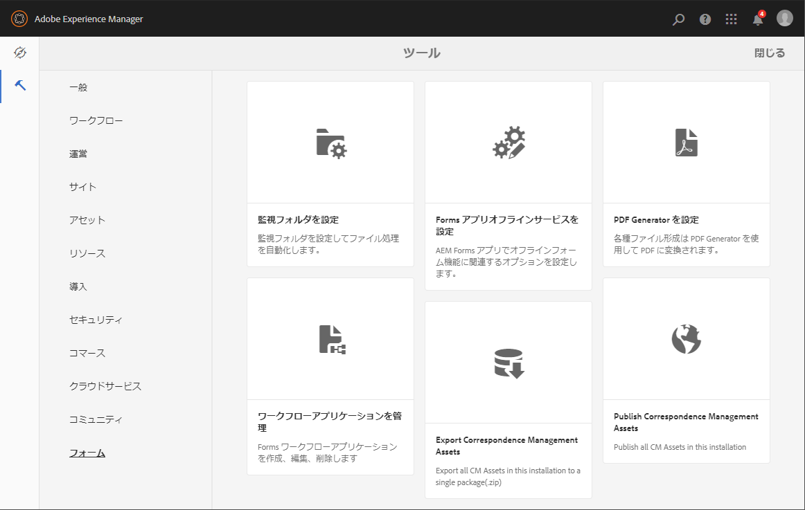

# フォームの管理の概要  {#introduction-to-managing-forms}

AEM [!DNL Forms]は、フォーム、ドキュメント、テーマ、レター、ドキュメントフラグメント、データディクショナリ、および関連アセットを作成および管理するための、シンプルで強力なユーザーインターフェイスを備えています。 開発者のデスクトップから、ポータルサーバーでのエンドユーザーへの提供まで、フォーム、ドキュメントおよび関連アセットのライフサイクル全体を管理するために役立ちます。AEM [!DNL Forms]ユーザーインターフェイスを使用して、次の操作を実行できます。

* AEMの[!DNL Forms]コンポーネントへのアクセス
* AEMの[!DNL Forms]構成へのアクセス

>[!NOTE]
>
>その他のAEMツールおよびオプションについて詳しくは、[オーサリング](/help/sites-authoring/author.md)を参照してください。

## AEM Forms コンポーネントへのアクセス {#access-aem-forms-components}

AEM には、フォーム、ドキュメントおよび関連アセットを作成するためのオプションに加えて、サイトの作成、アセットの作成、AEM インスタンスの管理などのオプションが用意されています。Experience Managerのロゴをクリックして、使用可能なすべてのツールに移動できます。 他のコンポーネントのコンソールへのリンクに加えて、AEM [!DNL Forms]のリンクも含まれます。 AEM [!DNL Forms]に移動するには、Experience Managerのロゴ /ナビゲーション / **[!UICONTROL Forms]**&#x200B;をクリックします。 以下のコンソールのリンクが表示されます。

* フォームとドキュメント
* テーマ
* レター
* ドキュメントフラグメント
* データディクショナリ

   

### フォームとドキュメント  {#forms-documents}

フォームとドキュメントには、インタラクティブ通信、アダプティブフォーム、アダプティブフォームフラグメント、フォームセットを作成するためのオプションが用意されています。JEE上のAEM [!DNL Forms]の場合のみ、Formsとドキュメントには、ローカルストレージからファイルを読み込み、AEM [!DNL Forms]アセットをWorkbenchに同期するオプションが用意されています。

「作成」ボタンは、AEM [!DNL Forms]アセットを作成またはアップロードするプロセスの出発点です。 以下を作成するオプションが用意されています。

* **インタラクティブ通信**:インタラクティブ通信は、HTMLベースのパーソナライズされたインタラクティブなデバイス対応デジタル通信で、デジタル文書、ドキュメントを表します。インタラクティブ通信はレスポンシブな特性を持っているため、使用するデバイスや設定に応じて、レイアウトとデザインが自動的に変わります。詳しくは、「[インタラクティブ通信の概要](/help/forms/using/interactive-communications-overview.md)」を参照してください。

* **アダプティブフォーム：**&#x200B;アダプティブフォームは、魅力的でレスポンシブなフォームです。アダプティブフォームを作成し、ユーザーの応答、デバイス、または作業環境に基づいてフォームのセクションを追加または削除することで、ユーザーの入力に動的に対応することができます。 アダプティブフォームについて詳しくは、「[アダプティブフォームの作成について](../../forms/using/introduction-forms-authoring.md)」を参照してください。

* **アダプティブフォームフラグメント：**&#x200B;すべてのフォームは特定の目的のためにデザインされますが、ほとんどのフォームにはいくつかの共通するセグメントがあります。例えば、名前と住所、家族の詳細、収入の詳細などの個人の詳細を入力するためのものなどです。このようなセクションに対して個別のアセットを作成できます。これらの再利用可能なスタンドアロンセグメントを、アダプティブフォームフラグメントと呼びます。 詳しくは、「[アダプティブフォームフラグメント](../../forms/using/adaptive-form-fragments.md)」を参照してください。

* **フォームセット：**&#x200B;フォームセットは HTML5 フォームの集まりであり、エンドユーザーには 1 つのフォームのセットとして提供されます。エンドユーザーがフォームセットへの入力を始めると、フォームはシームレスにその内容を別のフォームにも写します。最後に、ユーザーは1回のクリックですべてのフォームを単一のエンティティとして送信できます。 詳しくは、「[AEM Forms におけるフォームセット](../../forms/using/formset-in-aem-forms.md)」を参照してください。

* **フォルダー：**[!DNL Forms]AEM ユーザーインターフェイスは、フォルダーを利用してアセットを整理します。サポートされているフォルダーは 2 種類あります。

   * **一般フォルダー：**[!DNL Forms]これらのフォルダーは、AEM ユーザーインターフェイスで作成されたアセットに対して使用されます。これらのフォルダーには、厳密なフォルダー構造はありません。これらのフォルダーでは、フォルダー名の変更とサブフォルダーの作成を行うことができます。また、アダプティブフォーム、インタラクティブ通信、アダプティブフォームフラグメント、フォームテンプレート（XDP）、PDF フォーム、ドキュメント、関連アセットを、これらのフォルダーに保存することができます。
   * **フォームワークフローフォルダー：**[!DNL Forms]フォームワークフローフォルダーは、AEM ユーザーインターフェイスで Workbench プロセス（LiveCycle アーカイブ）が移行および同期されるときに作成されます。このフォルダーの名前を変更することはできません。また、このフォルダー内に、サブフォルダー、インタラクティブ通信、アダプティブフォームフラグメントを作成することはできません。また、バージョンフォルダーの削除や、アダプティブフォーム、アダプティブフォームフラグメント、インタラクティブ通信の作成とアップロードを同時に行うこともできません。

   

   **A.一般フォ** ルダ **ーB.** Forms Workflowフォルダー

フォームとドキュメントパネルには、以下のオプションも用意されています。

* **ローカルストレージからのファイルの読み込み：** PDF フォームとドキュメント、フォームテンプレート（XFA フォーム）およびその他のリソース（画像や XSD の XML スキーマ）を読み込むことができます。詳しい手順については、「[AEM Forms におけるアセットの読み込みと書き出し](../../forms/using/import-export-forms-templates.md)」を参照してください。
* **AEM Forms アセットの Workbench との同期：**「Workbench のファイル」オプションを使用して、AEM Forms ユーザーインターフェイスと Workbench の間でアセットを同期することができます。これにより、AEM [!DNL Forms]ユーザーインターフェイスとWorkbenchのcrx-repositoryアセットの選択で、すべてのアセットが使用可能になります。

### テーマ  {#themes}

テーマには、コンポーネントやパネルのスタイル設定の詳細が含まれています。テーマには個別の ID があります。このため、1 つのテーマを複数のアダプティブフォームで再利用できます。コンポーネントに対してスタイルを指定したり、複数のフォームで使用されている様々なコンポーネントの CSS プロパティを変更したりできます。スタイルには、背景色、状態色、透明度、およびサイズなどのプロパティが含まれます。テーマのカスタマイズを保存し、プリセットとしてフォームのコンポーネントにそれらを移植することができます。テーマをフォームに追加すると、指定されたスタイルがフォームの対応コンポーネントに反映されます。AEM 6.2 [!DNL Forms]では、テーマを作成してフォームに適用できます。

テーマの作成と使用について詳しくは、「[AEM Forms のテーマ](../../forms/using/themes.md)」を参照してください。

### レター  {#letters}

AEMの[!DNL Forms]レターは、セキュリティで保護され、パーソナライズされた、インタラクティブな通信です。 AEM [!DNL Forms]を使用すると、合理化されたプロセスで、承認済みコンテンツとカスタム作成コンテンツの両方からレター（通信とも呼ばれます）をすばやく組み立てることができます。

レターの作成と使用について詳しくは、「[レターの作成](../../forms/using/create-letter.md)」を参照してください。

### ドキュメントフラグメント {#document-fragments}

ドキュメントフラグメントは、レターの作成時に使用する再利用可能な通信のパーツやコンポーネントです。ドキュメントフラグメントのタイプとして、テキスト、リスト、条件およびレイアウトフラグメントがあります。ドキュメントフラグメントの作成と使用について詳しくは、「[ドキュメントフラグメントの作成](/help/forms/using/document-fragments.md)」を参照してください。

### データディクショナリ {#data-dictionaries}

一般のビジネスユーザーにとって、XSD（xml スキーマ）や Java クラスといった、メタデータ表現に関する知識は必要ありません。しかし、通常はソリューションを構築するために、これらのデータ構造や属性の利用が必要となります。AEM [!DNL Forms]は、ビジネスユーザーがバックエンドデータソースの情報を使用できるデータディクショナリを使用します。基礎となるデータモデルの技術的な詳細を把握する必要はありません。

データディクショナリの作成と使用について詳しくは、[データディクショナリに関する記事](../../forms/using/data-dictionary.md)を参照してください。

## AEM [!DNL Forms]設定{#accessing-aem-forms-configurations}へのアクセス

AEM ツールパネルには、様々なコンポーネント用のツールが含まれています。AEM Forms固有のツールに移動するには、Experience Managerのロゴ /ツール / **[!UICONTROL Forms]**&#x200B;をクリックします。 以下の機能を実行するためのツールが表示されます。

* **監視フォルダーを設定：**&#x200B;管理者は、監視フォルダーと呼ばれるネットワークフォルダーを設定できます。ユーザーがファイル（PDF ファイルなど）を監視フォルダーに配置すると、設定済みの操作が開始され、ファイルが操作されます。詳しくは、「[監視フォルダーの作成と設定](/help/forms/using/creating-configure-watched-folder.md)」を参照してください。
* **Forms App Offline Serviceの設定：**  [!DNL Forms] AEM App Offline Serviceは、フォームで使用されるリソースのパスやURLをキャッシュします。フォームで使用されるリソースのパスや URL をキャッシュに保存することで、サーバー側のパフォーマンスが向上します。AEM Formsアプリのサーバー側オフラインコンポーネントを設定するには、[オフラインモードでの作業](/help/forms/using/work-offline-mode.md)を参照してください。

   

* **PDF Generator を設定：**[!DNL Forms]管理者は、AEM PDF Generator の設定、ユーザーアカウントの追加、PDF Generator 設定の読み込みまたは書き出しを行うことができます。
* **Correspondence Management アセットを発行：**[!DNL Forms]AEM では、作成者インスタンスからすべてのレター、ドキュメントフラグメント、データディクショナリおよび関連する依存関係を同時に発行できます。公開済みのアセットには、すべての Correspondence Management アセットと関連する依存性が含まれます。詳しくは、[フォームとドキュメントの発行と非公開](../../forms/using/publishing-unpublishing-forms.md#publishallthecorrespondencemanagementassets)を参照してください。
* **Correspondence Management アセットを書き出し：**[!DNL Forms]すべての Correspondence Management アセットおよび関連する依存関係を、AEM インスタンスからパッケージとしてダウンロードできます。手順について詳しくは、「[AEM Forms におけるアセットの読み込みと書き出し](../../forms/using/import-export-forms-templates.md#importandexportassetsincorrespondencemanagement)」を参照してください。

## 共通のユーザーインターフェイス要素 {#commonelements}

* **左側のレール：** 左側のレールアイコンrailleftpngをクリックする  と、AEMのタイムライン機能と参照機能が表示されま [!DNL Forms]す。

   * **タイムライン：**&#x200B;アセットに対するコメントをタイムラインに追加して表示し、レビューとして使用できます。手順について詳しくは、「[フォームのアセットのレビューの作成と管理](../../forms/using/create-reviews-forms.md)」を参照してください。
   * **参照：**[!DNL Forms]1 つの AEM アセットを複数の AEM アセットで使用できます。[!DNL Forms]例えば、1 つのドキュメントフラグメントを複数のレターで使用できます。「参照」は、選択したアセットが使用されるアセット（他のフォームまたはリソース）のリストです。また、選択したアセットが使用している他のアセットのリストです。

* **パンくず：**&#x200B;パンくずは、現在のコンソールまたはフォルダーのタイトルを表します。「パンくず」オプションをクリックすると、フォルダー階層の上位のフォルダーに移動することができます。
* **表示切り替え：** 表示切り替えアイコンviewlistor viewcardをクリックすると、リ  スト表  示とカード表示をすばやく切り替えることができます。一般的なユーザーインターフェイスコンポーネントについて詳しくは、[オーサリング](/help/sites-authoring/author.md)を参照してください。
* **検索：** 検索オプション検索  は、必要なコンテンツやツールをすばやく見つけてジャンプする機能を提供します。コンテンツまたは製品機能の名前を入力し、候補から選択します。例えば、「Documents」と入力すると、すばやく&#x200B;**[!UICONTROL Forms &amp; Documents]**&#x200B;またはドキュメントフラグメントコンソールを検索して移動できます。 検索について詳しくは、AEM 6.2 の[検索](/help/sites-authoring/search.md)に関する記事を参照してください。

* **アクションツールバー**：アセットを選択すると、アセット一覧の上にアクションツールバーが表示されます。このツールバーには、選択したアセットに対応するすべての管理ツールが表示されます。ツールアイコンの上にマウスを移動すると、その機能を説明するツールヒントが表示されます。

>[!NOTE]
>
>ユーザーがフォームとドキュメントのコンソールを検索すると、「**フィルターおよびオプション**」のみがレールに表示されます。「フィルターおよびオプション」を使用して、高度な検索を実行できます。

* **アクションツールバー**：アセットを選択すると、アセット一覧の上にアクションツールバーが表示されます。このツールバーには、選択したアセットに対応するすべての管理ツールが表示されます。ツールアイコンの上にマウスを移動すると、その機能を説明するツールヒントが表示されます。

   

   アダプティブフォームのアクションツールバー
