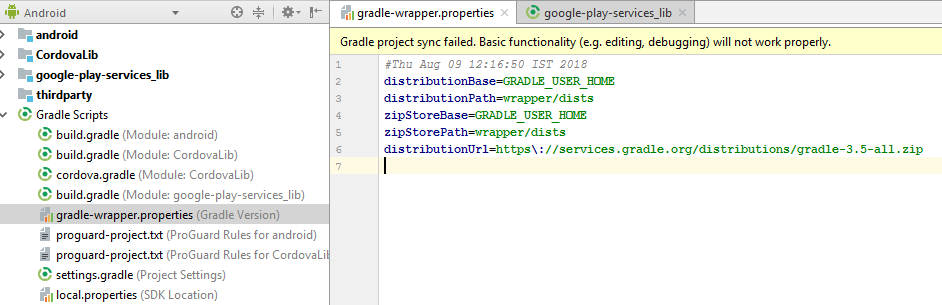

# AEM Forms アプリケーションのトラブルシューティング {#troubleshoot-aem-forms-app}

この記事では、AEM Forms アプリケーションの構築中に表示される可能性のあるエラーメッセージとその解決方法について説明します。

この記事のセクションは次のとおりです。

* [iOS ユーザーの添付ファイルが失われる](/help/forms/using/issues-aem-forms-app.md#attachment-loss-for-ios-users)
* [Workspace ユーザーによって送信された HTML5 フォームドラフトがポータルに表示されない](/help/forms/using/issues-aem-forms-app.md#html-form-drafts-submitted-by-workspace-users-are-not-visible-on-the-portal)
* [キャッシュされていない HTML5 フォームを AEM Forms アプリケーションに読み込むことができない](/help/forms/using/issues-aem-forms-app.md#html-forms-not-cached-fail-to-load-in-aem-forms-app)
* [AEM Forms が Windows で同期されない](/help/forms/using/issues-aem-forms-app.md#aem-forms-do-not-sync-on-windows)
* [Gradle のサポートされていないバージョン](/help/forms/using/issues-aem-forms-app.md#unsupported-version-of-gradle)
* [Gradle と Android Gradle プラグインの互換性の問題](/help/forms/using/issues-aem-forms-app.md#gradle-and-android-gradle-plug-in-compatibility-issues)

## iOS ユーザーの添付ファイルが失われる {#attachment-loss-for-ios-users}

OSGi 上の AEM Forms と同期するように設定された iOS 用の AEM Forms アプリケーションは、フィールドレベルの添付ファイルのみをサポートします。すべての添付ファイルには一意の名前が付いている必要があります。複数の添付ファイルに同じ名前が付いている場合、1 つの添付ファイルのみが保持され、同じ名前が付いている他のすべての添付ファイルは失われます。iOS デバイスのユーザーがデータを損失するのを回避するには、次の手順を実行します。

1. 接続されているサーバーで、**Adobe Experience Manager/ツール/操作/Webコンソール**&#x200B;に移動します。
1. 「**Adaptive Form 設定サービス**」を検索してクリックします。
1. Adaptive Form 設定サービスダイアログで、「**ファイル名を一意にする**」を有効にします。

   **「ファイル名を一意にする」**&#x200B;設定が無効になっている場合、複数の添付ファイルを含むアダプティブフォームを送信しようとすると、データが失われます。

1. 「**保存**」をクリックします。

## Workspace ユーザーによって送信された HTML5 フォームドラフトがポータルに表示されない  {#html-form-drafts-submitted-by-workspace-users-are-not-visible-on-the-portal}

「**ドラフトとして保存**」HTMLレンダリングプロファイルが&lt;a0/>設定されているAEM Formsアプリで有効になっているHTML5フォームの場合、保存されたドラフトはWorkspaceユーザーに表示されません。 Workspaceユーザーが送信したHTML5フォームのドラフトをポータル上に表示保存するには、次の手順を実行します。

1. CRXDE を開いて管理者の資格情報でログインします。

   URL: `https://<server>:<port>/lc/crx/de/index.jsp`

1. CRXDE のルートパスにある「アクセス制御」の「アクセス制御リスト」で、**+** をクリックします。
1. **新しいエントリを追加**&#x200B;ダイアログで、「プリンシパル」フィールドのグループ検索ボタンをクリックします。
1. プリンシパルを選択ダイアログの「名前」フィールドに、`PERM_WORKSPACE_USER`と入力し、「**検索**」をクリックします。
1. プリンシパルを選択ダイアログで`PERM_WORKSPACE_USER`グループを選択し、「**OK**」をクリックします。
1. 新しいエントリを追加ダイアログの「プリンシパル」フィールドで、`PERM_WORKSPACE_USER` グループが選択された状態になります。

   ユーザーグループの`jcr:read`権限を有効にします。

1. 「**OK**」をクリックします。

## キャッシュされていない HTML5 フォームを AEM Forms アプリケーションに読み込むことができない {#html-forms-not-cached-fail-to-load-in-aem-forms-app}

AEM Forms アプリケーションが古いバージョンの AEM Forms サーバーに接続している場合、キャッシュされていない HTML5 フォームを AEM Forms アプリケーションに読み込むことができません。

問題を解決するには、次の手順を実行してください。

1. オーサーインスタンスで、**Adobe Experience Manager/ツール/Workspace App Offline Serviceを設定/今すぐ設定**&#x200B;に移動します。
1. **ワークスペースアプリのオフラインサービス**&#x200B;ページで、**「手動のリソースキャッシュ**」をクリックします。

   URL：https://&lt;server>:&lt;port>/libs/fd/workspace-offline/content/config.html

1. 「**手動リソースキャッシュ**」タブで、**+**&#x200B;ボタンをクリックしてCRXパスを追加します。
1. 「**追加新しいリソース**」フィールドに、次のように入力します。/etc.clientlibs/fd/xfaforms/I18N/en_US.jsをクリックし、追加&#x200B;****&#x200B;をクリックします。
1. 「**保存**」をクリックします。

## AEM Forms が Windows で同期されない  {#aem-forms-do-not-sync-on-windows}

Windows の AEM Forms アプリケーションでは、フォームまたはそのリソースのいずれかへのパスが 256 文字以上の場合、フォームは接続されたサーバーと同期されません。

フォームとそのリソースへのパスを変更して、文字数を 256 文字よりも少なくしてください。

## Gradle のサポートされていないバージョン  {#unsupported-version-of-gradle}

**エラーメッセージ：** プロジェクトでサポートされていないバージョンのGradleが使用されています。

Android Studio で AEM Forms アプリケーションを構築すると、エラーメッセージが表示されます。この問題は、システムでサポートされる Gradle のサポート対象でないバージョンにより発生します。

**解決：「グレードルを** 修正」ラッパーを **クリックし、** プロジェクトを再度読み込んで問題を解決します。

## Gradle と Android Gradle プラグインの互換性の問題 {#gradle-and-android-gradle-plug-in-compatibility-issues}

**エラーメッセージ：Android Gradleプラグ** インとGradleのバージョンに互換性がありません。

このエラーメッセージは、Android Studioユーザーインターフェイスの&#x200B;**ビルド**&#x200B;メニューから「**APKをビルド**」オプションを選択した場合に表示されます。

**解像度：** Gradle Scripts **>** gradle-wrapper. **propertiesファイルを開き、**  **** distributionUrlプロパティを編集します。

例えば、Android Studioコンソールでは、Gradleバージョンを3.5にダウングレードすることをお勧めします。**distributionUrl**（**gradle-wrapper.properties**&#x200B;ファイル）でバージョンを編集します。

「**ビルド**/**ビルドAPK**」を再度選択して、エラーを解決し、.apkファイルを生成します。

